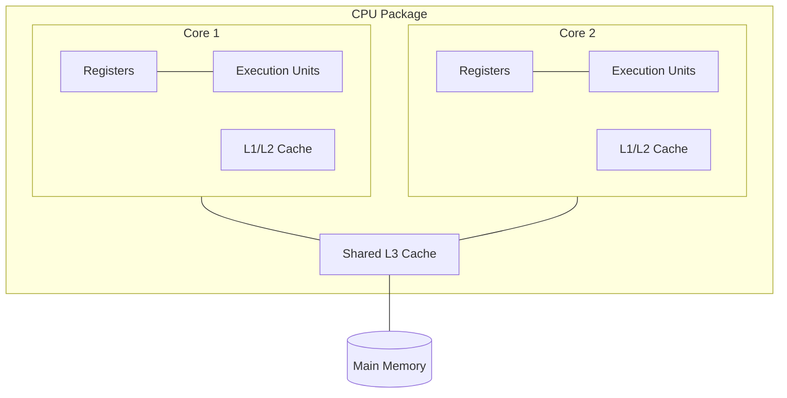

# Multicore & Parallelism

## Overview

Making a single CPU core faster (higher clock speed, deeper pipelines, wider superscalar execution)
ran into physical limits in the mid-2000s: higher clock speeds need more voltage, which increases
power draw and heat roughly quadratically (dynamic power ∝ voltage² × frequency). Chipmakers hit a
"power wall" and pivoted from making one core faster to putting multiple cores on one chip. This
changed the fundamental question for performance from *"how fast is one thread?"* to *"how much of
this workload can run in parallel?"*

## Core Concepts

| Term | Meaning |
|---|---|
| **Core** | An independent processing unit within a CPU chip, with its own fetch/decode/execute pipeline. |
| **SMP (Symmetric Multiprocessing)** | Multiple identical cores share the same memory, all running under one OS scheduler. |
| **Hyper-Threading / SMT (Simultaneous Multithreading)** | One physical core presents itself as two (or more) logical cores by duplicating some hardware (registers) and sharing others (execution units) — increases utilization when one thread stalls (e.g., on a cache miss), but doesn't double real throughput. |
| **Cache coherence** | The protocol (e.g., MESI) that keeps each core's view of shared memory consistent when multiple cores cache the same address — see [Memory Hierarchy & RAM](../memory-hierarchy/intro.md). |
| **Amdahl's Law** | A formula for the maximum speedup from parallelizing part of a program, given the fraction that must remain serial. |

## Architecture / Mechanism



Each core has its own private L1/L2 cache but typically shares a larger L3 cache and the memory bus
with every other core on the chip. This sharing is why memory-bandwidth-heavy workloads don't scale
linearly with core count — every core is competing for the same path to RAM.

### Amdahl's Law

If a fraction **p** of a program's execution time can be parallelized across **N** processors, and
the rest (**1 − p**) must run serially, the maximum possible speedup is:

```text
Speedup(N) = 1 / ((1 − p) + p / N)
```

| Parallel fraction (p) | Speedup at N=4 | Speedup at N=64 | Speedup at N=∞ |
|---|---|---|---|
| 50% | 1.6x | 1.9x | 2x |
| 90% | 3.1x | 7.8x | 10x |
| 99% | 3.9x | 39.3x | 100x |

:::info The takeaway
Even a small serial fraction caps your maximum speedup, no matter how many cores you add. Finding and
eliminating serial bottlenecks (locks, single-threaded I/O, a shared queue) usually matters more than
adding more cores.
:::

## Practical Usage

```cpp showLineNumbers
// Naive: false sharing hurts multicore scaling
struct Counters { int a; int b; }; // a and b likely share one cache line
// If thread 1 writes 'a' and thread 2 writes 'b', every write invalidates
// the whole cache line for the other core — cache coherence traffic dominates.

// Fixed: pad to separate cache lines (typically 64 bytes)
struct alignas(64) PaddedCounter { int value; char padding[60]; };
PaddedCounter a, b; // now on different cache lines, no false sharing
```

## Edge Cases & Pitfalls

- **False sharing**: independent variables that happen to sit on the same cache line cause
  unnecessary cache-coherence traffic between cores, silently destroying multicore scaling — see the
  example above.
- **Hyper-Threading is not "free" cores.** Two logical cores on one physical core still share
  execution units; expect noticeably less than 2x throughput, and sometimes *worse* performance for
  cache- or ALU-bound workloads that don't have stalls to hide.
- **More cores ≠ automatically faster.** Per Amdahl's Law, workloads dominated by serial sections
  (locking, single producer/consumer pipelines) see rapidly diminishing returns from added cores.

## Comparisons

| Approach | Scales with | Bottleneck |
|---|---|---|
| Single fast core | Clock speed, IPC | Power/heat wall (~5 GHz practical ceiling) |
| Multicore (SMP) | Core count, for parallel workloads | Shared memory bandwidth, serial code sections (Amdahl's Law) |
| SMT / Hyper-Threading | Utilization of stalls within one core | Shared execution units, cache contention |

## References

- Gene Amdahl, "Validity of the Single Processor Approach to Achieving Large Scale Computing
  Capabilities" (1967) — the original paper defining Amdahl's Law.
- Hennessy & Patterson, *Computer Architecture: A Quantitative Approach* — multiprocessor and cache
  coherence chapters.

### Books & Videos

- Computerphile, [Multithreading Code](https://www.youtube.com/watch?v=7ENFeb-J75k) — Dr. Steve
  Bagley on what a thread actually is and what the OS has to track for it, versus a process.

## Related Pages

- [Superscalar & Out-of-Order Execution](./superscalar-and-out-of-order-execution.md)
- [Memory Hierarchy & RAM](../memory-hierarchy/intro.md) — cache coherence protocols referenced above.
- [Operating Systems](../operating-systems/intro.md) — how the OS scheduler assigns threads to cores.
