# Pipelining

## Overview

Pipelining overlaps the fetch-decode-execute stages of *multiple* instructions so that, once the
pipeline is full, the CPU completes roughly one instruction per clock cycle instead of one every four
(or five, or more) cycles. It's the single most important idea in classic CPU performance
engineering — and it's also the reason certain code patterns (unpredictable branches, dependent
instruction chains) are slower than others.

## Core Concepts

| Term | Meaning |
|---|---|
| **Pipeline stage** | One step of instruction processing (fetch, decode, execute, memory access, write-back) implemented as dedicated hardware. |
| **Throughput** | Instructions completed per unit time — what pipelining improves. |
| **Latency** | Time for *one* instruction to fully complete — pipelining does not reduce this, and can slightly increase it. |
| **Hazard** | A situation that prevents the next instruction from executing in its ideal pipeline slot. |
| **Stall (bubble)** | An idle pipeline slot inserted to resolve a hazard, wasting a cycle. |

## Architecture / Mechanism

A classic 5-stage pipeline (Fetch, Decode, Execute, Memory, Write-back — the MIPS/RISC textbook
model):

```mermaid
gantt
    dateFormat X
    axisFormat %s
    section Instr 1
    F :a1, 0, 1
    D :a2, 1, 1
    E :a3, 2, 1
    M :a4, 3, 1
    W :a5, 4, 1
    section Instr 2
    F :b1, 1, 1
    D :b2, 2, 1
    E :b3, 3, 1
    M :b4, 4, 1
    W :b5, 5, 1
    section Instr 3
    F :c1, 2, 1
    D :c2, 3, 1
    E :c3, 4, 1
    M :c4, 5, 1
    W :c5, 6, 1
```



By cycle 4, three different instructions are in flight simultaneously, each in a different stage —
this overlap is what raises throughput to nearly one instruction per cycle.

### Hazards

| Hazard type | Cause | Example | Typical fix |
|---|---|---|---|
| **Structural** | Two instructions need the same hardware resource at once | Both need the memory unit in the same cycle | Duplicate hardware (separate instruction/data caches) |
| **Data** | An instruction needs a result the previous one hasn't produced yet | `add rax, rbx` immediately followed by `mov [rcx], rax` | **Forwarding** (feed the ALU result directly to the next stage without waiting for write-back) |
| **Control** | The CPU doesn't know the next instruction's address until a branch resolves | `je label` — is the branch taken or not? | **Branch prediction** + speculative execution (see [next page](./superscalar-and-out-of-order-execution.md)) |

## Practical Usage: Why This Matters for Code You Write

```cpp showLineNumbers
// Data hazard: each iteration depends on the previous result
int sum = 0;
for (int i = 0; i < n; ++i) {
    sum += a[i];   // 'sum' must be ready before the next '+=' can execute
}

// Reduces the dependency chain: 4 independent partial sums can pipeline better
int s0 = 0, s1 = 0, s2 = 0, s3 = 0;
for (int i = 0; i + 3 < n; i += 4) {
    s0 += a[i]; s1 += a[i+1]; s2 += a[i+2]; s3 += a[i+3];
}
int sum = s0 + s1 + s2 + s3;
```

Compilers and CPUs both try to break dependency chains like this automatically (auto-vectorization,
out-of-order execution), but tight, serially-dependent loops are a common reason hand-written code
underperforms what the hardware is capable of.

## Edge Cases & Pitfalls

:::danger Branch mispredictions are expensive
On a deep pipeline (15-20+ stages on some x86-64 chips), a mispredicted branch means every
speculatively-fetched instruction after it must be discarded — a **pipeline flush** that can cost
10-20 cycles. Unpredictable branches (data-dependent, essentially random) are one of the most common
hidden performance costs in hot loops.
:::

- Deeper pipelines increase clock speed potential but increase the misprediction penalty and the
  cost of any stall — there's a real engineering tradeoff, not a free lunch (this is part of why
  clock speeds plateaued around 3-5 GHz industry-wide).
- Pipelining improves *throughput*, not the latency of a single instruction — don't expect one
  isolated operation to get faster from pipelining alone.

## Comparisons

| Approach | Instructions/cycle (ideal) | Complexity | Notes |
|---|---|---|---|
| Non-pipelined | < 1 (one instruction fully finishes before next starts) | Low | Simple to build, wastes hardware |
| Pipelined (scalar) | ~1 | Medium | Classic RISC design (5-stage MIPS) |
| Superscalar + OoO | > 1 | High | See [Superscalar & Out-of-Order Execution](./superscalar-and-out-of-order-execution.md) |

## References

- Patterson & Hennessy, *Computer Organization and Design* — pipeline hazards and hazard-resolution techniques.
- Hennessy & Patterson, *Computer Architecture: A Quantitative Approach* — deeper treatment of pipeline depth tradeoffs.

### Books & Videos

- Computerphile, [CPU Pipeline](https://www.youtube.com/watch?v=BVNx3wtJ9vs) — Matt Godbolt explains
  pipelining and hazards with concrete, visual examples.

## Related Pages

- [Fetch-Decode-Execute Cycle](./fetch-decode-execute-cycle.md)
- [Superscalar & Out-of-Order Execution](./superscalar-and-out-of-order-execution.md)
- [Memory Hierarchy & RAM](../memory-hierarchy/intro.md) — cache misses stall the pipeline in a similar way.
