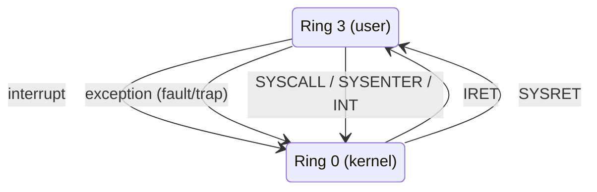

# Privilege Levels and Protection

An operating system has to run code it does not trust — a downloaded binary, a browser tab, a
container — on the same machine, at the same time, as code that owns the machine. Software alone
cannot police that boundary: if untrusted code is allowed to execute arbitrary instructions, no
amount of checking *by other software* can stop it from executing the one instruction that disables
the check. The only thing that works is a bit the untrusted code cannot set itself — a hardware mode
that gates which instructions are even allowed to run. That bit is the subject of this page.

## What a privilege level actually is

A privilege level is a small piece of state inside the CPU, not in memory, that the CPU consults on
every instruction fetch and every memory access, in hardware, before the instruction or access is
allowed to happen. On x86-64 this state is called the **CPL** (Current Privilege Level), and it lives
in the low two bits of the `CS` segment selector — the register that already has to be loaded to fetch
the next instruction, so the check is free: the CPU is reading `CS` anyway.

Because the check happens in hardware on every fetch, there is no code path that skips it. Software
cannot query "am I allowed to do this?" and get a wrong answer through a bug in a checking routine —
there is no checking routine. The CPU either permits the instruction at the current CPL or it doesn't.

## The x86 rings, and why only two are used

x86 defines four privilege levels, numbered 0 (most privileged) through 3 (least privileged), usually
drawn as concentric rings:

<Figure src="/img/linux/overview/privilege-rings.svg"
        alt="Four concentric rings labeled ring 0 through ring 3, with the kernel at the center and applications at the outer edge"
        caption="Ring 0 (kernel) has unrestricted access; each ring out is more restricted than the one inside it."
        source="Wikimedia Commons" href="https://commons.wikimedia.org/wiki/File:Priv_rings.svg"
        license="CC BY-SA 3.0" />

Every mainstream OS — Linux, Windows, macOS — uses exactly two of the four: ring 0 for the kernel and
ring 3 for everything else. Rings 1 and 2 are architecturally real, but nothing runs there, for a
reason that has nothing to do with instruction gating and everything to do with *memory* gating: the
CPL controls which instructions execute, but data protection is enforced separately by the page
table's user/supervisor bit (see below), and that bit is exactly one bit — it can only distinguish
"supervisor" from "user," two states, not four. A ring-1 driver would have an intermediate CPL but
no intermediate memory-protection level to match it, so it would gain nothing over ring 3 for data and
nothing over ring 0 for the trouble of a second privileged tier to secure. With only two protection
states available at the memory layer, only two rings are worth using at the instruction layer either.

## Privileged instructions

A privileged instruction is one the CPU refuses to execute unless the current CPL is 0. These are
instructions that can reconfigure the machine itself — attempting them from ring 3 would let any
process reprogram memory protection, disable interrupts globally, or read another process's secrets
by fiat. Concrete x86-64 examples:

| Instruction | What it touches | Why it must be privileged |
|---|---|---|
| `HLT` | Stops the processor until the next interrupt | A user process could freeze the machine for everyone |
| `LGDT` / `LIDT` | Loads the Global/Interrupt Descriptor Table register | These tables define every segment and every trap/interrupt entry point |
| `MOV` to/from `CR0`, `CR3`, `CR4` | Control registers: paging mode, the page table root, feature bits | This *is* memory protection — writable from ring 3, it would be optional |
| `WRMSR` / `RDMSR` | Model-specific registers | MSRs configure everything from `SYSCALL` targets to performance counters |
| `INVLPG` | Invalidates one entry in the TLB | Lets software desynchronize the CPU's cached view of page permissions |

Attempting any of these from ring 3 raises **`#GP`, the general-protection fault** — and a fault, not
a crash. `#GP` is precise and restartable: the CPU stops before the instruction takes effect, saves
enough state for the kernel's fault handler to inspect exactly what happened, and hands control to
that handler. What happens next — deliver `SIGSEGV`, kill the process, silently emulate the
instruction — is entirely the kernel's decision. The hardware's job ends at "this was not allowed";
policy is software's job.

## Memory protection is the other half

CPL alone protects *instructions*: it decides whether `WRMSR` is allowed to run at all. It says
nothing about whether the currently running code can read or write a given byte of memory. That half
of the boundary is enforced by paging: every page table entry carries a user/supervisor bit, and the
CPU checks it on every memory access — a page marked supervisor-only simply cannot be touched by code
running at CPL 3, regardless of what that code's instruction stream says.

The two mechanisms have to agree for the boundary to mean anything. CPL without page protection would
let ring-3 code execute freely but still read and write kernel memory directly — no privileged
instructions needed, no protection at all. Page protection without CPL enforcement would be
meaningless too, since the CPL check is what makes it impossible for user code to simply reprogram the
page tables (`CR3`, `INVLPG`) to remove the restriction. It is the *combination* — the mode bit gating
which instructions can run, and the page bit gating which memory those instructions can touch — that
makes the kernel/user boundary unforgeable rather than merely inconvenient.

## Crossing the boundary

CPL 3 code cannot raise its own privilege — there is no instruction that sets `CPL := 0` from ring 3;
if there were, the entire model would be decorative. There are exactly three ways execution moves from
ring 3 to ring 0, and all three are things that *happen to* the running code rather than choices it
makes about where to land:

- **An interrupt** — an asynchronous signal from hardware (a timer, a disk, a network card).
- **An exception** — a fault or trap the CPU itself raises (a page fault, a divide-by-zero, the `#GP`
  above).
- **A deliberate instruction** — `SYSCALL` (the fast path on x86-64), or the legacy `SYSENTER` /
  `INT n` forms — which a user program executes on purpose to ask the kernel for something.

The property that matters is not that these three exist, but where each one lands: every single one
transfers control to an address the *kernel* chose ahead of time — an interrupt/exception vector out
of the IDT, or the `SYSCALL` target programmed into the `IA32_LSTAR` MSR — never an address the calling
code supplies. Writing either of those (loading the IDT with `LIDT`, writing `IA32_LSTAR` with
`WRMSR`) is itself a privileged instruction, so user code cannot even aim the door it's about to walk
through. This is the single most important property on this page: the kernel does not have to trust
where a trap into it came from, because it fully controls where every trap into it goes.

*The only three ways user code reaches the kernel, and the two ways back.*

Returning is comparatively unremarkable: `IRET` (the general interrupt/exception return) or `SYSRET`
(the fast counterpart to `SYSCALL`) restores the saved CPL and resumes ring-3 execution — the kernel
is choosing to step back down, which needs no special protection of its own.

## Beyond rings: hypervisor and firmware modes

Rings 0–3 are not the bottom of the stack on modern x86-64 hardware. Intel VT-x and AMD-V add **VMX
root operation**, informally "ring −1," where a hypervisor runs beneath every guest OS's ring 0,
trapping the operations (like reprogramming paging or MSRs) that a guest kernel believes are
privileged but that the host reserves for itself.

Below even that is **System Management Mode (SMM)**, entered only via a System Management Interrupt
and often called "ring −2." SMM code runs from a separate protected memory region invisible to the
OS and hypervisor alike, and exists for firmware-level concerns — power management, hardware
errata workarounds — that predate and outrank the OS entirely.

## arm64 does it differently

arm64 does not use rings at all; it uses **exception levels**, EL0 through EL3, and — the opposite
of x86's numbering — *higher* number means *more* privileged: EL0 is unprivileged userspace, EL1 is
the OS kernel, EL2 is the hypervisor, and EL3 is the secure monitor that arbitrates the Secure/Non-secure
split (TrustZone). Each level is named for a specific role rather than numbered as a generic stack, and
that is a deliberate design choice, not a cosmetic one — it is why arm64 documentation never says "ring
0": there is no ring model to refer to, only a fixed hierarchy of four roles.

---

How Linux specifically builds the kernel/user-space boundary on top of this hardware mechanism is
covered in [The Kernel/User-Space Boundary](../../linux/00-overview/the-kernel-userspace-boundary.md);
the full taxonomy of what can trigger a ring 3 → ring 0 crossing — faults, traps, aborts, and
asynchronous interrupts — is covered in
[Exceptions, Traps, and Interrupts](./exceptions-traps-and-interrupts.md).

## References

- Intel, *Intel 64 and IA-32 Architectures Software Developer's Manual*, Vol. 3A, Chapter 5,
  "Protection" — the authority for the ring model and the exact `#GP` conditions.
  [intel.com](https://www.intel.com/content/www/us/en/developer/articles/technical/intel-sdm.html)
- Arm, [Armv8-A Architecture Reference Manual](https://developer.arm.com/documentation/ddi0487/latest)
  — see "Exception levels" for the arm64 equivalent, and why the vocabulary differs from x86's.
- OSDev Wiki, [Security](https://wiki.osdev.org/Security) — a readable summary when the manuals are
  too much.
