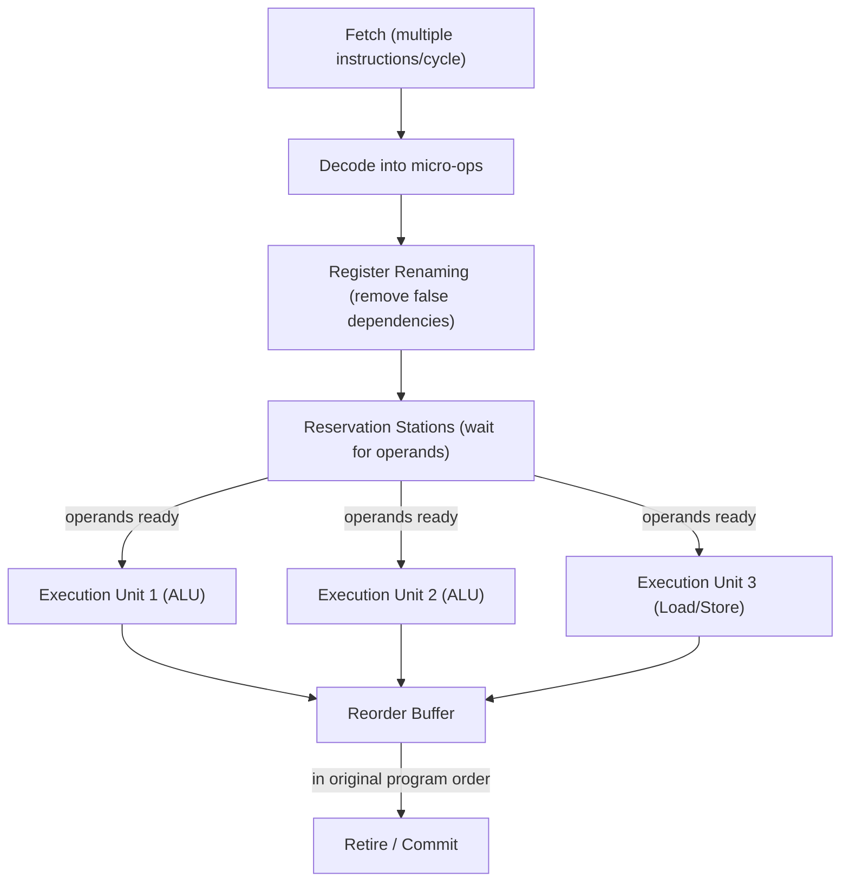

# Superscalar & Out-of-Order Execution

## Overview

A simple pipeline gets throughput to about one instruction per cycle. Modern high-performance CPUs
go further: they fetch and decode *multiple* instructions per cycle (**superscalar**), and execute
instructions in whatever order their data is ready — not necessarily program order (**out-of-order,
OoO, execution**) — then make the results appear in the original order again. This is why a modern
x86-64 or ARM64 core can retire 4-8 instructions per cycle despite running at "only" a few GHz.

## Core Concepts

| Term | Meaning |
|---|---|
| **Instruction-Level Parallelism (ILP)** | Independent instructions in a program that could, in principle, execute simultaneously. |
| **Superscalar** | A CPU with multiple execution units (ALUs, load/store units) that can issue and execute more than one instruction per cycle. |
| **Out-of-order execution** | Instructions execute as soon as their operands are ready, rather than strictly in program order. |
| **Reorder buffer (ROB)** | Hardware structure that tracks in-flight instructions so results can be *committed* (retired) in original program order, even though they executed out of order. |
| **Branch prediction** | A hardware guess about which way a conditional branch will go, made *before* the branch condition is actually known. |
| **Speculative execution** | Executing instructions based on a predicted branch outcome, before it's confirmed correct. |

## Architecture / Mechanism



**Register renaming** solves a subtle problem: two unrelated instructions that happen to reuse the
same architectural register (say, both write to `rax`) don't actually have a data dependency — the
CPU internally maps them to different *physical* registers so they can execute independently, then
resolves which value `rax` should hold when each instruction retires.

**Branch prediction** solves the control-hazard problem from [pipelining](./pipelining.md): instead
of stalling until a branch's condition is known, the CPU predicts the outcome (using history tables
of recently-taken branches) and speculatively executes down the predicted path. If the prediction was
right, this "guessed" work is free performance. If wrong, the pipeline flushes the speculative
instructions and restarts — the cost pipelining pages describe.

## Practical Usage: Why Branch Predictability Matters

```cpp showLineNumbers
// Unpredictable: random data defeats the branch predictor
for (int i = 0; i < n; ++i) {
    if (data[i] > threshold)  // ~50% taken, ~50% not — hard to predict
        sum += data[i];
}

// Predictable / branch-free: sort first, or use branchless select
std::sort(data.begin(), data.end());
for (int i = 0; i < n; ++i) {
    if (data[i] > threshold)  // now mostly one direction — predictor learns it
        sum += data[i];
}
```

This is the famous "sorting makes the loop faster" observation: sorting doesn't change how much work
the ALU does — it changes how predictable the branch is, which changes how often the pipeline flushes.

## Edge Cases & Pitfalls

:::danger Speculative execution and security
Speculative execution can transiently access data (e.g., read past an array bound during a
mispredicted branch) that never architecturally "happens" — the instruction is squashed on
misprediction. But the speculative access can leave measurable side effects in the CPU cache. This is
the root mechanism behind the **Spectre** and **Meltdown** vulnerability classes (2018): an attacker
can use cache-timing side channels to infer secret data that was only *speculatively* touched.
:::

- Out-of-order execution has diminishing returns: real programs have limited ILP, and the hardware
  needed to track more in-flight instructions (bigger reorder buffers, more reservation stations)
  grows faster than the performance gained.
- Not all workloads benefit equally — code with long, serial dependency chains (see the pipelining
  page's `sum +=` example) limits how much OoO execution can help regardless of how wide the CPU is.

## Comparisons

| Design | Instructions issued/cycle | Complexity/power cost | Where used |
|---|---|---|---|
| In-order scalar | 1 | Low | Simple embedded cores |
| In-order superscalar | 2-4 | Medium | Some low-power/embedded designs (e.g., early ARM Cortex-A) |
| Out-of-order superscalar | 4-8+ | High | Modern desktop/server CPUs (Intel Core, AMD Zen, Apple Silicon) |

## References

- Hennessy & Patterson, *Computer Architecture: A Quantitative Approach* — Tomasulo's algorithm and
  out-of-order execution design.
- Kocher et al., ["Spectre Attacks: Exploiting Speculative Execution"](https://spectreattack.com/spectre.pdf) — original research paper.

### Books & Videos

- Computerphile, [How Branch Prediction Works in CPUs](https://www.youtube.com/watch?v=nczJ58WvtYo) —
  Matt Godbolt walks through predictor design and the cost of a misprediction.
- Computerphile, [Spectre & Meltdown](https://www.youtube.com/watch?v=I5mRwzVvFGE) — an accessible
  explanation of how speculative execution's cache side effects became the Spectre/Meltdown
  vulnerability class.

## Related Pages

- [Pipelining](./pipelining.md)
- [Multicore & Parallelism](./multicore-and-parallelism.md)
- [Memory Hierarchy & RAM](../memory-hierarchy/intro.md) — cache-timing side channels rely on cache behavior described here.
