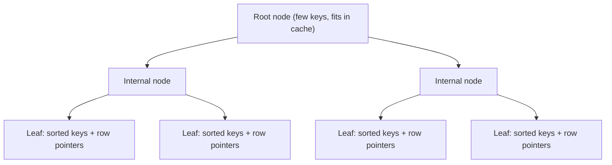
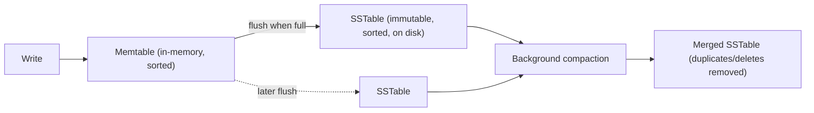

# Indexing & Storage Engines

## Overview

Without an index, finding a row that matches a condition means reading every row in the table — a
**full table scan**. That's fine for a hundred rows and disastrous for a hundred million. An index is
an auxiliary data structure, maintained alongside the table, that lets the database jump almost
directly to matching rows instead of scanning everything. Which data structure to use for that index
is itself a deep design decision, and it's driven by the physical storage tradeoffs covered in
[Storage: HDD, SSD & NVMe](../storage/intro.md) — sequential access is cheap, random access is
expensive, and every indexing scheme is ultimately trying to convert random work into sequential work.

## Core Concepts

| Term | Meaning |
|---|---|
| **Full table scan** | Reading every row in a table to find matches — O(n) regardless of how selective the query is. |
| **Index** | A separate, sorted or hashed structure mapping column values to row locations, enabling lookups faster than a full scan. |
| **B-tree** | A balanced, disk-oriented tree structure where each node holds many keys, keeping the tree shallow; the default index structure in most relational databases. |
| **LSM-tree (Log-Structured Merge-tree)** | A write-optimized structure that buffers writes in memory and flushes them as sorted, immutable files, merging (compacting) them in the background. |
| **Write amplification** | The ratio of bytes actually written to storage versus bytes the application logically wrote — higher amplification means more wear and lower sustained throughput. |
| **Compaction** | The background process that merges LSM-tree files, discarding overwritten/deleted data and reducing the number of files a read must check. |

## Architecture / Mechanism

### Before/after an index

```text
-- Before: no index on email, the engine reads every row (full scan)
SELECT * FROM customers WHERE email = 'alice@example.com';
-- Cost: O(n) — scan all rows in `customers`

-- After: an index on email lets the engine navigate directly to the match
CREATE INDEX idx_customers_email ON customers(email);
SELECT * FROM customers WHERE email = 'alice@example.com';
-- Cost: O(log n) tree traversal instead of O(n) scan
```

### Why B-trees specifically



A B-tree stays **balanced** (every leaf is the same distance from the root) and **shallow** (each
node holds many keys, so even billions of rows need only 3-4 levels of traversal). Two properties
make it a good match for disk-oriented storage, discussed in
[Storage: HDD, SSD & NVMe](../storage/intro.md):

- Each node is sized to match one disk page (commonly 4-16 KB), so one tree level costs roughly one
  I/O.
- Because leaves are kept in sorted order, a **range query** (`WHERE price BETWEEN 10 AND 20`) reads
  a contiguous run of leaves — closer to sequential I/O than random I/O.

The cost is on the write side: an update modifies a page in place, and if a leaf overflows it must
**split**, potentially cascading changes up the tree — a random-I/O-heavy, read-modify-write operation
for every write.

### Why write-heavy databases use LSM-trees



An LSM-tree never modifies data on disk in place. Writes land in an in-memory **memtable**, and when
it fills up it is flushed to disk as a new, immutable, sorted file (an **SSTable**) with one
**sequential** write — no seeking to the "right" page, no page splits. A background **compaction**
process later merges SSTables together, discarding old/overwritten values and keeping the number of
files a read has to check bounded. This is why write-optimized and time-series/append-heavy databases
(Cassandra, RocksDB, LevelDB) build on LSM-trees: they trade some read cost and background CPU/I/O
(compaction) for dramatically cheaper, always-sequential writes.

## Practical Usage

```text showLineNumbers
-- Composite index: helps queries that filter on last_name first,
-- then last_name + first_name together, but NOT first_name alone.
CREATE INDEX idx_customers_name ON customers(last_name, first_name);

SELECT * FROM customers WHERE last_name = 'Smith';                      -- uses the index
SELECT * FROM customers WHERE last_name = 'Smith' AND first_name = 'A'; -- uses the index fully
SELECT * FROM customers WHERE first_name = 'A';                        -- index NOT used
```

## Edge Cases & Pitfalls

:::warning Indexes aren't free
Every index speeds up matching reads but slows down every `INSERT`/`UPDATE`/`DELETE` on that table,
because the index itself must be kept up to date. An over-indexed, write-heavy table can end up
spending more I/O maintaining indexes than doing the actual write.
:::

:::danger Leading-column rule for composite indexes
A composite (multi-column) B-tree index is only usable for queries that filter on a **prefix** of its
columns, left to right. An index on `(last_name, first_name)` cannot be used to efficiently search by
`first_name` alone — the database falls back to a full scan.
:::

- A low-selectivity index (e.g., indexing a boolean `is_active` column where 99% of rows are `true`)
  often isn't worth it — the query planner may decide a full scan is cheaper than following the index
  and fetching mostly-matching rows anyway.
- LSM-trees pay their write savings back on reads: a point lookup may need to check the memtable and
  several SSTables (mitigated with in-memory Bloom filters to skip files that can't contain the key).

## Comparisons

| Aspect | B-tree | LSM-tree |
|---|---|---|
| Writes | In-place, random I/O, page splits | Append-only, sequential I/O, background compaction |
| Reads | Fast, predictable (one tree traversal) | Slower/variable (may check multiple SSTables) |
| Best for | Read-heavy or balanced workloads | Write-heavy, high-ingest workloads |
| Write amplification | Lower per-write, but random | Higher overall (compaction rewrites data multiple times), but sequential |
| Examples | PostgreSQL, MySQL/InnoDB, SQLite | Cassandra, RocksDB, LevelDB, HBase |

## References

- Comer, "The Ubiquitous B-Tree" (1979) — the classic survey of B-tree structure and variants.
- O'Neil et al., "The Log-Structured Merge-Tree (LSM-Tree)" (1996) — the original LSM-tree paper.

### Books & Videos

- Martin Kleppmann, *Designing Data-Intensive Applications*, Ch. 3 "Storage and Retrieval" — B-trees
  vs. LSM-trees, write amplification, and index structures in depth.
- Alex Petrov, *Database Internals* — storage-engine internals for both B-tree and LSM-tree systems.
- CMU 15-445/645 *Intro to Database Systems* (Andy Pavlo) — the "Database Storage" and "Indexes"
  lecture series, e.g. ["Database Storage 1"](https://www.youtube.com/watch?v=df-l2PxUidI).

## Related Pages

- [Storage: HDD, SSD & NVMe](../storage/intro.md)
- [Relational Model & SQL](./relational-model-and-sql.md)
- [Transactions & ACID](./transactions-and-acid.md)
