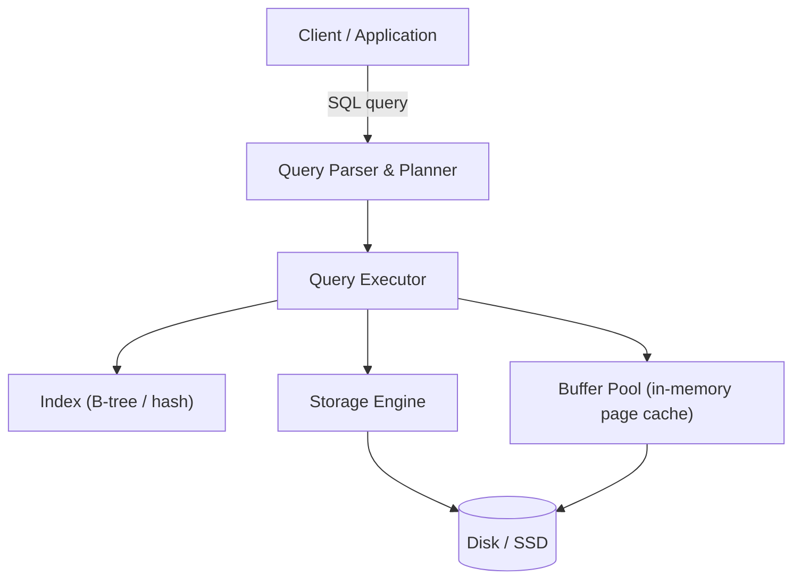

# Databases — Overview

## Overview

A database management system (DBMS) exists to store data reliably, query it efficiently, and let
multiple clients read and write it concurrently without corrupting it — three goals that are each
individually hard and actively pull against each other, which is why database internals matter to
understand rather than treat as a black box.

## Core Concepts

| Term | Meaning |
|---|---|
| **Relational model** | Data organized into tables (relations) of rows and columns, related via keys. |
| **Index** | An auxiliary data structure (commonly a B-tree) that lets the database find rows without scanning the whole table. |
| **Storage engine** | The component responsible for how data is physically laid out on disk and read back. |
| **ACID** | **A**tomicity, **C**onsistency, **I**solation, **D**urability — the guarantees a transactional database makes about each transaction. |
| **CAP theorem** | In a distributed system, you can't simultaneously guarantee **C**onsistency, **A**vailability, and **P**artition tolerance — a network partition forces a choice between C and A. |

## Architecture / Mechanism

Every query ultimately becomes disk I/O, which is why this section sits directly on top of
[Storage](../storage/intro.md) in the reading order — a database's storage engine is a specialized
application of the same random-vs-sequential I/O tradeoffs.

## In This Section

- **[Relational Model & SQL](./relational-model-and-sql.md)**: tables, keys, and why normalization
  exists — with a worked unnormalized-to-normalized example and real SQL.
- **[Indexing & Storage Engines](./indexing-and-storage-engines.md)**: why indexes avoid full table
  scans, and the B-tree vs. LSM-tree trade-off behind read-optimized vs. write-optimized databases.
- **[Transactions & ACID](./transactions-and-acid.md)**: what Atomicity, Consistency, Isolation, and
  Durability each actually prevent, isolation levels, and locking vs. MVCC.
- **[NoSQL & the CAP Theorem](./nosql-and-cap-theorem.md)**: the CAP theorem precisely stated, the
  key-value/document/column-family/graph data model families, and when to reach for each.

## Why It Matters

- **[Storage: HDD, SSD & NVMe](../storage/intro.md)**: index and storage-engine design decisions
  (B-tree vs. LSM-tree) are direct consequences of the physical read/write characteristics covered
  there.
- **[Application Protocols](../protocols/intro.md)**: database clients communicate over a wire
  protocol with the same request/response and connection-security shape as HTTP/TLS.

## Related Pages

- [Relational Model & SQL](./relational-model-and-sql.md)
- [Indexing & Storage Engines](./indexing-and-storage-engines.md)
- [Transactions & ACID](./transactions-and-acid.md)
- [NoSQL & the CAP Theorem](./nosql-and-cap-theorem.md)
- [Storage: HDD, SSD & NVMe](../storage/intro.md)
- [Application Protocols](../protocols/intro.md)
