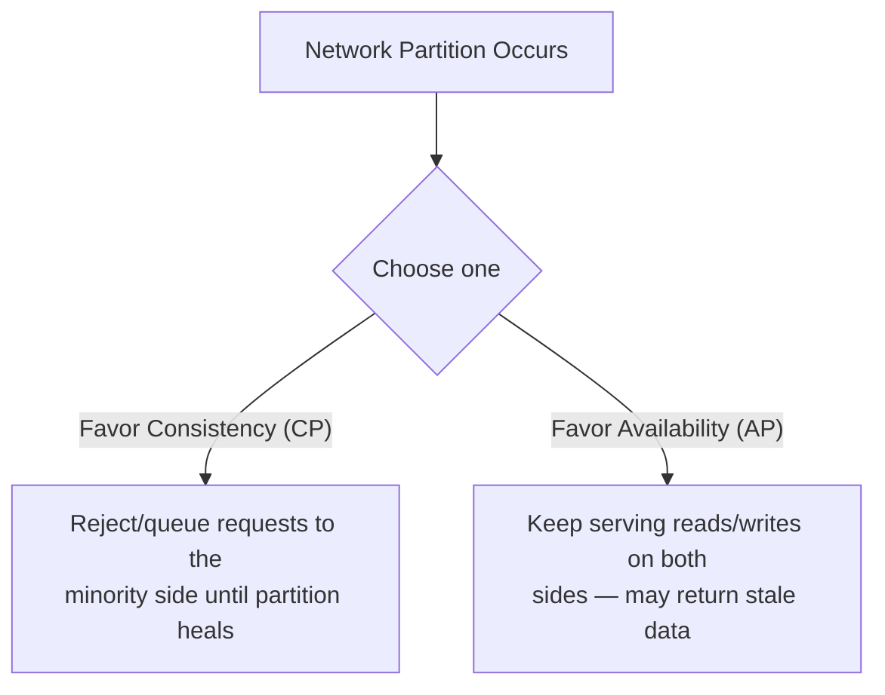

# NoSQL & the CAP Theorem

## Overview

Once a database is replicated across multiple machines to survive failures and scale reads, it
becomes a **distributed system**, and distributed systems are subject to the **CAP theorem**: a
precise, provable statement about what you can and cannot guarantee when the network between
replicas breaks. NoSQL ("not only SQL") databases exist largely because different applications land
in different places along the trade-offs CAP forces — and because the rigid, uniform-schema
relational model isn't the best fit for every shape of data.

## Core Concepts

| Term | Meaning |
|---|---|
| **CAP theorem** | A distributed data store can provide at most two of Consistency, Availability, and Partition tolerance at the same time. |
| **Partition tolerance** | The system continues operating despite dropped or delayed messages between nodes. |
| **Consistency (CAP sense)** | Every read receives the most recent write, or an error — distinct from the "C" in ACID. |
| **Availability (CAP sense)** | Every request to a non-failing node receives a (non-error) response, though not necessarily the latest data. |
| **Key-value store** | Data model where a value is retrieved only by an opaque key; no query into the value's structure. |
| **Document store** | Data model where each record is a self-contained, semi-structured document (JSON/BSON), typically queryable by field. |
| **Column-family (wide-column) store** | Data model organized as row key → column family → column, optimized for very wide rows and high-throughput writes. |
| **Graph database** | Data model where nodes and the edges (relationships) between them are first-class, optimized for traversal queries. |

## Architecture / Mechanism



:::info The precise statement
In any distributed data store, you can't simultaneously guarantee Consistency, Availability, and
Partition tolerance. In practice, partition tolerance isn't optional — a distributed system must
survive dropped/delayed messages, because networks fail — so the real, forced choice only appears
**during a partition**: keep answering requests on both sides of the split (favoring Availability,
at the cost of nodes potentially disagreeing), or refuse/stall requests on the minority side until
the partition heals (favoring Consistency, at the cost of availability). When there's no partition,
a well-designed system can be both consistent and available.
:::

This is why the choice is a genuine trade-off rather than an engineering shortcoming: CP systems
(e.g., a majority-quorum configuration of MongoDB, HBase) sacrifice availability during a partition
to guarantee every read reflects the latest write; AP systems (e.g., Cassandra, DynamoDB) keep
serving requests through a partition but accept that different replicas may briefly disagree
(**eventual consistency**) until it heals.

### NoSQL data model families

| Family | One-line use case | Example system |
|---|---|---|
| Key-value | Session storage / cache where lookups are always by a single known key | Redis |
| Document | Flexible, nested records (e.g., a product catalog) queried by field, without a fixed schema | MongoDB |
| Column-family (wide-column) | High-throughput writes of wide, sparse rows, e.g. time-series sensor data | Apache Cassandra |
| Graph | Data where the relationships matter as much as the entities, e.g. social/recommendation graphs | Neo4j |

## Practical Usage

```text showLineNumbers
-- Relational: relationships are explicit, enforced foreign keys, fixed schema
SELECT o.order_id, c.name
FROM orders o JOIN customers c ON o.customer_id = c.customer_id;
```

```json
// Document store (e.g., MongoDB): a self-contained, schema-flexible record —
// no join needed to fetch the customer's name alongside the order
{
  "_id": "order_123",
  "customer": { "name": "Alice", "email": "alice@example.com" },
  "items": [{ "product": "Widget", "quantity": 3 }]
}
```

```cypher
// Graph database (e.g., Neo4j/Cypher): relationships are first-class,
// making multi-hop traversal queries cheap and natural
MATCH (a:Person {name: "Alice"})-[:FRIENDS_WITH]->(friend)-[:PURCHASED]->(p:Product)
RETURN friend.name, p.name
```

## Edge Cases & Pitfalls

:::warning "NoSQL" is not one thing
Key-value, document, column-family, and graph databases have almost nothing in common technically
beyond "not the relational model." Choosing "a NoSQL database" without picking a specific data model
for your access patterns is a category error — the right question is which family fits your queries,
not whether to avoid SQL.
:::

:::danger Eventual consistency has real application consequences
In an AP system, a client can write a value, immediately read from a different replica, and see the
*old* value — this is not a bug, it's the explicit trade-off being made. Applications built on AP
stores must be designed to tolerate (or explicitly work around, e.g. via read-your-writes techniques)
this staleness.
:::

- Relational databases are not inherently unable to scale or distribute — many now offer distributed,
  horizontally-scalable variants (e.g., CockroachDB, Google Spanner) that make explicit CAP
  trade-offs of their own. "NoSQL vs. SQL" is really "which data model and which side of CAP," not a
  strict scalability divide.

## Comparisons

| Use relational (SQL) when... | Use NoSQL when... |
|---|---|
| Data has a stable, well-defined schema with many relationships | Data is naturally document/graph/key-value shaped, or schema varies a lot |
| You need multi-row/multi-table ACID transactions and joins | You need horizontal write scalability and can relax cross-record transactions |
| Strong consistency is required for correctness (e.g., financial ledgers) | Availability under partition matters more than always reading the latest write |
| Query patterns are ad hoc/unpredictable (general-purpose SQL) | Query patterns are known upfront and the data model is designed around them |

## References

- Eric A. Brewer, "Towards Robust Distributed Systems" (PODC 2000 keynote) — the original CAP
  conjecture.
- Seth Gilbert & Nancy Lynch, "Brewer's Conjecture and the Feasibility of Consistent, Available,
  Partition-Tolerant Web Services" (2002) — the formal proof of CAP.

### Books & Videos

- Martin Kleppmann, *Designing Data-Intensive Applications*, Ch. 9 "Consistency and Consensus" —
  CAP, consistency models, and their practical implications.
- CMU 15-445/645 *Intro to Database Systems* (Andy Pavlo) — ["Relational Model & Algebra"](https://www.youtube.com/watch?v=7NPIENPr-zk) covers alternative (non-relational) data models for comparison.

## Related Pages

- [Transactions & ACID](./transactions-and-acid.md)
- [Relational Model & SQL](./relational-model-and-sql.md)
- [Databases — Overview](./intro.md)
