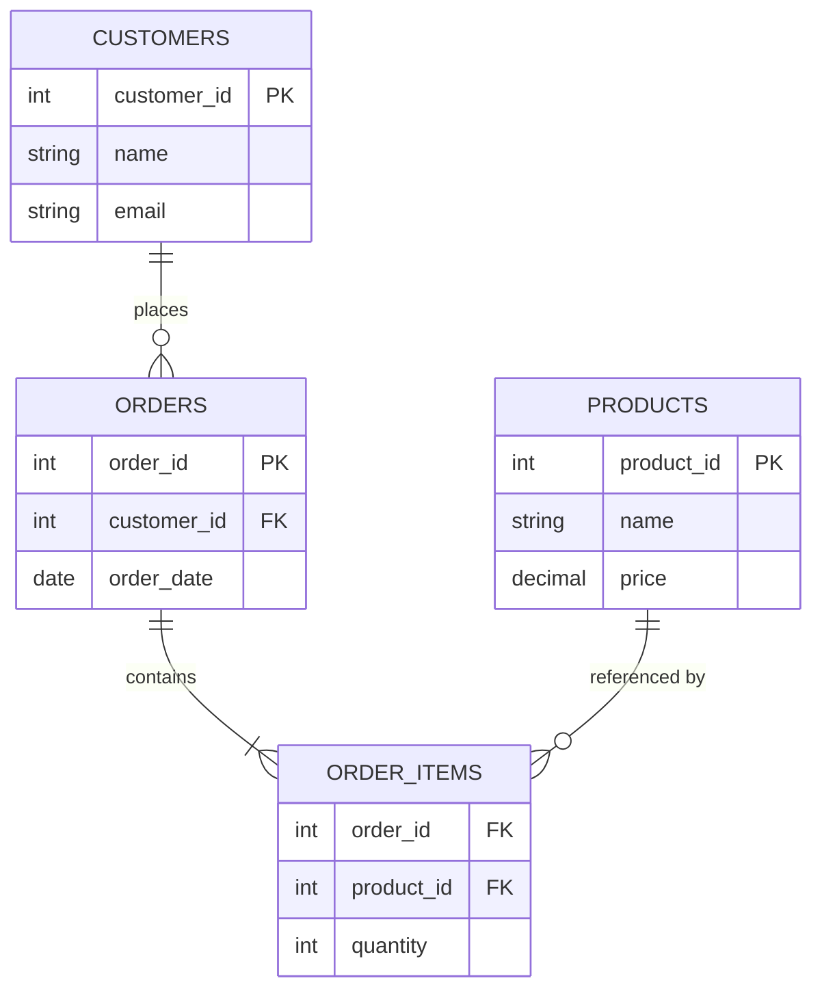

# Relational Model & SQL

## Overview

The relational model, introduced by Edgar F. Codd in 1970, represents all data as **relations**
(tables) of **tuples** (rows) with a fixed set of typed **attributes** (columns). SQL (Structured
Query Language) is the standard language for defining and querying data in that model. The model's
staying power comes from a simple idea: if you avoid storing the same fact in more than one place,
you avoid the many ways redundant copies can quietly drift out of sync — which is the entire
motivation behind **normalization**.

## Core Concepts

| Term | Meaning |
|---|---|
| **Table (relation)** | A named collection of rows sharing the same columns. |
| **Row (tuple)** | A single record in a table. |
| **Column (attribute)** | A named, typed field present in every row of a table. |
| **Primary key** | One or more columns whose value uniquely identifies a row within its table. |
| **Foreign key** | A column (or set of columns) in one table that references the primary key of another table, enforcing referential integrity. |
| **Normalization** | A set of design rules (normal forms) for structuring tables to eliminate redundant data and the update/insert/delete anomalies it causes. |
| **Join** | An operation that combines rows from two or more tables based on a related column, typically a foreign key. |

## Architecture / Mechanism



Foreign keys are what let a normalized schema be split across many small tables without losing the
ability to reconstruct the full picture — a `JOIN` follows the foreign key back to the row it
references at query time, instead of that data being copied everywhere it's needed.

### Why normalization exists: a worked example

Imagine a single, "flat" table that seems convenient at first:

| order_id | customer_name | customer_email | product_name | product_price | quantity |
|---|---|---|---|---|---|
| 1 | Alice | alice@example.com | Widget | 9.99 | 3 |
| 2 | Alice | alice@example.com | Gadget | 19.99 | 1 |
| 3 | Bob | bob@example.com | Widget | 9.99 | 5 |

This single table has three concrete problems, all stemming from the same root cause — storing the
same fact (a customer's email, a product's price) redundantly in multiple rows:

- **Update anomaly**: if Alice changes her email, every row containing "Alice" must be updated
  consistently, or her rows disagree about her own email.
- **Insertion anomaly**: you cannot record a new customer until they place an order, because there's
  nowhere to put a customer without an order row.
- **Deletion anomaly**: deleting Bob's only order deletes all record that Bob exists as a customer.

Normalizing splits this into separate tables, each storing one fact exactly once, related by keys —
the `CUSTOMERS`, `ORDERS`, `ORDER_ITEMS`, `PRODUCTS` structure in the diagram above. Now Alice's email
lives in exactly one row, updated in exactly one place.

:::info Normal forms, briefly
1NF requires atomic (non-repeating) column values. 2NF removes columns that depend on only part of a
composite key. 3NF removes columns that depend on other non-key columns rather than the key itself.
Most practical schema design stops at 3NF; further normalization is rarely worth the extra joins.
:::

## Practical Usage

```text showLineNumbers
CREATE TABLE customers (
    customer_id  INTEGER PRIMARY KEY,
    name         VARCHAR(100) NOT NULL,
    email        VARCHAR(255) NOT NULL UNIQUE
);

CREATE TABLE orders (
    order_id     INTEGER PRIMARY KEY,
    customer_id  INTEGER NOT NULL,
    order_date   DATE NOT NULL,
    FOREIGN KEY (customer_id) REFERENCES customers(customer_id)
);

-- Reconstruct the flat view above with a JOIN, without ever duplicating
-- the customer's name/email on disk:
SELECT o.order_id, c.name, c.email, o.order_date
FROM orders o
JOIN customers c ON o.customer_id = c.customer_id
WHERE o.order_date >= '2024-01-01';
```

## Edge Cases & Pitfalls

:::warning Over-normalization
Splitting data into too many tables can turn simple reads into deep join chains, hurting read
performance. Read-heavy analytical systems often deliberately **denormalize** (duplicate some data)
to avoid joins — the opposite trade-off, made intentionally rather than by accident.
:::

- A foreign key constraint doesn't stop you from designing a bad schema — it only stops you from
  inserting an order for a customer that doesn't exist. Normalization is a design discipline, not
  something the database enforces automatically.
- `NULL` in a foreign key column usually means "no relationship" (e.g., an optional reference), but
  it silently excludes that row from an inner `JOIN` — a common source of "missing rows" bugs.

## Comparisons

| Approach | Redundancy | Read performance | Write/update safety |
|---|---|---|---|
| Flat/unnormalized table | High (facts repeated per row) | Fast (no joins) | Poor — update/insert/delete anomalies |
| Normalized (3NF) schema | Low (each fact stored once) | Requires joins | Strong — one place to update each fact |
| Denormalized (deliberate) | Reintroduced intentionally | Fast (fewer joins) | Requires application-level consistency handling |

## References

- ISO/IEC 9075 (SQL) — the ANSI/ISO SQL standard.
- E. F. Codd, "A Relational Model of Data for Large Shared Data Banks" (1970) — the original paper
  defining the relational model.

### Books & Videos

- Silberschatz, Korth, Sudarshan, *Database System Concepts* — the relational model, ER diagrams, and
  normal forms chapters.
- CMU 15-445/645 *Intro to Database Systems* (Andy Pavlo) — ["Relational Model & Algebra"](https://www.youtube.com/watch?v=7NPIENPr-zk).

## Related Pages

- [Indexing & Storage Engines](./indexing-and-storage-engines.md)
- [Transactions & ACID](./transactions-and-acid.md)
- [Databases — Overview](./intro.md)
