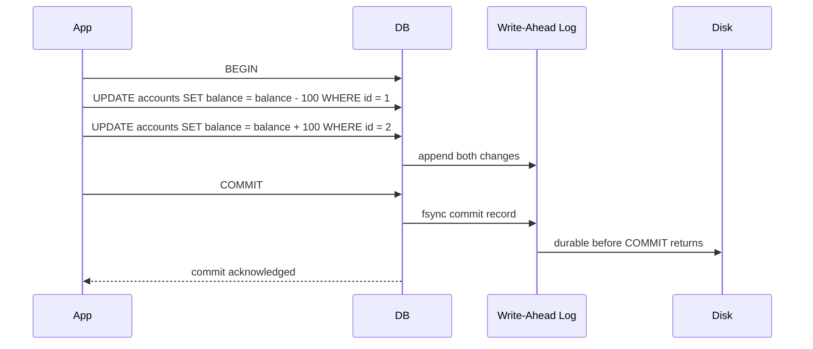

# Transactions & ACID

## Overview

A **transaction** groups multiple reads/writes into a single logical unit of work. ACID —
**A**tomicity, **C**onsistency, **I**solation, **D**urability — is the set of guarantees a
transactional database makes about how that unit of work behaves, especially when things go wrong
(crashes) or when other transactions run concurrently. Each letter protects against a specific,
concrete failure mode; understanding what breaks *without* each one is the fastest way to understand
what it actually buys you.

## Core Concepts

| Term | Meaning | What breaks without it |
|---|---|---|
| **Atomicity** | A transaction's writes either all happen, or none do. | A transfer that debits one account but crashes before crediting the other — money disappears. |
| **Consistency** | A transaction only moves the database from one valid state to another, per application-defined invariants (constraints, triggers). | A `CHECK (balance >= 0)` constraint being violated because a transaction partially applied. |
| **Isolation** | Concurrent transactions appear to run as if executed one at a time. | Two transactions both read a counter as 5, both increment it, both write 6 — one increment is lost. |
| **Durability** | Once a transaction commits, its effects survive a crash immediately after. | The database acknowledges a commit, the power fails, and the write is gone when it restarts. |

## Architecture / Mechanism



Atomicity and durability are typically implemented together via a **write-ahead log (WAL)**: changes
are appended to a durable log before being applied to the actual data pages, and before a commit is
acknowledged, its log entries must be flushed to durable storage. If the database crashes mid-write,
it replays the WAL on restart to redo committed work and undo uncommitted work — atomic all-or-nothing
recovery.

### Isolation levels and the anomalies they prevent

The ANSI SQL standard defines isolation levels in terms of three concurrency **anomalies** they may
or may not permit:

- **Dirty read**: reading a row another transaction has written but not yet committed.
- **Non-repeatable read**: re-reading the same row within a transaction and getting a different
  value, because another transaction committed a change to it in between.
- **Phantom read**: re-running the same *range* query within a transaction and seeing a different set
  of rows, because another transaction inserted/deleted a matching row in between.

| Isolation level | Dirty read | Non-repeatable read | Phantom read |
|---|---|---|---|
| Read Uncommitted | Possible | Possible | Possible |
| Read Committed | Prevented | Possible | Possible |
| Repeatable Read | Prevented | Prevented | Possible |
| Serializable | Prevented | Prevented | Prevented |

:::info Standard vs. real implementations
The ANSI SQL definitions describe permitted *phenomena*, not a specific mechanism — real databases
vary. PostgreSQL's "Repeatable Read", for example, is implemented via snapshot isolation and in
practice also prevents phantom reads, which is stricter than the ANSI SQL requirement. Always check a
specific database's documentation rather than assuming the table above applies exactly.
:::

### Locking vs. MVCC

Isolation can be implemented in (at least) two different ways:

- **Locking**: transactions take locks on rows (or ranges) they read/write; conflicting transactions
  block or abort. Simple to reason about, but readers and writers can contend directly, and
  range/predicate locks are needed to prevent phantoms.
- **MVCC (Multi-Version Concurrency Control)**: the database keeps multiple versions of a row and
  gives each transaction a consistent snapshot to read from, so readers never block writers and
  writers never block readers. PostgreSQL, MySQL/InnoDB, and Oracle all use MVCC as their primary
  isolation mechanism, typically combined with row-level locking for write-write conflicts.

## Practical Usage

```text showLineNumbers
BEGIN;

-- Both statements succeed together, or neither is applied (atomicity).
UPDATE accounts SET balance = balance - 100 WHERE id = 1;
UPDATE accounts SET balance = balance + 100 WHERE id = 2;

COMMIT; -- durable once this returns
```

```text showLineNumbers
-- Setting an explicit isolation level (syntax varies by database)
SET TRANSACTION ISOLATION LEVEL SERIALIZABLE;
BEGIN;
SELECT balance FROM accounts WHERE id = 1;
-- ... application logic decides how much to transfer ...
UPDATE accounts SET balance = balance - 50 WHERE id = 1;
COMMIT;
```

## Edge Cases & Pitfalls

:::danger Lost updates
Read Committed does not prevent a "read-modify-write" race: two transactions can both read a balance
of 100, both compute "100 - 50 = 50" in application code, and both write 50 back — one transaction's
decrement is silently lost. Preventing this needs either Repeatable Read/Serializable, or an explicit
`SELECT ... FOR UPDATE` row lock, or an atomic `UPDATE accounts SET balance = balance - 50` that never
reads the value into application code at all.
:::

- Higher isolation levels aren't free: Serializable typically means more aborted/retried transactions
  under contention, or more locking overhead — a real throughput cost for the stronger guarantee.
- "Consistency" in ACID (application-defined invariants) is a different concept from "Consistency" in
  the CAP theorem (all nodes agree on the latest value) — the same word means two different things in
  these two contexts, a frequent source of confusion.

## Comparisons

| Mechanism | Readers block writers? | Writers block readers? | Typical use |
|---|---|---|---|
| Pessimistic locking | Sometimes (shared/exclusive locks) | Yes | Strong conflict environments, simple reasoning |
| MVCC | No (reads a snapshot) | No | PostgreSQL, MySQL/InnoDB, Oracle — most modern OLTP databases |

## References

- ISO/IEC 9075 (SQL) — defines the standard isolation levels and anomalies.
- Berenson et al., "A Critique of ANSI SQL Isolation Levels" (SIGMOD 1995) — clarifies ambiguities in
  the standard's definitions and introduces Snapshot Isolation.

### Books & Videos

- Martin Kleppmann, *Designing Data-Intensive Applications*, Ch. 7 "Transactions" — isolation levels,
  anomalies, and how they're actually implemented.
- Silberschatz, Korth, Sudarshan, *Database System Concepts* — the transactions and concurrency
  control chapters.

## Related Pages

- [Indexing & Storage Engines](./indexing-and-storage-engines.md)
- [NoSQL & the CAP Theorem](./nosql-and-cap-theorem.md)
- [Relational Model & SQL](./relational-model-and-sql.md)
