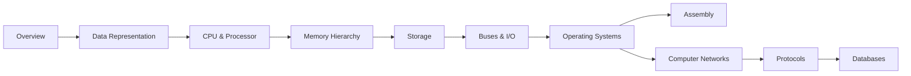

# Computer Science Knowledge Base

A structured, top-down path through how computers actually work: from a single instruction executing
on a CPU, up through memory, storage, and the operating system, out to networks and the databases
built on top of all of it. Pages favor **why the layer exists and what breaks when you ignore it**
over trivia — grade-school basics (binary counting, "what is a computer") are skipped or covered in
one line.

:::info How this is organised
Bottom-up on hardware (CPU → Memory → Storage → Buses), then up through the **Operating System** that
multiplexes that hardware, then out to **Networks**, **Protocols**, and **Databases** — the systems
built using everything below them. See the [Overview](./overview/intro.md) page for the full
reasoning.
:::

## Sections

|   | Section | What it covers |
|---|---------|----------------|
| <Icon icon="lucide:map" inline /> | [Overview](./overview/intro.md) | The abstraction-layer mental model and reading order |
| <Icon icon="lucide:binary" inline /> | [Data Representation](./bit-manipulation/intro.md) | Binary/hex, two's complement, bitwise techniques |
| <Icon icon="lucide:cpu" inline /> | [CPU & Processor Architecture](./cpu-architecture/intro.md) | ISA, fetch-decode-execute, pipelining, superscalar/OoO, multicore |
| <Icon icon="lucide:memory-stick" inline /> | [Memory Hierarchy & RAM](./memory-hierarchy/intro.md) | Registers, caches, DRAM, virtual memory |
| <Icon icon="lucide:hard-drive" inline /> | [Storage: HDD, SSD & NVMe](./storage/intro.md) | Magnetic disks, NAND flash, storage interfaces |
| <Icon icon="lucide:cable" inline /> | [Buses & I/O](./buses-and-io/intro.md) | Address/data/control buses, PCIe, DMA, interrupts |
| <Icon icon="lucide:layers" inline /> | [Operating Systems](./operating-systems/intro.md) | Processes/threads, scheduling, memory management, sync |
| <Icon icon="lucide:terminal" inline /> | [Assembly & Low-Level Programming](./assembly/intro.md) | Registers, instructions, calling conventions, disassembly |
| <Icon icon="lucide:network" inline /> | [Computer Networks](./computer-networks/intro.md) | OSI/TCP-IP models, data link, IP, TCP/UDP |
| <Icon icon="lucide:globe" inline /> | [Application Protocols](./protocols/intro.md) | DNS, HTTP/HTTPS, TLS |
| <Icon icon="lucide:database" inline /> | [Databases](./databases/intro.md) | Relational model, indexing, ACID, NoSQL/CAP |

## Suggested Reading Path

- <Icon icon="lucide:rocket" inline /> **New to systems programming:** [Overview](./overview/intro.md) → [CPU & Processor Architecture](./cpu-architecture/intro.md) → [Memory Hierarchy & RAM](./memory-hierarchy/intro.md) → [Operating Systems](./operating-systems/intro.md).
- <Icon icon="lucide:server" inline /> **Backend / infrastructure focus:** [Operating Systems](./operating-systems/intro.md) → [Computer Networks](./computer-networks/intro.md) → [Application Protocols](./protocols/intro.md) → [Databases](./databases/intro.md).
- <Icon icon="lucide:cpu" inline /> **Performance engineering:** [CPU & Processor Architecture](./cpu-architecture/intro.md) (all pages) → [Memory Hierarchy & RAM](./memory-hierarchy/intro.md) → [Assembly & Low-Level Programming](./assembly/intro.md).

:::tip Conventions used across these docs
- Diagrams are Mermaid; tables are preferred over prose for comparisons.
- Admonitions flag the important bits: `info` for context, `warning`/`danger` for real foot-guns
  (security issues, performance traps).
- Every page ends with a **References** section and a **Books & Videos** subsection pointing at the
  specific chapters, official specs, or videos worth going deeper on — this KB is meant as a map, not
  a replacement for the primary sources it cites.
:::
