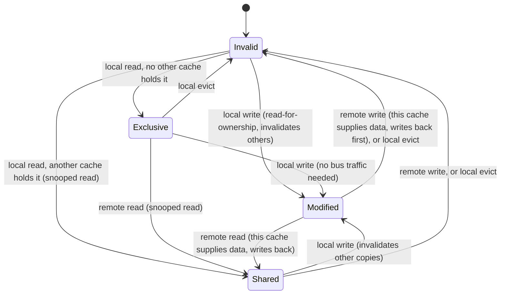

# Cache Coherence and MESI

How several caches holding the same line stay consistent, and why two unrelated variables in one line can destroy performance.

This is a problem created by success. Private per-core caches, described in
[CPU Caches](./cpu-caches.md), are exactly what makes multicore fast — each core gets its own fast
local copy of the data it's using, instead of contending for one shared cache on every access. But
the moment two cores cache the *same* line, they can disagree about what's in it, and nothing about
that is automatically prevented. **Cache coherence** is the hardware protocol that makes the
disagreement impossible to observe — every core sees a value consistent with some valid ordering of
writes, no matter which cache actually holds the data — and it is the reason a shared variable
costs what it costs.

## The invariant

Every coherence protocol on this page is an implementation of one sentence: **at most one writer,
or any number of readers, per line, at a time.** A line either has a single core that may modify
it, or it has zero-or-more caches that may only read it — never both at once, and never two
writers. Everything below — the states, the optimizations, the traffic — exists to enforce exactly
that, as cheaply as possible.

## MESI, state by state

**MESI** names the four states a cache line can be in, one per cache that holds it:

| State | This cache may... | What forces a transition |
|---|---|---|
| **M**odified | Read and write locally, with no bus traffic. This copy is the only valid one, and it disagrees with memory. | Another core requests the line (this cache must supply the data and write back) |
| **E**xclusive | Read and write locally, with no bus traffic. This copy is the only valid one, and it matches memory. | A local write silently moves it to Modified; another core's read moves it to Shared |
| **S**hared | Read locally, with no bus traffic. Other caches may hold this line too, all agreeing with memory. | A local write requires first invalidating every other copy (moves to Modified); another core's write invalidates this copy |
| **I**nvalid | Nothing — this cache's copy, if any, is not usable and must be fetched before use | A local read or write starts a request that lands in E, S, or M |

**Exclusive is the interesting one.** It is what lets a core write to a line it privately loaded
without a single bus transaction — no broadcast, no invalidation, nothing to coordinate, because
the protocol already knows no one else has a copy. This is why touching data that genuinely belongs
to one core is fast: the first access finds the line uncached anywhere and lands in Exclusive, and
every access after that, including writes, is free of coherence traffic until another core shows
interest.

## MOESI and MESIF, in one paragraph each

Real hardware rarely ships bare MESI. AMD's **MOESI** adds an **O**wned state: a dirty line can be
shared with other caches directly from the owning cache, without first writing it back to memory —
the owner just serves the data itself and keeps the "responsible for eventually writing back"
obligation. Intel's **MESIF** instead adds a **F**orward state: when a line is Shared by several
caches, exactly one of them is designated Forward, and that's the one that answers a new request
for the line, rather than every sharer racing to respond or memory being the sole source. Both are
optimizations of the same invariant from above — fewer memory round trips, less redundant bus
traffic — and neither changes anything about how software should be written. The invariant that
matters to a programmer is still "one writer or many readers," however many extra letters the
vendor's diagram has.

## Snooping versus directories

The mechanism above assumes every cache can see every other cache's traffic — **snooping**: a bus
(or bus-like interconnect) that every core listens to, so "does anyone else have this line" is
answered by broadcasting the question. That works and scales fine up to a handful of cores; beyond
that, broadcasting every request to every core stops scaling; the traffic grows with the number of
cores squared. Large systems instead keep a **directory** — a structure that tracks, per line,
which caches currently hold it — so a request only has to ask the directory, and the directory only
has to notify the caches that are actually involved.

This changes nothing about correctness — the invariant is identical either way — and everything
about how the cost grows with core count. A snooping system on 4 or 8 cores can be simpler and
faster than a directory; a directory-based system is what makes a 64- or 128-core machine coherent
at all without every cache-miss becoming a global broadcast.

## The unit is the line, not the variable

Coherence operates on whole **cache lines**, not on individual variables — and the line size on
every current x86-64 and arm64 part is **64 bytes**. (This is a current-generation fact, not an
architectural mandate: nothing in either ISA requires 64 bytes forever, and it has changed across
generations before. Treat "64 bytes" as the number to verify for a specific part, not a constant to
hardcode into an assumption that will outlive the hardware.) Everything on the rest of this page —
false sharing, the cost table below, `perf c2c` — follows from this one fact: coherence protects
lines, so two things that share a line share its coherence state whether or not they have anything
to do with each other.

## False sharing

Two cores, two completely unrelated variables, one 64-byte line. Core 0 writes its variable; MESI
correctly invalidates Core 1's copy of the *line* — not of the variable Core 1 actually cares
about, because the protocol has no finer granularity than that. Core 1 then writes its own
variable, invalidating Core 0's copy right back. The line ping-pongs between Modified on each core
in turn, both cores stall on coherence traffic, there is no shared data in the program's own terms,
and nothing in the source code looks wrong — this is **false sharing**, and it is one of the most
common invisible multicore performance bugs there is.

The canonical fixes: pad each variable out so it occupies its own cache line, or restructure the
data so each core has its own **per-core copy** instead of sharing a struct at all. The second is
the stronger fix — per-core data doesn't just make the ping-pong cheaper, it eliminates the
sharing that caused it in the first place, which is exactly the structural answer Linux's per-CPU
data areas use (linked below).

## What it costs

As orders of magnitude, not measurements — real numbers depend on the specific part, the
interconnect topology, and current bus load, and should be measured, not assumed:

| Access | Approximate cost (order of magnitude) |
|---|---|
| L1 hit | ~4 cycles |
| L2 hit | ~10-15 cycles |
| LLC (L3) hit | ~40-75 cycles |
| Line held Modified by another core, same socket | ~100-150 cycles |
| Line held Modified by another core, different socket | ~300-400+ cycles |

The jump from an on-socket to a cross-socket coherence transaction is the one worth remembering as
a shape: it's not a small multiplier, it's an order of magnitude beyond an LLC hit. When "this is
slow" needs to become "this is *this* cache line, contended between *these* two threads," the tool
is `perf c2c` — it's built specifically to turn a vague coherence-cost suspicion into a concrete
line and a concrete pair of contending accesses.

*One cache line, one core's view: what moves it between Modified, Exclusive, Shared, and Invalid.*

## Coherence is not consistency

The closing distinction, and the reason this page and
[Memory Ordering and Consistency](../cpu-architecture/memory-ordering-and-consistency.md) are
separate pages rather than one. Coherence orders accesses to **one** memory location: it guarantees
every core eventually agrees on the sequence of values a single line takes on. It says nothing
about the order of accesses to **two different** locations — whether a store to `x` becomes visible
to another core before or after a store to `y`. That second question, which coherence has nothing
to say about, is the **memory model**, and it's a genuinely separate piece of machinery built on
top of the coherence protocol described here.

## Where this goes next

- [CPU Caches](./cpu-caches.md) — cache organization itself: levels, associativity, and the
  hit/miss path this protocol operates within.
- [Atomic Operations in Hardware](../cpu-architecture/atomic-operations-in-hardware.md) — what an
  atomic instruction actually does to these states (acquiring a line in Exclusive/Modified and
  holding it for the read-modify-write).
- [`../../linux/09-concurrency-and-locking/per-cpu-data.md`](../../linux/09-concurrency-and-locking/per-cpu-data.md) —
  the kernel's structural answer to false sharing: give each core its own copy instead of
  contending for one.

## References

- Sorin, Hill & Wood, *A Primer on Memory Consistency and Cache Coherence*, 2nd ed. — the standard
  treatment; the coherence chapters are the clearest published statement of the invariant.
  Available free through many institutions; otherwise a purchase.
- Ulrich Drepper, ["What Every Programmer Should Know About Memory"](https://people.freebsd.org/~lstewart/articles/cpumemory.pdf) —
  dated in its hardware specifics (2007) and still the best long-form explanation of why cache
  behaviour dominates.
- Intel SDM Vol. 3A, ch. 9.4 "Memory Ordering" and the MESI description in ch. 12 — the vendor
  statement of protocol behaviour.
- [`perf c2c` documentation](https://man7.org/linux/man-pages/man1/perf-c2c.1.html) — the tool that
  turns "this is slow" into a specific cache line and a specific pair of threads.
