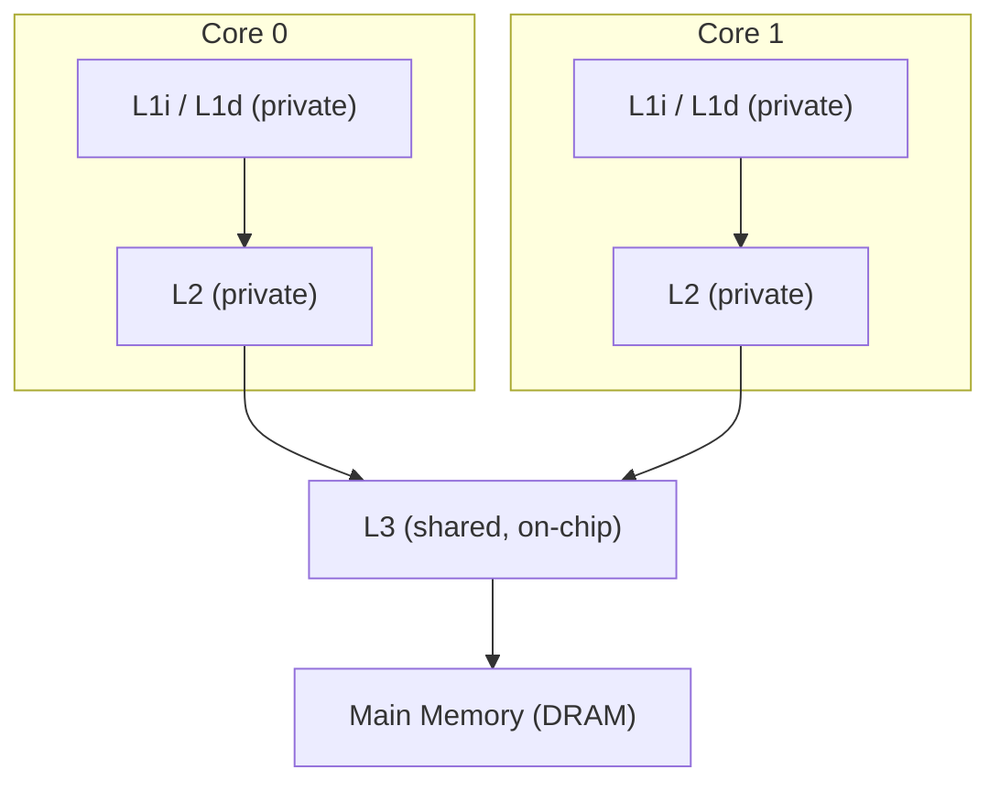
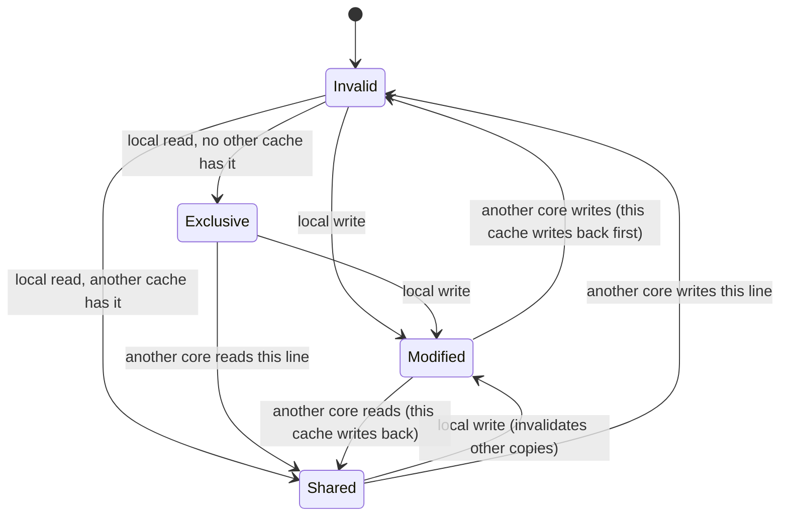

# CPU Caches

## Overview

A CPU cache is a small amount of fast SRAM that sits between the core and main memory, holding
recently-used data so most memory accesses never have to pay DRAM's latency. Modern CPUs use several
*levels* of cache (L1, L2, L3) that trade size for speed, and on multicore chips, several *copies* of
the same data can legally exist in different cores' caches at once — which means the hardware needs a
protocol to keep them all consistent. This page covers how caches are organized, how hits/misses and
writes are handled, and how multiple cores keep their caches coherent.

## Core Concepts

| Term | Meaning |
|---|---|
| **Cache line (block)** | The fixed-size chunk (commonly 64 bytes) that a cache stores and moves as one unit — you can't fetch just one byte from DRAM into cache, you fetch its whole line. |
| **L1 cache** | Smallest, fastest cache, private per core; often split into separate instruction (L1i) and data (L1d) caches. |
| **L2 cache** | Larger and slower than L1, typically private per core (or per small cluster of cores). |
| **L3 cache** | Largest, slowest on-chip cache, typically **shared** across all cores on the chip. |
| **Hit / miss** | Whether the requested data was found in a given cache level or had to be fetched from a lower/slower level. |
| **Associativity** | How many cache locations a given memory address is allowed to map to (direct-mapped, set-associative, fully-associative). |
| **Write-through / write-back** | Whether writes go to main memory immediately, or only when the modified line is evicted. |
| **Cache coherence** | The guarantee that all cores observe a consistent view of memory even though each has its own cache copies. |

## Architecture / Mechanism

### Private vs. shared, and the levels



L1 and usually L2 are private to a core — fast, but only that core sees them. L3 is shared across
cores on the same chip, which is *why* cache coherence is needed: a shared L3 plus each core's private
L1/L2 means the same data can legitimately be cached in multiple places simultaneously.

### Mapping: where can an address go?

| Scheme | How an address maps to cache locations | Tradeoff |
|---|---|---|
| **Direct-mapped** | Each address maps to exactly one cache slot. | Simple, fast, but two addresses that map to the same slot constantly evict each other ("conflict misses"). |
| **Set-associative (N-way)** | Each address maps to one *set* containing N slots; it can go in any of the N. | Good balance — most real CPU caches (e.g., 8-way L1) use this. |
| **Fully-associative** | An address can go in any slot at all. | Fewest conflict misses, but expensive to search — used only for small structures (e.g., TLBs). |

### Hits, misses, and writes

On a **read**, the CPU checks progressively larger/slower levels (L1 → L2 → L3 → DRAM) until it finds
the line; every level it checks along the way is filled with a copy. On a **write**, two common
policies exist:

- **Write-through**: every write goes to this cache *and* immediately down to the next level/memory —
  simple, always consistent, but generates more traffic.
- **Write-back**: writes only update the cache line and mark it **dirty**; it's written down to memory
  only when evicted. Fewer memory writes, but a dirty line must be flushed before eviction, and a crash
  can lose data that was never flushed.

Most modern CPU caches use write-back for L1/L2/L3, deferring memory traffic as long as possible.

### Cache coherence: MESI

When multiple cores each have a private cache, the hardware needs a **cache coherence protocol** so
that a write on one core is eventually visible to others, and no two cores disagree about a line's
value. The most widely taught protocol is **MESI**, named for the four states a cache line can be in:

| State | Meaning |
|---|---|
| **M**odified | Present only in this cache, and dirty (different from memory) — this cache must supply this data to anyone else who wants it, and write it back before it can be discarded. |
| **E**xclusive | Present only in this cache, but clean (matches memory) — can silently become Shared or transition to Modified on a local write. |
| **S**hared | Present in this cache and possibly others too; clean — can be discarded at any time without writing back. |
| **I**nvalid | This cache's copy is not valid and must be re-fetched before use. |

Cores communicate state changes by broadcasting/snooping bus transactions (e.g., "I'm about to write
this line" invalidates other cores' copies). Real CPUs often extend MESI with an **O**wned state
(MOESI) or similar, but MESI is the conceptual core every variant builds on.



## Practical Usage

Cache-friendly code is mostly about respecting cache lines and locality:

```cpp showLineNumbers
// Cache-friendly: row-major traversal matches how a 2D array is laid
// out in memory, so each cache line loaded is fully used before moving on.
for (int i = 0; i < rows; ++i)
    for (int j = 0; j < cols; ++j)
        sum += matrix[i][j];

// Cache-unfriendly: column-major traversal of a row-major array jumps
// 'cols' elements between accesses, touching a new cache line almost
// every time and wasting most of each line that was fetched.
for (int j = 0; j < cols; ++j)
    for (int i = 0; i < rows; ++i)
        sum += matrix[i][j];
```

One important multicore-specific pitfall — **false sharing**, where independent variables placed on
the same cache line cause unrelated writes from different cores to repeatedly invalidate each other's
copies via the coherence protocol above — is covered with a worked padding example in
[Multicore & Parallelism](../cpu-architecture/multicore-and-parallelism.md); it's a direct, practical
consequence of the MESI mechanics described on this page.

## Edge Cases & Pitfalls

:::danger Coherence traffic can dominate multicore performance
Even when cores touch *different* variables, if those variables share a cache line, MESI's
invalidation traffic forces the line to bounce between cores' caches on every write — see
[Multicore & Parallelism](../cpu-architecture/multicore-and-parallelism.md) for the false-sharing
example and fix.
:::

- A cache miss doesn't just cost time for one load — it can stall the pipeline waiting on data (see
  [Pipelining](../cpu-architecture/pipelining.md)), so cache misses in hot loops are often the real
  reason "CPU-bound" code is slow.
- Associativity is a tradeoff, not a free win: fully-associative lookups are expensive to implement in
  hardware, which is why L1/L2/L3 use set-associativity rather than fully-associative designs despite
  the latter having fewer conflict misses.
- Write-back caches mean memory isn't always immediately up to date — this matters for DMA, memory-
  mapped I/O, and multi-threaded code that assumes writes are instantly visible everywhere.

## Comparisons

| Cache level | Typical scope | Relative size | Relative latency |
|---|---|---|---|
| L1 | Private per core | Smallest | Fastest |
| L2 | Private per core (or small cluster) | Medium | Medium |
| L3 | Shared across cores on chip | Largest on-chip | Slowest on-chip |
| DRAM | Shared, off-chip | Much larger than L3 | Much slower than any cache level |

| Write policy | Memory updated | Traffic | Risk |
|---|---|---|---|
| Write-through | On every write | Higher | Lower (memory always current) |
| Write-back | On eviction of a dirty line | Lower | Higher (data only in cache until flushed) |

## References

- [MESI protocol — Wikipedia](https://en.wikipedia.org/wiki/MESI_protocol) — state definitions and transitions.
- Patterson & Hennessy, *Computer Organization and Design* — cache organization, associativity, and coherence chapters.

### Books & Videos

- Ulrich Drepper, ["What Every Programmer Should Know About Memory"](https://people.freebsd.org/~lstewart/articles/cpumemory.pdf) — detailed cache-line and coherence discussion.
- Bryant & O'Hallaron, *Computer Systems: A Programmer's Perspective* — "The Memory Hierarchy" chapter, including cache-friendly code examples.
- Computerphile, ["How CPU Memory & Caches Work"](https://www.youtube.com/watch?v=SAk-6gVkio0) — accessible walkthrough of multi-level caching.

## Related Pages

- [Memory Hierarchy & RAM — Overview](./intro.md)
- [RAM Fundamentals](./ram-fundamentals.md)
- [Virtual Memory & Paging](./virtual-memory-and-paging.md)
- [Multicore & Parallelism](../cpu-architecture/multicore-and-parallelism.md)
- [Pipelining](../cpu-architecture/pipelining.md)
