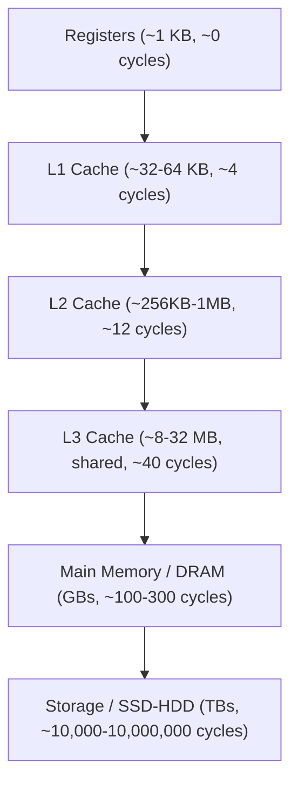

# Memory Hierarchy & RAM — Overview

## Overview

No single memory technology is simultaneously fast, large, and cheap. Computers instead use a
**hierarchy**: a small amount of extremely fast memory (registers, caches) backed by progressively
larger, slower, cheaper tiers (RAM, then disk). Programs benefit from this transparently because most
real workloads exhibit **locality of reference** — they tend to reuse recently accessed data (temporal
locality) and access nearby addresses (spatial locality) — which lets small, fast caches absorb most
memory traffic.

## Core Concepts

| Tier | Approx. size | Approx. latency | Volatile? |
|---|---|---|---|
| CPU registers | Bytes | < 1 cycle | Yes |
| L1/L2/L3 cache | KB-MB | 4-40 cycles | Yes |
| DRAM (RAM) | GB | ~100-300 cycles | Yes |
| SSD/NVMe | GB-TB | ~10,000-100,000 cycles | No |
| HDD | TB | ~10,000,000+ cycles | No |

Each tier down is roughly 10-1000x larger and slower than the one above it — the difference between
an L1 cache hit and a disk access is comparable to the difference between one second and several
weeks.

## In This Section

- **[RAM Fundamentals](./ram-fundamentals.md)** — SRAM vs. DRAM, why DRAM needs refresh, and DDR
  generations and channel bandwidth.
- **[CPU Caches](./cpu-caches.md)** — L1/L2/L3 organization, associativity, hit/miss handling, and
  cache coherence (MESI).
- **[Virtual Memory & Paging](./virtual-memory-and-paging.md)** — why virtual memory exists, page
  tables, the MMU, the TLB, and page faults.

See [Operating Systems](../operating-systems/intro.md) for how the OS manages memory at the process
level (page replacement, swapping) on top of the hardware mechanisms covered here.

## Why It Matters

- **[CPU & Processor Architecture](../cpu-architecture/intro.md)**: a pipeline stall waiting on a
  cache miss is one of the most common real-world causes of "CPU-bound but slow" code.
- **[Multicore & Parallelism](../cpu-architecture/multicore-and-parallelism.md)**: cache coherence and
  false sharing are memory-hierarchy problems that directly limit multicore scaling.
- **[Storage](../storage/intro.md)**: understanding that RAM is volatile and orders of magnitude
  faster than storage explains why databases and OSes cache aggressively.

## Related Pages

- [CPU & Processor Architecture](../cpu-architecture/intro.md)
- [Storage: HDD, SSD & NVMe](../storage/intro.md)
- [Operating Systems](../operating-systems/intro.md)
