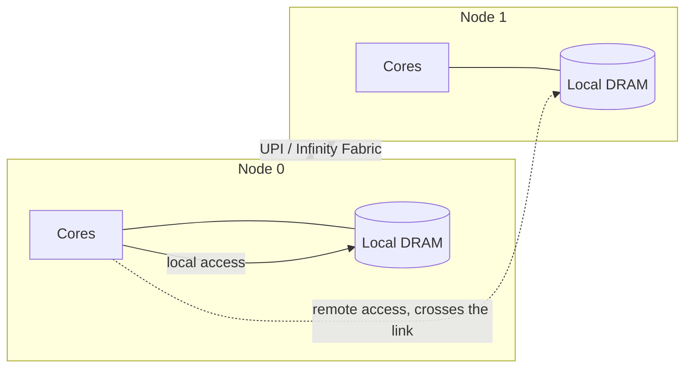

# NUMA and Memory Topology

When "main memory" stops being one thing: node distance, local versus remote latency, and what interleaving trades away.

Past a certain core count, a single memory controller becomes the bottleneck: every core on the
chip is contending for the same pins, the same channels, and the same physical path to DRAM. The
fix is to stop sharing it. Each socket gets its own memory controller and its own bank of attached
DRAM, and the address space stays globally addressable — any core can still issue a load to any
address — but the address now determines whether that load is **local** (this socket's own
controller answers) or **remote** (the request crosses an interconnect to another socket's
controller and back). Every effect described on this page, from the distance matrix to
first-touch allocation, follows from that one asymmetry.

## Why it exists

NUMA is not a workaround for a design mistake; it is what buying more sockets actually gets you.
A single memory controller has a fixed bandwidth ceiling, and widening it — more channels, more
pins — runs into the same physical limits as widening a bus generally: pin count on the package,
trace length and signal integrity on the board, and power. Splitting memory across sockets, each
with its own controller and its own short physical path to its own DRAM, scales aggregate
bandwidth roughly with socket count instead of flattening out. The cost is that not all memory is
equally close to all cores anymore, and the system has to be honest about that instead of
pretending otherwise.

## Nodes, distance, and the interconnect

A **NUMA node** is the unit the OS reasons about: a set of CPUs plus the memory that is local to
them. On a simple two-socket machine, that is one node per socket. The kernel and the firmware
agree on a **distance matrix** — a table of relative cost from each node to each other node — and
that matrix is the machine's own statement of what "far" means on this particular box, not a
guess. A local access is typically given distance 10; a one-hop remote access is a larger number,
and the ratio between them is the number that actually matters, not either value alone.

The link that carries a remote request is a point-to-point interconnect between sockets — **UPI**
(Ultra Path Interconnect) on recent Intel parts, **Infinity Fabric** on AMD — and it is not
carrying memory traffic alone. It is also the path for **cache-coherence traffic**: when core on
socket 0 needs a line that socket 1's cache holds dirty, the coherence protocol's messages travel
over the same link as an ordinary remote memory access. A workload that looks memory-bound across
sockets is often partly a coherence-traffic problem for exactly this reason.

Node count does not have to match socket count. **Sub-NUMA clustering (SNC)** lets a single socket
partition its own memory controllers and present itself to software as two or more separate NUMA
nodes, each with a smaller, faster local slice of that socket's memory. `numactl --hardware` on
such a machine reports more nodes than there are physical chips — that is SNC, not a
misconfiguration.

## What remote actually costs

The honest way to state the cost is as a ratio, because the absolute numbers change every
generation:

| | Local | Remote (one hop) |
|---|---|---|
| Latency | baseline | roughly 1.5–2× baseline |
| Bandwidth | baseline | materially lower, and shared with coherence traffic on the same link |

Treat those as shape, not spec — the actual multiplier depends on the interconnect generation, the
number of hops (a four-socket machine can have accesses that cross two links), and current traffic
on the link. The instruction that matters more than any number on this page: **measure, don't
assume**. Three places tell the machine's own story:

- **`lstopo`** (from `hwloc`) draws the topology — sockets, nodes, caches, and cores — as a
  picture or as text (`lstopo-no-graphics`).
- **`numactl --hardware`** prints the node list, each node's CPUs and memory, and the distance
  matrix directly.
- The **ACPI SRAT** (System Resource Affinity Table) and **SLIT** (System Locality Information
  Table) are where the firmware states this in the first place — SRAT says which CPUs and memory
  ranges belong to which proximity domain, SLIT gives the distance matrix — and the OS believes
  them rather than deriving topology itself.

## First-touch, and the allocation policy question

A page of memory is not bound to a NUMA node when it is allocated; it is bound when it is first
**touched** — the first actual read or write that causes the OS to back a virtual page with a
physical frame. `malloc` on its own commits nothing. The default Linux policy allocates that frame
from the node the touching thread is currently running on.

This makes the thread that *initializes* a data structure the thread that decides where it
physically lives, regardless of which thread allocated it or which threads will use it later. A
single thread that mallocs and zeroes a large array, which worker threads on every node then
process in parallel, has pinned the entire array to one node — every other node's accesses to it
are remote. **Parallel initialization**, where each worker thread touches (and so binds) the slice
of the array it is about to work on, is consequently a real technique for NUMA-aware code, not a
micro-optimization: it is the difference between a working set that's local everywhere and one
that's local nowhere but its origin node.

## Interleaving, and what it trades

The alternative to first-touch is **interleaving**: round-robin allocation of successive pages
across all (or a chosen subset of) nodes, regardless of who touches them first. Interleaving
converts a bimodal latency distribution — some accesses cheap and local, others expensive and
remote, depending on which thread touched what — into a single uniform, mediocre one: every
thread pays roughly the same blended cost on every access, because roughly the same fraction of
any large structure is remote from any given core.

That trade is correct for a large structure genuinely shared and accessed from every node with no
natural ownership — a big shared hash table or a global cache, say — where there is no "right"
node to place it on in the first place. It is the wrong choice for a per-thread working set, where
first-touch would have kept each thread's own data local to it; interleaving that data instead
manufactures remote traffic that first-touch would have avoided for free.

## I/O has a topology too

A PCIe device does not hang off the memory subsystem in the abstract; it hangs off a specific
socket's **root complex**. A NIC or NVMe drive is therefore local to the cores on that socket and
remote to every other core, exactly the way a DRAM bank is local to one node — a DMA transfer that
lands in memory on the wrong node, or an interrupt handled on the wrong core, pays a remote hop
just like a load instruction would.

This is why interrupt affinity and NUMA placement are the same conversation rather than two
separate tuning problems: pinning a NIC's interrupts (and the application thread that consumes its
data) to cores on the socket the NIC is actually attached to keeps the entire path — DMA write,
interrupt, and the application's read of that data — local. Getting any one of those three pieces
wrong reintroduces a remote hop the other two were placed to avoid.

## When NUMA is a red herring

Say this plainly: on a typical two-socket machine, most performance problems are not NUMA
problems. Cache misses, lock contention, poor algorithmic complexity, and ordinary memory-bandwidth
saturation all produce symptoms — "this is slower than it should be, and scaling badly across
cores" — that look identical to a NUMA problem from the outside, and are far more common causes of
it.

The check that actually distinguishes them: look at per-node memory access statistics (on Linux,
`numastat`, or the CPU's own performance counters for local versus remote DRAM traffic), or more
simply, pin the whole workload to a single node with `numactl --cpunodebind` and `--membind` and
re-measure. If performance is materially the same (or better, because remote traffic is now
impossible by construction) when confined to one node, NUMA was not the bottleneck and the search
should go elsewhere.

<Figure src="/img/cs/cpu-architecture/topology-hwloc.png"
        alt="An lstopo topology map of a 32-core machine: two sockets, each holding two NUMA nodes, each node with its own L3 cache shared by eight cores"
        caption="One machine, two nodes: every core, cache, and memory bank, with the nodes the operating system will allocate from."
        source="Wikimedia Commons" href="https://commons.wikimedia.org/wiki/File:Hwloc.png"
        license="BSD" />

## Where this goes next

- [Cache Coherence and MESI](./cache-coherence-and-mesi.md) — coherence traffic crosses the same
  interconnect that carries remote memory accesses.
- [Multicore and Parallelism](../cpu-architecture/multicore-and-parallelism.md) — the core-count
  scaling pressure that makes NUMA the answer in the first place.
- [`../../linux/08-memory-management/numa-and-memory-policy.md`](../../linux/08-memory-management/numa-and-memory-policy.md) —
  how Linux exposes nodes, policies, and binding to software.

## References

- [`https://www.open-mpi.org/projects/hwloc/`](https://www.open-mpi.org/projects/hwloc/) — hwloc
  and `lstopo`, the portable way to ask a machine what shape it is.
- ACPI Specification, the SRAT and SLIT table definitions — where the firmware states the topology
  and the distance matrix the OS then believes.
- [`https://man7.org/linux/man-pages/man8/numactl.8.html`](https://man7.org/linux/man-pages/man8/numactl.8.html) —
  the practical interface for inspecting and binding, and the source of the numbers in the cost
  table.
- Lameter, *"NUMA (Non-Uniform Memory Access): An Overview"*, ACM Queue 2013 —
  [`https://queue.acm.org/detail.cfm?id=2513149`](https://queue.acm.org/detail.cfm?id=2513149).
  Written by the kernel's NUMA maintainer; the clearest short treatment of policy trade-offs.
