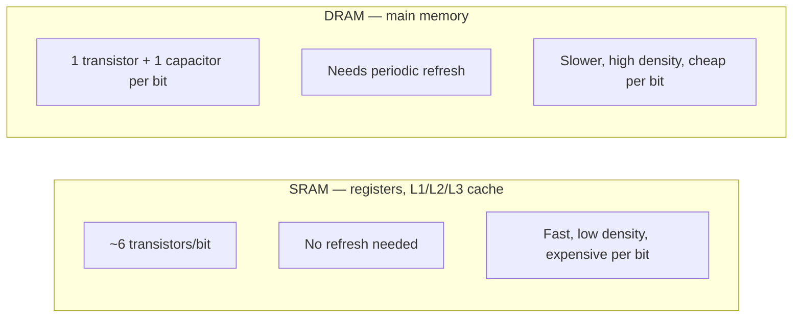

# RAM Fundamentals

## Overview

"RAM" isn't one technology — it's a family. The RAM that makes up multi-gigabyte main memory
(**DRAM**) and the RAM that makes up tiny, ultra-fast on-chip caches and registers (**SRAM**) trade
off density and cost against speed and simplicity in almost opposite ways. Understanding *why* they
differ explains a lot about the memory hierarchy: it's not that engineers chose to make caches small,
it's that the technology fast enough to keep up with a CPU core physically cannot be made cheap and
dense enough to serve as multi-gigabyte main memory.

## Core Concepts

| Term | Meaning |
|---|---|
| **SRAM** (Static RAM) | Memory built from bistable transistor circuits (typically six transistors per bit) that hold their value as long as power is applied — no refresh needed. |
| **DRAM** (Dynamic RAM) | Memory that stores each bit as charge on a tiny capacitor, accessed through one transistor per cell — far denser than SRAM, but the charge leaks away and must be periodically refreshed. |
| **Refresh** | The periodic read-then-rewrite cycle DRAM needs to restore leaking capacitor charge before the stored value is lost (JEDEC DRAM parts are typically specified around a 64 ms refresh window per row). |
| **Memory controller** | The hardware (on-die on modern CPUs) that issues commands to DRAM chips — activate a row, read/write a column, refresh — and manages timing. |
| **Memory channel** | An independent electrical path between the memory controller and DRAM modules; more channels roughly multiply available bandwidth. |
| **DIMM** | Dual In-line Memory Module — the physical stick of DRAM chips plugged into a motherboard. |

## Architecture / Mechanism

### Why SRAM vs. DRAM at different tiers



A DRAM cell stores a bit as the presence or absence of charge on a capacitor; a single access
transistor connects that capacitor to a bit line when its row is activated. Reading a DRAM cell is
**destructive** — it drains the capacitor's charge — so the memory controller must sense the value
with a sense amplifier and immediately write it back. This same read-sense-rewrite machinery is reused
to implement periodic refresh: the controller works through the chip's rows in the background,
refreshing each one before its charge decays enough to flip the stored bit. SRAM's six-transistor
bistable cell holds its state electrically as long as power is supplied, so it needs none of this —
at the cost of roughly 4-6x the transistors (and therefore silicon area and dollars) per bit compared
to DRAM's one transistor and one capacitor. That density/cost difference is exactly why SRAM is used
only where a small amount of memory must be extremely fast (registers, L1/L2/L3 caches) and DRAM is
used for everything that needs to be large (main memory).

### DDR generations

Standard main-memory DRAM is specified by JEDEC as **DDR SDRAM** (Double Data Rate Synchronous
DRAM) — "double data rate" because it transfers data on both the rising and falling edge of the clock.
Each generation roughly doubles peak per-pin transfer rate and lowers operating voltage compared to
the last, while adding capacity and reliability features:

| Generation | JEDEC standard | Typical data rate range | Notable changes |
|---|---|---|---|
| DDR3 | JESD79-3 | ~800-2133 MT/s | 1.5 V (1.35 V low-voltage variants) |
| DDR4 | JESD79-4 | ~1600-3200 MT/s | 1.2 V; bank groups for more parallelism |
| DDR5 | JESD79-5 | ~4800-8800+ MT/s | 1.1 V; on-die ECC; two independent 32-bit sub-channels per DIMM |

Newer generations aren't purely a speed upgrade for a given part — a higher data rate alone doesn't
help if the CPU's memory controller can't issue enough concurrent requests, which is why per-generation
architectural changes (like DDR5 splitting each DIMM into two independent sub-channels) matter as much
as the raw MT/s number.

### Channels and bandwidth

A single memory channel connects the controller to one or more DIMMs and has a fixed data width (64
bits per classic DDR4 channel, split into two 32-bit sub-channels for DDR5). Peak bandwidth is
approximately:

```
bandwidth ≈ (data rate in transfers/sec) × (channel width in bytes)
```

Running two, four, or more channels in parallel (dual-channel, quad-channel, and the many-channel
configurations used in servers) multiplies available bandwidth roughly linearly — one reason
server/workstation CPUs expose far more memory channels than consumer chips.

## Practical Usage

Most application code never talks to DRAM directly, but memory layout still determines how well it
uses the channels and rows available:

```cpp showLineNumbers
// Sequential access: each cache-line-sized chunk is likely already
// in an open DRAM row/bank, and prefetchers can predict the pattern.
for (int i = 0; i < n; ++i) {
    sum += data[i];
}

// Strided/random access: each access may require the memory
// controller to close one row and open another ("row buffer miss"),
// which is measurably slower than staying within an open row.
for (int i = 0; i < n; ++i) {
    sum += data[shuffled_index[i]];
}
```

This is the DRAM-level version of the same locality principle that motivates CPU caches (see
[CPU Caches](./cpu-caches.md)): sequential, predictable access patterns let both the cache hierarchy
*and* the DRAM row buffer do their job well.

## Edge Cases & Pitfalls

:::warning Refresh isn't free, but it's not usually your bottleneck
Refresh briefly makes a row unavailable for normal access, and refresh traffic scales with DRAM
density. On mainstream systems this overhead is a small, well-amortized background cost — but it's
part of why simply adding more DRAM capacity doesn't scale bandwidth for free, and it matters more on
very large, high-density server memory configurations.
:::

- DDR generations are **not backward compatible** electrically or physically (different voltages,
  pin-outs, and notch positions) — you cannot mix DDR4 and DDR5 modules or put a DDR5 DIMM in a DDR4
  slot.
- More channels help only if the workload actually generates enough concurrent, independent memory
  requests; a single memory-bound thread with a serial dependency chain may not saturate even one
  channel.
- "Faster RAM" (higher MT/s) and "lower-latency RAM" (lower CAS latency in nanoseconds) are different
  axes — a higher data-rate module isn't automatically lower-latency in absolute time.

## Comparisons

| Property | SRAM | DRAM |
|---|---|---|
| Cell structure | ~6 transistors, bistable | 1 transistor + 1 capacitor |
| Needs refresh? | No | Yes |
| Density | Low | High |
| Cost per bit | High | Low |
| Typical use | Registers, L1/L2/L3 cache | Main memory (DIMMs) |
| Access latency | Sub-nanosecond to a few ns | Tens of nanoseconds |

## References

- JEDEC, [DDR4 SDRAM Standard (JESD79-4)](https://www.jedec.org/standards-documents/docs/jesd79-4a) and [DDR5 SDRAM Standard (JESD79-5)](https://www.jedec.org/standards-documents/docs/jesd79-5b) — official specifications.
- [Memory refresh — Wikipedia](https://en.wikipedia.org/wiki/DRAM_refresh) — DRAM refresh mechanics.
- Patterson & Hennessy, *Computer Organization and Design* — memory technology chapter (SRAM/DRAM tradeoffs, DDR).

### Books & Videos

- Ulrich Drepper, ["What Every Programmer Should Know About Memory"](https://people.freebsd.org/~lstewart/articles/cpumemory.pdf) — deep, still-relevant technical treatment of DRAM internals and memory controllers.
- Bryant & O'Hallaron, *Computer Systems: A Programmer's Perspective* — "The Memory Hierarchy" chapter covers RAM technology alongside caches.
- Computerphile, ["How CPU Memory & Caches Work"](https://www.youtube.com/watch?v=SAk-6gVkio0) — Matt Godbolt walks through the RAM-to-cache relationship.

## Related Pages

- [Memory Hierarchy & RAM — Overview](./intro.md)
- [CPU Caches](./cpu-caches.md)
- [Storage: HDD, SSD & NVMe](../storage/intro.md)
