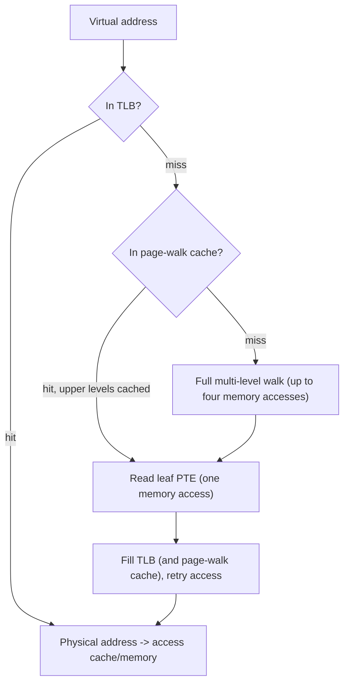

# The TLB and Address-Translation Hardware

The cache that makes virtual memory affordable: TLB structure, page-walk caches, address-space tags, and shootdown cost.

Here is the arithmetic that forces the design. [Virtual memory](./virtual-memory-and-paging.md)
resolves one address by walking a page table, and on 64-bit x86-64 or arm64 that walk is four
levels deep — four dependent memory accesses just to find out where the fifth, real access should
go. Paying that on every load and store would make virtual memory too expensive to use at all. So
the result of a walk is cached, in a structure small enough to check on every single memory
access without slowing the pipeline down: the **translation lookaside buffer (TLB)**. It is
physically tiny, indexed by virtual page number, and — when it works — completely invisible to
software. This page is about what happens when it doesn't.

## What a TLB entry holds

A TLB entry caches the *result* of a page-table walk, not any part of the table itself:

- **Virtual page number** — the tag the lookup matches against.
- **Physical frame number** — the translated result.
- **Permission bits** — read/write/execute and privilege level, copied out of the page-table entry
  so a protection check doesn't need a second lookup.
- **An address-space tag**, on modern parts — which process this entry belongs to (see below).

That's it. A TLB miss does not mean "the page table doesn't have this mapping" — it almost always
does. It means the MMU has not cached that particular row of it recently, and has to go get it
again.

## Structure: levels, and separate I and D

Like the data caches described in [CPU Caches](./cpu-caches.md), the TLB is not one flat table —
it's a small hierarchy:

- **L1** is split into an instruction TLB (iTLB) and a data TLB (dTLB), each with on the order of
  tens of entries, fully or highly associative, and on the critical path of every fetch and every
  load/store.
- **L2** is usually shared between instructions and data, unified, and holds on the order of a
  thousand to a couple of thousand entries.
- Real parts further split entries by page size — a set of L1 dTLB entries just for 4 KiB pages,
  a separate smaller set for 2 MiB pages, and so on — because a huge-page mapping and a
  regular-page mapping don't compete well for the same associative set.

Treat "tens of entries" and "a thousand or two" as shape, not spec. Exact counts are
per-microarchitecture, change every generation, and belong in the vendor's optimization manual —
not memorized from a blog post or, for that matter, from this page.

## Page-walk caches

There is a second, less-discussed cache sitting between "TLB miss" and "full four-level walk":
the intermediate levels of the page table — the PML4, PDPT, and PD entries on x86-64, the
equivalent upper-level tables on arm64 — are themselves ordinary memory reads, and the MMU caches
*those* too, separately from the TLB. This is why a TLB miss is survivable at all: if the
upper-level entries for an address are already cached, a walk that would naively cost four memory
accesses instead costs one — a single read of the leaf page-table entry, because every level above
it was a page-walk-cache hit. The TLB is the headline structure, but the page-walk cache is doing
most of the work of keeping a TLB miss cheap.

## Reach, and why huge pages exist

**Reach** is the amount of address space a TLB level can cover without a miss: entries × page
size. Take a concrete, stated assumption — a 1536-entry L2 TLB, which is a plausible order of
magnitude for a modern shared L2 TLB (check the actual number for any real part in its
optimization manual):

- At 4 KiB pages: 1536 × 4 KiB = 6,291,456 bytes = **6 MiB** of reach.
- At 2 MiB huge pages: 1536 × 2 MiB = 3,145,728 KiB = **3 GiB** of reach — the same 1536 entries,
  1024× the coverage, because each entry now stands for 1024× as much memory.

That thousand-fold jump, not "fewer levels to walk," is the real argument for huge pages. Fewer
levels does shave a little off the cost of a single walk, but the number that actually matters for
a large working set is whether it fits in the TLB's reach at all. A 6 MiB TLB reach against a
64 GiB working set means most accesses miss; a 3 GiB reach against the same working set means most
of them don't.

## Address-space tags: ASID and PCID

Without a way to tell entries from different processes apart, a TLB has to be treated as
process-specific: switch address spaces (a context switch across processes), and every entry in
it is potentially wrong, so the whole TLB gets invalidated on every switch. That is expensive
enough that both major architectures give the TLB an **address-space tag** instead, so entries
from several processes can coexist and a context switch doesn't have to flush anything:

- x86-64 calls it **PCID** (process-context identifier).
- arm64 calls it **ASID** (address-space identifier).

The tag is narrow — 12 bits on x86-64, giving 4096 distinct PCIDs — so the OS cannot hand out a
permanent, unique tag to every process that has ever run. It has to recycle them, which means
occasionally reassigning a PCID that used to belong to a different process and flushing exactly
that PCID's stale entries when it does.

## Invalidation, and why it is expensive

Software invalidates a stale translation with `INVLPG` on x86-64 (or a full/PCID-scoped flush of
`CR3`), and the arm64 equivalent, `TLBI`. Both invalidate **locally** — the executing core's own
TLB.

That's fine if only one core ever cached the mapping. It usually isn't. **x86-64 has no hardware
broadcast for TLB invalidation**: `INVLPG` only ever touches the core that executes it, so making
every other core that might hold the same mapping drop it is a job for software. The kernel
interrupts every core that could plausibly have cached the translation — a **TLB shootdown** — and
waits for each one to acknowledge that it has invalidated locally before it's safe to proceed
(for example, before reusing the physical page for something else). The cost shape is one IPI
round trip, multiplied by the number of cores that need to be notified — cheap on a handful of
cores, and a real scalability problem on a machine with dozens or hundreds of them.

arm64 is architecturally different here, not just implemented differently: `TLBI` has broadcast
variants that invalidate within the **inner-shareable domain** — in hardware, without an IPI or
software acknowledgment protocol — because the coherency fabric itself propagates the
invalidation to every core in that domain. Software can still fall back to a narrower,
core-targeted invalidate-and-IPI scheme when it wants finer control, but the hardware broadcast
path is available in a way x86-64 simply does not offer.

*Where a memory access goes when translation hits, and the two fallbacks when it does not.*

| Case | Approximate cost (order of magnitude) | What software can do |
|---|---|---|
| TLB hit | ~1 cycle, folded into the access | Nothing needed — this is the fast path working |
| TLB miss, page-walk cache hit | Tens of cycles (one memory access) | Improve locality so upper-level entries stay resident; use huge pages to shrink the number of levels below a cached one |
| Full page-table walk | Low hundreds of cycles (multiple dependent memory accesses) | Reduce working-set spread; huge pages to increase TLB reach; avoid pointer-chasing over widely scattered pages |

## What software must do, in one paragraph

The OS must invalidate a TLB entry after any change that would make a cached translation wrong:
unmapping a page, reducing its permissions (write-protecting a page for copy-on-write, say), or
moving it to a different physical frame. It generally does *not* need to invalidate after
**widening** permissions — a TLB entry that is more restrictive than the current page-table state
can only cause a spurious page fault, never let an access through that should be denied, and the
fault handler will refill the TLB with the correct, wider permissions on the way out. Correctness
only requires invalidating in the direction that could let something through that shouldn't.

## Where this goes next

- [Virtual Memory & Paging](./virtual-memory-and-paging.md) — the page-table format whose walk
  result is what the TLB caches.
- [`../../linux/08-memory-management/tlb-and-address-space-switching.md`](../../linux/08-memory-management/tlb-and-address-space-switching.md) —
  Linux's shootdown implementation and its use of PCID.

## References

- Intel SDM Vol. 3A, ch. 4.10 "Caching Translation Information" — the authority on what may be
  cached, when it must be invalidated, and how PCIDs behave.
- Arm Architecture Reference Manual, "TLB maintenance" — the broadcast `TLBI` instructions and the
  shareability domains, i.e. the reason arm64 does not need a shootdown IPI.
- Intel 64 and IA-32 Architectures Optimization Reference Manual — where actual
  per-microarchitecture TLB sizes live, so nobody memorizes a number from a blog.
- Villavieja et al., *"DiDi: Mitigating the Performance Impact of TLB Shootdowns"*, PACT 2011 —
  measurements of what shootdowns cost on real machines, which is the part vendor documentation
  never states.
