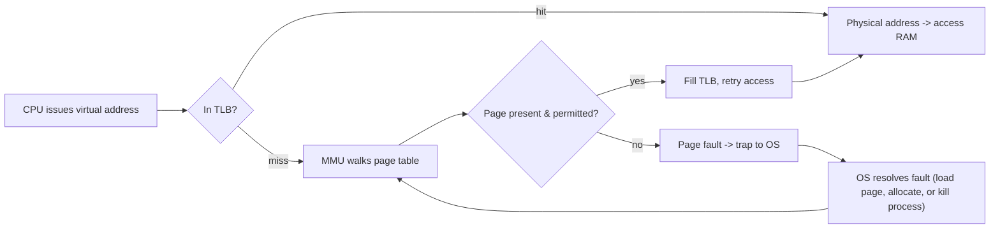

# Virtual Memory & Paging

## Overview

Every process behaves as if it owns the entire address space and as if its memory is one large,
contiguous block — neither is physically true. **Virtual memory** is the hardware/OS collaboration
that creates this illusion: each process gets its own private virtual address space, which the CPU's
memory-management hardware transparently translates to real physical RAM addresses (or to disk, if
the data isn't resident) on every access.

## Core Concepts

| Term | Meaning |
|---|---|
| **Virtual address** | The address a program uses; meaningful only within that process's address space. |
| **Physical address** | The real address of a byte in RAM. |
| **Page** | A fixed-size chunk (commonly 4 KB) of virtual (or physical) address space — the unit virtual memory manages. |
| **Page table** | A per-process data structure mapping virtual page numbers to physical frame numbers. |
| **MMU** (Memory Management Unit) | CPU hardware that performs virtual-to-physical translation on every memory access, walking the page table when needed. |
| **TLB** (Translation Lookaside Buffer) | A small, fast hardware cache of recent virtual-to-physical translations inside the MMU, so most accesses skip the full page-table walk. |
| **Page fault** | A trap raised when the MMU can't complete a translation (page not present, or access not permitted) — handled by the OS, not the MMU itself. |

## Architecture / Mechanism

### Why virtual memory exists

- **Isolation**: each process has its own address space, so one process cannot read or corrupt
  another's memory (or the kernel's) just by using an address — the MMU enforces the boundary on every
  access.
- **Illusion of contiguous memory**: a process's logically contiguous address space can be backed by
  scattered, even non-resident, physical pages — programs don't need to know or care where their data
  physically lives.

### Address translation path



On every memory access, the CPU first checks the TLB — a small, fully-associative-style cache of
recent translations right in the MMU. A **TLB hit** turns translation into effectively free; a **TLB
miss** forces the MMU to walk the page table in memory (itself one or more extra memory accesses) to
find the mapping, which is then cached in the TLB for next time. If the page table says the page isn't
currently in physical memory at all — or the access violates permissions — the MMU raises a **page
fault**, trapping into the OS to decide what to do (bring the page in from disk, extend the heap, or
terminate the process for an invalid access).

## Practical Usage

Programs rarely manipulate page tables directly, but the cost of translation shows up in real
workloads:

```cpp showLineNumbers
// Sequential access over a large buffer: touches relatively few
// distinct pages per unit of data processed, so the TLB's cached
// translations cover most accesses (good TLB locality).
for (int i = 0; i < n; ++i) {
    sum += data[i];
}

// Pointer-chasing over widely scattered allocations: each dereference
// may land on a different page, increasing TLB misses (and full page
// walks) on top of any cache misses already incurred.
for (Node* node = head; node != nullptr; node = node->next) {
    sum += node->value;
}
```

This is the same locality-of-reference idea that drives CPU cache performance (see
[CPU Caches](./cpu-caches.md)), one level higher up: poor locality costs you both cache misses *and*
TLB misses.

## Edge Cases & Pitfalls

:::warning TLB misses are a real, measurable cost
A TLB miss doesn't just cost a lookup — it can trigger a full multi-level page-table walk, which is
several extra memory accesses before the original access can even proceed. Workloads that scatter
accesses across many pages (large sparse data structures, huge hash tables) can suffer noticeably from
TLB pressure even when the CPU cache hit rate looks fine.
:::

- **Page faults are not all equally bad**: a *minor* fault (page not mapped into the TLB/page table yet
  but the data is already in RAM, e.g. lazily-allocated memory) is cheap; a *major* fault (the data must
  be read from disk/swap) is orders of magnitude slower.
- Page-replacement policy — deciding *which* resident page to evict when physical memory is full — is
  an OS-level decision (e.g., approximations of LRU), not something the MMU/TLB decides; see
  [Operating Systems](../operating-systems/intro.md) for how the OS manages memory at that level.
- Larger page sizes ("huge pages") reduce the number of TLB entries needed to cover a given amount of
  memory, cutting TLB misses for large workloads — but waste memory when allocations are small and
  don't need a full huge page.

## Comparisons

| Concept | Managed by | Typical cost when it misses |
|---|---|---|
| CPU cache line | Hardware (cache controller) | Tens to hundreds of cycles (fetch from a lower cache level or DRAM) |
| TLB entry | Hardware (MMU) | A page-table walk — multiple extra memory accesses |
| Page (in physical memory) | OS + hardware together | A page fault — potentially a disk/swap read, orders of magnitude slower |

## References

- [Translation Lookaside Buffer — Wikipedia](https://en.wikipedia.org/wiki/Translation_Lookaside_Buffer) — TLB structure and role.
- OSTEP (Arpaci-Dusseau), ["Paging: Faster Translations (TLBs)"](https://pages.cs.wisc.edu/~remzi/OSTEP/vm-tlbs.pdf) — free, widely used OS textbook chapter on TLBs.
- Patterson & Hennessy, *Computer Organization and Design* — virtual memory and TLB chapter.

### Books & Videos

- Bryant & O'Hallaron, *Computer Systems: A Programmer's Perspective* — "Virtual Memory" chapter covers paging, the MMU, and the TLB in depth.
- Ulrich Drepper, ["What Every Programmer Should Know About Memory"](https://people.freebsd.org/~lstewart/articles/cpumemory.pdf) — includes a section on TLB behavior and its performance impact.

## Related Pages

- [Memory Hierarchy & RAM — Overview](./intro.md)
- [CPU Caches](./cpu-caches.md)
- [Operating Systems](../operating-systems/intro.md)
