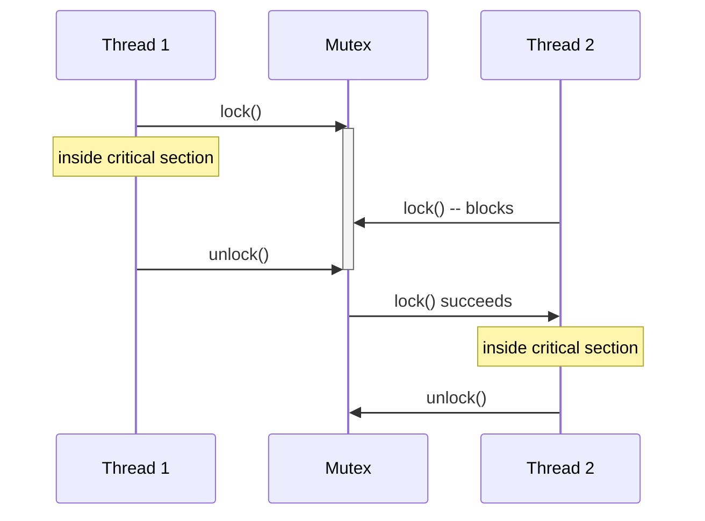

# Concurrency & Synchronization

## Overview

Threads within a process share memory, which makes communication cheap but introduces a real hazard:
if two threads read and write the same data without coordination, the outcome depends on the exact
interleaving of their instructions — a **race condition**. Synchronization primitives (mutexes,
semaphores, condition variables) exist to make specific interleavings impossible, at the cost of
threads sometimes having to wait for each other.

## Core Concepts

| Term | Meaning |
|---|---|
| **Race condition** | A bug where the correctness of a result depends on the relative timing/order of concurrent operations. |
| **Critical section** | A block of code that accesses shared state and must not be executed by more than one thread at the same time. |
| **Mutex (lock)** | A primitive with **ownership**: whoever locks it must be the one to unlock it; protects a critical section so only one thread is inside at a time. |
| **Semaphore** | A primitive based on **signaling**: an integer counter with atomic increment (`post`) and decrement-and-wait-if-zero (`wait`) operations; any thread can signal it, not just the one that waited. |
| **Deadlock** | A cycle of threads each waiting on a resource held by another, so none can ever proceed. |
| **Monitor / condition variable** | A mutex paired with a wait queue that lets a thread sleep until some condition becomes true, atomically releasing the mutex while it sleeps and reacquiring it on wake. |

## Architecture / Mechanism



### Mutexes vs. semaphores — the actual difference

It's tempting to think of a semaphore with a max value of 1 ("binary semaphore") as "the same as a
mutex," but the conceptual difference matters:

- A **mutex** has an *owner*. Only the thread that locked it is allowed to unlock it; a mutex encodes
  mutual exclusion over a critical section.
- A **semaphore** has no owner. It's a counter representing "how many units of some resource are
  available right now," and *any* thread can signal it — including a thread that never waited on it.
  This makes semaphores the right tool for producer/consumer-style signaling (e.g., "N buffer slots are
  free"), not just mutual exclusion.

### The four Coffman conditions for deadlock

A deadlock can only occur if **all four** of these hold simultaneously:

1. **Mutual exclusion** — resources can't be shared; only one thread can hold a given resource.
2. **Hold and wait** — a thread holding one resource can request another while still holding the first.
3. **No preemption** — a resource can't be forcibly taken away; it must be released voluntarily.
4. **Circular wait** — there's a cycle of threads, each waiting on a resource held by the next.

Breaking any single condition prevents deadlock. The most common practical strategy is attacking
**circular wait**: impose a global lock-acquisition ordering (e.g., always lock the lower-address or
lower-ID mutex first) so a cycle can never form. Other strategies include requesting all needed
resources up front (attacks hold-and-wait) or using timeouts/`try_lock` with backoff-and-retry (attacks
no-preemption, since a thread voluntarily gives up what it holds if it can't get everything it needs).

## Practical Usage

A classic race condition — two threads incrementing a shared counter without protection — and the fix:

```c showLineNumbers
#include <pthread.h>

int counter = 0;
pthread_mutex_t lock = PTHREAD_MUTEX_INITIALIZER;

void *increment(void *arg) {
    for (int i = 0; i < 100000; i++) {
        // BUG (no lock): "counter++" is read-modify-write, not atomic.
        // Two threads can both read the same old value before either writes
        // back, silently losing an increment.
        pthread_mutex_lock(&lock);
        counter++;                 // now a protected critical section
        pthread_mutex_unlock(&lock);
    }
    return NULL;
}

int main(void) {
    pthread_t t1, t2;
    pthread_create(&t1, NULL, increment, NULL);
    pthread_create(&t2, NULL, increment, NULL);
    pthread_join(t1, NULL);
    pthread_join(t2, NULL);
    // Without the mutex, 'counter' unpredictably ends up less than 200000.
    return 0;
}
```

A monitor-style wait for a condition, using a POSIX condition variable (note the mutex + condvar
pairing, and that the predicate is re-checked in a loop because of possible spurious wakeups):

```c showLineNumbers
pthread_mutex_lock(&lock);
while (!ready) {
    pthread_cond_wait(&cond, &lock);  // atomically unlocks 'lock' while waiting
}
// ... proceed now that 'ready' is true, still holding 'lock' ...
pthread_mutex_unlock(&lock);
```

## Edge Cases & Pitfalls

:::danger Deadlock from inconsistent lock ordering
If thread A locks mutex 1 then tries to lock mutex 2, while thread B locks mutex 2 then tries to lock
mutex 1, both can end up waiting on each other forever. This is a circular-wait deadlock — the fix is
a consistent global lock ordering, as noted above.
:::

:::warning Spurious wakeups and lost wakeups
`pthread_cond_wait()` can return even if no one called `signal`/`broadcast` (a "spurious wakeup" is
explicitly permitted by POSIX), so the awaited condition must always be re-checked in a loop, not
assumed true on wakeup. Conversely, signaling a condition variable *before* a waiter starts waiting
(rather than via the counter/state that the predicate checks) loses the signal entirely — always
signal through checked, mutex-protected state, never rely on wakeup timing alone.
:::

- A double-checked, unprotected read of shared state ("I'll just check without locking, it's probably
  fine") is still a race condition even if it's "usually correct" — it will fail intermittently and
  disproportionately in production under load.
- Uncontended locks are cheap on modern CPUs, but heavily contended locks serialize threads and can
  turn a "parallel" program back into an effectively single-threaded one for that critical section.

## Comparisons

| Primitive | Has ownership? | Typical use | Can be signaled by a non-owner? |
|---|---|---|---|
| Mutex | Yes | Protecting a critical section | No |
| Semaphore | No | Counting available resources, producer/consumer signaling | Yes |
| Condition variable | Used with a mutex | Waiting for a state change (not just exclusion) | Yes (via `signal`/`broadcast`) |

## References

- Edsger W. Dijkstra, "Cooperating Sequential Processes" (1965/1968) — the origin of the semaphore.
- E. G. Coffman, M. Elphick, A. Shoshani, "System Deadlocks," *ACM Computing Surveys*, 1971 — the
  original four-conditions formulation.
- `pthread_mutex_lock(3)`, `pthread_cond_wait(3p)`, `sem_wait(3)` — Linux/POSIX man-pages.
- Remzi H. Arpaci-Dusseau & Andrea C. Arpaci-Dusseau, [*Operating Systems: Three Easy Pieces*](https://pages.cs.wisc.edu/~remzi/OSTEP/) — the entire "Concurrency" part (Locks, Condition Variables, Semaphores, Deadlock).

### Books & Videos

- Remzi H. Arpaci-Dusseau & Andrea C. Arpaci-Dusseau, *Operating Systems: Three Easy Pieces* — free
  online at [ostep.org](https://ostep.org).
- Michael Kerrisk, *The Linux Programming Interface* — the POSIX threads, mutex, and condition
  variable chapters, with the exact API semantics used above.
- Andrew S. Tanenbaum & Herbert Bos, *Modern Operating Systems* — deadlock chapter.

## Related Pages

- [Processes & Threads](./processes-and-threads.md) — why threads share memory in the first place.
- [Scheduling](./scheduling.md) — priority inversion, a scheduling problem caused by locking.
- [Inter-Process Communication](./interprocess-communication.md) — coordination across, rather than
  within, address spaces.
