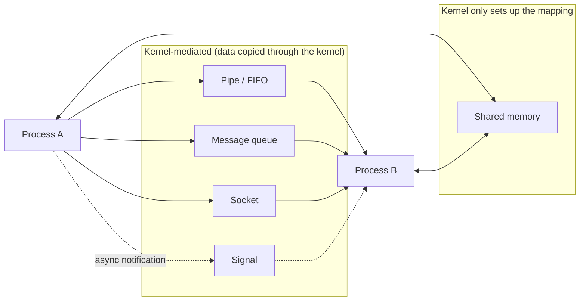

# Inter-Process Communication

## Overview

Processes are deliberately isolated from each other — that's the whole point of giving each one its
own address space (see [Processes & Threads](./processes-and-threads.md)). But isolated processes
still often need to cooperate: a shell piping the output of one program into another, a browser's
renderer process talking to its main process, a database's worker processes sharing a cache. **IPC**
mechanisms are the kernel-mediated (or kernel-arranged) channels that let processes exchange data
without breaking that isolation.

## Core Concepts

| Term | Meaning |
|---|---|
| **Pipe** | A unidirectional, in-kernel byte stream connecting two related processes (classically a parent and child). |
| **Named pipe (FIFO)** | A pipe with a filesystem name, so unrelated processes can open and use it. |
| **Message queue** | A kernel-managed queue of discrete, typed messages that processes can send/receive, rather than an undifferentiated byte stream. |
| **Shared memory** | A region of physical memory mapped into more than one process's address space, so they can read/write it directly with no kernel mediation on each access. |
| **Socket** | A bidirectional communication endpoint, usable both between processes on one machine (Unix domain sockets) and across a network (TCP/UDP sockets). |
| **Signal** | A short, asynchronous notification delivered to a process (e.g., `SIGTERM`, `SIGCHLD`) — carries no payload beyond its number, but can interrupt normal control flow. |

## Architecture / Mechanism



The mechanisms split into two categories with very different performance characteristics: pipes,
message queues, and sockets all copy data *through* the kernel on every send/receive (a syscall each
way); shared memory has the kernel set up the mapping once, after which reads/writes are ordinary
memory accesses with no per-message kernel involvement — which is why it's the fastest option, but
also why it pushes the synchronization problem entirely onto userspace (see
[Concurrency & Synchronization](./concurrency-and-synchronization.md) — without an explicit mutex or
semaphore over the shared region, concurrent access to shared memory is exactly the same race-condition
hazard as unsynchronized threads, just between processes instead of within one).

## Practical Usage

### Pipes (POSIX)

```c showLineNumbers
int fds[2];
pipe(fds);                 // fds[0] = read end, fds[1] = write end
pid_t pid = fork();
if (pid == 0) {
    close(fds[1]);
    char buf[256];
    read(fds[0], buf, sizeof(buf));   // child reads what the parent writes
} else {
    close(fds[0]);
    write(fds[1], "hello", 5);        // parent writes to the child
}
```

This is exactly the mechanism behind a shell pipeline like `ls | grep foo`: the shell creates a pipe,
then `fork()`s and `exec()`s both `ls` and `grep`, wiring the pipe's ends to their standard output/input.

### Shared memory (POSIX)

```c showLineNumbers
#include <sys/mman.h>
#include <fcntl.h>

int fd = shm_open("/my-region", O_CREAT | O_RDWR, 0600);
ftruncate(fd, 4096);
void *addr = mmap(NULL, 4096, PROT_READ | PROT_WRITE, MAP_SHARED, fd, 0);
// addr now refers to the same physical memory in every process that maps it.
// Reading/writing 'addr' needs its own synchronization (e.g. a semaphore
// stored in the shared region itself, or a named semaphore).
```

### Sockets

Unix domain sockets (`AF_UNIX`) provide socket semantics for same-machine IPC with lower overhead than
a full network stack; the identical `socket()`/`bind()`/`connect()`/`send()`/`recv()` API also works
across machines with `AF_INET`/`AF_INET6`, which is why sockets are the one IPC mechanism that
transparently scales from "two processes on one box" to "client and server on different continents" —
see [Computer Networks](../computer-networks/intro.md) for the network side of that same API.

## Edge Cases & Pitfalls

:::warning Shared memory needs its own synchronization
Mapping a region into two processes doesn't make access to it safe — it's the multi-process analogue
of two threads sharing memory. Without an explicit lock (commonly a named semaphore or a mutex placed
inside the shared region itself, allocated with `pthread_mutexattr_setpshared`), concurrent writers
will race exactly as they would across threads.
:::

:::danger Pipes have a bounded capacity — writers can block
A pipe has a finite kernel buffer (commonly 64 KiB on Linux). If a writer produces data faster than
the reader consumes it, `write()` blocks once the buffer fills — a slow or stalled reader can stall
the writer indefinitely, and if both ends are on processes that are also waiting on each other
somehow, this is a real, practical source of deadlock, not just an efficiency problem.
:::

- Message queues and pipes preserve *some* structure (records vs. a raw byte stream, respectively);
  don't assume a `read()` on a pipe returns exactly one "message" as written — TCP-like streams can be
  split or coalesced arbitrarily.
- Signals are inherently racy to handle correctly (a signal can arrive at literally any instruction);
  real code typically only sets a flag in the handler and does the real work back in normal control
  flow, or uses `signalfd`/`sigwaitinfo` to receive signals synchronously instead.

## Comparisons

| Mechanism | Direction | Relation required | Kernel copies data? | Typical use |
|---|---|---|---|---|
| Pipe | Unidirectional | Related processes (or use a FIFO for unrelated) | Yes | Shell pipelines, parent/child streaming |
| Message queue | Bidirectional (as separate messages) | Any (by name/key) | Yes | Discrete, structured messages |
| Shared memory | Bidirectional | Any (by name/key) | No (after setup) | High-throughput/low-latency data sharing |
| Socket | Bidirectional | Any, same machine or networked | Yes | Client/server, network-transparent IPC |
| Signal | Unidirectional, async | Any (by PID, with permission) | N/A (no payload) | Notifications, process control (`SIGTERM`, `SIGCHLD`) |

## References

- Michael Kerrisk, *The Linux Programming Interface* — Chapters 44–57 cover pipes, FIFOs, System V
  and POSIX message queues/semaphores/shared memory, and sockets in depth.
- `pipe(2)`, `mmap(2)`, `shm_open(3)`, `socket(2)`, `signal(7)` — Linux man-pages.
- Remzi H. Arpaci-Dusseau & Andrea C. Arpaci-Dusseau, [*Operating Systems: Three Easy Pieces*](https://pages.cs.wisc.edu/~remzi/OSTEP/) — "Interlude: Process API" touches on pipes as part of the shell's implementation.

### Books & Videos

- Michael Kerrisk, *The Linux Programming Interface* — the definitive, exhaustively detailed reference
  for every IPC mechanism above.
- W. Richard Stevens, *UNIX Network Programming, Volume 2: Interprocess Communications* —
  historically the canonical deep dive specifically on IPC.
- Remzi H. Arpaci-Dusseau & Andrea C. Arpaci-Dusseau, *Operating Systems: Three Easy Pieces* — free
  online at [ostep.org](https://ostep.org).

## Related Pages

- [Processes & Threads](./processes-and-threads.md) — why processes are isolated in the first place.
- [Concurrency & Synchronization](./concurrency-and-synchronization.md) — synchronizing access to
  shared memory once it's mapped.
- [Computer Networks](../computer-networks/intro.md) — sockets as network-transparent IPC.
