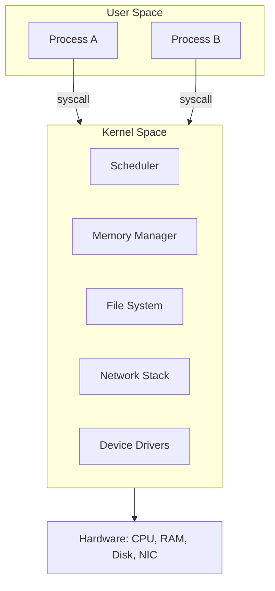

# Operating Systems — Overview

## Overview

An operating system's job is to let multiple programs safely share one machine's hardware — CPU,
RAM, storage, and I/O devices — without those programs having to coordinate with each other directly
or trust each other at all. It does this by inserting itself as a privileged layer between hardware
and applications: the **kernel** runs in a special CPU mode with full hardware access, while ordinary
programs run in a restricted mode and must ask the kernel (via **system calls**) to do anything that
touches shared hardware.

## Core Concepts

| Term | Meaning |
|---|---|
| **Kernel space / user space** | CPU privilege levels: kernel mode has unrestricted hardware access; user mode is restricted and isolated per process. |
| **System call (syscall)** | A controlled entry point that lets a user-mode program request a kernel-mode operation (read a file, allocate memory, send a network packet). |
| **Process** | A running program: its own address space, open files, and execution state, isolated from other processes by the kernel. |
| **Thread** | An independent unit of execution *within* a process, sharing that process's memory with other threads in it. |
| **Context switch** | The kernel saving one process/thread's CPU state and loading another's, so multiple things appear to run "at once" on limited CPU cores. |

## Architecture / Mechanism

## In This Section

- **[Processes & Threads](./processes-and-threads.md)** — the process control block, what a context
  switch actually saves and restores, and 1:1 kernel threads vs. green threads.
- **[Scheduling](./scheduling.md)** — FCFS, SJF, Round Robin, priority scheduling, multilevel feedback
  queues, and how Linux's CFS approximates fairness in practice.
- **[Memory Management](./memory-management.md)** — demand paging, page replacement (FIFO, LRU,
  Clock), Bélády's anomaly, and thrashing.
- **[Concurrency & Synchronization](./concurrency-and-synchronization.md)** — race conditions,
  mutexes vs. semaphores, deadlock and the four Coffman conditions.
- **[Inter-Process Communication](./interprocess-communication.md)** — pipes, message queues, shared
  memory, sockets, and signals.

## Why It Matters

- **[CPU & Processor Architecture](../cpu-architecture/intro.md)**: the scheduler decides which
  process/thread runs on which core, directly interacting with the multicore concepts covered there.
- **[Memory Hierarchy & RAM](../memory-hierarchy/intro.md)**: virtual memory (an OS + hardware
  collaboration) is what lets every process believe it has its own private, contiguous address space.
- **[Computer Networks](../computer-networks/intro.md)**: the OS's network stack is what turns raw
  packets from a network card into the sockets applications actually use.

## Related Pages

- [CPU & Processor Architecture](../cpu-architecture/intro.md)
- [Memory Hierarchy & RAM](../memory-hierarchy/intro.md)
- [Assembly & Low-Level Programming](../assembly/intro.md)
