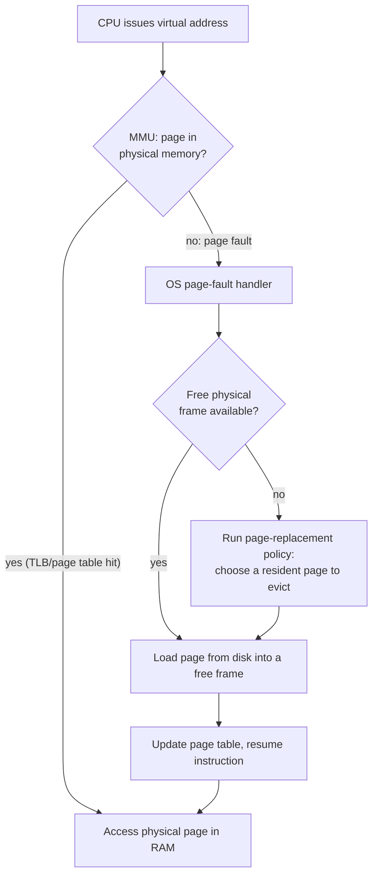

# Memory Management

## Overview

The OS gives every process the illusion of a large, private, contiguous address space, even though
physical RAM is smaller, shared among many processes, and fragmented. It does this with **virtual
memory**: each process's addresses are translated to physical addresses through per-process page
tables, enforced by the CPU's **MMU** and cached in the **TLB**. This page focuses on the OS-level
policies built on top of that hardware mechanism — demand paging, page replacement, and swapping. The
hardware translation mechanism itself (page tables, the MMU, the TLB) is covered in
[Memory Hierarchy & RAM](../memory-hierarchy/intro.md), specifically the planned
**Virtual Memory & Paging** deep-dive there — link to that page directly once it exists.

## Core Concepts

| Term | Meaning |
|---|---|
| **Page** | A fixed-size chunk of virtual memory (commonly 4 KiB) that the OS maps as a unit. |
| **Page fault** | A trap raised by the MMU when a program accesses a page not currently mapped to physical memory — the OS's cue to load it. |
| **Demand paging** | Loading pages into physical memory only when they're first accessed (on a page fault), rather than all at once when a process starts. |
| **Page replacement** | Choosing which resident page to evict to make room for an incoming one, when physical memory is full. |
| **Swapping** | Writing a page (or a whole process's pages) out to disk to free physical memory, and reading it back on demand. |
| **Thrashing** | A system spending most of its time paging data in and out rather than doing useful work, because the working set of active processes exceeds available physical memory. |

## Architecture / Mechanism



### Page replacement algorithms

| Algorithm | Idea | Pros | Cons |
|---|---|---|---|
| **FIFO** | Evict the page that has been resident the longest | Trivial to implement | Poor decisions — age says nothing about future use; suffers **Bélády's anomaly** |
| **LRU (Least Recently Used)** | Evict the page that hasn't been accessed for the longest time | Good approximation of "won't be needed soon" for typical workloads | Exact LRU needs per-access timestamps/tracking — expensive in hardware/software at scale |
| **Clock / Second-chance** | Approximate LRU cheaply: a "use" bit per page, a rotating pointer; a page with `use = 1` is spared once (bit cleared) and the pointer advances, otherwise it's evicted | Cheap to implement, close to LRU in practice | Slightly less accurate than true LRU |

:::warning Bélády's anomaly
For the FIFO algorithm specifically, it's possible to construct an access pattern where *adding more*
physical frames *increases* the number of page faults — the opposite of what you'd expect. This was
demonstrated by László Bélády in 1969 and is a classic gotcha: "just add more RAM" is not guaranteed
to help under FIFO. Stack-based algorithms like LRU and OPT (optimal) don't suffer from this anomaly —
adding frames under those algorithms never increases faults.
:::

## Practical Usage

Applications rarely manage paging directly, but they influence it. On Linux/POSIX:

```c showLineNumbers
#include <sys/mman.h>

// Map a file's pages into the process's address space; pages are faulted
// in lazily on first access rather than read from disk up front.
void *addr = mmap(NULL, length, PROT_READ, MAP_PRIVATE, fd, 0);

// Hint that a memory region is about to be needed / will not be needed,
// so the kernel can prefetch or reclaim pages more intelligently.
madvise(addr, length, MADV_WILLNEED);
madvise(addr, length, MADV_DONTNEED);

// Lock pages so the kernel is not permitted to swap them out at all
// (used for latency-critical or security-sensitive memory, e.g. crypto keys).
mlock(addr, length);
```

`mmap()`-ing a file is a direct, visible use of demand paging: the file's contents aren't read from
disk until the process actually touches a given page, and the kernel can evict clean, unmodified
pages of it under memory pressure without ever writing them back (it can simply re-read them from the
file later).

## Edge Cases & Pitfalls

:::danger Thrashing
If the combined working set of all runnable processes exceeds physical memory, the system can enter
thrashing: nearly every scheduling quantum triggers a page fault, the CPU spends almost all its time
waiting on disk I/O to service faults rather than running code, and overall throughput can collapse
even though the CPU looks "busy." The fix is to reduce memory pressure (fewer concurrent processes,
smaller working sets) rather than to tune the replacement algorithm further.
:::

- Bélády's anomaly (above) makes FIFO's behavior under increased memory genuinely unintuitive —
  don't assume "more RAM" strictly helps unless the replacement policy is stack-based (LRU/OPT).
  See [Bélády's anomaly](https://en.wikipedia.org/wiki/B%C3%A9l%C3%A1dy%27s_anomaly) for the original
  reference strings that demonstrate it.
- Exact LRU is rarely implemented as-is in real kernels because tracking true access order for every
  page is expensive; Clock/second-chance (and Linux's actual multi-list "active/inactive LRU
  approximation") trade a little accuracy for a lot of speed.

## Comparisons

| Algorithm | Faults vs. LRU (typical) | Implementation cost | Belady's-anomaly-prone |
|---|---|---|---|
| FIFO | Worse | Very low | Yes |
| LRU (exact) | Best practical baseline | High | No |
| Clock / Second-chance | Close to LRU | Low | No |

## References

- László Bélády, R. A. Nelson, G. S. Shedler, "An Anomaly in Space-Time Characteristics of Certain
  Programs Running in a Paging Machine," *Communications of the ACM*, 1969.
- Remzi H. Arpaci-Dusseau & Andrea C. Arpaci-Dusseau, [*Operating Systems: Three Easy Pieces*](https://pages.cs.wisc.edu/~remzi/OSTEP/) — "Beyond Physical Memory: Mechanisms" and "...: Policies" chapters.
- `mmap(2)`, `madvise(2)`, `mlock(2)` — Linux man-pages.

### Books & Videos

- Remzi H. Arpaci-Dusseau & Andrea C. Arpaci-Dusseau, *Operating Systems: Three Easy Pieces* — free
  online at [ostep.org](https://ostep.org).
- Andrew S. Tanenbaum & Herbert Bos, *Modern Operating Systems* — virtual memory chapter, including
  page-replacement algorithm comparisons.
- Michael Kerrisk, *The Linux Programming Interface* — the `mmap()`/virtual memory chapters.

## Related Pages

- [Memory Hierarchy & RAM](../memory-hierarchy/intro.md) — the hardware side: MMU, TLB, and page-table
  translation that this page's policies sit on top of (see the **Virtual Memory & Paging** deep-dive
  there once published).
- [Processes & Threads](./processes-and-threads.md) — each process's private address space.
- [Storage](../storage/intro.md) — where swapped-out pages ultimately live.
