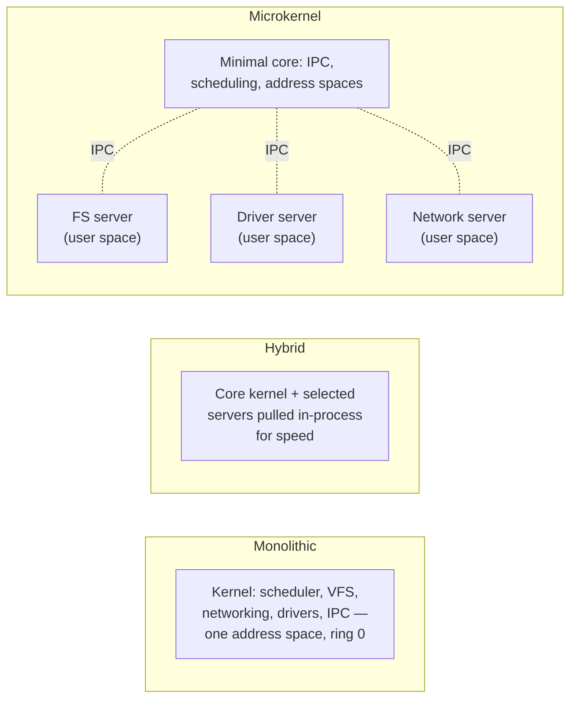

# OS Structure: Monolithic, Microkernel, Hybrid

Every kernel design question people argue about — "is Linux old-fashioned," "why does Windows put
graphics in the kernel," "what does seL4 actually guarantee" — collapses to one question: where do
you put the boundary between code that runs with full hardware authority and code that doesn't? Not
*whether* to have a boundary — every real OS has one (see
[Privilege Levels and Protection](../cpu-architecture/privilege-levels-and-protection.md)) — but how
much code gets to live on the privileged side of it. That single placement decision is what "which is
better" arguments are usually really about, and it buys something on one axis while charging for it on
another.

## The axis

*More code in ring 0 (left) trades isolation for cheap calls; more code out of ring 0 (right) trades
cheap calls for isolation. Hybrid designs pick a point in between, deliberately.*

Three named positions on that axis:

- **Monolithic** — the kernel is one program: scheduler, virtual filesystem, network stack, and
  device drivers all link into a single privileged binary sharing one address space. A call from the
  filesystem layer into a block driver is an ordinary function call.
- **Microkernel** — the privileged core is reduced to the minimum that *must* run in ring 0 to make
  everything else possible: address-space management, thread scheduling, and inter-process
  communication (IPC). Filesystems, drivers, and network stacks move to user-space servers that talk
  to each other and to applications over IPC, the same mechanism any other user process would use.
- **Hybrid** — not a third mechanism, but a compromise built by moving in either direction: a
  monolithic kernel that borrows microkernel-style internal structure (module boundaries, message-like
  internal APIs) without paying for address-space separation, or a microkernel that pulls specific
  performance-critical servers back in-process to cut IPC out of the hot path. "Hybrid" in marketing
  material and "hybrid" in an OS textbook do not always mean the same thing — read the specific claim
  before trusting the label.

## What a microkernel buys

Moving code out of ring 0 and into a user-space server changes what happens when that code is wrong,
not just how fast it runs:

- **Fault isolation.** A user-space filesystem server that dereferences a bad pointer takes a page
  fault the same way any other process would — the kernel can kill and restart the server. A
  filesystem *inside* a monolithic kernel that does the same thing corrupts kernel memory, and the
  usual outcome is a full system panic, not a restart.
- **Enforceable least privilege.** A server that only needs to open block devices and doesn't need
  network access can be denied it — a capability or IPC endpoint it never receives. In a monolithic
  kernel every driver and subsystem runs with the same unrestricted authority as every other, because
  ring 0 does not have degrees.
- **Formal verifiability at realistic scale.** seL4 is a microkernel with a machine-checked proof that
  its implementation matches its specification — no crashes, no unsafe memory access, and (for the
  proof's stated scope) no violation of its access-control model. That proof covers roughly 10,000
  lines of C. Nobody has produced an equivalent proof for a multi-million-line monolithic kernel, and
  the small, fixed trusted computing base is precisely what makes the proof tractable — shrinking what
  must be trusted is the whole strategy, not a side effect of it.

## What it costs

The price is the boundary crossing itself. Inside a monolithic kernel, a call from one subsystem to
another is a function call — an address in the same space, at most a few cycles. The microkernel
equivalent of that same call is, at minimum: a trap from the calling process into the kernel (one
privilege transition), the kernel validating and delivering the IPC message, a context switch to the
receiving server, that server doing the work, and the same sequence in reverse to return the result —
two privilege transitions and a context switch per round trip, and the message payload itself has to
be copied or the memory granted, not just pointed to, because caller and server do not share an
address space.

That structural cost is real, but its *magnitude* is not what the field believed in the 1990s. Early
microkernels (first-generation Mach in particular) measured IPC costs high enough to look prohibitive,
and those benchmarks did a lot to convince a generation of systems programmers that microkernels were
academically elegant and practically unusable. Liedtke's *"On µ-Kernel Construction"* (SOSP '95)
showed this was an implementation property of those specific kernels, not an inherent property of the
microkernel idea — a carefully engineered IPC path (L4's) cut the cost by roughly an order of magnitude
over Mach's, with no change to the architectural model. The crossing is still not free — it is a
strictly larger number of cycles than a function call, and always will be, because a privilege
transition and a context switch are irreducible parts of it — but "far cheaper than a 1990s Mach
benchmark suggests" and "as cheap as a function call" are different claims, and only the first one is
true. The cost is structural, not fatal.

## The historical argument, briefly

In 1992, Andrew Tanenbaum — author of Minix, a teaching microkernel — posted "LINUX is obsolete" to
comp.os.minix, arguing that a monolithic design was an outdated choice for a new OS in an era when
microkernels were, in his view, the technically correct direction and portability/modularity mattered
more than raw performance. Linus Torvalds, then two years into Linux, replied defending the monolithic
choice on pragmatic grounds: portability concerns were overstated for what he was actually trying to
ship, and a design that worked *now*, on real hardware, beat a theoretically cleaner one that didn't
yet exist in a usable form. The full exchange is worth reading once as a primary source, not a
retelling — both sides argue in good faith and the disagreement is genuinely about engineering
trade-offs, not personalities.

Neither side won outright; both positions aged into partial correctness. Tanenbaum was right that
isolation matters enough to be worth paying for — seL4's adoption in safety- and security-critical
systems (and QNX's decades-long run in automotive and industrial control) is that argument vindicated
in domains where a driver crash cannot be a kernel panic. Torvalds was right that a monolithic design
does not have to stay architecturally frozen — Linux's loadable module system, its internal subsystem
boundaries, and decades of incremental restructuring show a monolithic kernel can absorb a great deal
of the modularity argument without paying IPC's cost, at least for the isolation it declines to buy.
Treat the thread as a historical data point about a real fork in early-90s systems design, not a
question with a settled winner.

## Where real systems actually sit

| System | Structure | Drivers run in | Notes |
|---|---|---|---|
| **Linux** | Monolithic + loadable modules | Kernel space (ring 0) | Modules are a build/deploy convenience, not an isolation boundary — see below. |
| **Windows NT** | Hybrid | Mostly kernel space | The NT kernel started closer to a microkernel design (client/server subsystems); graphics (GDI) moved *into* the kernel in NT 4.0 specifically to cut IPC overhead for a performance-sensitive path — the canonical example of "hybrid by pulling a server back in." |
| **macOS / iOS (XNU)** | Hybrid | Kernel space | XNU embeds a Mach microkernel core (IPC, scheduling, VM) together with a monolithic BSD layer (syscalls, networking, the VFS) *in the same address space* — Mach's IPC exists internally, but drivers and BSD services do not run as isolated user-space servers the way a "pure" microkernel would. |
| **QNX** | Microkernel | User space | Long-lived commercial real-time microkernel; drivers and filesystems are ordinary user processes restarted on failure, which is why it's a mainstay in automotive and industrial control. |
| **seL4** | Microkernel | User space | Formally verified core (~10k LOC); everything else, including drivers, is unprivileged user-space code built on top. |
| **Unikernels** (MirageOS, IncludeOS, and similar) | Neither — the boundary is removed | N/A | A single application and the OS services it needs are compiled together into one address space with no user/kernel split at all, deployed as one bootable image (typically as a VM) — this trades away process isolation entirely in exchange for minimal size and attack surface, viable specifically because the hypervisor below it is doing the isolation instead. |

**Comparison across the taxonomy:**

| | Where drivers run | Cost of a subsystem call | Blast radius of a driver bug | Ease of extension | Real system |
|---|---|---|---|---|---|
| **Monolithic** | Kernel space, ring 0 | One function call | Whole kernel (panic) | Recompile/reload a module into the same space | Linux |
| **Microkernel** | User space | IPC round trip: 2 transitions + context switch | One server (restartable) | Add/replace a user-space server, no kernel change | QNX, seL4 |
| **Hybrid** | Usually kernel space, selectively user space | Function call for in-kernel parts; IPC for the rest | Depends on what moved where | Mixed — depends which parts stayed modular | Windows NT, XNU |

## Modules are not isolation

This is the correction most worth internalizing, because it's the belief the Linux section of this
site will otherwise let stand uncorrected: a Linux **loadable kernel module** (`insmod`, `.ko` files)
is a *build- and deploy-time* convenience — it lets a driver ship separately from the kernel image and
load only when needed — not a *runtime isolation* boundary. Once loaded, a module executes in exactly
the same address space, at exactly the same privilege level (ring 0), with exactly the same authority
as code that was compiled directly into `vmlinux`. A bug in a loaded module — a bad pointer
dereference, a use-after-free — corrupts kernel memory precisely as thoroughly as a bug in the
scheduler would, and the usual result is the same: an oops or a panic, not a contained failure. The
word "module" describes how the code got there, not what it's allowed to do once it has. Whatever
isolation a microkernel's user-space server gets from being a separate process with its own address
space, a Linux kernel module gets none of — it is, for every purpose that matters to a fault, just
more kernel.

---

Where Linux specifically sits on this axis, and the honest cost of that specific choice, is covered in
[Monolithic, With Modules](../../linux/04-kernel-architecture-and-idioms/monolithic-with-modules.md).

## References

- Andrew Tanenbaum and Linus Torvalds, *"LINUX is obsolete"* — the 1992 comp.os.minix exchange,
  archived at
  [oreilly.com/openbook/opensources/book/appa.html](https://www.oreilly.com/openbook/opensources/book/appa.html).
  The primary text of the argument; worth reading once rather than taking secondhand.
- Jochen Liedtke, ["On µ-Kernel Construction"](https://dl.acm.org/doi/10.1145/224056.224075), SOSP
  '95 — the paper that showed microkernel IPC cost was an implementation property of early designs
  like Mach, not an inherent property of the microkernel idea.
- [seL4: About](https://sel4.systems/About/) — what a formally verified microkernel actually
  guarantees, and the precise scope of that guarantee.
