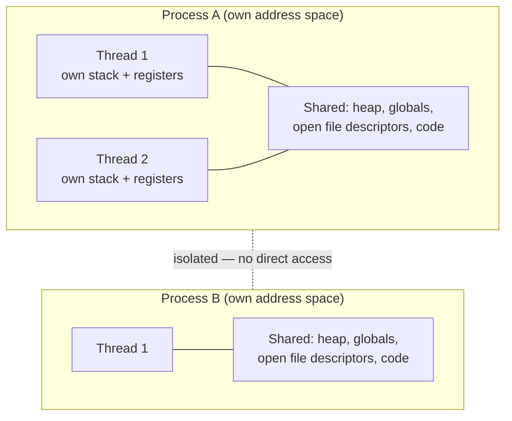

# Processes & Threads

## Overview

A **process** is the OS's unit of isolation: a running program with its own private address space,
open file descriptors, and execution state, walled off from every other process by the kernel. A
**thread** is the OS's unit of *scheduling*: an independent sequence of execution that can run
concurrently with other threads. The key distinction between the two is what they share — every
thread within a process shares that process's address space, file descriptors, and most other
resources, while each process gets its own private copy of everything. That single fact (shared vs.
private address space) explains almost every practical difference between "spawn a thread" and
"spawn a process."

## Core Concepts

| Term | Meaning |
|---|---|
| **Process** | An instance of a running program: address space, open files, signal handlers, and one or more threads, isolated from other processes. |
| **Thread** | An independent, schedulable execution context (its own stack, registers, program counter) that shares its parent process's address space with sibling threads. |
| **Process Control Block (PCB)** | The kernel data structure (`task_struct` on Linux) holding everything the OS needs to know about a process/thread: PID, state, saved registers, memory maps, open file table, scheduling priority. |
| **Context switch** | The kernel saving the CPU state of the currently running thread into its PCB and restoring another thread's saved state, so execution can resume later exactly where it left off. |
| **Kernel thread (1:1 model)** | A thread the kernel scheduler knows about directly and can schedule onto a CPU core independently of its siblings. |
| **Green thread / user-level thread** | A thread multiplexed onto one or more kernel threads entirely by a userspace runtime; the kernel is unaware of it individually. |

## Architecture / Mechanism



Threads within a process are cheap to create and communicate through because they read and write the
same memory directly. Processes are expensive to create and communicate through precisely *because*
they don't share memory — any communication has to go through the kernel (see
[Inter-Process Communication](./interprocess-communication.md)).

### What a context switch actually saves and restores

When the kernel switches from thread A to thread B on a CPU core, it must save into A's PCB (and load
from B's PCB) at least:

- **CPU registers** — general-purpose registers, the program counter, the stack pointer.
- **Processor status/flags register.**
- **Memory-management state** — if switching between *processes* (not threads of the same process),
  the page-table base register (e.g., `CR3` on x86-64) must also change, which invalidates
  address-translation caching in the **TLB** (see
  [Memory Hierarchy & RAM](../memory-hierarchy/intro.md)) and causes a burst of expensive TLB misses
  right after the switch.
- **Kernel bookkeeping** — scheduling info, signal masks, and enough state to resume the syscall the
  thread was in, if any.

This is why context switches aren't free: beyond the direct cost of saving/restoring registers, a
process-to-process switch cools down the CPU's caches and TLB for the new process, and those misses
have to be paid back on the following instructions. Switching between two threads *of the same
process* is cheaper precisely because the page tables (and therefore the TLB) don't need to change.

## Practical Usage

### Thread models: 1:1 kernel threads vs. green threads

| Model | Who schedules it | Blocking syscall behavior | Example |
|---|---|---|---|
| **1:1 (kernel threads)** | The OS scheduler, directly | One thread blocking (e.g., on I/O) doesn't stall its siblings | POSIX threads (`pthreads`) on Linux, Windows threads |
| **N:1 / M:N (green threads)** | A userspace runtime, multiplexed onto one or few kernel threads | A blocking syscall can stall the whole runtime unless it's wrapped in a non-blocking/async I/O layer | Early Java "green threads", Go's goroutines (M:N onto OS threads), Erlang processes |

### fork/exec (POSIX) vs. CreateProcess (Windows)

POSIX splits "make a new process" and "run a different program in it" into two distinct syscalls:

```c showLineNumbers
#include <unistd.h>
#include <sys/wait.h>

pid_t pid = fork();       // clones the calling process; returns twice
if (pid == 0) {
    // Child: an almost-exact copy of the parent's address space (copy-on-write)
    execvp("/bin/ls", (char *[]){"ls", "-l", NULL}); // replaces the image in place
    _exit(127);            // only reached if exec fails
} else {
    // Parent: pid is the child's PID
    waitpid(pid, NULL, 0); // block until the child exits
}
```

`fork()` gives the child a copy-on-write duplicate of the parent's entire address space; `execvp()`
then discards that address space and replaces it with a freshly loaded program image. Splitting the
two steps is what makes it trivial to set up file descriptors, environment variables, or working
directories in the child *between* `fork()` and `exec()` (which is exactly how shells implement I/O
redirection and pipelines).

Windows instead exposes a single `CreateProcess()` call that both creates the new process and loads
the target executable's image into it in one step — there is no separate "clone myself" primitive.
That design is simpler for the common case ("just start this program") but makes fork-style
copy-then-customize tricks awkward, which is part of why POSIX compatibility layers on Windows
(Cygwin, WSL1) historically struggled to emulate `fork()` efficiently.

## Edge Cases & Pitfalls

:::warning fork() only duplicates the calling thread
In a multithreaded process, `fork()` clones the *entire address space* but only the calling thread
continues to exist in the child — other threads simply vanish without running their cleanup code.
Mutexes held by now-nonexistent threads can be left permanently locked. POSIX explicitly documents
this; the safe pattern is to `fork()` before spawning additional threads, or to immediately `exec()`
in the child.
:::

:::danger Thread creation is not "free," and address-space sharing cuts both ways
Because threads share memory, a bug in one thread (a wild pointer write, a buffer overflow) can
silently corrupt another thread's data with no kernel protection between them — unlike a crash in one
*process*, which the kernel isolates from every other process automatically.
:::

- Zombie processes: a child that has exited but whose parent hasn't called `wait()`/`waitpid()` yet
  still occupies a PCB entry until it's reaped.
- Orphaned processes (parent exits first) are re-parented (to `init`/PID 1 on Unix) so they can still
  be reaped.

## Comparisons

| | Process | Thread |
|---|---|---|
| Address space | Private, isolated | Shared with sibling threads |
| Creation cost | High (`fork()` + page-table setup) | Low (new stack + PCB entry) |
| Communication | Requires explicit IPC | Direct memory access (needs synchronization) |
| Fault isolation | A crash doesn't affect other processes | A crash can corrupt the whole process |
| Context-switch cost | Higher (page tables, TLB flush) | Lower (registers only, same address space) |

## References

- Michael Kerrisk, *The Linux Programming Interface* — Chapters 24–28 cover processes, `fork()`,
  `exec()`, and process termination in detail.
- Remzi H. Arpaci-Dusseau & Andrea C. Arpaci-Dusseau, [*Operating Systems: Three Easy Pieces*](https://pages.cs.wisc.edu/~remzi/OSTEP/) — "The Abstraction: The Process" and "Interlude: Process API" chapters.
- `fork(2)`, `execve(2)`, `wait(2)` — Linux man-pages ([man7.org](https://man7.org/linux/man-pages/)).

### Books & Videos

- Remzi H. Arpaci-Dusseau & Andrea C. Arpaci-Dusseau, *Operating Systems: Three Easy Pieces* — free online at [ostep.org](https://ostep.org).
- Michael Kerrisk, *The Linux Programming Interface* (No Starch Press) — the definitive reference for
  the Linux/POSIX process and thread APIs used in the examples above.
- Andrew S. Tanenbaum & Herbert Bos, *Modern Operating Systems* — process/thread models chapter.
- MIT 6.1810 (formerly 6.S081/6.828), *Operating System Engineering* — free course building a Unix-like
  kernel (xv6): [pdos.csail.mit.edu/6.1810](https://pdos.csail.mit.edu/6.1810/2024/).

## Related Pages

- [Scheduling](./scheduling.md) — how the kernel decides which thread runs next.
- [Concurrency & Synchronization](./concurrency-and-synchronization.md) — the price paid for sharing
  memory between threads.
- [Inter-Process Communication](./interprocess-communication.md) — how isolated processes talk anyway.
- [Memory Hierarchy & RAM](../memory-hierarchy/intro.md) — the TLB effects of a process context switch.
