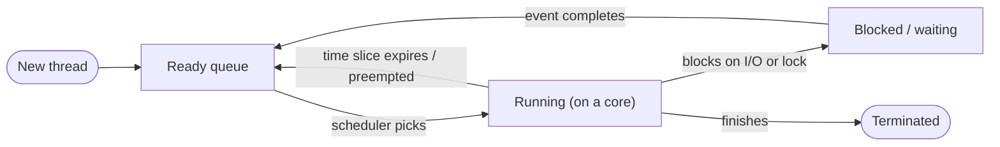

# Scheduling

## Overview

There are almost always more runnable threads than CPU cores. The **scheduler** is the kernel
component that decides which thread runs on which core for how long. Every scheduling policy is a
tradeoff between competing goals — you cannot simultaneously optimize all of them — which is why
different systems (a phone, a web server, a real-time controller) reasonably choose different
algorithms.

## Core Concepts

| Term | Meaning |
|---|---|
| **Throughput** | Total work completed per unit time (e.g., jobs finished per second). |
| **Latency / response time** | How long a thread waits before it starts (or resumes) making progress. |
| **Fairness** | Roughly equal CPU allocation among threads/processes of equal priority. |
| **Starvation** | A thread that is repeatedly, indefinitely denied the CPU because the policy always prefers other threads. |
| **Preemption** | The scheduler forcibly suspending a running thread (usually via a timer interrupt) before it voluntarily yields. |
| **Time slice / quantum** | The maximum amount of CPU time a thread is allowed to run before the scheduler reconsiders. |

:::info Goals often conflict
Maximizing throughput favors letting jobs run to completion with minimal switching overhead; minimizing
latency favors switching often so nothing waits long. Fairness can directly reduce throughput (an
optimal single ordering of jobs is rarely a "fair" round-robin). There is no universally "best"
scheduler — only one best-suited to a given workload's priorities.
:::

## Architecture / Mechanism



### Classic algorithms

| Algorithm | Idea | Strength | Weakness |
|---|---|---|---|
| **FCFS (First-Come, First-Served)** | Run jobs in arrival order, to completion | Simple, no starvation | A long job blocks every later job ("convoy effect") |
| **SJF (Shortest Job First)** | Always run whichever ready job has the least remaining work | Optimal average waiting time | Requires knowing job length in advance; can starve long jobs |
| **Round Robin (RR)** | Give every ready thread a fixed time slice, then rotate to the next | Fair, bounded response time | Frequent switches hurt throughput if the quantum is too small |
| **Priority scheduling** | Always run the highest-priority ready thread | Lets important work go first | Low-priority threads can starve without aging/boosting |
| **Multilevel Feedback Queue (MLFQ)** | Several priority queues with different quanta; a thread's priority drops the longer it runs CPU-bound, and can be boosted if it behaves interactively (I/O-bound) | Approximates SJF without knowing job length ahead of time; good interactive feel | Complex to tune well |

### Preemptive vs. cooperative scheduling

- **Cooperative**: a thread keeps the CPU until it voluntarily yields (returns control or blocks).
  Simple, but a single misbehaving thread can freeze the whole system — this was how early
  Windows (3.x/95-era) and classic Mac OS scheduled.
- **Preemptive**: the kernel can forcibly interrupt a running thread (typically via a periodic timer
  interrupt) whether or not it wants to give up the CPU. Virtually all general-purpose OSes today
  (Linux, modern Windows, macOS) are preemptive — it's what keeps one runaway process from being able
  to freeze the machine.

### Real-world example: Linux CFS

Linux's default scheduler for ordinary (non-real-time) tasks since kernel 2.6.23 has been the
**Completely Fair Scheduler (CFS)**. Conceptually:

- Every runnable task accumulates a **virtual runtime (`vruntime`)** — its actual CPU time consumed,
  scaled by its weight (derived from its `nice` value). A higher-priority (lower `nice`) task
  accumulates `vruntime` more slowly, so it earns proportionally more real CPU time.
- Runnable tasks are kept in a **red-black tree**, ordered by `vruntime`.
- The scheduler always picks the **leftmost node** — the task with the smallest `vruntime`, i.e., the
  one that has (proportionally) received the least CPU time so far — approximating an idealized
  model where every task gets a perfectly fair, continuously-updated share of the CPU.

:::info Linux has since moved past CFS
Starting with kernel 6.6 (2023), Linux began replacing CFS with **EEVDF** (Earliest Eligible Virtual
Deadline First), a related but more principled virtual-deadline-based design. The `vruntime`/red-black
tree intuition above still describes CFS as shipped for roughly 16 years and remains the standard
teaching model for "how does Linux schedule fairly."
:::

## Practical Usage

Pseudocode for a simple Round Robin scheduler tick, illustrating the mechanism most textbook
schedulers build on:

```text showLineNumbers
on timer interrupt:
    current.remaining_slice -= 1
    if current.remaining_slice == 0 or current.blocked:
        save_context(current)
        ready_queue.push_back(current)
        next = ready_queue.pop_front()
        next.remaining_slice = QUANTUM
        restore_context(next)
        current = next
```

From userspace, you influence (but don't control) the scheduler via APIs like POSIX `nice(2)` /
`setpriority(2)` (adjust CFS weighting) or `sched_setscheduler(2)` (switch a thread to a real-time
policy such as `SCHED_FIFO`/`SCHED_RR` on Linux, which preempt all normal `SCHED_OTHER` tasks).

## Edge Cases & Pitfalls

:::warning Priority inversion
A low-priority thread holding a lock that a high-priority thread needs can block that high-priority
thread indefinitely if a medium-priority thread keeps preempting the low-priority one. This is exactly
what nearly doomed the Mars Pathfinder mission in 1997. The standard fix is **priority inheritance**:
temporarily boost the lock holder to the waiter's priority.
:::

- Too small a time slice wastes CPU time on context-switch overhead; too large a time slice hurts
  interactive responsiveness — there's no one-size-fits-all quantum.
- SJF/priority scheduling without aging can starve long-running or low-priority jobs forever.

## Comparisons

| Algorithm | Preemptive? | Starvation-free? | Needs job-length knowledge? | Typical use |
|---|---|---|---|---|
| FCFS | No | Yes | No | Batch systems, simple queues |
| SJF | Usually no | No (long jobs can starve) | Yes | Theoretical baseline / batch scheduling |
| Round Robin | Yes | Yes | No | General-purpose interactive systems |
| Priority | Optional | No (without aging) | No | Real-time / latency-sensitive tasks |
| MLFQ / CFS | Yes | Yes (in practice) | No | General-purpose OSes (Linux, etc.) |

## References

- Linux kernel documentation, [*CFS Scheduler*](https://docs.kernel.org/next/scheduler/sched-design-CFS.html).
- Remzi H. Arpaci-Dusseau & Andrea C. Arpaci-Dusseau, [*Operating Systems: Three Easy Pieces*](https://pages.cs.wisc.edu/~remzi/OSTEP/) — "Scheduling: Introduction" and "Multilevel Feedback Queue" chapters.
- `sched(7)`, `nice(2)`, `sched_setscheduler(2)` — Linux man-pages.

### Books & Videos

- Remzi H. Arpaci-Dusseau & Andrea C. Arpaci-Dusseau, *Operating Systems: Three Easy Pieces* — free
  online at [ostep.org](https://ostep.org).
- Andrew S. Tanenbaum & Herbert Bos, *Modern Operating Systems* — scheduling algorithms chapter.
- MIT 6.1810 (formerly 6.S081/6.828), *Operating System Engineering* — [pdos.csail.mit.edu/6.1810](https://pdos.csail.mit.edu/6.1810/2024/).

## Related Pages

- [Processes & Threads](./processes-and-threads.md) — what's actually being scheduled.
- [Multicore & Parallelism](../cpu-architecture/multicore-and-parallelism.md) — scheduling across
  multiple cores.
- [Concurrency & Synchronization](./concurrency-and-synchronization.md) — how threads coordinate once
  scheduled.
