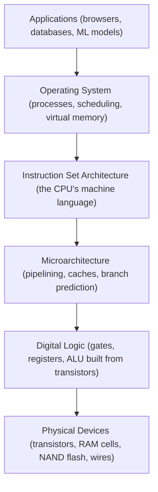

# How Computers Work — A Mental Model

## Overview

A computer is a stack of **abstraction layers**. Each layer hides the complexity of the one below
it and exposes a simpler interface to the one above it. You write a Python loop; underneath, a CPU
core is fetching binary instructions from RAM tens of millions of times per second, moving bytes
between registers, caches, and buses. Understanding computer science at a "senior engineer" level
means being able to move up and down this stack on demand — to know which layer is responsible when
something is slow, wrong, or insecure.

This section is the map. Every later section is one layer of the stack, described bottom-up
(closest to silicon first) because the physical constraints of hardware (speed of light, energy per
bit, physical proximity) are what *cause* the software abstractions above them to exist.

## Core Concepts

**The stored-program (von Neumann) model.** Almost every general-purpose computer today follows the
same idea: instructions and data live in the *same* memory, as numbers, and a processor executes
them by repeatedly fetching the next instruction, decoding what it means, and executing it.

| Concept | Definition |
|---|---|
| Von Neumann architecture | One shared memory for code and data; instructions execute sequentially unless a branch changes the flow. |
| Harvard architecture | Separate memory/buses for code and data (common inside CPU caches and microcontrollers) — avoids one bottleneck, at the cost of complexity. |
| Abstraction layer | A boundary that hides implementation detail behind a stable interface (e.g., "write a byte to this address" hides DRAM refresh cycles). |
| Instruction | A single operation a CPU can execute, encoded as bits (e.g., "add register 1 and register 2"). |

## Architecture / Mechanism: The Layer Stack

Each downward arrow is a translation: your Python/C++ code compiles to machine instructions (ISA),
which a specific chip design (microarchitecture) executes using logic gates, built out of physical
transistors. Data doesn't just sit still — it constantly moves between the CPU, memory, storage, and
network, which is why buses and I/O get their own section.

## Reading Order

This is deliberately **bottom-up on hardware, then up through the OS into networked systems**,
because later sections assume you know what a register, a cache, and a page fault are.

1. **[Data Representation](../bit-manipulation/intro.md)** — how numbers, text, and bits encode information.
2. **[CPU & Processor Architecture](../cpu-architecture/intro.md)** — how instructions actually execute.
3. **[Memory Hierarchy & RAM](../memory-hierarchy/intro.md)** — where data lives while a program runs.
4. **[Storage: HDD, SSD & NVMe](../storage/intro.md)** — where data lives when the power is off.
5. **[Buses & I/O](../buses-and-io/intro.md)** — how components talk to each other.
6. **[Operating Systems](../operating-systems/intro.md)** — how one machine multiplexes hardware across many programs.
7. **[Assembly & Low-Level Programming](../assembly/intro.md)** — the language the ISA actually speaks.
8. **[Computer Networks](../computer-networks/intro.md)** — how *multiple* machines talk to each other.
9. **[Application Protocols](../protocols/intro.md)** — the rules built on top of networks (HTTP, DNS, TLS).
10. **[Databases](../databases/intro.md)** — how data is organized, stored, and queried reliably at scale.

## Edge Cases & Pitfalls

:::warning Don't skip layers when debugging
A slow SQL query, a segfault, and a dropped network packet all *look* like application bugs but are
frequently caused by the layer underneath (a missing index, a stack overflow, a misconfigured MTU).
Knowing the stack lets you jump to the right layer instead of guessing at the top one.
:::

- Treating "the computer" as a single black box instead of a layered system is the most common gap
  between junior and senior engineers — performance and correctness bugs usually live at a layer
  boundary (cache miss, syscall, page fault, network retransmit).
- Abstractions leak. Virtual memory looks like infinite, contiguous RAM until you page-fault to disk
  and your "simple" array access takes 100,000x longer.

## References

- Patterson & Hennessy, *Computer Organization and Design* (RISC-V/ARM/x86 editions) — the standard
  textbook this section's structure is loosely modeled on.
- Randal E. Bryant & David R. O'Hallaron, *Computer Systems: A Programmer's Perspective*.

### Books & Videos

- **[nand2tetris.org](https://www.nand2tetris.org/)** — "Build a Modern Computer from First
  Principles" (also on Coursera as *From Nand to Tetris*). Builds a full computer, from logic gates
  up to a working OS, in 12 hands-on projects — the single best practical companion to this section.
- **Ben Eater**, [Building an 8-bit breadboard computer!](https://www.youtube.com/playlist?list=PLowKtXNTBypGqImE405J2565dvjafglHU)
  — a from-scratch hardware build on breadboards that makes the abstraction layers in the diagram
  above physically visible (clock, registers, ALU, memory, control logic).
- Charles Petzold, *Code: The Hidden Language of Computer Hardware and Software* — a very accessible,
  non-textbook narrative covering the same bottom-up journey (switches → logic → CPU → software).

## Related Pages

- [Data Representation](../bit-manipulation/intro.md)
- [CPU & Processor Architecture](../cpu-architecture/intro.md)
- [Operating Systems](../operating-systems/intro.md)
