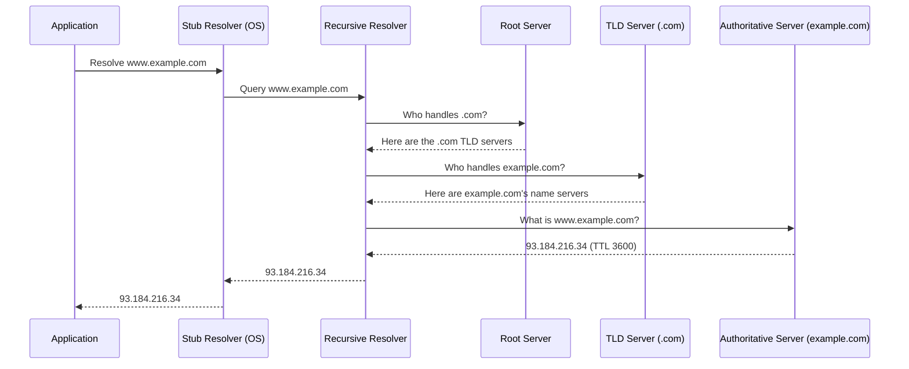

# DNS (Domain Name System)

## Overview

DNS is the Internet's naming system — it translates human-readable names like `example.com` into the
IP addresses machines actually need to route traffic (see
[Network Layer & Routing](../computer-networks/network-layer-and-routing.md)). It's a globally
distributed, hierarchical, heavily-cached database, and it's on the critical path of essentially
every Internet request: no DNS resolution, no connection.

## Core Concepts

| Term | Meaning |
|---|---|
| **Stub resolver** | The small DNS client built into your OS — sends queries, doesn't do the recursive work itself. |
| **Recursive resolver** | A server (e.g., your ISP's, or `1.1.1.1` / `8.8.8.8`) that does the full lookup on behalf of the stub resolver, caching results along the way. |
| **Root server** | One of 13 logical root name servers that know which servers are authoritative for each top-level domain (`.com`, `.org`, etc.). |
| **TLD server** | A server authoritative for a top-level domain, pointing to the authoritative servers for specific domains under it. |
| **Authoritative name server** | The server that holds the actual records for a specific domain (e.g., `example.com`'s own DNS provider). |
| **TTL (Time To Live)** | How long, in seconds, a resolver may cache a record before it must re-query. |

## Architecture / Mechanism: The Resolution Chain



The recursive resolver caches results at every level (root/TLD referrals are effectively static and
cached for a long time; the final answer is cached according to its own TTL), so most real-world
lookups skip several of these steps entirely and answer straight from cache.

### Common Record Types

| Type | Purpose |
|---|---|
| **A** | Maps a name to an IPv4 address. |
| **AAAA** | Maps a name to an IPv6 address. |
| **CNAME** | Aliases one name to another name (which is then resolved again). |
| **MX** | Specifies the mail server(s) responsible for a domain, with priority. |
| **TXT** | Arbitrary text — commonly used for domain verification and email anti-spoofing (SPF/DKIM/DMARC). |
| **NS** | Delegates a (sub)domain to a specific set of authoritative name servers. |

## Practical Usage: Reading `dig` Output

```bash
$ dig example.com A

; <<>> DiG 9.18.28 <<>> example.com A
;; global options: +cmd
;; Got answer:
;; ->>HEADER<<- opcode: QUERY, status: NOERROR, id: 41592
;; flags: qr rd ra; QUERY: 1, ANSWER: 1, AUTHORITY: 0, ADDITIONAL: 1

;; QUESTION SECTION:
;example.com.                   IN      A

;; ANSWER SECTION:
example.com.            86400   IN      A       93.184.216.34

;; Query time: 23 msec
;; SERVER: 192.168.1.1#53(192.168.1.1) (UDP)
;; WHEN: Wed Feb 12 10:15:30 UTC 2026
;; MSG SIZE  rcvd: 56
```

Reading this:

- `status: NOERROR` — the query succeeded (a real failure would show `NXDOMAIN`, meaning the name
  doesn't exist).
- `ANSWER SECTION`: `example.com. 86400 IN A 93.184.216.34` — name, **TTL in seconds** (86400 = 24
  hours), class (`IN` = Internet), record type, and the actual answer.
- `Query time: 23 msec` and `SERVER: 192.168.1.1` — this answer came from a local/recursive resolver,
  not directly from the authoritative server; querying the authoritative server directly (`dig
  example.com A @ns1.example-dns.com`) would show the real current TTL rather than a countdown from
  a cached copy.

## Edge Cases & Pitfalls

:::warning DNS caching means changes are never instant
Because resolvers cache answers for up to a record's TTL, updating a DNS record (e.g., pointing a
domain at a new server) can take anywhere from seconds to the full TTL to propagate everywhere,
depending on who has already cached the old value. Lowering a TTL *before* a planned change (and
raising it back afterward) is a common technique to make cutovers faster.
:::

- **CNAME flattening/restrictions**: a CNAME record cannot coexist with other record types at the
  same name (e.g., you can't have both a CNAME and an MX record for the same host name) — a frequent
  source of "why won't this record save" confusion.
- DNS mostly runs over UDP for speed (single round trip, no handshake), but falls back to TCP for
  responses too large for a single UDP datagram (e.g., DNSSEC-signed responses, or many records) —
  see [Transport Layer: TCP & UDP](../computer-networks/transport-layer-tcp-udp.md).
- Plain DNS queries are unencrypted and can be observed or tampered with in transit; DNS-over-HTTPS
  (DoH) and DNS-over-TLS (DoT) exist specifically to close that gap.

## Comparisons

| Record type | Resolves to | Can coexist with other records at same name? |
|---|---|---|
| A | IPv4 address | Yes |
| AAAA | IPv6 address | Yes |
| CNAME | Another name | No |
| MX | Mail server name (+ priority) | Yes |
| TXT | Arbitrary text | Yes |

## References

- IETF, [RFC 1034](https://www.rfc-editor.org/rfc/rfc1034.html) — *Domain Names — Concepts and
  Facilities*.
- IETF, [RFC 1035](https://www.rfc-editor.org/rfc/rfc1035.html) — *Domain Names — Implementation and
  Specification*.

### Books & Videos

- Kurose & Ross, *Computer Networking: A Top-Down Approach* — application-layer chapter covers DNS's
  hierarchy and caching model.
- Cloudflare's engineering blog has well-regarded, technically accurate articles explaining DNS
  internals and resolver behavior in detail.

## Related Pages

- [Application Protocols — Overview](./intro.md)
- [Network Layer & Routing](../computer-networks/network-layer-and-routing.md)
- [Transport Layer: TCP & UDP](../computer-networks/transport-layer-tcp-udp.md)
- [HTTP & HTTPS](./http-and-https.md)
