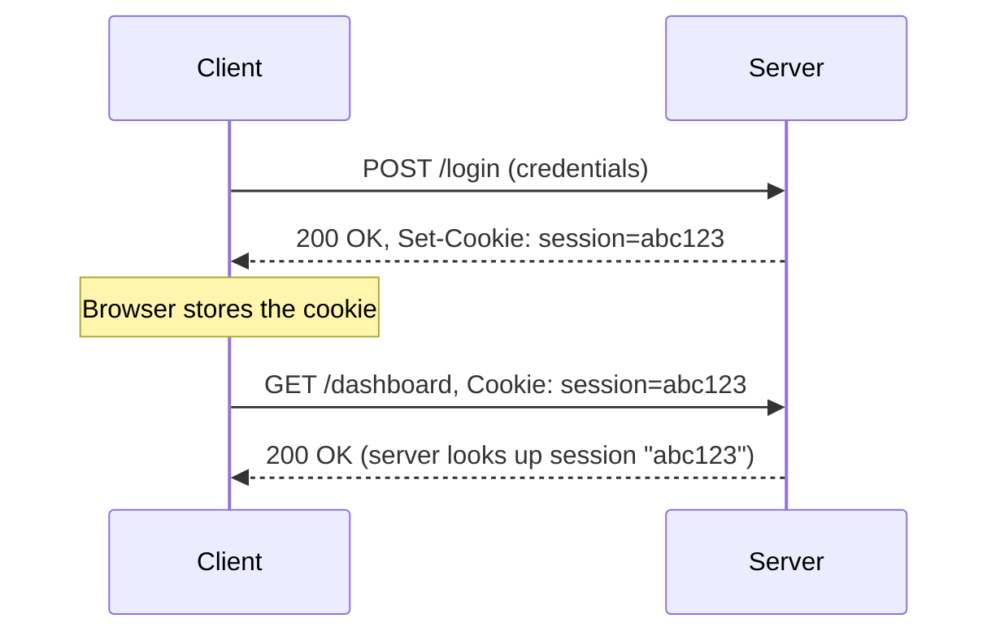
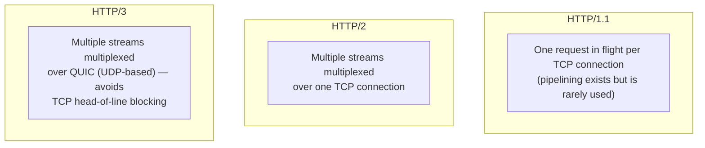

# HTTP and HTTPS

## Overview

HTTP is the request/response protocol underlying the Web and most modern APIs: a client sends a
request for a resource, a server sends back a response. HTTPS is simply HTTP layered on top of TLS
(see [TLS & Encryption Basics](./tls-and-encryption-basics.md)) so that request and response are
encrypted and authenticated in transit. HTTP has gone through three major versions — HTTP/1.1,
HTTP/2, and HTTP/3 — each addressing performance limitations of the last while keeping the same
core request/response *semantics*.

## Core Concepts

| Term | Meaning |
|---|---|
| **Method** | The action a request performs — `GET`, `POST`, `PUT`, `DELETE`, `PATCH`, `HEAD`, `OPTIONS`. |
| **Status code** | A 3-digit response code indicating the outcome, grouped into classes (see below). |
| **Header** | A key-value metadata field on a request or response (`Content-Type`, `Authorization`, `Cache-Control`, etc.). |
| **Statelessness** | Each HTTP request is independent by default — the protocol itself carries no memory of previous requests. |
| **Cookie** | A small piece of state the server asks the client to store and re-send on future requests — the usual way statelessness is worked around. |
| **Multiplexing** | Sending multiple logical requests/responses concurrently over a single connection (HTTP/2 and HTTP/3; not possible in HTTP/1.1 without multiple connections). |

### Status Code Classes

| Range | Class | Examples |
|---|---|---|
| 1xx | Informational | `100 Continue` |
| 2xx | Success | `200 OK`, `201 Created`, `204 No Content` |
| 3xx | Redirection | `301 Moved Permanently`, `304 Not Modified` |
| 4xx | Client error | `400 Bad Request`, `401 Unauthorized`, `404 Not Found` |
| 5xx | Server error | `500 Internal Server Error`, `503 Service Unavailable` |

## Architecture / Mechanism

### Statelessness and Cookies



HTTP itself doesn't know "this request and that request came from the same user" — the server
issues a cookie via `Set-Cookie`, the client re-sends it via the `Cookie` header on every subsequent
request to that domain, and the server uses it as a lookup key into its own session store. This is
an application-level convention layered on top of a genuinely stateless protocol, not a feature of
HTTP's wire format itself.

### HTTP/1.1 vs. HTTP/2 vs. HTTP/3



- **HTTP/1.1**: text-based, one request waits for one response per connection at a time; browsers
  work around this by opening several parallel TCP connections to the same host.
- **HTTP/2**: binary framing, true multiplexing of many concurrent requests/responses over a *single*
  TCP connection, plus header compression (HPACK) and server push. Still built on TCP, so a single
  lost packet stalls *all* multiplexed streams until it's retransmitted (TCP-level head-of-line
  blocking).
- **HTTP/3**: keeps HTTP/2's multiplexing model but runs over **QUIC**, a transport built on UDP that
  implements its own reliability and congestion control per-stream — so one lost packet only stalls
  the stream it belongs to, not the whole connection. QUIC also folds in TLS 1.3 at the transport
  level, shaving round trips off connection setup.

## Practical Usage: A Raw HTTP Request and Response

What actually goes over the wire for a simple `GET` (as seen with `curl -v` or a raw `nc`/`openssl
s_client` session):

```text
GET /index.html HTTP/1.1
Host: example.com
User-Agent: curl/8.4.0
Accept: */*

```

```text
HTTP/1.1 200 OK
Content-Type: text/html; charset=UTF-8
Content-Length: 1256
Cache-Control: max-age=604800
Date: Wed, 12 Feb 2026 10:15:30 GMT

<!doctype html>
<html>
<head><title>Example Domain</title></head>
...
```

Using `curl -v` shows this exchange plus the TLS and connection setup around it:

```bash
$ curl -v https://example.com/ -o /dev/null
* Connected to example.com (93.184.216.34) port 443
* TLS handshake, Client hello (1)
* TLS handshake, Server hello (2)
...
> GET / HTTP/2
> Host: example.com
> user-agent: curl/8.4.0
> accept: */*
>
< HTTP/2 200
< content-type: text/html; charset=UTF-8
< content-length: 1256
```

Note `curl` negotiated `HTTP/2` here (visible in the `>`/`<` request/response lines) via TLS's ALPN
extension during the handshake — this is how a client and server agree on an HTTP version without
an extra round trip.

## Edge Cases & Pitfalls

:::danger Plain HTTP is not just "less secure" — it's actively tamperable
Anyone on the network path between client and server (a public Wi-Fi operator, an ISP, an on-path
attacker) can read *and modify* plain HTTP traffic. This includes injecting ads, tracking scripts, or
malware into unencrypted pages — a real, historically documented practice by some ISPs, not a
theoretical risk. See [TLS & Encryption Basics](./tls-and-encryption-basics.md).
:::

- `GET` and `HEAD` are specified as safe/idempotent (repeating them should have no side effects) —
  building a `GET` endpoint that deletes data violates this contract and breaks caches, prefetching,
  and retries in ways that are hard to debug.
- Caching intermediaries (browsers, CDNs, proxies) key heavily off status codes and headers like
  `Cache-Control`/`ETag` — a `200 OK` response with no cache headers is often still cached somewhere
  unexpectedly, or not cached when you wanted it to be.
- HTTP/2's server push turned out to be rarely used effectively in practice and was removed from
  most major browsers/HTTP/3 implementations — not every feature that ships in a spec sticks.

## Comparisons

| Version | Transport | Multiplexing | Head-of-line blocking |
|---|---|---|---|
| HTTP/1.1 | TCP | No (needs multiple connections) | Per-connection |
| HTTP/2 | TCP | Yes, one connection | Still possible at the TCP level |
| HTTP/3 | QUIC (UDP) | Yes, one connection | Avoided — per-stream reliability |

## References

- IETF, [RFC 9110](https://www.rfc-editor.org/rfc/rfc9110.html) — *HTTP Semantics* (methods, status
  codes, headers — version-independent).
- IETF, [RFC 9112](https://www.rfc-editor.org/rfc/rfc9112.html) — *HTTP/1.1*.
- IETF, [RFC 9113](https://www.rfc-editor.org/rfc/rfc9113.html) — *HTTP/2*.
- IETF, [RFC 9114](https://www.rfc-editor.org/rfc/rfc9114.html) — *HTTP/3*.

### Books & Videos

- Kurose & Ross, *Computer Networking: A Top-Down Approach* — the application-layer chapter starts
  with HTTP as its running example.
- Ilya Grigorik, [*High Performance Browser Networking*](https://hpbn.co/) (free online) — Part II
  covers HTTP/1.1 and HTTP/2 performance characteristics in depth.

## Related Pages

- [Application Protocols — Overview](./intro.md)
- [TLS & Encryption Basics](./tls-and-encryption-basics.md)
- [DNS](./dns.md)
- [Transport Layer: TCP & UDP](../computer-networks/transport-layer-tcp-udp.md)
