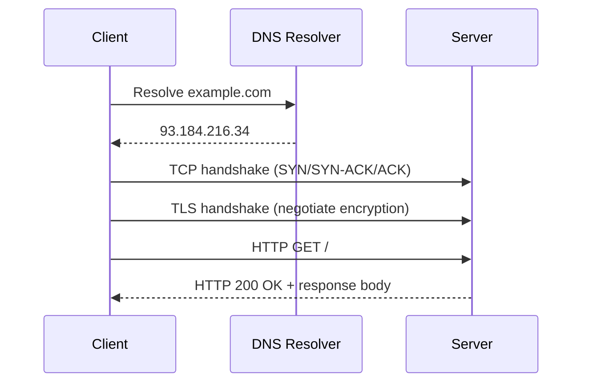

# Application Protocols — Overview

## Overview

Application protocols define the actual *content and semantics* of messages exchanged over a network
connection — as opposed to the [transport/network layers](../computer-networks/intro.md), which only
guarantee that bytes arrive (or don't). This section covers the protocols that make up most of what
"the Internet" means in practice: naming machines (DNS), requesting resources (HTTP/HTTPS), and
securing that traffic (TLS).

## Core Concepts

| Protocol | Purpose | Runs over |
|---|---|---|
| **DNS** (Domain Name System) | Translates human-readable names (`example.com`) into IP addresses. | UDP (mostly), TCP for larger responses |
| **HTTP / HTTPS** | Request/response protocol for fetching resources (web pages, APIs); HTTPS is HTTP over TLS. | TCP (HTTP/1.1, 2) or UDP-based QUIC (HTTP/3) |
| **TLS** (Transport Layer Security) | Encrypts and authenticates a connection between client and server. | TCP (or QUIC for HTTP/3) |

## Architecture / Mechanism

This is what happens, layer by layer, before a browser renders a single byte of a web page — a name
lookup, a transport connection, a security handshake, and only then the actual application-level
request.

## In This Section

- **[DNS](./dns.md)** — the resolution chain from stub resolver to authoritative server, record
  types, caching/TTL, and reading real `dig` output.
- **[HTTP & HTTPS](./http-and-https.md)** — request/response structure, statelessness and cookies,
  and HTTP/1.1 vs. HTTP/2 vs. HTTP/3.
- **[TLS & Encryption Basics](./tls-and-encryption-basics.md)** — confidentiality, integrity, and
  authentication, the TLS 1.3 handshake, and certificates/chain of trust.

## Why It Matters

- **[Computer Networks](../computer-networks/intro.md)**, and specifically
  **[Transport Layer: TCP & UDP](../computer-networks/transport-layer-tcp-udp.md)**, provide the
  transport these protocols run over — a "slow API" might be a DNS, TCP, or TLS problem before it's
  an application problem at all.
- **[Databases](../databases/intro.md)**: most databases expose their own wire protocols, built using
  the same request/response and connection-security principles as HTTP/TLS.

## Related Pages

- [Computer Networks](../computer-networks/intro.md)
- [Transport Layer: TCP & UDP](../computer-networks/transport-layer-tcp-udp.md)
- [Databases](../databases/intro.md)
