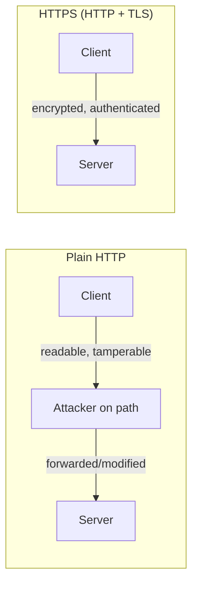
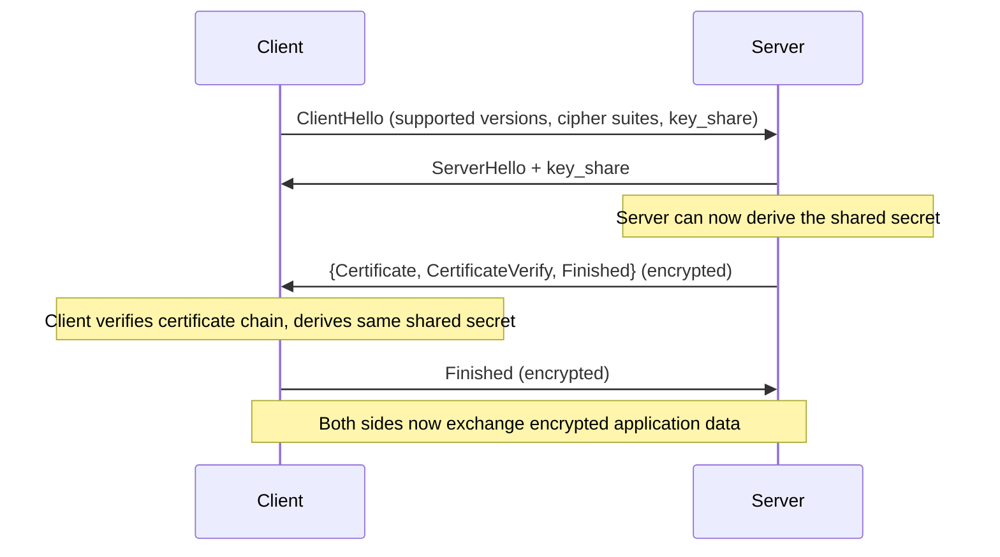
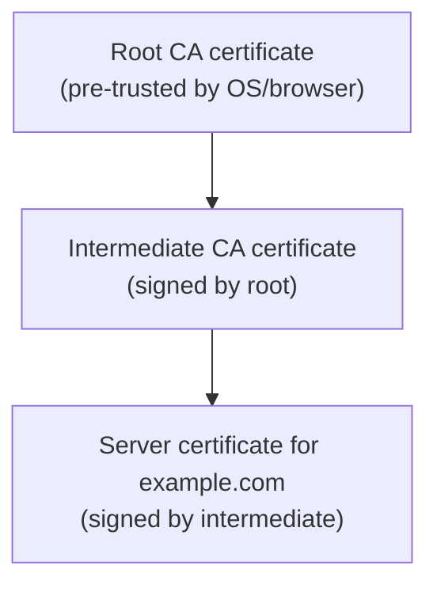

# TLS and Encryption Basics

## Overview

**TLS (Transport Layer Security)** is what turns HTTP into HTTPS — and secures plenty of other
protocols besides (SMTP, database connections, and more). It runs on top of a reliable transport
(usually TCP, or QUIC for HTTP/3) and gives the two endpoints of a connection three distinct
guarantees that plain, unencrypted traffic has none of.

## Core Concepts

| Term | Meaning |
|---|---|
| **Confidentiality** | Only the intended recipient can read the data — achieved via encryption. |
| **Integrity** | Any tampering with data in transit is detectable — achieved via authenticated encryption/MACs. |
| **Authentication** | The client can verify it's actually talking to the server it intended to (not an impostor) — achieved via certificates. |
| **Certificate** | A signed document binding a public key to an identity (e.g., a domain name), issued by a CA. |
| **Certificate Authority (CA)** | A trusted organization that verifies identity and signs certificates. |
| **Chain of trust** | The sequence of signatures from a server's certificate up to a root CA that the client already trusts. |

## Architecture / Mechanism

### What TLS Provides, Conceptually



TLS doesn't change *what* HTTP says — it wraps the entire exchange (including headers, method, path,
and cookies) in an encrypted, tamper-evident channel between exactly the two parties who negotiated it.

### The TLS 1.3 Handshake (High Level)

TLS 1.3 significantly simplified the handshake compared to TLS 1.2, cutting it from two round trips
down to one (with an optional 0-RTT resumption mode for repeat connections to the same server):



The client sends its Diffie-Hellman key share *speculatively* in the very first message (guessing a
commonly-supported group like X25519), which is what lets the server respond with everything needed
to finish the handshake in a single round trip — a deliberate design change from TLS 1.2, where the
client had to wait for the server to choose a cipher suite before sending its own key material.

### Certificates and the Chain of Trust



Your OS/browser ships with a built-in list of trusted **root CAs**. A server presents its own
certificate plus any intermediate certificates needed to chain back up to one of those trusted
roots. If every signature in the chain checks out, and the certificate's domain name matches the one
being requested, the client trusts it — without ever having communicated with the CA directly during
the handshake itself.

## Practical Usage

Inspecting a server's certificate chain from the command line:

```bash
$ openssl s_client -connect example.com:443 -servername example.com </dev/null 2>/dev/null | openssl x509 -noout -subject -issuer -dates
subject=CN = example.com
issuer=C = US, O = DigiCert Inc, CN = DigiCert Global G2 TLS RSA SHA256 2020 CA1
notBefore=Jan 15 00:00:00 2025 GMT
notAfter=Feb 15 23:59:59 2026 GMT
```

`curl -v` also reports the negotiated TLS version and cipher, and will fail outright with a
certificate error if the chain doesn't validate:

```bash
$ curl -v https://example.com/ -o /dev/null 2>&1 | grep -i 'SSL connection\|subject:'
* SSL connection using TLSv1.3 / TLS_AES_128_GCM_SHA256
*  subject: CN=example.com
```

## Edge Cases & Pitfalls

:::danger Mixed content quietly breaks HTTPS's guarantees
A page served over HTTPS that loads even one resource (a script, an image, a stylesheet) over plain
HTTP reopens the door to man-in-the-middle tampering — an attacker can modify that one HTTP resource
to attack the otherwise-secure page. Modern browsers block "active" mixed content (scripts, iframes)
by default, but "passive" mixed content (images) may still load with only a warning.
:::

- A valid certificate proves the server controls the domain named in the certificate — it says
  nothing about whether that server/domain is trustworthy or legitimate otherwise (phishing sites
  routinely have perfectly valid HTTPS certificates for their own look-alike domains).
- Certificate expiry is a genuinely common outage cause — an expired certificate fails validation
  even if every other part of the server is working correctly.
- TLS session resumption and 0-RTT data trade a small amount of replay-attack risk for latency —
  appropriate for idempotent requests, riskier for anything with side effects.
- HTTPS-everywhere isn't just about hiding content from eavesdroppers: without it, any on-path
  network (coffee shop Wi-Fi, a compromised router, an ISP) can inject or alter content, not just
  read it.

## Comparisons

| Aspect | Plain HTTP | HTTPS (HTTP + TLS) |
|---|---|---|
| Confidentiality | None — readable by anyone on path | Encrypted |
| Integrity | None — modifiable in transit | Tamper-evident |
| Server authentication | None | Verified via certificate chain |
| Handshake round trips added | 0 | 1 (TLS 1.3), 2 (TLS 1.2), or 0 for TLS 1.3 resumption |

## References

- IETF, [RFC 8446](https://www.rfc-editor.org/rfc/rfc8446.html) — *The Transport Layer Security
  (TLS) Protocol Version 1.3*.
- IETF, [RFC 5280](https://www.rfc-editor.org/rfc/rfc5280.html) — *Internet X.509 Public Key
  Infrastructure Certificate and CRL Profile* (the certificate format TLS relies on).

### Books & Videos

- Ilya Grigorik, [*High Performance Browser Networking*](https://hpbn.co/) (free online) — has a
  dedicated TLS chapter covering the handshake and its performance implications.
- Kurose & Ross, *Computer Networking: A Top-Down Approach* — security chapter covers the
  cryptographic building blocks TLS is built from.
- Cloudflare's engineering blog has well-regarded, technically accurate articles explaining TLS
  handshake internals and certificate validation.

## Related Pages

- [Application Protocols — Overview](./intro.md)
- [HTTP & HTTPS](./http-and-https.md)
- [Transport Layer: TCP & UDP](../computer-networks/transport-layer-tcp-udp.md)
