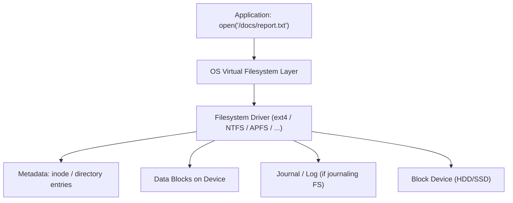

# Filesystems Basics

## Overview

A raw storage device — HDD or SSD — just exposes a flat array of addressable blocks; it has no
concept of "files" or "directories" at all. A **filesystem** is the layer of data structures and
software (usually inside the OS kernel) that maps human-meaningful files and directories onto that
flat block address space, tracks which blocks are free, and tries to keep everything consistent even
when the power cuts out mid-write.

## Core Concepts

| Term | Meaning |
|---|---|
| **Block** | The smallest unit of storage the filesystem allocates (e.g., 4 KB), independent of the underlying device's own page/sector size. |
| **Inode** | A metadata structure holding a file's attributes (size, permissions, timestamps) and pointers to its data blocks — used by ext4-style filesystems. |
| **Directory entry** | A mapping from a filename to an inode (or, in FAT-style filesystems, directly to a starting cluster). |
| **Journal** | A dedicated log area where a filesystem records pending metadata changes before applying them, to survive crashes. |
| **Copy-on-write (CoW)** | A design where changed data is written to a *new* location and the filesystem atomically swaps a pointer, instead of modifying data in place. |

## Architecture / Mechanism

### Inode-based vs. FAT-style

**Inode-based filesystems** (ext2/3/4, XFS, and conceptually similar designs in most Unix-derived
systems) separate a file's identity from its name: an inode holds all metadata and block pointers, and
one or more directory entries can point to the same inode (hard links). Looking up a path means
walking directory entries down to an inode, then following that inode's block pointers to the data.

**FAT-style filesystems** (FAT12/16/32, and its descendants) instead chain a file's data blocks
("clusters") together directly via a File Allocation Table, with each directory entry pointing at the
starting cluster. This is simpler and has less metadata overhead, which is why FAT variants remain
common on USB drives, SD cards, and boot/EFI partitions, but it lacks features like hard links, and
older variants have significant limitations (filename length, max file/volume size).

### Journaling and crash consistency

Updating a file often requires several separate metadata writes (allocate a block, update the inode,
update a directory entry). If the system crashes partway through, an unprotected filesystem can be
left with inconsistent metadata — e.g., a block marked both free and in-use. A **journaling
filesystem** (ext3/ext4, NTFS, XFS) writes a short description of the intended changes to a journal
first; on reboot after a crash, the filesystem replays or discards incomplete journal entries to get
back to a consistent state without a full filesystem scan.

:::info Copy-on-write: a different answer to the same problem
**ZFS** and **Btrfs** take a different approach: instead of modifying data/metadata in place and
logging the intent, they write changes to new blocks and only then atomically update a pointer (like a
tree root) to make the new version visible. This means the filesystem is never caught "mid-update" in
a way that leaves old data corrupted — the old version simply stays valid until the pointer switch —
and it enables cheap snapshots, since an old root pointer can be kept around to preserve a prior state.
:::

## Practical Usage

- Choosing a filesystem is a trade-off, not a default: ext4 is a solid general-purpose journaling
  filesystem on Linux; Btrfs/ZFS add snapshots, checksumming, and built-in RAID-like redundancy at the
  cost of more complexity and (for ZFS) higher memory usage.
- Databases often bypass some filesystem overhead intentionally (raw block devices, `O_DIRECT`) when
  they implement their own durability/caching logic — see [Databases](../databases/intro.md) — but
  most applications rely entirely on the filesystem's own crash-consistency guarantees.
- On flash storage, filesystem behavior interacts directly with the drive's FTL: filesystems that
  issue **TRIM**/`fstrim` and avoid unnecessary metadata rewrites reduce write amplification — see
  [SSDs & NAND Flash](./ssd-and-nand-flash.md).

## Edge Cases & Pitfalls

:::warning Journaling protects metadata, not always data
Many journaling filesystems default to journaling *metadata only* (not file contents) for
performance reasons. That means after a crash, the filesystem structure will be consistent, but the
*contents* of a file being written at crash time may still be incomplete or stale — applications that
need stronger guarantees must use explicit `fsync`/`fdatasync` and understand their filesystem's
journaling mode.
:::

:::danger Silent data corruption without checksumming
Traditional filesystems (ext4, NTFS) don't checksum file data by default, so a "bit rot" event on the
storage medium can go undetected until the corrupted data is read and causes a visible problem.
Checksumming filesystems (ZFS, Btrfs) detect this at read time and, with redundancy configured, can
repair it automatically.
:::

- FAT-style filesystems have real limits (e.g., legacy FAT32's 4 GB single-file size cap) that
  surprise users copying large files to USB drives formatted with older FAT variants.
- Full or near-full CoW filesystems can see write performance degrade as free-space fragmentation
  increases, since there's less contiguous free space to write new versions of data into.

## Comparisons

| Filesystem style | Examples | Crash consistency approach | Notable feature |
|---|---|---|---|
| FAT-style | FAT32, exFAT | Minimal / none built-in | Simplicity, broad compatibility |
| Inode-based, journaling | ext4, NTFS, XFS | Journal replay on mount | Mature, widely supported |
| Copy-on-write | ZFS, Btrfs | Atomic pointer swap (no journal replay needed) | Cheap snapshots, checksumming |

## References

- Remzi H. Arpaci-Dusseau & Andrea C. Arpaci-Dusseau, [*Operating Systems: Three Easy Pieces*](https://pages.cs.wisc.edu/~remzi/OSTEP/) — freely available chapters on file systems, journaling, and log-structured/CoW designs.
- SNIA, [Educational Library](https://www.snia.org/educational-library) — filesystem and storage-management tutorials.

### Books & Videos

- Remzi H. Arpaci-Dusseau & Andrea C. Arpaci-Dusseau, *Operating Systems: Three Easy Pieces* — the file-system chapters (FFS, FAT, journaling, and log-structured filesystems) are freely available online and cover this material in depth.

## Related Pages

- [SSDs & NAND Flash](./ssd-and-nand-flash.md)
- [Storage: HDD, SSD & NVMe — Overview](./intro.md)
- [Operating Systems](../operating-systems/intro.md)
- [Databases](../databases/intro.md)
