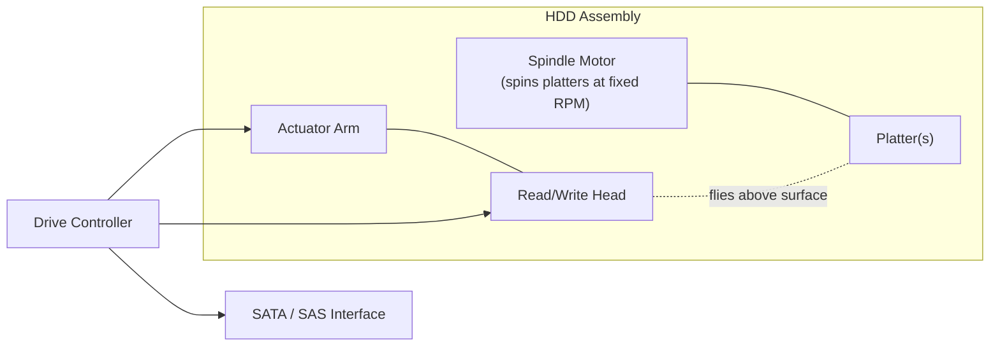

# Hard Disk Drives (HDDs)

## Overview

A **hard disk drive** stores data as magnetized regions on spinning platters, read and written by a
head that flies just above the surface on a moving actuator arm. Every part of that description is
mechanical, and mechanical motion is slow compared to electronics — which is why an HDD's performance
story is really a story about physics: how far the head has to travel, and how fast the platter spins
underneath it.

## Core Concepts

| Term | Meaning |
|---|---|
| **Platter** | A rigid, magnetically coated disk that stores data in concentric circular **tracks**; drives stack multiple platters on one spindle. |
| **Read/write head** | A tiny electromagnet, one per platter surface, that reads or writes the magnetic domains as the platter spins beneath it. |
| **Actuator arm** | The arm that moves all heads together, radially, to position them over a target track. |
| **Seek time** | Time for the actuator arm to move the head to the correct track. |
| **Rotational latency** | Time spent waiting for the platter to spin the target sector under the head. |
| **Transfer time** | Time to actually read/write the data once the head is positioned over it. |
| **RPM (Revolutions Per Minute)** | Platter spin speed — directly determines average rotational latency. |

## Architecture / Mechanism



A single I/O request has to pay for three sequential delays before any bytes move:

```text
Total access time = Seek time + Rotational latency + Transfer time
                     (move arm)   (wait for spin)      (read bits)
```

- **Seek time** depends on how far the current track is from the target track — a few hundred
  microseconds for an adjacent track, several milliseconds for a full sweep across the platter.
- **Rotational latency** is bounded by RPM: on average the head waits for *half* a revolution.
  A higher RPM directly shrinks this wait.
- **Transfer time** is comparatively small and roughly proportional to how much data is read once
  the head is in position.

| RPM | Time per revolution | Average rotational latency (½ revolution) |
|---|---|---|
| 5,400 | ~11.1 ms | ~5.6 ms |
| 7,200 | ~8.3 ms | ~4.2 ms |
| 10,000 | ~6.0 ms | ~3.0 ms |
| 15,000 | ~4.0 ms | ~2.0 ms |

:::info Why sequential I/O is fast and random I/O is slow
If consecutive reads are on the same or an adjacent track, seek time drops to nearly zero and
rotational latency is paid once for a large run of data — this is **sequential I/O**, and it's close
to the drive's raw media bandwidth. **Random I/O** pays a full seek and rotational-latency penalty
*per request*, since each request may land on a completely different track. This is why HDDs are
excellent for large sequential transfers (backups, video, streaming writes) but poor for random-access
workloads like OLTP database indexes or swap files.
:::

## Practical Usage

- Sequential-friendly workloads (archival storage, media streaming, write-ahead log files, backups)
  are a good fit for HDDs — they get near-peak throughput at a much lower cost per GB than flash.
- Storage engines that expect to run on HDDs are designed around this constraint: **log-structured
  merge (LSM) trees** batch random writes into large sequential ones, and traditional **B-trees**
  try to keep related pages physically close together to minimize seeks — see
  [Databases](../databases/intro.md).
- Enterprise/server drives (10,000-15,000 RPM, often SAS) trade capacity and cost for lower latency;
  desktop and archival drives (5,400-7,200 RPM, SATA) trade latency for capacity and cost per GB.

## Edge Cases & Pitfalls

:::warning Fragmentation compounds seek cost
When a filesystem scatters a single file's blocks across non-adjacent tracks (fragmentation), what
should be one sequential read becomes many small seeks. This is a much bigger deal on HDDs than on
SSDs, which is why HDD-oriented filesystems and defragmentation tools exist at all.
:::

:::danger Mechanical wear is not optional
Every HDD eventually fails mechanically — bearing wear, head crashes, or motor failure — regardless of
how carefully it's used. Unlike flash wear (which scales with writes), HDD mechanical failure is
largely time- and usage-independent in onset, so backups/RAID redundancy matter even for "lightly
used" drives.
:::

- Queuing many small random requests can *help* on HDDs if the drive/controller reorders them by
  physical position (native command queuing), but this optimization has limits and never approaches
  SSD random-I/O performance.
- RPM alone doesn't determine overall speed: a 7,200 RPM drive with a large cache and short seek
  times can beat a poorly designed 10,000 RPM drive on real workloads.

## Comparisons

| Access pattern | Seek time paid? | Rotational latency paid? | Relative throughput |
|---|---|---|---|
| Large sequential read/write | Once per contiguous run | Once per contiguous run | Near maximum media bandwidth |
| Small random read/write | Per request | Per request | Orders of magnitude slower |

## References

- SNIA (Storage Networking Industry Association), [Educational Library](https://www.snia.org/educational-library) — vendor-neutral storage technology tutorials, including HDD fundamentals.
- Alex Petrov, *Database Internals* (O'Reilly, 2019), Chapter 2 "B-Tree Basics" — covers HDD vs. SSD characteristics from a storage-engine design perspective.

### Books & Videos

- Alex Petrov, *Database Internals: A Deep Dive into How Distributed Data Systems Work* (O'Reilly, 2019) — the "Hard Disk Drives" and "Solid State Drives" sections of Chapter 2 explain why disk-based structures are shaped the way they are.

## Related Pages

- [Storage: HDD, SSD & NVMe — Overview](./intro.md)
- [SSDs & NAND Flash](./ssd-and-nand-flash.md)
- [Memory Hierarchy & RAM](../memory-hierarchy/intro.md)
- [Databases](../databases/intro.md)
