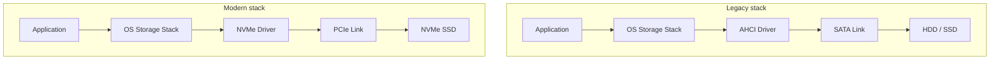

# NVMe & Storage Interfaces

## Overview

The physical storage medium (platters, NAND cells) is only half the story — data still has to travel
between the drive and the CPU over some standardized **interface**. That interface stack evolved
through several generations, each designed around the assumptions of the dominant storage technology
of its era. The mismatch between an interface designed for spinning disks and the realities of flash
is exactly what NVMe was created to fix.

## Core Concepts

| Term | Meaning |
|---|---|
| **PATA/IDE** | Early parallel-cable disk interface; long superseded, mentioned here only for historical context. |
| **SATA (Serial ATA)** | Serial interface that replaced PATA; the physical link most commonly paired with the AHCI protocol. |
| **AHCI (Advanced Host Controller Interface)** | The command protocol used over SATA — designed around HDD access patterns, with a single command queue. |
| **NVMe (Non-Volatile Memory Express)** | A command protocol designed from scratch for flash, using many parallel deep queues over a PCIe link. |
| **PCIe (PCI Express)** | The high-speed general-purpose expansion bus that NVMe drives attach to directly, bypassing the SATA/AHCI stack entirely. |
| **M.2** | A physical connector/form-factor for small expansion cards — *not* a protocol. It can carry either SATA or NVMe (PCIe) signaling. |

## Architecture / Mechanism



### Evolution

```text
PATA/IDE  →  SATA + AHCI  →  NVMe over PCIe
(parallel,     (serial link,    (direct PCIe attach,
 HDD era)       still HDD-       many queues,
                oriented           purpose-built for flash)
                protocol)
```

AHCI was standardized in the mid-2000s when hard disks dominated, and it shows: it exposes **one
command queue** with a maximum of 32 outstanding commands, tuned for a world where a single mechanical
head could only service one request at a time anyway. That's a fine match for HDD latency, but flash
can service many requests in parallel across its internal channels/dies. AHCI's single queue and its
relatively high per-command software overhead (extra register reads, single interrupt path) becomes
the bottleneck once the storage medium itself is fast enough.

**NVMe** was designed around that flash reality: it supports up to 65,535 I/O queues, each with up to
65,535 outstanding commands, and attaches directly over **PCIe** rather than going through a legacy
SATA host controller. Each CPU core can own its own queue pair, avoiding lock contention, and the
command format itself is leaner (fewer round trips per operation) than AHCI's.

| Aspect | AHCI (over SATA) | NVMe (over PCIe) |
|---|---|---|
| Command queues | 1 | Up to 65,535 |
| Max outstanding commands | 32 (per queue) | Up to 65,535 per queue |
| Designed for | Rotating magnetic media | Flash / non-volatile memory |
| Typical link | SATA (~6 Gb/s) | PCIe lanes (multiple GB/s, scales with lane count/generation) |

:::info M.2 is a connector, not a protocol
"M.2 SSD" tells you the physical card shape and connector — it says nothing about whether the drive
speaks SATA or NVMe. An M.2 slot can carry SATA signaling, PCIe/NVMe signaling, or both depending on
motherboard wiring; two visually identical M.2 drives can have very different performance because one
uses the SATA/AHCI protocol and the other uses NVMe over PCIe. Always check the drive's *protocol*
(SATA vs. NVMe), not just its form factor, when comparing specs.
:::

## Practical Usage

- When shopping for or provisioning storage, check both the **form factor** (2.5" SATA, M.2, U.2/U.3,
  add-in PCIe card) and the **protocol** (SATA/AHCI vs. NVMe) — they're independent axes.
- Server/enterprise systems increasingly expose NVMe over network fabrics too (NVMe-oF, e.g. over
  RDMA or TCP), extending NVMe's low-overhead, many-queue model beyond a single machine — relevant
  when designing storage for distributed databases; see [Databases](../databases/intro.md) and
  [Computer Networks](../computer-networks/intro.md).
- OS-level: modern Linux/Windows storage stacks include NVMe-aware I/O paths (e.g., multiqueue block
  layer) specifically to take advantage of NVMe's per-core queues instead of funneling everything
  through one queue as legacy AHCI drivers did.

## Edge Cases & Pitfalls

:::warning "NVMe" and "PCIe Gen X" are separate claims
A drive's PCIe generation (which bounds link bandwidth) and its use of the NVMe protocol are both
worth checking independently — a drive can support NVMe on an older, slower PCIe generation and be
bandwidth-limited well below what a newer-generation NVMe drive achieves, even though both are
"NVMe SSDs."
:::

- Booting from NVMe requires firmware/BIOS UEFI support; some older systems can see an NVMe drive but
  can't boot from it without a UEFI update.
- Putting an NVMe (PCIe) drive in an M.2 slot that's wired only for SATA simply won't work (or the
  drive won't be detected) — always verify motherboard M.2 slot capabilities, not just that the
  connector fits.
- Legacy AHCI's single-queue design isn't just "slower NVMe" — some older RAID/storage-management
  software and drivers assume AHCI semantics and need explicit NVMe-aware updates to fully benefit
  from the new queueing model.

## Comparisons

| Interface/Protocol | Link | Queues | Best suited to |
|---|---|---|---|
| PATA/IDE | Parallel cable | 1 | Historical/legacy only |
| SATA + AHCI | Serial (SATA) | 1 (32 commands) | HDDs, budget SATA SSDs |
| NVMe over PCIe | PCIe lanes | Up to 65,535 | Flash/NVM at any performance tier |

## References

- NVM Express, Inc., [NVM Express Base Specification](https://nvmexpress.org/specifications/) — the official NVMe protocol specification.
- SATA-IO, [NVMe and AHCI: A Comparison](https://sata-io.org/system/files/member-downloads/NVMe%20and%20AHCI_%20_long_.pdf) — direct technical comparison of queue models and command overhead.
- SNIA, [Educational Library](https://www.snia.org/educational-library) — vendor-neutral tutorials on storage interfaces.

### Books & Videos

- Alex Petrov, *Database Internals* (O'Reilly, 2019) — storage-medium chapters provide context for why databases care about the interface's queueing and latency model.

## Related Pages

- [SSDs & NAND Flash](./ssd-and-nand-flash.md)
- [Hard Disk Drives](./hard-disk-drives.md)
- [Buses & I/O](../buses-and-io/intro.md)
- [Storage: HDD, SSD & NVMe — Overview](./intro.md)
