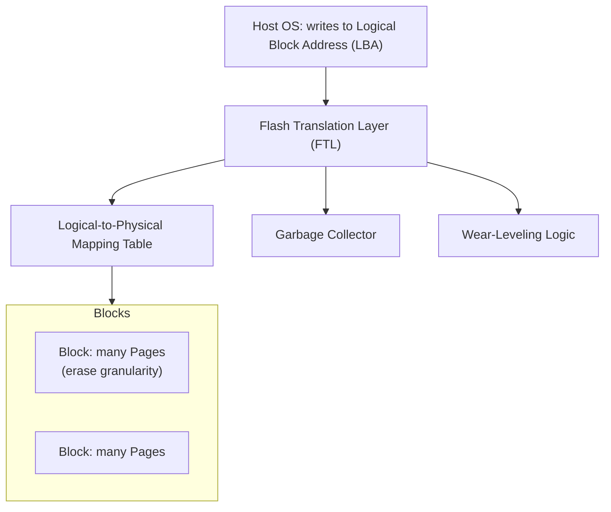

# SSDs & NAND Flash

## Overview

A **solid-state drive** has no moving parts — it stores bits as trapped electrical charge in NAND
flash memory cells. That solves the mechanical latency problem of HDDs, but flash comes with its own
quirks: it can't be overwritten in place, cells wear out after a limited number of write/erase cycles,
and the drive has to run a substantial amount of internal software just to look like an ordinary
block device. Understanding that hidden layer — the **flash translation layer** — explains almost
every SSD performance and endurance behavior you'll observe in practice.

## Core Concepts

| Term | Meaning |
|---|---|
| **NAND cell** | A floating-gate (or charge-trap) transistor that stores data as a trapped charge level, read back as a voltage. |
| **Page** | The smallest unit that can be *read* or *written* on a flash chip (typically a few KB). |
| **Block** | A group of pages (typically hundreds); the smallest unit that can be *erased*. |
| **FTL (Flash Translation Layer)** | Firmware inside the SSD that maps logical block addresses (what the OS sees) to physical flash pages, and handles erase/wear/garbage-collection housekeeping. |
| **Wear leveling** | FTL strategy that spreads writes evenly across all blocks so no single block wears out (from erase cycles) far ahead of the others. |
| **TRIM** | A command the OS sends to tell the SSD which logical blocks no longer hold live data, so the FTL can reclaim them during garbage collection instead of treating them as live. |
| **Write amplification** | The ratio of data physically written to flash vs. data the host actually asked to write; always ≥ 1 due to erase-before-write and garbage collection. |

## Architecture / Mechanism

### Why SSDs can't overwrite in place

A NAND page can be written directly only while it's in its erased (all-1s) state; flipping bits back
requires erasing first, and erase only operates on a whole **block** (hundreds of pages) at once. So a
single logical "overwrite" of one page actually means: find/allocate a free page elsewhere, write the
new data there, mark the old page as stale, and update the mapping table. Reclaiming stale pages later
requires **garbage collection**: copy any still-live pages out of a block, then erase the entire block
so it can be reused. This copy-then-erase cycle is the root cause of write amplification.

### NAND cell types

| Type | Bits per cell | Relative speed | Relative endurance | Relative cost/density |
|---|---|---|---|---|
| **SLC** (Single-Level Cell) | 1 | Fastest | Highest endurance | Most expensive per GB, lowest density |
| **MLC** (Multi-Level Cell) | 2 | Fast | High | Moderate |
| **TLC** (Triple-Level Cell) | 3 | Moderate | Moderate | Common in consumer SSDs today |
| **QLC** (Quad-Level Cell) | 4 | Slowest | Lowest endurance | Cheapest per GB, highest density |

Packing more bits per cell means distinguishing more voltage levels per read, which is slower and more
error-prone — hence the speed/endurance trade-off against density/cost as you go from SLC toward QLC.

:::info The SLC cache trick
Many TLC/QLC consumer SSDs dedicate a portion of flash to run in fast SLC mode as a write cache,
absorbing bursts of incoming writes at high speed and flushing them to native TLC/QLC in the
background. This is why a **sustained** random or large sequential write can be dramatically slower
than the drive's advertised burst speed: once the SLC cache fills up, writes fall back to the slower
native mode, and remaining background flush activity competes for the same flash for I/O with the
host.
:::

## Practical Usage

- **TRIM** matters most on filesystems/OSes that support it (`fstrim` on Linux, automatic on modern
  Windows/macOS). Without TRIM, the FTL doesn't know which pages are actually free, forcing more
  garbage collection and higher write amplification, especially as the drive fills up.
- Leaving **spare/unallocated capacity** (over-provisioning) on an SSD gives the FTL more free blocks
  to juggle during garbage collection, reducing write amplification — this is why enterprise SSDs
  often expose less usable capacity than their raw flash size.
- Random-write-heavy workloads (databases, VM images) benefit from drives with more over-provisioning
  and higher-endurance cell types (MLC or enterprise TLC); read-mostly or archival workloads are fine
  on cheaper QLC.

## Edge Cases & Pitfalls

:::warning Endurance is finite and workload-dependent
Every flash block tolerates a limited number of program/erase cycles before it becomes unreliable.
Write-heavy workloads (logging, caching layers, databases without care for write amplification) burn
through that budget faster — this is why SSDs specify endurance in **TBW** (terabytes written) or
**DWPD** (drive writes per day), not just capacity.
:::

:::danger Power loss during a write can corrupt in-flight data
Because a logical write may touch the mapping table, a new physical page, and pending garbage
collection simultaneously, sudden power loss mid-operation can leave the FTL's metadata inconsistent.
Enterprise SSDs mitigate this with power-loss-protection capacitors; consumer SSDs typically do not
guarantee it, which matters for databases relying on `fsync` durability guarantees.
:::

- Full drives with heavy write activity see the largest performance drop, because the FTL has fewer
  free blocks to work with — keeping some headroom free noticeably helps sustained write performance.
- Write amplification isn't just an SSD-internal concern: filesystem and database choices (e.g., small
  random overwrites vs. append-only/log-structured designs) change how much amplification the *host*
  induces on top of what the FTL already does.

## Comparisons

| Aspect | SLC | MLC | TLC | QLC |
|---|---|---|---|---|
| Bits/cell | 1 | 2 | 3 | 4 |
| Speed | Highest | High | Moderate | Lowest |
| Endurance | Highest | High | Moderate | Lowest |
| Cost per GB | Highest | Moderate-high | Moderate | Lowest |
| Typical use | Caches, enterprise write-intensive | Enterprise/prosumer | Mainstream consumer | Cheap, high-capacity/archival |

## References

- Alex Petrov, *Database Internals* (O'Reilly, 2019), Chapter 2 "B-Tree Basics" — "Solid State Drives" section on pages/blocks and erase behavior.
- SNIA, [Educational Library](https://www.snia.org/educational-library) — solid-state storage tutorials and white papers.

### Books & Videos

- Alex Petrov, *Database Internals: A Deep Dive into How Distributed Data Systems Work* (O'Reilly, 2019) — explains why database storage engines are designed around flash's erase-before-write constraint.

## Related Pages

- [Hard Disk Drives](./hard-disk-drives.md)
- [NVMe & Storage Interfaces](./nvme-and-storage-interfaces.md)
- [Storage: HDD, SSD & NVMe — Overview](./intro.md)
- [Memory Hierarchy & RAM](../memory-hierarchy/intro.md)
