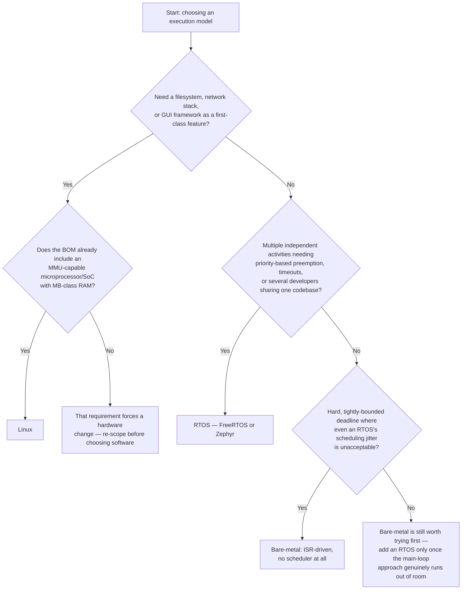

# Bare-Metal, RTOS, or Linux

An engineer coming from application software tends to reach for the environment closest to what they already know — an RTOS, or better yet Linux, because it has threads and a filesystem and feels familiar. That instinct is worth resisting. Every layer of software you add between your code and the hardware costs something real: flash and RAM you don't get back, boot time, a scheduler whose behavior you now have to understand rather than one you wrote yourself, and — for Linux specifically — an MMU-capable microprocessor in the bill of materials at all. The right choice is the cheapest one that actually meets the product's requirements, and picking a heavier environment "to be safe" is itself a common and expensive mistake. This page exists to make that trade-off concrete instead of a matter of taste.

## The three models

**Bare-metal** means your code is the only thing that runs. There's a `main()` function containing a loop (or a hand-rolled state machine), interrupt service routines (ISRs) that the hardware invokes directly, and nothing else — no scheduler unless you write one, no task abstraction, no dynamic loading. It's the cheapest option in memory and the most deterministic, because there's no scheduler decision between your code and the CPU running it. It's also the most work to structure well once a project has more than a couple of concurrent responsibilities, because you're building whatever concurrency model you need by hand.

**An RTOS** (real-time operating system — FreeRTOS and Zephyr are the two this section covers) adds a real preemptive scheduler, tasks with priorities, and synchronization primitives (queues, semaphores, mutexes) — while still fitting comfortably in tens of KB of flash and running on the same microcontroller-class hardware bare-metal does. Critically, an RTOS scheduler is *designed* to be deterministic and bounded: task-switch latency and worst-case scheduling behavior are things you can reason about and often bound, which is exactly what "real-time" means in this context. It costs you flash, a bit of RAM overhead per task, and a new class of concurrency bugs (priority inversion, stack sizing per task) in exchange for not hand-rolling your own scheduling.

**Linux** adds a full operating system: virtual memory, a filesystem, a network stack, a driver ecosystem, and a process model — at the cost of needing an MMU-capable microprocessor or SoC, megabytes rather than kilobytes of RAM, and a boot time in the hundreds of milliseconds to seconds rather than microseconds. Critically, **stock Linux is not a hard real-time operating system by default.** Its default scheduler is built to be fair and throughput-efficient across many general-purpose processes, not to bound worst-case latency for one task — see [Scheduling](../../computer-science/operating-systems/scheduling.md) for how that default scheduler actually makes its decisions.

## Deciding which one fits

## Compared directly

| | Bare-metal | RTOS | Linux |
|---|---|---|---|
| Determinism | Highest — no scheduler between you and the CPU | High — bounded, designed for hard real-time | Low by default — CFS is fair, not bounded (PREEMPT_RT changes this, at a cost) |
| Memory cost | Lowest — no framework overhead | Low — tens of KB flash, small per-task RAM overhead | High — MB-class RAM and flash/storage required |
| Boot time | Microseconds to milliseconds | Milliseconds | Hundreds of milliseconds to seconds |
| Driver availability | None — you write every peripheral driver | Vendor HAL plus whatever the RTOS ecosystem provides | Enormous — the mainline kernel driver ecosystem |
| Typical team size | Works fine solo | Comfortable for a small team once tasks are decomposed | Usually needs someone with real Linux/BSP experience |

## The honest note

Most products reach for more than they need. It's genuinely common to see a project pull in an RTOS to manage two or three activities that a well-structured bare-metal main loop with a couple of timer interrupts would have handled with less code, less RAM, and fewer new bug classes — and just as common to see a project pull in Linux for a UI and a network connection that a Cortex-M part with a small TCP/IP stack and a display driver could have handled at a fraction of the bill-of-materials cost and power draw. The decision flow above is deliberately biased toward the cheaper option at each fork, because the cost of under-provisioning (hit a wall, add the next layer) is almost always smaller than the cost of over-provisioning (carry an OS's complexity, memory footprint, and failure modes for a job that never needed it).

:::warning
Don't assume "runs on Linux" means "meets my deadline." Stock Linux's default scheduler (CFS) is not designed for hard real-time and can defer a ready thread by tens of milliseconds under load — enough to blow a control-loop deadline that a bare-metal or RTOS build would have hit every time. Teams that discover this after their Linux port is otherwise working end up either bolting on the `PREEMPT_RT` patch set or moving the hard-real-time portion back onto a small RTOS or microcontroller running alongside the Linux core — a rewrite, not a patch, and far cheaper to rule out at the design stage than to discover once the port is finished.
:::

## See also

- [Microcontroller, Microprocessor, SoC](./microcontroller-vs-microprocessor-vs-soc.md) — the hardware property (an MMU or not) that decides whether Linux is even on the table.
- [The Embedded Landscape](./the-embedded-landscape.md) — which chip families this decision typically maps onto.
- [How This Section Is Organised](./how-this-section-is-organised.md) — where the RTOS and embedded Linux material actually lives once you've picked a lane.
- [Glossary](./glossary.md) — RTOS, tick, jitter, and WCET, defined precisely.
- [Embedded Systems](../readme.md) — the section index and its four learning paths.

## References

- [FreeRTOS documentation](https://www.freertos.org/Documentation/RTOS_book.html) — the kernel's own documentation and design overview; the primary source for how an RTOS scheduler actually behaves.
- Bootlin — [Embedded Linux training materials](https://bootlin.com/training/embedded-linux/) (CC BY-SA) — freely available slides and labs covering exactly the boot-time and driver-ecosystem trade-offs described above, from a company that does this training professionally.
- [The Linux Kernel documentation](https://docs.kernel.org/) — the kernel's own scheduler documentation, and the entry point for the `PREEMPT_RT` real-time patch set now merged into mainline; the primary source for how far stock Linux is from hard real-time by default.
