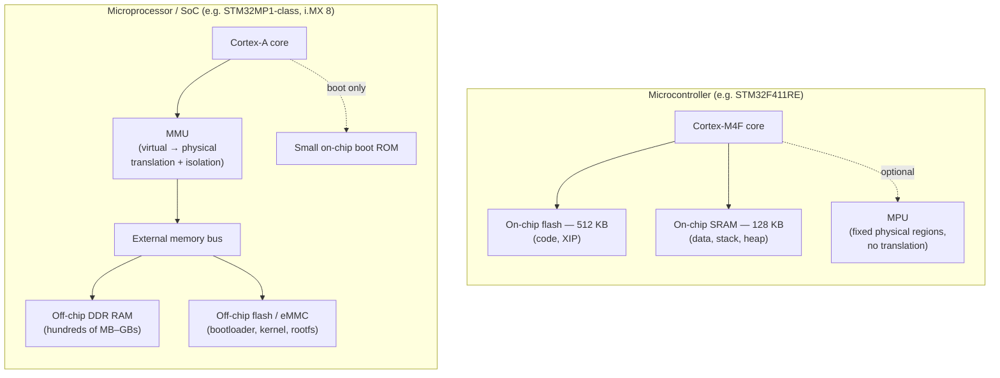

# Microcontroller, Microprocessor, SoC

"It's an ARM chip" tells you almost nothing useful. The question that actually matters — can this thing run Linux, does it need a bootloader partition scheme, will your firmware fit without an external memory chip, is there hardware memory protection between tasks — all comes down to one boundary: where the code and data live relative to the CPU core, and whether there's a hardware unit that translates and protects memory addresses on the way there. That boundary is what separates a **microcontroller** from a **microprocessor**, and it's a hardware property you can check on a datasheet, not a marketing category.

## Microcontroller (MCU)

A microcontroller integrates the CPU core, flash memory for code, and SRAM for data all on the same die. There is no external memory bus you're required to use — the whole system fits in one package. This section's reference board, the NUCLEO-F411RE (STM32F411RE, Arm Cortex-M4F), is a microcontroller: 512 KB of on-chip flash, 128 KB of on-chip SRAM, no memory management unit (MMU). Everything the CPU addresses is either on-chip or a small number of well-defined peripheral registers — there's no concept of virtual memory, no per-process address space, and (on this class of core) at most an optional **memory protection unit (MPU)** that can mark fixed physical regions as read-only or no-execute. That's a genuinely different piece of hardware from an MMU, and the fact that both are abbreviated "MPU" in different corners of the industry is a real source of confusion — more on that below.

## Microprocessor (MPU, in this sense — a microprocessor unit)

A microprocessor, by contrast, is not built to hold your whole program on-chip. It executes code out of external memory — DRAM, typically — reached over a memory bus and controller, and it has an MMU: a hardware unit that translates virtual addresses to physical ones and enforces per-process isolation. That translation layer is what a full OS like Linux is built on: every process believes it owns its own flat address space, and the MMU is what makes that fiction hold up in hardware. See [Virtual Memory and Paging](../../computer-science/memory-hierarchy/virtual-memory-and-paging.md) for how that translation actually works.

:::note[The acronym is genuinely overloaded]
"MPU" means **memory protection unit** on a microcontroller (a small set of fixed physical-address rules, no translation) and **microprocessor unit** as a product category (a chip with external memory and an MMU). Both usages are common in vendor documentation and both show up in this section. The glossary calls this out explicitly — when you see "MPU," check which sense is meant from context, because the two things have almost nothing in common beyond the name.
:::

## SoC — what "system on chip" adds

A **system on chip (SoC)** integrates a microprocessor core (or several, sometimes mixing an applications-class Cortex-A core with a real-time Cortex-M co-processor) together with a GPU, a memory controller, and dozens of peripheral blocks onto one die. Most hardware people casually call "an embedded Linux board" is actually built around an SoC, not a bare microprocessor — the STM32MP1 series, NXP's i.MX 8 family, and the chip inside a Raspberry Pi are all SoCs. "SoC" describes *integration breadth*; it doesn't by itself tell you whether an MMU is present, though in practice almost every Linux-capable SoC has one, because that's the point of putting it there.

## On-chip vs external memory, and where the MMU sits

The microcontroller's flash is *execute-in-place* — the CPU fetches instructions directly from it, no loading step required, which is why a microcontroller can start running code microseconds after reset. The microprocessor/SoC side has to run a boot chain that initializes the external memory controller before it can even fetch the operating system, which is a large part of why its boot time is measured in hundreds of milliseconds to seconds instead.

## The practical consequence: can it run Linux at all?

Linux's memory management assumes an MMU exists — per-process virtual address spaces, demand paging, and copy-on-write `fork()` are all built on top of hardware address translation. (There is a no-MMU configuration, `CONFIG_MMU=n`, historically associated with the `uClinux` project — its no-MMU support merged into mainline Linux in the 2.6 series, so "uClinux" today is a historical label rather than a separate fork. It runs on hardware with no memory-protection hardware at all, MPU or otherwise, and gives up every process-isolation guarantee normal Linux provides. It exists, but it's a legacy, niche path, not a mainstream option.) So the MCU/microprocessor split isn't just a memory-size difference — it's the fork point for the entire "what runs on this thing" decision covered next: running Linux on a microcontroller-class part with no MMU is realistic only in that narrow, isolation-free configuration, while a microprocessor or SoC with an MMU can run bare-metal, an RTOS, *or* full Linux with the process isolation guarantees people normally mean by "Linux," and picking among those becomes an engineering trade-off rather than a hardware limit. See [Bare-Metal, RTOS, or Linux](./bare-metal-vs-rtos-vs-linux.md).

:::warning
Don't assume enabling the Cortex-M's MPU gets you anything like an operating system's memory protection. The MPU only allow/deny-lists a handful of fixed *physical* address ranges (8 or 16 regions on most Cortex-M parts) — it has no concept of a virtual address space, no per-task page tables, and no way to give two tasks each their own private memory that they can't accidentally see or corrupt without you manually carving up and assigning every region yourself. Engineers coming from Linux/desktop work routinely expect MPU-based "protection" to behave like MMU-based process isolation and are surprised, usually after a real bug, that it doesn't.
:::

## See also

- [What "Embedded" Actually Means](./what-embedded-means.md) — the constraint set this hardware distinction sits underneath.
- [The Embedded Landscape](./the-embedded-landscape.md) — where MCUs, microprocessors, and SoCs each show up across the wider families of parts.
- [Bare-Metal, RTOS, or Linux](./bare-metal-vs-rtos-vs-linux.md) — the software decision this page's MMU boundary feeds directly into.
- [Glossary](./glossary.md) — MCU, MPU (both senses), MMU, and SoC defined precisely and side by side.
- [Embedded Systems](../readme.md) — the section index and its four learning paths.

## References

- STMicroelectronics — [STM32 32-bit Arm Cortex MCUs](https://www.st.com/en/microcontrollers-microprocessors/stm32-32-bit-arm-cortex-mcus.html) and [STM32MP1 Series microprocessors](https://www.st.com/en/microprocessors/stm32mp1-series.html) product-line pages — ST's own framing of the MCU/microprocessor split, including which line can run Linux.
- Arm Developer — [Processors](https://developer.arm.com/ip-products/processors) overview, comparing the Cortex-M (microcontroller) and Cortex-A (applications, MMU-equipped) profiles this page's diagram is based on.
- Joseph Yiu, *The Definitive Guide to Arm Cortex-M3 and Cortex-M4 Processors* — the MPU chapter, for the physical-region protection model in full, written by an Arm architect.

