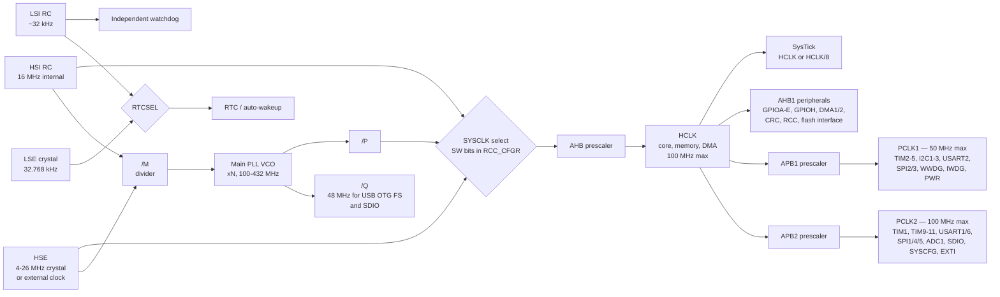

# Clocks and Oscillators

On a desktop machine the clock is somebody else's problem — it was configured by firmware you never see, and by the time your program runs it is a constant. On a microcontroller you *are* that firmware. The chip comes out of reset running on a cheap internal RC oscillator at a fraction of its rated speed, with almost every peripheral's clock switched off, and the first job your code has is to build the clock tree the rest of the system will run on. Nothing you write behaves as intended until that is done.

That makes clocks the first thing firmware configures, and — for exactly the same reason — the first thing to suspect when something is subtly wrong. Every baud rate, every bit time, every timer period, and every ADC sampling window is derived by dividing some clock down. If the clock is not what the code believes it is, none of those numbers are what the code believes either, and the symptom is never "wrong clock". It is a UART producing garbage, an I²C bus that half-works, a PWM at the wrong frequency, a delay loop that runs six times too fast. Learning to reach for the clock configuration early saves an enormous amount of time.

## What the chip wakes up as

RM0383 §6.2.6 states it plainly: "After a system reset, the HSI oscillator is selected as the system clock." On the STM32F411 that is an internal 16 MHz RC oscillator — a sixth of what the part can do — and every peripheral clock is off until you turn it on. So the standard start-up sequence in any bare-metal firmware is: configure flash wait states, start the oscillator you actually want, configure and lock the PLL, switch the system clock over to it, set the bus prescalers, and only then enable the peripherals you need.

## The five clock sources on this part

| Source | What it is | Frequency | Accuracy / notes | Source |
|---|---|---|---|---|
| **HSI** | High-Speed Internal RC oscillator | 16 MHz | `±1%` factory-calibrated at TA = 25 °C. Widens to `−4%/+4%` over TA = −10 to 85 °C, `−8%/+4.5%` over −40 to 105 °C, and `−8%/+5.5%` over −40 to 125 °C. Starts in `2.2 µs` typical | Datasheet Table 39; RM0383 §6.2.2 |
| **HSE** | High-Speed External crystal, resonator, or clock input | 4–26 MHz crystal | Accuracy is the *crystal's*, not the chip's — typically tens of ppm. Starts in about `2 ms` | Datasheet Table 37; RM0383 §6.2.1 |
| **PLL** | Phase-locked loop multiplying HSI or HSE up | Output 24–100 MHz | VCO runs 100–432 MHz; input must land in 0.95–2.10 MHz; locks in `75–300 µs` | Datasheet Table 41; RM0383 §6.2.3 |
| **LSI** | Low-Speed Internal RC oscillator | ~32 kHz | Very loose: `17 kHz` min, `32 kHz` typical, `47 kHz` max. Drives the independent watchdog and can wake the chip from Stop/Standby | Datasheet Table 40; RM0383 §6.2.5 |
| **LSE** | Low-Speed External 32.768 kHz crystal | 32.768 kHz | For the RTC. Startup is slow — about `2 s` typical | Datasheet Table 38; RM0383 §6.2.4 |

The LSI numbers deserve a second look, because they are the most commonly misread in the whole datasheet. A "32 kHz" oscillator specified from 17 to 47 kHz can be off by nearly a factor of three between two parts from the same reel. That is fine for its intended job — a watchdog timeout does not need precision — and completely unusable as a timebase for anything you will report to a user.

## The clock tree

RM0383's Figure 12 draws the whole thing. Simplified to the parts you configure:

Four things in that picture bite people:

- **APB1 tops out at half the speed of APB2.** RM0383 §6.2: "The maximum frequency of the AHB domain is 100 MHz. The maximum allowed frequency of the high-speed APB2 domain is 100 MHz. The maximum allowed frequency of the low-speed APB1 domain is 50 MHz." Get the APB1 prescaler wrong and you have overclocked half your peripherals — including every I²C controller on this part.
- **Timer clocks are not simply the bus clock.** RM0383 §6.2 spells out the doubling rule: with an APB prescaler of 1, the timer clock equals the bus clock; otherwise it is **twice** the APB domain's frequency. Compute a timer reload value from `PCLK1` when the prescaler is not 1 and every period is half what you wanted.
- **SysTick's default source is `HCLK/8`.** "The RCC feeds the external clock of the Cortex System Timer (SysTick) with the AHB clock (HCLK) divided by 8. The SysTick can work either with this clock or with the Cortex clock (HCLK), configurable in the SysTick control and status register" (RM0383 §6.2). A factor-of-eight error in every delay is a memorable first bug.
- **48 MHz for USB comes from a separate PLL output.** USB OTG FS and SDIO are clocked from the PLL's `Q` output, not from `SYSCLK` (RM0383 §6.2.3), so the PLL's `M`, `N`, and `Q` factors have to satisfy both requirements at once. This is the constraint that makes hand-computing PLL factors tedious enough that ST's own clock-configuration tooling exists.

## Accuracy, drift, and what a percent actually costs

An RC oscillator is a resistor and a capacitor: cheap, instant, on-chip, and temperature-dependent. A crystal is a mechanically resonant slice of quartz: expensive, needs two external capacitors and a couple of milliseconds to start, and drifts by tens of parts per million rather than percent. That is roughly a thousandfold difference in stability, and it is the entire reason both exist on the same chip.

Where it matters is asynchronous communication. Put concrete numbers on a UART frame: in 8N1 the receiver finds the start edge, then samples the stop bit about 9.5 bit times later. If the two ends' clocks disagree, the sampling point walks; once the accumulated error reaches half a bit time — roughly `5%` across both ends combined — the frame breaks. Now compare that with the HSI's specification: `±1%` at TA = 25 °C, but `−4%/+4%` across TA = −10 to 85 °C (datasheet Table 39). Those are **ambient** temperatures — Table 39's conditions footnote reads "VDD = 3.3 V, TA = −40 to 125 °C unless otherwise specified" — so a chip working hard inside a warm enclosure sits further along that curve than the room thermometer suggests. A link with an HSI-clocked STM32 at one end has already spent most of its error budget on temperature alone, before the other end has contributed anything.

This is the practical rule that falls out:

- **HSI is fine** for internal timing, PWM, ADC triggering, LED blinking, and SPI or I²C, where the master supplies the clock along with the data and both ends therefore agree by construction.
- **A crystal is effectively mandatory** for UART links that must survive temperature, for USB (which has its own tight tolerance requirement), for anything keeping wall-clock time, and for any protocol where two independently-clocked devices must stay in step over a long frame.
- **LSE (32.768 kHz) is what you use for real time**, because the RTC needs to keep running on battery and needs to still be right in a month. LSI cannot do that job at 17–47 kHz.

:::note[ppm, and why it is the unit crystals are sold in]
Crystal accuracy is quoted in parts per million. The 8 MHz crystal ST recommends for the `X3` footprint on this board is specified at **20 ppm** (UM1724 Rev 17, §7.9.1) — that is 0.002%, about five hundred times tighter than the HSI at room temperature. Twenty ppm is also about 1.7 seconds of drift per day, which is why a wristwatch needs a trimmer and a datalogger needs an RTC that can be corrected.
:::

## PLLs and jitter

A PLL takes a reference, divides it down, multiplies it up in a voltage-controlled oscillator, and feeds the result back to a phase comparator that steers the VCO until the two agree. The useful consequence is that a 16 MHz source can produce a 100 MHz system clock with the reference's *long-term* accuracy preserved — a PLL multiplies frequency, not error, so an HSI-fed PLL is still a 1%-accurate 100 MHz and an HSE-fed PLL is still a 20 ppm one.

What a PLL does add is **jitter**: cycle-to-cycle variation in exactly when each edge arrives. The datasheet quantifies it for this part (Table 41, "Main PLL characteristics"), with the system clock at 100 MHz: cycle-to-cycle jitter of `25 ps` RMS and `±150 ps` peak-to-peak, and period jitter of `15 ps` RMS and `±200 ps` peak-to-peak. Those are tens of picoseconds against a 10 ns clock period — invisible for ordinary digital work, and the reason ST provides a separate audio PLL (`PLLI2S`) for I²S, where jitter turns directly into audible noise.

The PLL also has a **lock time**: `75–200 µs` at a 100 MHz VCO, `100–300 µs` at 432 MHz (Table 41). Firmware must wait for the ready flag rather than assuming, and RM0383 §6.2.3 adds a constraint that catches people: "the main-PLL configuration parameters cannot be changed once PLL is enabled", so you configure it first and only then switch it on.

## Enabling a peripheral's clock is not optional

Every peripheral on an STM32 sits behind a gate in the RCC, and after reset almost all of those gates are shut. This is a power-saving measure — an unclocked block draws essentially no dynamic current — and it produces the single most common first-day bug in STM32 development.

A GPIO port with its clock disabled does not fault. Writes to its registers are discarded and reads come back as zeros. Your code sets `MODER`, sets `ODR`, checks `IDR`, and everything reads back wrong, with no exception, no fault handler, and nothing in the debugger to suggest why. On this part the GPIO ports live on **AHB1** (datasheet, Table 10, "Register boundary addresses"), so the gate is in `RCC_AHB1ENR`.

:::warning[Enable the clock before touching the peripheral, and do it in that order]
Two related mistakes, both of which produce silent wrong behaviour rather than an error:

1. **Configuring a peripheral before enabling its clock.** Everything you write is thrown away. Then you enable the clock and the peripheral comes up with reset defaults, so the symptom is "my configuration code does nothing" — and it does not go away when you re-read the configuration code, because the configuration code is correct.
2. **Writing the enable bit and immediately using the peripheral.** The clock-enable write goes across a bus with its own latency, and the peripheral needs a moment before its registers respond. ST's own HAL headers read the enable register back after writing it for exactly this reason. A read-back of the `RCC` enable register right after the write is the standard, cheap fix.

The habit that avoids both: in every driver's init function, the first statement enables the clock, the second reads the enable register back, and everything else follows.
:::

## Where the clock on your board actually comes from

The Nucleo-64 is more interesting than it looks here, and UM1724 Rev 17, §7.9 "OSC clock" explains why. **The `X3` crystal footprint is empty** — the manual says the on-board HSE crystal is "not provided", and lists the recommended part (8 MHz, 16 pF, 20 ppm) for anyone who wants to fit one. Instead, the HSE input can be fed from the ST-LINK microcontroller's clock output: "MCO output of ST-LINK MCU is used as input clock. This frequency cannot be changed, it is fixed at 8 MHz and connected to PF0/PD0/PH0-OSC_IN of the STM32 microcontroller."

Which of those you get depends on the board revision, and UM1724 §7.9.1 is explicit about it:

- **`MB1136 C-01`** — configured as **HSE not used**.
- **`MB1136 C-02` or higher** — configured to use the **ST-LINK MCO** as clock input.

The revision is on a sticker on the underside of the PCB. The same section pair (§7.9.2, "OSC 32 KHz clock supply") says the 32.768 kHz `X2` crystal is likewise absent on `C-01` and present from `C-02` onward. So "does this board have a crystal" has a per-board answer, and code that assumes HSE is available will hang waiting for `HSERDY` on a board where nothing is connected to `OSC_IN`. This is a real, common first-hour failure with Nucleo boards, and it is documented in exactly one place.

:::tip[The clock security system exists for this]
RM0383 §6.2.7: with the CSS enabled, if the HSE fails, "the system clock switches to the HSI oscillator and the HSE oscillator is disabled", and a non-maskable interrupt fires. That turns a dead crystal from a hang into a degraded-but-running system that can log the fault. It costs one bit to enable and is worth it on any product that ships with an external oscillator — though note the NMI "is executed indefinitely unless the CSS interrupt pending bit is cleared", so the handler must clear `CSSC` in `RCC_CIR`.
:::

## See also

- [How a GPIO Pin Really Behaves](./gpio-electrical-behaviour.md) — the peripheral whose clock gate catches everyone first.
- [Reading a Schematic](./schematics-and-board-basics.md) — the empty `X3` and `X2` crystal footprints, and the solder bridges that route the ST-LINK's clock output.
- [Reading a Datasheet](./reading-a-datasheet.md) — locating the oscillator tables and the RCC chapter in their respective documents.
- [What Hardware to Buy](./what-hardware-to-buy.md) — the board revision question, and where to find the sticker.
- [Embedded Systems](../readme.md) — the section index, including the folders that build on this one.

## References

- STMicroelectronics — [**RM0383**, *STM32F411xC/E reference manual*](https://www.st.com/resource/en/reference_manual/rm0383-stm32f411xce-advanced-armbased-32bit-mcus-stmicroelectronics.pdf), chapter 6 "Reset and clock control (RCC)". Figure 12 is the clock tree this page's diagram simplifies; §6.2.1–§6.2.7 cover each source, the PLL, SYSCLK selection, and the clock security system. Consulted at Rev 4 (May 2025).
- STMicroelectronics — [**STM32F411xC/E datasheet**](https://www.st.com/resource/en/datasheet/stm32f411re.pdf) (DS10314). Table 37 HSE, Table 38 LSE, Table 39 HSI, Table 40 LSI, Table 41 main PLL including jitter and lock time, Table 14 bus frequency limits, Table 10 register boundary addresses. Every frequency and tolerance quoted above. Consulted at **DS10314 Rev 8** (January 2024).
- STMicroelectronics — [**UM1724**, *STM32 Nucleo-64 boards (MB1136)*](https://www.st.com/resource/en/user_manual/um1724-stm32-nucleo64-boards-mb1136-stmicroelectronics.pdf), §7.9 "OSC clock". Consulted at Rev 17 (September 2025). The per-board-revision answer to "does this board have a crystal", and the solder-bridge configurations for each option.
- STMicroelectronics — [**AN2867**, *Guidelines for oscillator design on STM8AF/AL/S and STM32 MCUs/MPUs*](https://www.st.com/resource/en/application_note/an2867-guidelines-for-oscillator-design-on-stm8afals-and-stm32-mcusmpus-stmicroelectronics.pdf). Cited by both the datasheet and UM1724. Read this before choosing a crystal or its load capacitors — the safety-factor calculation it describes is the difference between an oscillator that starts every time and one that starts on most units.
