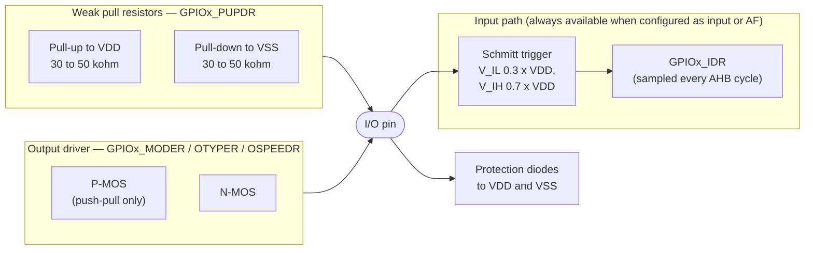
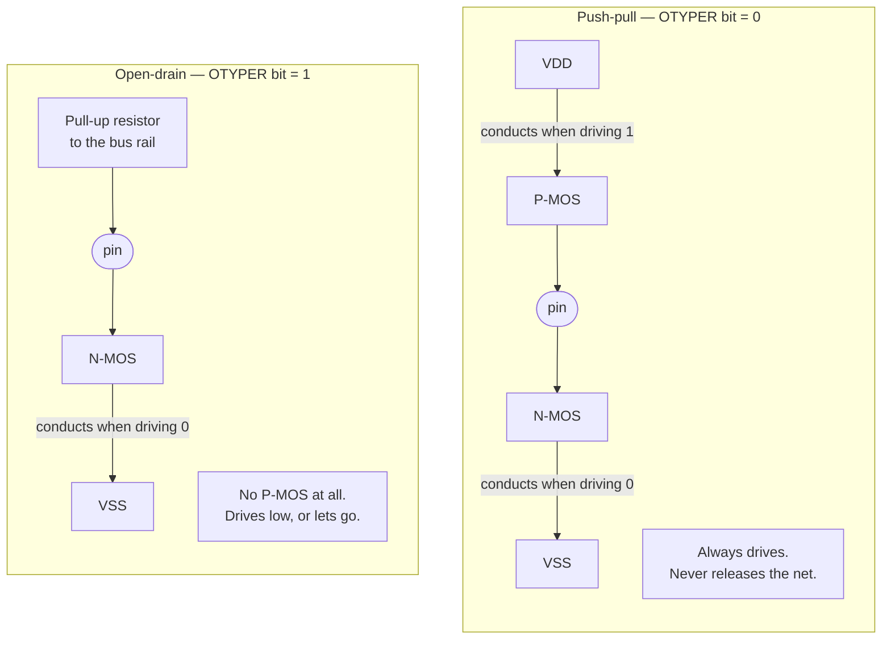
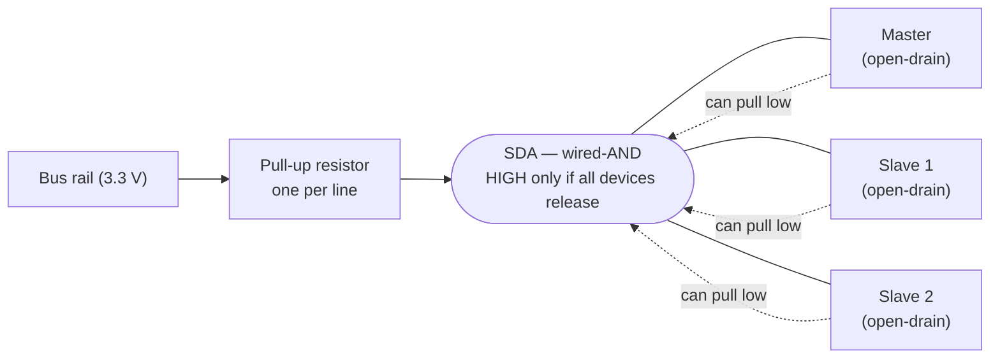

# How a GPIO Pin Really Behaves

`GPIOA->ODR |= (1 << 5);` looks exactly like every other memory write you have ever done, and that resemblance is the problem. On the far side of that register is not a bit of storage but a pair of transistors, wired to a physical pin, with a maximum current, a maximum switching rate, and a real-world net on the other end that may already be being driven by something else. The register model hides all of it, right up until the moment it matters.

What the hardware actually gives you is a *choice of output stage shape*. A GPIO is not simply "on or off" — it is a configurable circuit that can drive both directions, drive one direction and let go in the other, hold itself at a level through a weak resistor, or disconnect entirely. Picking the right shape is what makes an I²C bus work, what stops two devices destroying each other, and what determines whether a sleeping board draws two microamps or two hundred. This page is about those shapes and what they cost.

## What is behind the pin

Every STM32 I/O port bit has the same internal structure: an *input driver* and an *output driver* that can be enabled independently, plus a pair of protection diodes clamping the pin to the supply rails.

Two details from that diagram carry most of the practical weight. The input path is *not* switched off when you configure the pin as an output — you can read `GPIOx_IDR` and see the actual level on the pin, which is how you detect that something else is fighting you. And the pull resistors are controlled by `GPIOx_PUPDR` independently of everything else, so they apply "whatever the I/O direction" (RM0383 §8.3.3).

## Push-pull versus open-drain

`GPIOx_OTYPER` picks one bit per pin, and that bit changes what the output stage physically is (RM0383 §8.3.3, and Table 23, "Port bit configuration table").

**Push-pull** is the default and the right choice for almost everything you drive alone: an LED, a chip-select line, a PWM output. It actively drives both directions, so edges are fast and the level is stiff against noise. RM0383 §8.3.1 describes open-drain as the mode where "only the N-MOS is activated when 0 is output" — which is exactly the difference. In open-drain, driving a `1` does not drive anything; it turns the transistor off and lets the pin float, and something external has to pull it high.

That sounds like a downside. It is the entire point.

| | Push-pull | Open-drain |
|---|---|---|
| Driving `0` | N-MOS on, pin pulled to VSS | N-MOS on, pin pulled to VSS |
| Driving `1` | P-MOS on, pin driven to VDD | Both transistors off — pin released |
| Needs an external pull-up | No | **Yes**, or the line never goes high |
| Rise time | Fast, set by the driver | Slow, set by pull-up resistor × bus capacitance |
| Two devices both driving | **Short circuit** if they disagree | Safe — the `0` wins |
| Sets the high level to | VDD of the driving chip | Whatever the pull-up is tied to |

## Why open-drain is mandatory on I²C

I²C is a two-wire bus with any number of devices on it, and the protocol requires several things that a push-pull driver simply cannot do.

The specification is unambiguous. NXP's **UM10204**, *I²C-bus specification and user manual*, §3.1.1: "Both SDA and SCL are bidirectional lines, connected to a positive supply voltage via a current-source or pull-up resistor… **The output stages of devices connected to the bus must have an open-drain or open-collector to perform the wired-AND function.**" ST's own reference manual uses the same term from the other side, noting that the SMBus alert line "is a wired-AND signal just as the SCL and SDA signals are" (RM0383, chapter 18, SMBus alert mode).

*Wired-AND* is the mechanism. Because every device can only pull down or release, the line's state is the logical AND of every device's intention: it is high only if **every** device has let go, and low if **any single device** pulls it down. That one property is what makes three separate features of I²C possible:

1. **Acknowledge.** After each byte the transmitter releases SDA and the *receiver* pulls it low to acknowledge. Two devices take turns owning the same wire within a single byte time. With push-pull drivers that is a contest, not a handshake.
2. **Clock stretching.** A slave that needs more time holds SCL low while the master is trying to release it high. The master sees the clock is not rising and waits. This requires that the master's "high" be a release, not a drive.
3. **Multi-master arbitration.** UM10204 §3.1: the arbitration "procedure relies on the wired-AND connection of all I2C interfaces to the I2C-bus" — a master that puts out a `1` and reads back a `0` knows another master is talking and steps aside. With push-pull outputs, that condition is a short between two supply rails instead of a signal.

:::note[Rev 7 of the I²C spec renamed "master" and "slave"]
UM10204 Rev 7.0 replaces *master*/*slave* with **controller**/**target** throughout. The electrical requirements are identical, and ST's reference manuals, the Linux kernel, and most tooling still use the older terms — which is why this page does too. If a sentence in the spec reads oddly against what you find elsewhere, that rename is usually why.
:::

Two consequences of the pull-up being the only thing driving the line high:

- **Rise time is an RC curve, not an edge.** UM10204 §7.1 gives the maximum pull-up as `Rp(max) = tr / (0.8473 × Cb)`, where `Cb` is total bus capacitance. Too large a resistor and the line never reaches VIH in time; too small and the devices cannot sink enough current to pull it down — the same section sets the minimum from the specified sink current of `3 mA` for Standard- and Fast-mode. Values in the low kilohms are typical; the spec's own worked example (§7.2.4) computes `Rp(min) = 1.7 kΩ` for a 5 V bus and notes this limits bus capacitance to about `200 pF` to meet a `300 ns` rise time.
- **The STM32's internal pull-ups are too weak for this.** At `30–50 kΩ` (datasheet, Table 53) they are one to two orders of magnitude above what an I²C bus needs. They will make a very short, very slow bus *appear* to work, which is worse than not working. Fit real external resistors.

:::warning[Two push-pull outputs on one net is a short circuit]
If two devices both drive a net push-pull and disagree, one is connecting the net to VDD through a conducting transistor while the other connects it to VSS through a conducting transistor. The only thing limiting the current is the on-resistance of two transistors, and the absolute maximum for a single STM32F411 I/O is `25 mA` sunk or sourced (datasheet, Table 12, "Current characteristics"). A dead short passes far more than that.

The realistic ways to create one:

- Configuring an I²C pin as push-pull instead of open-drain. It may even work with one slave, until the slave acknowledges.
- Wiring two microcontrollers' outputs together to "share a signal".
- Grounding an output pin to "test" it. Driving high into a hard ground is a short.
- Driving an LED without a series resistor. The LED clamps at its forward voltage and the pin supplies whatever current that demands.

None of these produce an error message. You get a pin that reads back the wrong level, a chip that runs warm, and eventually a pin that never works again. When you must connect two outputs, both must be open-drain — that is what open-drain is *for*.
:::

## Drive strength, output speed, and the pins with restrictions

Two different limits are easy to conflate. **Drive strength** is how much current the pin may pass; **output speed** is how fast its edges may be, and on STM32 it is a slew-rate setting, not a frequency limit you must obey.

For the STM32F411 (datasheet §6.3.16, "Output driving current"): the GPIOs "can sink or source up to ±8 mA, and sink or source up to ±20 mA (with a relaxed VOL/VOH) except PC13, PC14 and PC15 which can sink or source up to ±3 mA." At 8 mA the part guarantees `V_OL ≤ 0.4 V` and `V_OH ≥ V_DD − 0.4 V`; at 20 mA those relax to `1.3 V` and `V_DD − 1.3 V` respectively (Table 54). Sitting above all of it is the absolute maximum of `±25 mA` per pin and `120 mA` summed over every I/O (Table 12).

`PC13`, `PC14` and `PC15` deserve their own note, because on the Nucleo the **USER button `B1` is on `PC13`** (UM1724 §6.5). The datasheet's Table 8 note 2 explains why they are special: they "are supplied through the power switch. Since the switch only sinks a limited amount of current (3 mA), the use of GPIOs PC13 to PC15 in output mode is limited: the speed should not exceed 2 MHz with a maximum load of 30 pF. **These I/Os must not be used as a current source (e.g. to drive an LED).**"

`GPIOx_OSPEEDR` then trades edge rate against noise and power. The datasheet's Table 55 ("I/O AC characteristics") gives the maximum output frequency for each setting:

| `OSPEEDRy[1:0]` | Max frequency (CL = 50 pF, VDD ≥ 2.7 V) | Rise/fall time |
|---|---|---|
| `00` | 4 MHz | ≤ 100 ns at CL = 50 pF |
| `01` | 25 MHz | ≤ 10 ns at CL = 50 pF |
| `10` | 50 MHz (CL = 40 pF) | ≤ 6 ns at CL = 40 pF |
| `11` | 100 MHz (CL = 30 pF) | ≤ 4 ns at CL = 30 pF |

The temptation is to set everything to the fastest setting. Resist it: a fast edge into a long wire is a radiated-noise source and a ringing source, and it costs supply current on every transition. Choose the slowest setting that meets your signal's actual requirement.

## Leakage, and why unused pins matter when the board sleeps

A GPIO configured as an input leaks a small current: `±1 µA` maximum for `V_SS ≤ V_IN ≤ V_DD`, rising to `3 µA` for an FT or TC pin held at 5 V (datasheet, Table 53). One microamp is nothing while the chip is running. It stops being nothing when the chip is asleep — the same datasheet gives Stop-mode current for this part as low as `14 µA` typical at 25 °C with the flash in deep power-down and the low-power regulator selected (Table 28, at VDD = 3.6 V). A handful of pins leaking a microamp each is then a measurable fraction of the whole system's sleep budget.

Worse than leakage is a **floating input near the switching threshold**, which leaves both transistors of the input stage partly conducting and can draw far more than the specified leakage. This is the single most common reason a low-power design misses its battery-life target, and the fix is trivial: before sleeping, give every unused pin a defined state — an internal pull-up or pull-down via `GPIOx_PUPDR`, or analog mode, which disconnects the digital input buffer entirely.

Note that the internal pull resistors themselves cost current when they are doing something: a `40 kΩ` pull-up holding a line that something else drags to ground passes about `80 µA` at 3.3 V. Pull *towards* whatever the net will actually sit at.

## The register set, in one table

Everything above is configured through nine registers per port (RM0383 §8.1 and §8.3.3–§8.3.7):

| Register | Controls |
|---|---|
| `GPIOx_MODER` | Input / general-purpose output / alternate function / analog, 2 bits per pin |
| `GPIOx_OTYPER` | Push-pull (`0`) or open-drain (`1`), 1 bit per pin |
| `GPIOx_OSPEEDR` | Output slew-rate setting, 2 bits per pin |
| `GPIOx_PUPDR` | Internal pull-up, pull-down, or neither — applies in any direction |
| `GPIOx_IDR` | Read-only: the level actually present on each pin, sampled every AHB cycle |
| `GPIOx_ODR` | Read/write: the value the output driver should present |
| `GPIOx_BSRR` | Write-only set/reset pairs, giving **atomic** single-bit changes to `ODR` |
| `GPIOx_AFRL` / `GPIOx_AFRH` | Which of sixteen alternate functions (`AF0`–`AF15`) the pin is routed to |
| `GPIOx_LCKR` | Freezes the configuration registers until the next reset |

:::tip[Prefer `BSRR` over read-modify-write on `ODR`]
RM0383 §8.3.5 is explicit: `GPIOx_BSRR` "provides a way of performing atomic bitwise handling", and "there is no need for the software to disable interrupts when programming the `GPIOx_ODR` at bit level". A `|=` on `ODR` is a read, a modify, and a write; an interrupt landing in the middle that touches another pin on the same port will have its change silently reverted. This is a genuinely hard bug to find, and using `BSRR` makes it impossible.
:::

:::note[After reset, almost nothing is configured]
RM0383 §8.3.1: "During and just after reset, the alternate functions are not active and the I/O ports are configured in input floating mode." The exceptions are the debug pins, which come up as alternate functions with pulls: `PA13` (SWDIO) pull-up, `PA14` (SWCLK) pull-down, `PA15` (JTDI) pull-up, `PB4` (NJTRST) pull-up, `PB3` (JTDO) floating. On the Nucleo, `PA13` and `PA14` go to the on-board ST-LINK (UM1724, Table 29, note 3), so repurposing them as ordinary GPIO costs you your debugger.
:::

## See also

- [Voltage Levels and Logic](./voltage-levels-and-logic.md) — the threshold and output-level numbers the drive-strength table depends on.
- [Reading a Schematic](./schematics-and-board-basics.md) — finding the external pull-ups and series resistors that sit on the other side of the pin.
- [Clocks and Oscillators](./clocks-and-oscillators.md) — why a GPIO does nothing at all until its port's clock is enabled.
- [Serial Buses — I2C, SPI & UART](../../computer-science/buses-and-io/serial-buses-i2c-spi-uart.md) — the protocol layer sitting on top of the wired-AND electrical layer described here.
- [Reading a Datasheet](./reading-a-datasheet.md) — where Tables 12, 53, 54, and 55 live.

## References

- STMicroelectronics — [**RM0383**, *STM32F411xC/E reference manual*](https://www.st.com/resource/en/reference_manual/rm0383-stm32f411xce-advanced-armbased-32bit-mcus-stmicroelectronics.pdf), chapter 8 "General-purpose I/Os (GPIO)". Table 23 port bit configuration, §8.3.1 reset state and open-drain behaviour, §8.3.3 the control registers, §8.3.5 atomic `BSRR` access. Consulted at Rev 3.
- NXP Semiconductors — [**UM10204**, *I²C-bus specification and user manual*](https://www.nxp.com/docs/en/user-guide/UM10204.pdf). §3.1.1 for the open-drain and wired-AND requirement, §7.1 for pull-up resistor sizing, §7.2 for what to do above the bus-capacitance limit. The primary source for anything I²C. Quotes here were taken from Rev 6 and re-checked against **Rev 7.0** (1 October 2021), the revision currently at that link; the section numbers and the quoted sentences are unchanged between them.
- STMicroelectronics — [**STM32F411xC/E datasheet**](https://www.st.com/resource/en/datasheet/stm32f411re.pdf) (DS10314). §6.3.16 output driving current, Table 12 current absolute maximum ratings, Table 53 I/O static characteristics, Table 54 output voltage characteristics, Table 55 I/O AC characteristics, Table 8 note 2 on `PC13`–`PC15`.
- STMicroelectronics — [**UM1724**, *STM32 Nucleo-64 boards (MB1136)*](https://www.st.com/resource/en/user_manual/um1724-stm32-nucleo64-boards-mb1136-stmicroelectronics.pdf), §6.5 and Table 29. Which board features land on the restricted and debug pins.
