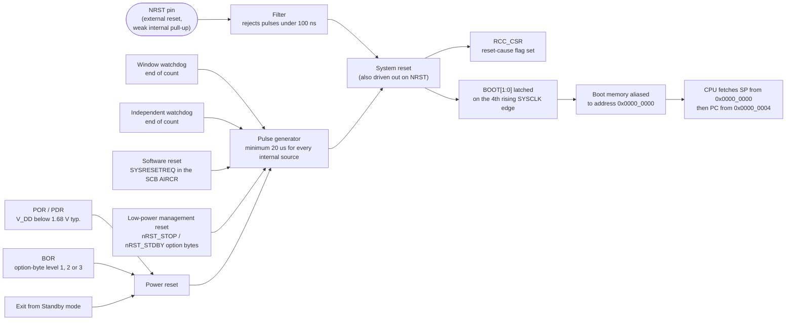

# Reset and Boot Configuration

There is a gap between the moment power reaches the chip and the moment your first instruction executes, and firmware engineers habitually treat it as empty. It is not. In that gap the supply supervisor decides whether the rail is trustworthy, a pulse generator stretches whatever event caused the reset into a signal long enough for every block on the die to see it, an option-byte loader runs, boot-mode pins are sampled and latched, an address decoder is reconfigured so that a completely different memory appears at address zero, and only then does the CPU fetch two words and start running.

Every one of those steps has a failure mode that reaches you as a symptom with no obvious cause: a board that flashes successfully and then does nothing, a device that resets every eight seconds with no exception in the debugger, a unit returned from the field that will not enumerate. This page is about what happens in the gap, how to configure it, and — most usefully — how to ask the chip afterwards what actually happened.

:::info[Prerequisites]
[Power Supplies and Regulators](./power-supply-and-regulators.md) covers the POR, BOR and PVD thresholds that trigger two of the reset sources below. [Clocks and Oscillators](./clocks-and-oscillators.md) covers the clock state the part wakes up in, which matters here because the boot pins are latched against SYSCLK.
:::

## Three kinds of reset, not one

RM0383 Rev 4 §6.1 opens by dividing resets into three categories, and the division is not academic — it determines what survives.

- A **system reset** "sets all registers to their reset values unless specified otherwise in the register description." Five events cause one (§6.1.1): a low level on `NRST`, a window-watchdog end-of-count, an independent-watchdog end-of-count, a software reset, and a low-power management reset.
- A **power reset** (§6.1.2) is generated by POR/PDR or BOR, and by exiting Standby mode. It "sets all registers to their reset values **except the Backup domain**." Crucially, "these sources act on the `NRST` pin and it is always kept low during the delay phase" — so a power reset is externally visible on the pin, and so is every internal reset source.
- A **backup domain reset** (§6.1.3) resets only the RTC registers, `RCC_BDCR`, and the `BRE` bit of `PWR_CSR`. It comes from setting `BDRST` in `RCC_BDCR`, or from V<sub>DD</sub>/V<sub>BAT</sub> powering on when both had previously been off.

The practical consequence of the middle bullet catches people: an RTC that has been keeping time will keep keeping time across a watchdog reset, a software reset, and a button press, because none of those is a backup domain reset. Firmware that re-initialises the RTC unconditionally at startup throws that away.

## The sources converge on one signal

Every source ends up asserting the same internal `System reset` line, which is also driven out on the `NRST` pin. RM0383 Rev 4, Figure 11 draws it; the diagram below is that figure's structure with the destination made explicit.



Two details in that diagram do real work on the bench.

**The pulse generator "guarantees a minimum reset pulse duration of 20 µs for each internal reset source"** (RM0383 Rev 4, §6.1.2). This is why a debug probe can see a reset that lasted only as long as a watchdog rollover: the hardware stretches it. It is also why `NRST` is an output as well as an input, and why tying it to something that drives hard high is a mistake.

**The `NRST` input is filtered.** DS10314 Rev 8, §6.3.17, Table 56: a pulse of up to `100 ns` is guaranteed to be filtered out, and a pulse of `300 ns` or more (at V<sub>DD</sub> > 2.7 V) is guaranteed to be seen. Between those, behaviour is unspecified. The same table gives the pin's permanent weak pull-up as `30/40/50 kΩ` (min/typ/max) and the generated reset pulse duration as `20 µs` minimum. The datasheet's Figure 32, "Recommended NRST pin protection", shows a `0.1 µF` capacitor to ground as the standard defence against parasitic resets.

## Boot mode: how a different memory appears at address zero

The Cortex-M4 always fetches its reset vector over the ICode bus, which means the boot memory must live in the code region at address `0x0000_0000`. Since flash, system memory and SRAM cannot all be there at once, STM32 parts alias one of them into that space, chosen by two pins.

RM0383 Rev 4, §2.4 and Table 2:

| `BOOT1` | `BOOT0` | Boot mode | What is aliased to `0x0000_0000` |
|---|---|---|---|
| x | 0 | Main flash memory | Your firmware. The normal case. |
| 0 | 1 | System memory | ST's factory-programmed bootloader. |
| 1 | 1 | Embedded SRAM | SRAM, for loading and running code without programming flash. |

Four facts about those pins, all from §2.4, are worth holding onto:

1. **The values are latched on the 4th rising edge of SYSCLK after reset.** They are not read continuously. Changing `BOOT0` while the program is running does nothing until the next reset.
2. **`BOOT0` is a dedicated pin; `BOOT1` is shared with a GPIO.** On the STM32F411, `BOOT1` is `PB2` (DS10314 Rev 8, Table 8, "Additional functions" column). "Once BOOT1 has been sampled, the corresponding GPIO pin is free and can be used for other purposes."
3. **The pins are resampled when the device exits Standby mode**, so "they must be kept in the required Boot mode configuration when the device is in the Standby mode."
4. **After the startup delay, the CPU "fetches the top-of-stack value from address `0x0000 0000`, then starts code execution from the boot memory starting from `0x0000 0004`."** Two words: initial stack pointer, then reset vector. That is the entire hardware-defined startup contract.

Booting from system memory runs the **embedded bootloader** ST programs during production. On this part it will talk over USART1 (`PA9`/`PA10`), USART2 (`PD5`/`PD6`), I²C1/2/3, SPI1/2/3, or USB OTG FS in DFU mode (§2.4, "Embedded bootloader"). It is the recovery path when SWD is unavailable, and the reason a part with no debug connector is still field-programmable. ST's AN2606 documents the protocol and the per-device pin list.

## What this looks like on the Nucleo

- **`BOOT0` defaults low.** UM1724 Rev 17, Table 29, note 1: "The default state of BOOT0 is LOW. It can be set to HIGH when a jumper is on pin5-7 of CN7. Two unused jumpers are available on CN11 and CN12 (bottom side of the board)." `CN7` pin 7 is `BOOT0`, pin 5 is `VDD`, so that jumper simply ties the pin to the 3.3 V rail.
- **`BOOT1`/`PB2` is a plain header pin** — `CN10` pin 22 on this board (UM1724 Rev 17, Table 29) — with nothing driving it. It reads as whatever the internal reset-state pull leaves it at, which is why `BOOT0` alone is the control you actually use.
- **`B2` is the reset button**, wired to `NRST` (UM1724 Rev 17, §7.7, "Push-buttons"), and solder bridge `SB12` is what connects the `CN4` debug connector's `NRST` line to the microcontroller's pin (Table 10). If a probe cannot reset the target, `SB12` is the first thing to check.
- **`B1`, the user button, is on `PC13`** (§7.7) — an input-only-in-practice pin, for reasons covered in [How a GPIO Pin Really Behaves](./gpio-electrical-behaviour.md).

## Reading the reset reason after the fact

This is the part that pays for the whole page. `RCC_CSR` records which source caused the last reset (RM0383 Rev 4, §6.3.20, address offset `0x74`, reset value `0x0E00 0000`):

| Bit | Flag | Set when |
|---|---|---|
| 31 | `LPWRRSTF` | A low-power management reset occurred |
| 30 | `WWDGRSTF` | A window watchdog reset occurred |
| 29 | `IWDGRSTF` | An independent watchdog reset from the V<sub>DD</sub> domain occurred |
| 28 | `SFTRSTF` | A software reset occurred |
| 27 | `PORRSTF` | A POR/PDR reset occurred |
| 26 | `PINRSTF` | A reset from the `NRST` pin occurred |
| 25 | `BORRSTF` | A POR/PDR **or** BOR reset occurred |
| 24 | `RMVF` | Written by software to clear all of the above |

```c
/* Call this early in main(), before anything can reset the part again. */
uint32_t reason = RCC->CSR;          /* snapshot first */
RCC->CSR |= RCC_CSR_RMVF;            /* then clear, so the next boot is readable */

if (reason & RCC_CSR_IWDGRSTF) { /* the watchdog fired: something hung */ }
if (reason & RCC_CSR_WWDGRSTF) { /* window watchdog: something ran too fast or too slow */ }
if (reason & RCC_CSR_SFTRSTF)  { /* we asked for this one */ }
if (reason & RCC_CSR_PINRSTF)  { /* NRST was pulled low: button, or the debug probe */ }
if (reason & RCC_CSR_BORRSTF)  { /* the rail sagged, or this is a genuine cold start */ }
```

Note the deliberate order: snapshot, then clear. And note what the flags do *not* tell you. `BORRSTF`, per its own bit description, "is set by hardware when a **POR/PDR or BOR** reset occurs" — it does not distinguish a brownout from a cold power-up. `PORRSTF` is the bit that identifies a genuine power-on; a brownout sets `BORRSTF` without `PORRSTF`, and that pair is how you tell a sagging supply from someone plugging the board in.

:::warning[Three ways this silently wastes a day]
**The reset flags are sticky, and nothing clears them for you.** RM0383 Rev 4 describes `RCC_CSR` as "reset by system reset, except reset flags by power reset only". If you never write `RMVF`, the flags accumulate: after a power-up followed by two watchdog resets you will read `PORRSTF | BORRSTF | IWDGRSTF` and have no way to know which one was *most recent*. Firmware that logs "reset cause: power-on **and** watchdog" every single boot is firmware that forgot to clear. Read once, clear immediately, and treat the snapshot as the answer.

**A `BOOT0` jumper left fitted makes flashing appear to work and firmware appear dead.** The programmer writes flash successfully — flash is writable regardless of boot mode — and then the part boots the system-memory bootloader instead of your code. No LED, no `printf`, no fault, and the debugger will happily attach and show you code you did not write. If a board that worked five minutes ago now does nothing after "just a reset", look at `CN7` pins 5 and 7 before you look at your linker script.

**A watchdog reset in the first milliseconds looks like a hang.** The device is held in reset for `T_RSTTEMPO` — `0.5 ms` min, `1.5 ms` typ, `3.0 ms` max, "measured from the power-on (POR reset or wakeup from V<sub>BAT</sub>) to the instant when first instruction is fetched by the user application code" (DS10314 Rev 8, Table 19 and note 3). If firmware enables the independent watchdog and then does slow initialisation before the first refresh, the board loops: reset, 1.5 ms, a little init, watchdog, reset. From the outside it is indistinguishable from a dead board — until you read `IWDGRSTF`.
:::

:::note[Reset is not the same as re-flashing]
A reset restores register state. It does not restore RAM contents in any guaranteed way, and it certainly does not restore flash. If your firmware keeps a state machine in a `static` variable that lives in `.bss`, startup code zeroes it — but a variable placed in a no-init section, or a value left in a backup register, survives. That difference is deliberate and useful (it is how a device remembers *why* it rebooted across a watchdog reset), and it is also how a corrupted state can survive every reset you throw at it.
:::

## See also

- [Power Supplies and Regulators](./power-supply-and-regulators.md) — the POR, BOR and PVD thresholds behind two of the reset sources, and why BOR is off by default.
- [Clocks and Oscillators](./clocks-and-oscillators.md) — the clock the boot pins are latched against, and what the RCC does before your code runs.
- [How a GPIO Pin Really Behaves](./gpio-electrical-behaviour.md) — the reset state of the I/O ports, and why `PC13` carries the user button.
- [Reading a Datasheet](./reading-a-datasheet.md) — locating `RCC_CSR`, Table 2, and Table 56 in their respective documents.
- [Reading a Schematic](./schematics-and-board-basics.md) — `SB12`, `B2`, and the rest of the board's reset wiring.

## References

- STMicroelectronics — [**RM0383**, *STM32F411xC/E reference manual*](https://www.st.com/resource/en/reference_manual/rm0383-stm32f411xce-advanced-armbased-32bit-mcus-stmicroelectronics.pdf), consulted at **Rev 4** (May 2025). §2.4 "Boot configuration" with Table 2 boot modes, Table 3 memory mapping versus boot mode, and the embedded-bootloader interface list; §6.1.1–§6.1.3 for the three reset categories and Figure 11's reset circuit; §6.3.20 for `RCC_CSR` and every flag bit quoted above.
- STMicroelectronics — [**STM32F411xC/E datasheet**](https://www.st.com/resource/en/datasheet/stm32f411re.pdf) (DS10314), consulted at **Rev 8** (January 2024). §6.3.5 Table 19 for the POR/PDR and BOR thresholds and `T_RSTTEMPO`; §6.3.17 Table 56 and Figure 32 for the `NRST` pull-up, input filtering and recommended protection; Table 8 for `PB2` carrying `BOOT1` and Table 14 for the `BOOT0` pin's 0–9 V input range.
- STMicroelectronics — [**UM1724**, *STM32 Nucleo-64 boards (MB1136)*](https://www.st.com/resource/en/user_manual/um1724-stm32-nucleo64-boards-mb1136-stmicroelectronics.pdf), consulted at **Rev 17** (September 2025). §7.7 "Push-buttons" for `B1` and `B2`, Table 10 "Solder bridges" for `SB12`, and Table 29 with note 1 for the `BOOT0` default and the `CN7` pin 5–7 jumper. Rev 17 renumbered this chapter from §6.x to §7.x.
- STMicroelectronics — [**AN2606**, *STM32 microcontroller system memory boot mode*](https://www.st.com/resource/en/application_note/cd00167594-stm32-microcontroller-system-memory-boot-mode-stmicroelectronics.pdf). The authority on the factory bootloader that §2.4 only names: which pins and peripherals are active per device, the version of the protocol each part carries, and the exact entry conditions. Read it before you rely on the bootloader as a recovery path.
- Arm — [**Armv7-M Architecture Reference Manual**](https://developer.arm.com/documentation/ddi0403/latest/). The architectural side of the same story: the vector table's first two entries as initial `SP` and reset `PC`, and the `SYSRESETREQ` bit in `AIRCR` that RM0383 §6.1.1 defers to.
