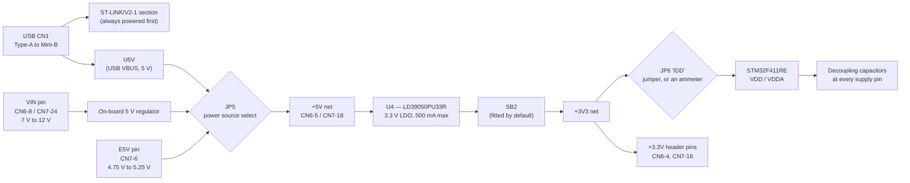

# Reading a Schematic

A schematic is not a picture of a board. It is a graph: components are nodes, and the wires between them — **nets** — are edges. Two points drawn at opposite corners of the page with the same net label are the *same electrical point*, as surely as two references to the same object in memory. Once you read it as a graph rather than as a drawing, the intimidating density stops mattering, because you are never reading the whole thing. You are tracing one path.

And the firmware engineer nearly always wants to trace the same path. The chip's reference manual tells you `PA5` exists and how to drive it. It cannot tell you that on *this* board `PA5` goes to an LED, through a resistor, and that there is a solder bridge in the way that the factory may or may not have fitted. Only the board's schematic knows that. So the question a schematic answers, over and over, is: **is this pin actually connected to what I think it is?** Getting comfortable answering that question is the entire skill, and it takes about an afternoon.

## Reference designators: the naming convention

Every component on a schematic carries a letter-plus-number label, and the letters are an industry convention, not a per-vendor invention. Knowing them means you can read a board you have never seen.

| Prefix | Component | Why you care |
|---|---|---|
| `R` | Resistor | Pull-ups, pull-downs, LED current limiting, and — crucially — `0 Ω` links used as permanent configuration |
| `C` | Capacitor | Decoupling, crystal load capacitors, bulk storage |
| `L` | Inductor / ferrite bead | Supply filtering; a ferrite in a rail is a common source of "why is this net not quite the other net" |
| `D` | Diode | Reverse-polarity and clamp protection |
| `LD` / `LED` | Light-emitting diode | The board's status indicators |
| `Q` | Transistor | Switching a load the MCU cannot drive directly |
| `U` | Integrated circuit | The microcontroller, regulators, level shifters, sensors |
| `X` / `Y` | Crystal or resonator | The clock source — see [Clocks and Oscillators](./clocks-and-oscillators.md) |
| `JP` | Jumper (pin header with a removable shunt) | User-configurable, no tools needed |
| `SB` | Solder bridge | Configuration you change with a soldering iron. ST uses these heavily |
| `CN` | Connector | Headers, USB sockets, debug connectors |
| `B` / `SW` | Button or switch | |
| `TP` | Test point | A pad deliberately exposed so you can put a probe on it |

The two that surprise software engineers are `SB` and `0 Ω` resistors. Both exist because a board manufacturer wants **one PCB** to serve several product variants: the copper is laid down once, and which options get connected is decided at assembly time by fitting or omitting a tiny link. This means a net that looks connected in the schematic may not be connected on the board in front of you, and the schematic's footnotes are the only place that says so.

## Power rails, traced end to end

Every board has a small number of **power rails** — nets that distribute a particular voltage — and tracing them is the first thing to do with an unfamiliar board, because almost every "the board does nothing" problem is a power problem. On the Nucleo-64 the chain looks like this (simplified from UM1724 §6.3, "Power supply and power selection", and its Appendix A schematics):

Four things fall out of that one diagram, and each of them is a real bench symptom:

- **The ST-LINK is powered before the target is.** UM1724 §6.3.1 spells out the sequence: only the ST-LINK section is powered before USB enumeration, because the host offers just 100 mA at that point. The board then requests 300 mA, and only if the host grants it does the target STM32 come up and the red `LD3` light. **A dark `LD3` with a live ST-LINK means the USB host refused the current**, not that your firmware crashed.
- **`JP5` chooses where the 5 V comes from**, and `JP1` tells the ST-LINK how much current to ask for (UM1724 Table 6). Defaults, from §5.1: `JP1` off, `JP5` on `U5V`, `JP6` on.
- **`JP6` sits in series with the microcontroller's supply.** Pull the jumper, put an ammeter across the two pins, and you are measuring the STM32's own current draw with no other instrument (UM1724 §6.6). Leave it out with no ammeter and the microcontroller simply is not powered — a genuinely confusing five minutes if you forgot.
- **`SB2` is the 3.3 V regulator's output link.** UM1724 Table 10 documents that turning `SB2` off disconnects the `LD39050PU33R` output — which is exactly what you do when you want to feed the board 3.3 V from elsewhere (§6.3.3), and exactly what will make an otherwise healthy board look dead if it was disturbed.

## Decoupling capacitors: the components you will never touch but must recognise

Scattered around the microcontroller on any schematic you will find a cloud of small capacitors, one per supply pin, all tied between a power rail and ground. These are **decoupling** (or bypass) capacitors, and they exist because a digital chip's current draw is not steady — it spikes every time a large number of transistors switch together. The inductance of the traces back to the regulator means the regulator cannot respond fast enough, so a small capacitor is parked next to each supply pin as a local reservoir.

ST is unusually direct about this in the datasheet's power supply scheme (§6.1.6, Figure 17): "Each power supply pair (for example VDD/VSS, VDDA/VSSA) must be decoupled with filtering ceramic capacitors as shown above. These capacitors must be placed as close as possible to, or below, the appropriate pins… It is not recommended to remove filtering capacitors to reduce PCB size or cost. This might cause incorrect operation of the device." The same figure specifies a bulk `4.7 µF` ceramic that "must be connected to one of the VDD pin" alongside the per-pin `100 nF` parts.

You will not modify these. You need to recognise them so you do not mistake them for something meaningful when tracing a net, and so that when you eventually design a board, you copy the vendor's arrangement rather than inventing your own.

## Pull-ups, pull-downs, and current-limiting resistors

Three resistor roles cover almost everything a firmware engineer meets on a schematic:

- A **pull-up** ties a net to the positive rail through a resistor, so the net reads high unless something actively drives it low. A **pull-down** does the mirror image. These define the state of a net that nothing is driving — see [How a GPIO Pin Really Behaves](./gpio-electrical-behaviour.md) for what happens when nothing does either.
- A **current-limiting resistor** sits in series with an LED. The LED itself has no meaningful resistance once it conducts; the resistor is what stops it (and the pin driving it) from drawing destructive current.
- A **series termination or protection resistor** sits in a signal path to damp reflections or to limit fault current if the two ends disagree about who is driving.

The distinction matters when you are asking "why is this pin not going low." A pin fighting a pull-up will still go low; a pin fighting a hard connection to the rail is a short circuit.

## The worked question: is `PA5` really the LED?

This is the whole skill in one example, and it needs three documents.

1. **The board manual says what the LED is.** UM1724 §6.4: "User LD2: the green LED is a user LED connected to Arduino signal D13 corresponding to STM32 I/O `PA5` (pin 21) or `PB13` (pin 34) depending on the STM32 target… when the I/O is HIGH value, the LED is on."
2. **A per-board table resolves the "depending on."** UM1724 Table 16, "Arduino connectors on NUCLEO-F401RE and NUCLEO-F411RE", lists `CN5` pin 6 = `D13` = `PA5`. So on *this* board it is `PA5`, and driving it high lights the LED.
3. **A solder bridge can break the connection.** UM1724 Table 10: `SB21 (LD2-LED)` — "ON: Green user LED LD2 is connected to D13 of Arduino signal. OFF: Green user LED LD2 is not connected." Default is on.

Notice that the same `PA5` is also `SPI1_SCK` on the Arduino header (Table 16). That is not a contradiction — it is pin multiplexing, and it means enabling SPI1 on its default pins makes your status LED flicker with every transfer. Boards are full of these overlaps, and the schematic is where you find them before they confuse you.

:::warning[Probe grounding: the mistake that damages things]
Before you clip an instrument onto a board, its ground must be connected to the board's ground — and to *that* ground, not a different one.

- **A logic analyzer with no common ground** does not fail cleanly. It reports plausible-looking garbage: phantom edges, decoded bytes that are not real, signals that idle at the wrong level. Hours have been lost debugging firmware against a capture that was measuring nothing but noise. The single black wire is not optional.
- **An oscilloscope's ground clip is connected to mains earth.** Clip it to any net that is not ground and you have shorted that net to earth through the probe lead. On a USB-powered Nucleo that usually just kills the net or the pin; on anything mains-referenced it destroys equipment and can injure you.
- **Ground is not one net on every board.** Analogue ground, digital ground, and an isolated section's ground may be deliberately separated. Clipping across two of them defeats the isolation that was there for a reason.

The habit: find a labelled ground pin — on the Nucleo, `CN6` pins 6 and 7, or `CN7` pins 8, 19, 20, and 22 (UM1724, Table 16 and Table 29) — and connect it first, every time, before any signal lead.
:::

:::tip[Read the board's schematic before your first session, not after your first problem]
UM1724's Appendix A carries the complete Nucleo-64 schematics. Twenty minutes tracing the power rail, the SWD connector, the two LEDs, and the USER button will make every later bench symptom interpretable. It is the highest-yield twenty minutes available to someone who has just unboxed the board.
:::

## See also

- [What Hardware to Buy](./what-hardware-to-buy.md) — the board whose schematic this page traces.
- [Reading a Datasheet](./reading-a-datasheet.md) — where the board user manual sits in the wider document set.
- [How a GPIO Pin Really Behaves](./gpio-electrical-behaviour.md) — what the pull-up and pull-down resistors on the schematic are competing with inside the chip.
- [Clocks and Oscillators](./clocks-and-oscillators.md) — the crystal footprints on this board, and why two of them are empty.
- [Voltage Levels and Logic](./voltage-levels-and-logic.md) — the rails traced here, and what the chip does when they are wrong.

## References

- STMicroelectronics — [**UM1724**, *STM32 Nucleo-64 boards (MB1136)*](https://www.st.com/resource/en/user_manual/um1724-stm32-nucleo64-boards-mb1136-stmicroelectronics.pdf). §6.3 power supply and selection, §6.4 LEDs, §6.5 push-buttons, §6.6 the `JP6` current-measurement jumper, Table 10 solder bridges, Table 16 Arduino pin mapping, Table 29 ST morpho pin mapping, and Appendix A full schematics. Consulted at Rev 12 (DocID025833).
- STMicroelectronics — [**STM32F411xC/E datasheet**](https://www.st.com/resource/en/datasheet/stm32f411re.pdf), §6.1.6 "Power supply scheme" (Figure 17). The vendor's own decoupling requirement, in the vendor's own words.
- STMicroelectronics — [**AN2867**, *Guidelines for oscillator design on STM8AF/AL/S and STM32 MCUs/MPUs*](https://www.st.com/resource/en/application_note/an2867-guidelines-for-oscillator-design-on-stm8afals-and-stm32-mcusmpus-stmicroelectronics.pdf). Referenced from both the datasheet and UM1724 for the crystal and load-capacitor part of the schematic; a good example of what an application note is for.
- KiCad project — [KiCad documentation](https://docs.kicad.org/). Free, open-source schematic capture. Drawing a two-component schematic yourself teaches net and designator conventions faster than reading about them.
