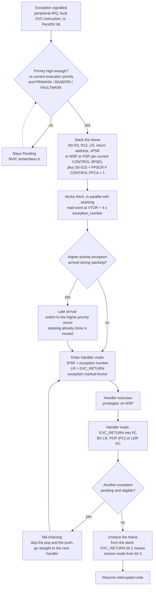

# Exceptions and the Vector Table

On most processors, getting from "an interrupt line went high" to "my C function is running" involves software: a dispatcher reads a status register, works out which source fired, and calls the right handler. Cortex-M does none of that. The hardware reads a **table of function pointers** at a known address, indexes it by exception number, and branches — having already pushed the registers a C function is allowed to clobber. Your handler is an ordinary function with an ordinary prologue, and it starts running a fixed and small number of cycles after the event.

That is the design decision the entire exception model hangs off, and it has a consequence you have to internalise before writing a line of startup code: **the vector table is not a convention, it is a hardware data structure.** It has a defined address, a defined order, and a defined content for every slot, and the processor reads it before your code exists. Getting entry 0 or entry 1 wrong produces a chip that does not run at all, with no error message, because there is no software running to produce one.

This page is the map of that structure: what is in it, how the processor uses it at reset and at every exception thereafter, and how to move it.

:::info[Prerequisites]
[The Register Model](./cortex-m-register-model.md) covers the stack frame the hardware pushes on the way in and the `EXC_RETURN` value it leaves in `LR`; this page covers everything that happens before and around it. [I/O and Interrupts](../../computer-science/buses-and-io/io-and-interrupts.md) owns the general theory of interrupts versus polling.
:::

## The two entries that are not handlers

The table begins with something that is not a function pointer at all.

| Offset | Exception number | Content |
|---|---|---|
| `0x00` | — | **Initial value of the Main Stack Pointer** |
| `0x04` | 1 | Reset handler address |
| `0x08` | 2 | NMI |
| `0x0C` | 3 | HardFault |
| … | … | … |

PM0214 Rev 10 §2.3.4: "The vector table contains the reset value of the stack pointer, and the start addresses, also called exception vectors, for all exception handlers." The Armv7-M reset pseudocode shows precisely how both are consumed (*Armv7-M ARM* DDI 0403E.e §B1.5.5):

```text
bits(32) vectortable = VTOR<31:7>:'0000000';
SP_main = MemA_with_priv[vectortable, 4, AccType_VECTABLE] AND 0xFFFFFFFC<31:0>;
SP_process = ((bits(30) UNKNOWN):'00');
LR = 0xFFFFFFFF<31:0>;              /* preset to an illegal exception return value */
tmp = MemA_with_priv[vectortable+4, 4, AccType_VECTABLE];
tbit = tmp<0>;
IPSR<8:0> = Zeros(9);               /* Exception Number cleared */
EPSR.T = tbit;                      /* T bit set from vector */
BranchTo(tmp AND 0xFFFFFFFE<31:0>); /* address of reset service routine */
```

Read that carefully, because five separate facts about the boot sequence are in those eight lines:

- **The stack pointer is loaded before anything executes.** This is why you never see startup code setting up `MSP` — the hardware did it. It is also why an initial `MSP` value pointing outside RAM produces a board that faults on the very first `PUSH`, before `main`.
- **The bottom two bits of the initial SP are discarded** (`AND 0xFFFFFFFC`). A misaligned value in the linker script is silently rounded down rather than faulting.
- **`PSP` is left UNKNOWN**, which is the hazard [Privilege Modes and the Two Stacks](./privilege-modes-and-stacks.md) opens with.
- **`LR` is preset to an illegal `EXC_RETURN` value**, so a stray return before anything has set `LR` faults loudly.
- **Bit 0 of the reset vector becomes `EPSR.T`, and the branch target has that bit masked off.** The Thumb bit and the address travel in the same word — see [Thumb-2 and Code Density](./thumb-and-instruction-sets.md) for what happens when it is zero.

The stack pointer is the entry people get wrong most often, and the reason is that it *looks* like it should be a symbol. In a GNU linker script and startup file it is written as:

```text
/* Linker script: the symbol the vector table's first word points at. */
_estack = ORIGIN(RAM) + LENGTH(RAM);   /* one past the top -- full descending */
```

```armasm
    .section .isr_vector, "a", %progbits
    .type    g_pfnVectors, %object
g_pfnVectors:
    .word    _estack               /* 0x00: initial MSP, NOT a function      */
    .word    Reset_Handler         /* 0x04: exception 1                      */
    .word    NMI_Handler           /* 0x08: exception 2                      */
    .word    HardFault_Handler     /* 0x0C: exception 3                      */
    .word    MemManage_Handler     /* 0x10: exception 4                      */
    .word    BusFault_Handler      /* 0x14: exception 5                      */
    .word    UsageFault_Handler    /* 0x18: exception 6                      */
    .word    0                     /* 0x1C-0x28: reserved, four words        */
    .word    0
    .word    0
    .word    0
    .word    SVC_Handler           /* 0x2C: exception 11                     */
    .word    DebugMon_Handler      /* 0x30: exception 12                     */
    .word    0                     /* 0x34: reserved                         */
    .word    PendSV_Handler        /* 0x38: exception 14                     */
    .word    SysTick_Handler       /* 0x3C: exception 15                     */
    .word    WWDG_IRQHandler       /* 0x40: exception 16 = IRQ0              */
    /* ... 85 more entries for this device ... */
```

The offsets and reserved slots are RM0383 Rev 4, Table 37 "Vector table for STM32F411xC/E", cross-checked against PM0214 Rev 10, Table 17.

## The system exceptions

The first sixteen entries are architectural: they mean the same thing on every Cortex-M. Their numbers are also the values `IPSR.ISR_NUMBER` reports — with the one exception you would expect, since the processor is never *in* the reset exception once code is running. PM0214 Rev 10, Table 6 assigns `0: Thread mode`, **`1: Reserved`**, `2: NMI`, `3: Hard fault` and so on, so `IPSR` never reads 1. From PM0214 Rev 10, Table 17 "Properties of the different exception types" and RM0383 Rev 4, Table 37:

| Exception no. | CMSIS `IRQn` | Name | Priority | Vector offset | Activation |
|---|---|---|---|---|---|
| 1 | — (no CMSIS IRQn) | **Reset** | −3, "the highest" | `0x0000_0004` | Asynchronous |
| 2 | −14 | **NMI** | −2, fixed | `0x0000_0008` | Asynchronous |
| 3 | −13 | **HardFault** | −1, fixed | `0x0000_000C` | — ‡ |
| 4 | −12 | MemManage | Configurable | `0x0000_0010` | Synchronous |
| 5 | −11 | BusFault | Configurable | `0x0000_0014` | Synchronous when precise, asynchronous when imprecise |
| 6 | −10 | UsageFault | Configurable | `0x0000_0018` | Synchronous |
| 7–10 | — | Reserved | — | `0x0000_001C`–`0x0000_002B` | — |
| 11 | −5 | **SVCall** | Configurable | `0x0000_002C` | Synchronous |
| 12 | −4 | Debug Monitor † | Configurable | `0x0000_0030` | Synchronous |
| 13 | — | Reserved | — | `0x0000_0034` | — |
| 14 | −2 | **PendSV** | Configurable | `0x0000_0038` | Asynchronous |
| 15 | −1 | **SysTick** | Configurable | `0x0000_003C` | Asynchronous |
| 16 and above | 0 and above | IRQ0 upwards | Configurable | `0x0000_0040` and up, in steps of 4 | Asynchronous |

† PM0214's two tables describe this slot differently, and both are right about different things. Its **Table 17** groups exceptions 12–13 as Reserved; its **Table 6**, defining what `IPSR` reports, is more specific — `11: SVCall`, **`12: Reserved for Debug`**, `13: Reserved`, `14: PendSV`, `15: SysTick`. RM0383 Rev 4, Table 37 names the vector at `0x0000_0030` outright: "Debug Monitor". So the slot is real, reserved for debug use, and not one you populate unless you are writing debug-monitor code.

‡ PM0214 Rev 10, Table 17 leaves HardFault's Activation cell blank, and that is not an omission. A HardFault is always an *escalation* of something else (§2.4.2), so it inherits the character of whatever escalated into it — synchronous when a UsageFault or a precise BusFault escalates, asynchronous when an imprecise BusFault does. There is no single value the cell could hold.

The **CMSIS `IRQn`** column is CMSIS's own numbering, not a field in either ST table. The negative values come from `core_cm4.h`, where the system-exception enumerators run `NonMaskableInt_IRQn = -14` … `SVCall_IRQn = -5`, `DebugMonitor_IRQn = -4`, `PendSV_IRQn = -2`, `SysTick_IRQn = -1`. PM0214's Table 17 carries the same values in its IRQ-number column and explains why they are negative — see the note below.

Three columns of that table are load-bearing.

**Priority runs backwards, and the fixed ones are negative.** PM0214 Rev 10 §2.3.5: "A lower priority value indicating a higher priority… Configurable priority values are in the range 0-15. This means that the Reset, Hard fault, and NMI exceptions, with fixed negative priority values, always have higher priority than any other exception." Note also the default: "If software does not configure any priorities, then all exceptions with a configurable priority have a priority of 0" — which is the *highest* configurable priority, so out of the box nothing preempts anything and ties are broken by exception number.

**The IRQ-number column is CMSIS's, not the hardware's.** PM0214's footnote to Table 17: "To simplify the software layer, the CMSIS only uses IRQ numbers and therefore uses negative values for exceptions other than interrupts. The IPSR returns the Exception number." So `SysTick_IRQn` is `−1` in CMSIS while `IPSR` reads `15`. Both are right; they are different numbering schemes and mixing them produces off-by-sixteen bugs.

**"Synchronous" versus "asynchronous" tells you whether the stacked PC is the culprit.** A synchronous fault — UsageFault, MemManage, a precise BusFault — is raised by the instruction that caused it, so the return address in the stack frame points at or immediately after the offending instruction. An *imprecise* BusFault is not: the write that caused it was buffered and completed later, and the stacked PC is somewhere downstream. That single distinction is why fault debugging is easy on some faults and archaeological on others.

Two of the system exceptions deserve naming because they exist purely for software:

- **`SVCall`** is raised by the `SVC` instruction. PM0214 §2.3.2: "In an OS environment, applications can use SVC instructions to access OS kernel functions and device drivers." It is the system-call boundary that makes [unprivileged Thread mode](./privilege-modes-and-stacks.md) usable.
- **`PendSV`** has no hardware source at all — software sets its pending bit. PM0214 §2.3.2: "PendSV is an interrupt-driven request for system-level service. In an OS environment, use PendSV for context switching when no other exception is active." Kernels give it the lowest configurable priority so a context switch never runs ahead of a real device interrupt.

For the STM32F411 the table continues to exception number 101 — RM0383 Rev 4, Table 37's last row is "85 | 91 | settable | SPI5 | SPI 5 global interrupt | `0x0000 0194`", and position 85 means exception 16 + 85 = 101. So the full table is 102 words, `0x198` bytes. Many of the intervening positions are unused on this part; §10.1.1 gives the real figure — "52 maskable interrupt channels (not including the 16 interrupt lines of Cortex-M4 with FPU)" — but the *slots* still have to exist, because the hardware indexes by exception number and cannot skip gaps.

## What happens when an exception is taken



The two optimisations in that diagram are what make Cortex-M interrupt latency competitive, and PM0214 Rev 10 §2.3.7 defines both:

- **Tail-chaining** — "On completion of an exception handler, if there is a pending exception that meets the requirements for exception entry, the stack pop is skipped and control transfers to the new exception handler." Two back-to-back interrupts cost one stack push and one pop between them, not two of each.
- **Late arrival** — "If a higher priority exception occurs during state saving for a previous exception, the processor switches to handle the higher priority exception and initiates the vector fetch for that exception. State saving is not affected by late arrival because the state saved is the same for both exceptions." The push is generic, so it can be reused for whichever exception ends up winning. The window closes at a defined point: "The processor can accept a late arriving exception until the first instruction of the exception handler of the original exception enters the execute stage of the processor."

Note also what happens in parallel. PM0214 §2.3.7: "In parallel to the stacking operation, the processor performs a vector fetch that reads the exception handler start address from the vector table." The table read and the register push overlap, which is why the vector table's location matters for latency — a table in slow memory delays entry.

### Escalation to HardFault

A configurable-priority fault does not always reach its own handler. PM0214 Rev 10 §2.4.2 lists four ways it becomes a HardFault instead:

- "A fault handler causes the same kind of fault as the one it is servicing."
- "A fault handler causes a fault with the same or lower priority as the fault it is servicing."
- "An exception handler causes a fault for which the priority is the same as or lower than the currently executing exception."
- "**A fault occurs and the handler for that fault is not enabled.**"

That last one is the default state. `SHCSR` has a reset value of `0x0000 0000`, so `USGFAULTENA`, `BUSFAULTENA` and `MEMFAULTENA` all start at 0, and PM0214 Rev 10 §4.4.9 states the consequence in one line: "If you disable a system handler and the corresponding fault occurs, the processor treats the fault as a hard fault." On a fresh chip *every* fault arrives as a HardFault. This is why beginner firmware only ever sees `HardFault_Handler`, and why enabling the three individual fault handlers early is one of the highest-value things startup code can do — the specific handler plus its status register tells you what happened; the HardFault, on its own, does not.

## Relocating the table with `VTOR`

The table starts at address zero and does not have to stay there. PM0214 Rev 10 §2.3.4: "On system reset, the vector table is fixed at address `0x00000000`. Privileged software can write to the VTOR to relocate the vector table start address to a different memory location."

The reasons to move it are all real:

- **A bootloader** occupies low flash; the application's table has to live above it.
- **Runtime-modifiable vectors** need the table in RAM, since flash cannot be written a word at a time.
- **Latency**, marginally — a table in fast RAM shortens the vector fetch.

The alignment requirement is where this goes wrong, and the two documents state it differently, so it is worth being precise about which one binds.

The *Armv7-M ARM* (DDI 0403E.e §B3.2.5) defines `VTOR.TBLOFF` as **bits[31:7]** of the vector table address, with bits[6:0] reserved — a 128-byte granularity architecturally, with the note that "One or two of the high-order bits of the TBLOFF field can be implemented as RAZ/WI, reducing the supported address range."

PM0214 Rev 10 §4.4.4 describes the STM32 implementation more tightly: `TBLOFF` is **bits[29:9]**, "the offset of the table base from memory address `0x00000000`", with "Bits 31:30 Reserved" and "Bits 8:0 Reserved". It adds the rule and its consequence: "When setting TBLOFF, you must align the offset to the number of exception entries in the vector table. **The minimum alignment is 128 words.** Table alignment requirements mean that bits[8:0] of the table offset are always zero." 128 words is **512 bytes**. Bit 29 is called out separately: "Bit 29 determines whether the vector table is in the code or SRAM memory region. 0: Code, 1: SRAM. Note: Bit 29 is sometimes called the TBLBASE bit."

512 bytes is exactly right for this part, and you can check it: the table is 102 words, `0x198` = 408 bytes, and the next power of two at or above 408 is 512.

:::note[PM0214 contradicts itself on the VTOR range, and the register description is the one to follow]
PM0214 Rev 10 §2.3.4 says privileged software can relocate the table "in the range `0x00000080` to `0x3FFFFF80`". That range implies a 128-byte granularity — which matches the generic Armv7-M definition, but *not* PM0214's own §4.4.4, where `TBLOFF` is bits[29:9] and bits[8:0] "are always zero", giving a 512-byte granularity and a maximum offset of `0x3FFFFE00`.

The register description in §4.4.4 is the one to build against, for two reasons: it is the field definition rather than a prose summary, and it is consistent with the stated 128-word alignment rule in the same paragraph. The §2.3.4 sentence appears to be inherited from Arm's generic Cortex-M user guide, where a 16-interrupt implementation needs only 32-word alignment. Aligning to 512 bytes satisfies both readings, so there is no practical dilemma — just do not be surprised when the two sections disagree.
:::

```text
/* Linker script: put the table where VTOR can actually point at it. */
SECTIONS
{
    .isr_vector : ALIGN(512)
    {
        KEEP(*(.isr_vector))
    } > FLASH
}
```

```c
/* Startup, after the table is in place. PM0214 Rev 10, section 4.4.4. */
SCB->VTOR = (uint32_t)&g_pfnVectors;   /* must be 512-byte aligned */
__DSB();
```

:::warning[The three vector-table mistakes that produce a chip with no symptoms]
**Entry 0 is a value, not a pointer — and treating it as a pointer is silent.** The first word is the initial `MSP`, loaded by hardware before any code runs. Two ways it goes wrong. If the linker script sets `_estack` to the *base* of RAM rather than one past the top, the stack grows downwards out of RAM immediately and the first push either faults or corrupts something below. And if a startup file was copied from a part with more RAM, `_estack` points past the end of *this* part's RAM — on the STM32F411, past `0x2002_0000`. The first push goes to unmapped memory and you get a BusFault before `main`, with a fault handler that itself cannot push a frame, which means lockup. The board is simply dead, with the debugger showing a `PC` that makes no sense.

**A vector table that is not linked in at all.** `.isr_vector` has no references from C, so `--gc-sections` will discard it unless the linker script wraps it in `KEEP()`. The build succeeds, the map file quietly shows the section gone, address `0x0000_0000` contains whatever the next section put there, and the chip branches to garbage at reset. This one costs an afternoon because the error is in the *absence* of something, and the only place it is visible is the `.map` file.

**Relocating `VTOR` to a misaligned address.** `TBLOFF` is bits[29:9]; writing a value with any of bits[8:0] set does not fault, it just does not store those bits. Your table is at `0x2000_0100` and `VTOR` now reads `0x2000_0000` — so the hardware fetches vectors from 256 bytes before your table. Every exception, including the first SysTick, branches to whatever those words contain. `SCB->VTOR = addr; if (SCB->VTOR != addr) { /* misaligned */ }` is a two-line assertion that catches it at the moment it happens. The *Armv7-M ARM* even suggests the discovery technique: "Software can write all 1s to the TBLOFF field and then read the register to find the maximum supported offset value."

One more, which is not silent but is easy to misread: **changing a vector at runtime and enabling the exception without a barrier.** PM0214 Rev 10 §2.2.4 asks for a specific instruction — "Vector table. If the program changes an entry in the vector table, and then enables the corresponding exception, use a DMB instruction between the operations. This ensures that if the exception is taken immediately after being enabled the processor uses the new exception vector." Without it, an exception taken in the window between the two writes can fetch the old vector.
:::

## See also

- [The Register Model](./cortex-m-register-model.md) — the stack frame pushed in the diagram above, and the `EXC_RETURN` value that drives the return path.
- [Privilege Modes and the Two Stacks](./privilege-modes-and-stacks.md) — which stack the frame lands on, and why `PendSV` and `SVCall` exist.
- [The Cortex-M Memory Map](./memory-map-and-bit-banding.md) — where the table can legally live, and why `SCB->VTOR` is at `0xE000_ED08` on every Cortex-M.
- [Thumb-2 and Code Density](./thumb-and-instruction-sets.md) — the least-significant-bit rule that every entry in the table has to satisfy.
- [I/O and Interrupts](../../computer-science/buses-and-io/io-and-interrupts.md) — the general interrupt model this page's hardware is one implementation of.

## References

- STMicroelectronics — [**PM0214**, *STM32 Cortex-M4 MCUs and MPUs programming manual*](https://www.st.com/resource/en/programming_manual/pm0214-stm32-cortexm4-mcus-and-mpus-programming-manual-stmicroelectronics.pdf), consulted at **Rev 10** (March 2020). §2.3 "Exception model" throughout: §2.3.1 exception states, §2.3.2 exception types (the `SVCall` and `PendSV` descriptions quoted), **Table 17** "Properties of the different exception types" for the priority/offset/activation table (including the deliberately blank Activation cell on the HardFault row) and the CMSIS IRQ-numbering footnote, **Table 6** for the `IPSR.ISR_NUMBER` encodings — the source for `1: Reserved` and `12: Reserved for Debug`, §2.3.4 "Vector table" for the structure and the LSB rule, §2.3.5 for the priority ordering and the priority-0 default, §2.3.7 for stacking, the parallel vector fetch, tail-chaining and late arrival; §2.4.2 for the four escalation-to-HardFault conditions; §2.2.4 for the vector-table `DMB` requirement; §4.4.4 for `VTOR`/`TBLOFF` bits[29:9] and the 128-word alignment; §4.4.9 and §4.4.19 for `SHCSR` and its reset value. Be aware of the §2.3.4-versus-§4.4.4 inconsistency on the `VTOR` range, discussed above.
- Arm — [***Armv7-M Architecture Reference Manual***](https://developer.arm.com/documentation/ddi0403/latest/), consulted at **DDI 0403E.e (ID021621)**. §B1.5.5 for the reset pseudocode quoted at the top of this page — the `MSP` load and its `AND 0xFFFFFFFC`, `SP_process` UNKNOWN, `LR = 0xFFFFFFFF`, `EPSR.T` from vector bit 0 and the masked branch; §B3.2.5 "Vector Table Offset Register, VTOR" for the architectural `TBLOFF` bits[31:7] definition, the RAZ/WI note and the write-all-ones discovery technique; §B1.5.6–§B1.5.8 for exception entry, stacking and return.
- STMicroelectronics — [**RM0383**, *STM32F411xC/E reference manual*](https://www.st.com/resource/en/reference_manual/rm0383-stm32f411xce-advanced-armbased-32bit-mcus-stmicroelectronics.pdf), consulted at **Rev 4** (May 2025). **Table 37** "Vector table for STM32F411xC/E" for every device-specific offset, including the final `SPI5` entry at `0x0000 0194` that fixes the table length; §10.1.1 for the 52 maskable channels and the 4 implemented priority bits; §2.4 and Table 3 for the boot-time alias that puts the table at address zero in the first place.
- Arm — **CMSIS-Core(M) device header `core_cm4.h`**, the `IRQn_Type` enumeration. The source for the negative `IRQn` values in the system-exception table, including `DebugMonitor_IRQn = -4`. These are a software convention layered on top of the architecture's exception numbers, not a hardware register field.
