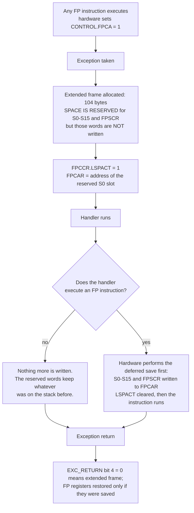

# Floating Point and DSP Extensions

Writing `float` in C on a microcontroller does not tell you what the hardware will do. The same line of source can compile to one instruction, to a forty-cycle library call, or to a two-hundred-cycle double-precision emulation — and the compiler chooses silently, based on flags you may not have set deliberately. Nothing in the source distinguishes the three cases, which is why "why is my control loop suddenly missing deadlines" is so often a floating-point question.

The mental model that resolves it has three levels, and every arithmetic expression in your firmware lands on exactly one:

1. **Hardware, single precision.** The Cortex-M4F's FPU executes it. One to fourteen cycles.
2. **Software, single or double precision.** The compiler emits a call into libgcc's soft-float routines. Tens to hundreds of cycles, plus several kilobytes of flash.
3. **Fixed point.** Integers with an agreed binary point. One cycle for an add, one for a multiply-accumulate on this core — and no FPU needed at all.

The FPU is a coprocessor bolted to the side of the core, it is **disabled at reset**, and on the Cortex-M4 it is **single precision only**. Those three facts generate most of the surprises on this page.

:::info[Prerequisites]
[Floating Point Representation](../../computer-science/bit-manipulation/floating-point.md) owns IEEE 754 itself — sign, exponent, mantissa, rounding, why `0.1` is not `0.1`. This page assumes it and covers what a Cortex-M does with it. [The Cortex-M Family](./arm-cortex-m-profiles.md) covers which cores have an FPU at all; [The Register Model](./cortex-m-register-model.md) covers the extended exception frame that floating-point context creates.
:::

## Which cores have what

| Core | FPU | Precision | DSP / SIMD extension |
|---|---|---|---|
| Cortex-M0, M0+ | No | — | No |
| Cortex-M3 | No | — | No |
| **Cortex-M4** | **Optional** (FPv4-SP) | **Single only** | **Optional** |
| Cortex-M7 | Optional (FPv5) | Single, or single **and double** | Yes |
| Cortex-M23 | No | — | No |
| Cortex-M33 | Optional (FPv5-SP) | Single only | Optional |
| Cortex-M55 | Optional | Single and double | Yes, plus **Helium** (MVE) vector extension |

Every "optional" in that column is a licence-time choice made by the silicon vendor, so the core name on a datasheet does not settle it — [The Cortex-M Family](./arm-cortex-m-profiles.md) covers how to find out what your part actually has. For this section's board the answer is: **STM32F411RE, Cortex-M4 with a single-precision FPv4-SP FPU and the DSP extension present** (RM0383 Rev 4 §3.4.2 and the datasheet DS10314 Rev 8 §3.1, which describes "its single precision FPU").

The register file the FPU adds is 32 single-precision registers `S0`–`S31`, viewable as 16 double-precision registers `D0`–`D15` — which is what `-mfpu=fpv4-sp-d16` names. On an FPv4-SP core those `D` registers can be *loaded, stored and moved* as 64-bit quantities but not arithmetically operated on: there is no `VADD.F64`. A double-precision addition compiles to a library call even though the register to hold the operand exists.

## Turning it on

The FPU is off after reset: the Armv7-M reset sequence leaves `CPACR.cp10` and `CPACR.cp11` at `0b00`, which PM0214 Rev 10 §4.6.1 defines as "Access denied. Any attempted access generates a NOCP UsageFault." The first floating-point instruction therefore faults — typically escalating to HardFault, at an address with no visible connection to floating point.

```c
/* Startup code, before main() and before any FP instruction can be reached.
   PM0214 Rev 10, section 4.6.1. */
SCB->CPACR |= (0x3u << 20) | (0x3u << 22);   /* full access to CP10 and CP11 */
__DSB();
__ISB();
```

The barriers are required: the enable must be visible before the next instruction is fetched and executed. Vendor startup files (and CMSIS's `SystemInit()` when `__FPU_PRESENT` is set) do this for you, which is exactly why the fault appears when you hand-write startup code and never when you use ST's.

## What the numbers actually are

Cycle counts for the FPv4-SP instructions on a Cortex-M4, from Arm's *Cortex-M4 Technical Reference Manual* (DDI 0439) instruction-timings table:

| Operation | Instruction | Cycles |
|---|---|---|
| Add, subtract | `VADD.F32`, `VSUB.F32` | 1 |
| Multiply | `VMUL.F32` | 1 |
| Multiply-accumulate | `VMLA.F32`, `VMLS.F32` | 3 |
| Divide | `VDIV.F32` | 14 |
| Square root | `VSQRT.F32` | 14 |
| Compare, absolute, negate | `VCMP.F32`, `VABS.F32`, `VNEG.F32` | 1 |
| Convert int ↔ float | `VCVT` | 1 |
| Load, store one register | `VLDR`, `VSTR` | 2 |

Against that, the alternatives — and here the honest framing matters, because the second and third columns are not architectural constants:

| Same expression, different route | Rough cost on a 100 MHz Cortex-M4F | Where the number comes from |
|---|---|---|
| `float` multiply, FPU enabled | **1 cycle** | The table above. |
| `float` multiply, soft-float (`-mfloat-abi=soft`) | tens of cycles | A libgcc `__aeabi_fmul` call — depends on the operands and the library build. |
| `double` multiply, on any Cortex-M4 | ~100 cycles and up | `__aeabi_dmul`; always software on this core. |
| `q15_t` (16-bit fixed point) multiply-accumulate | **1 cycle** | `SMLAD` from the DSP extension, single-cycle MAC. |

The middle two rows are deliberately given as orders of magnitude. Soft-float timings depend on the libgcc build, the operand values (denormals and special cases take longer), and flash wait states. **Do not quote them; measure them.** The DWT cycle counter described in [SysTick and the Core Peripherals](./systick-and-core-peripherals.md) gives you an exact figure for your own build in six lines of setup, and a measured number ends the argument in a way a table cannot.

The shape of the conclusion is stable even if the exact figures are not: with the FPU on, single-precision float is essentially free for add and multiply, expensive for divide and square root, and roughly two orders of magnitude worse the moment anything drops into software.

## Lazy stacking

The FPU adds 18 words of context — `S0`–`S15` plus `FPSCR` plus a reserved word — to what the hardware would have to push on every exception. Pushing that unconditionally would nearly triple interrupt latency for the overwhelmingly common case of a handler that never touches a float. **Lazy stacking** is Arm's answer, and it is the default: `FPCCR.ASPEN` and `FPCCR.LSPEN` both reset to 1 (*Armv7-M ARM* DDI 0403E.e §B1.5.5).

Here is the sequence, and it is worth being precise because the two halves are usually conflated:



| Register / bit | Meaning |
|---|---|
| `CONTROL.FPCA` | Floating-point context active. Set by hardware on the first FP instruction; cleared on exception return from the inverse of `EXC_RETURN[4]`. |
| `FPCCR.ASPEN` | Automatic state preservation enable. Reset value **1**. Makes the hardware manage `FPCA` for you. |
| `FPCCR.LSPEN` | Lazy state preservation enable. Reset value **1**. Reserve now, write later. |
| `FPCCR.LSPACT` | Lazy save is *pending* — space reserved, registers not yet written. |
| `FPCAR` | The address of the reserved `S0` slot the deferred save will write to. |

Two consequences that budgets and debuggers care about:

**The space is always taken, whether or not it is used.** Once any code in the current context has executed a floating-point instruction, every exception costs 104 bytes of stack instead of 32 — and up to 108 with the alignment word. Interrupt-heavy firmware with a single `float` in a callback needs its stack budget recomputed. The saving from laziness is *cycles*, not memory.

**The stack may hold stale data where `S0`–`S15` should be.** If the lazy save never happened, those 16 words in the frame are whatever the stack contained before. A fault-analysis tool that dumps an extended frame and prints "S0 = 1.7e38" may be printing the previous frame's remains. Check `FPCCR.LSPACT` before believing them.

There is also `MLSPERR` in the MemManage fault status register, and it exists precisely because of this mechanism: a lazy save that fires later can hit an MPU region the original exception entry did not — see [The Memory Protection Unit](./the-mpu.md).

## When fixed point still wins

The DSP extension on the Cortex-M4 is not a floating-point feature at all. It is SIMD and saturating integer arithmetic: `SADD16` and `SSUB16` operating on two 16-bit lanes at once, `SMLAD` doing a dual 16×16 multiply-accumulate in one cycle, `QADD`/`QSUB` saturating instead of wrapping, and `SSAT`/`USAT` clamping to an arbitrary bit width. The `Q` flag in `APSR` ([The Register Model](./cortex-m-register-model.md)) is the sticky record that a saturation happened.

Fixed point means agreeing where the binary point sits and then using ordinary integers. The CMSIS-DSP conventions are `q7_t`, `q15_t` and `q31_t` — 8-, 16- and 32-bit signed integers representing values in [−1, 1). A `q15` multiply is an integer multiply plus a shift.

Choose it when:

- **The part has no FPU.** On a Cortex-M0+ this is not a preference, it is the only option that performs.
- **The data is already integers of limited range.** ADC samples are 12 bits ([Analog Basics](../01-hardware-foundations/analog-basics-adc-and-dac.md)); converting them to float, filtering, and converting back is work the `q15` path skips entirely.
- **You need SIMD.** Two `q15` lanes per instruction is a factor of two the FPU cannot match on this core.
- **Determinism matters more than range.** Fixed-point arithmetic has no denormals, no `NaN` propagation and no operand-dependent timing.

Choose float when the dynamic range is wide or unknown, when the algorithm came from someone else's floating-point reference and correctness matters more than the last 20%, or when the FPU is there and the loop is not the bottleneck. On an M4F, single-precision float is usually the right default and fixed point is the optimisation.

**CMSIS-DSP** provides both. `arm_biquad_cascade_df1_f32` and `arm_biquad_cascade_df1_q15` are the same filter; `arm_cfft_f32` and `arm_cfft_q15` the same transform. The library is where the SIMD and saturating instructions are actually used — hand-writing `SMLAD` intrinsics is rarely worth it when a tuned implementation ships with the toolchain.

:::warning[The stray `double` is the most expensive character in embedded C]
`float x = y * 1.5;` is not a single-precision multiply. `1.5` is a `double` literal, so C's usual arithmetic conversions promote `y` to double, do the multiply in software at around a hundred cycles, and convert back. Writing `1.5f` makes it one cycle. In a control loop at 10 kHz that one character is a measurable fraction of the CPU.

The same trap has three other faces, all silent:

- **`sin()` instead of `sinf()`.** The unsuffixed names are the double-precision versions. `sqrt()` on a Cortex-M4F is a software double-precision routine; `sqrtf()` is `VSQRT.F32`, 14 cycles. Same for `fabs`, `pow`, `atan2` and the rest.
- **`printf("%f", x)`.** Varargs promote `float` to `double` unconditionally — the language requires it, there is no flag to turn it off. So a single `%f` drags in the double-precision soft-float library and the full floating-point formatting path, which is commonly the largest single item in a small firmware's map file. Formatting an integer scaled by 1000 and printing `%d.%03d` costs almost nothing.
- **A `double` intermediate hiding inside an integer expression**, e.g. `(int)(count * 0.001)`.

Turn on **`-Wdouble-promotion`**. It is not in `-Wall` or `-Wextra` and it catches all of the above at compile time. Pair it with a look at the map file for `__aeabi_dmul`, `__aeabi_ddiv` or `__adddf3`: if those symbols are linked in, something in your firmware is doing double-precision arithmetic, and it is usually not something you asked for.

Two more that cost time rather than cycles. **Stack budgets computed before anyone used a float** are wrong by 72 bytes per nested exception — a firmware that was comfortable at 32 bytes a frame can overflow after a `float` is added to an unrelated callback, and the overflow appears nowhere near the change. And **an RTOS context switcher that ignores the FPU**: `S16`–`S31` are callee-saved and are *not* in the exception frame, so a switcher that does not check `EXC_RETURN` bit 4 and push them for FP-using tasks will let one task silently corrupt another's floating-point state. Every mature RTOS port handles this; a hand-rolled `PendSV` switcher copied from a pre-FPU tutorial does not.
:::

## See also

- [The Cortex-M Family](./arm-cortex-m-profiles.md) — which cores have an FPU and a DSP extension, and how to find out what your specific part was configured with.
- [The Register Model](./cortex-m-register-model.md) — the extended 104-byte exception frame, `CONTROL.FPCA`, and `EXC_RETURN` bit 4 with its inverted polarity.
- [SysTick and the Core Peripherals](./systick-and-core-peripherals.md) — the DWT cycle counter, which is how you replace this page's estimates with measurements from your own board.
- [The Memory Protection Unit](./the-mpu.md) — `MLSPERR`, the fault that only exists because lazy stacking defers a write.
- [Floating Point Representation](../../computer-science/bit-manipulation/floating-point.md) — IEEE 754 itself: what single versus double precision actually buys in range and accuracy.

## References

- STMicroelectronics — [**PM0214**, *STM32 Cortex-M4 MCUs and MPUs programming manual*](https://www.st.com/resource/en/programming_manual/pm0214-stm32-cortexm4-mcus-and-mpus-programming-manual-stmicroelectronics.pdf), consulted at **Rev 10** (March 2020). §4.6 "Floating point unit (FPU)": §4.6.1 for `CPACR` and the `0b00` "access denied / NOCP UsageFault" encoding quoted, §4.6.2 for `FPCCR` including `ASPEN`, `LSPEN` and `LSPACT`, and the `FPCAR` and `FPSCR` descriptions. Also §2.3.7 for the exception entry that the lazy-stacking sequence hangs off.
- Arm — [***Armv7-M Architecture Reference Manual***](https://developer.arm.com/documentation/ddi0403/latest/), consulted at **DDI 0403E.e (ID021621)**. §B1.5.7 "Context state stacking on exception entry with the FP extension" is the normative description of the three stacking behaviours and of lazy context save; §B1.5.5 for the reset pseudocode that sets `FPCCR.ASPEN = '1'; FPCCR.LSPEN = '1';` and clears `CPACR`; §B1.5.8 for `EXC_RETURN` bit 4 and the restore path.
- Arm — [***Cortex-M4 Technical Reference Manual***](https://developer.arm.com/documentation/ddi0439/latest/) (DDI 0439), instruction-timings tables. The source for every cycle count in the FPv4-SP table. These are implementation figures for zero-wait-state memory — the same instruction behind flash wait states costs more, which is what makes the DWT measurement worth doing.
- Arm — [**CMSIS-DSP**](https://arm-software.github.io/CMSIS-DSP/latest/) documentation. The `q7_t`/`q15_t`/`q31_t` fixed-point conventions, the paired `_f32` and `_q15` function families referenced above, and the per-function notes on saturation and scaling — which are where the real difficulty of fixed point lives, not in the multiply.
- STMicroelectronics — [**RM0383**, *STM32F411xC/E reference manual*](https://www.st.com/resource/en/reference_manual/rm0383-stm32f411xce-advanced-armbased-32bit-mcus-stmicroelectronics.pdf), consulted at **Rev 4** (May 2025), §3.4.2, and the [**STM32F411xC/E datasheet**](https://www.st.com/resource/en/datasheet/stm32f411re.pdf) (DS10314, Rev 8) §3.1 — both for the single-precision FPU on this specific part.
