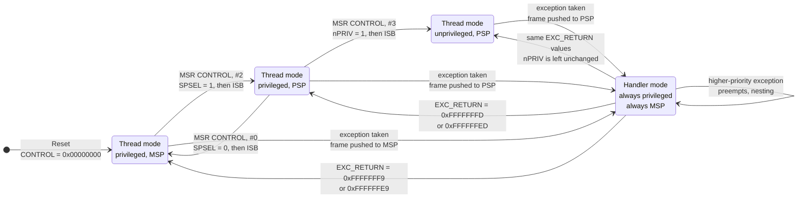

# Privilege Modes and the Two Stacks

A Cortex-M has two independent switches that most bare-metal firmware never touches, and that an RTOS depends on completely. One decides **which stack** the processor is using; the other decides **whether the code running is allowed to change anything important**. They are separate — you can be unprivileged on the main stack or privileged on the process stack — and confusing them is the source of a lot of half-right explanations.

The reason a microcontroller has this machinery at all is worth stating before the mechanism. A microcontroller has no MMU, so it cannot give tasks separate address spaces. What it can do is give them separate *stacks* and a way to stop them writing to the interrupt controller. That is a much weaker isolation than a desktop OS provides, but it is enough for the two things that actually matter in firmware: an exception handler always has a stack it can trust, and a misbehaving task cannot silently disable the system timer.

Out of reset none of this is engaged. PM0214 Rev 10 §2.1.2: "The processor enters Thread mode when it comes out of reset", and §2.1.3 adds that in Thread mode `CONTROL` bit 1 selects the stack pointer, where "0: Main Stack Pointer (MSP). **This is the reset value.**" So a fresh chip is in Thread mode, privileged, on `MSP` — and stays that way forever unless you do something about it.

:::info[Prerequisites]
[The Register Model](./cortex-m-register-model.md) introduces `MSP`, `PSP`, `CONTROL` and the exception stack frame; this page is where they are put to work. [Processes and Threads](../../computer-science/operating-systems/processes-and-threads.md) covers the general OS-side concepts of privilege separation and per-thread stacks that this hardware is a stripped-down version of.
:::

## Two modes, two privilege levels, two stacks

PM0214 Rev 10, Table 2 "Summary of processor mode, execution privilege level, and stack usage" is the whole model in four cells:

| Processor mode | Used to execute | Privilege level | Stack used |
|---|---|---|---|
| **Thread** | Applications | Privileged **or** unprivileged, per `CONTROL.nPRIV` | Main **or** process stack, per `CONTROL.SPSEL` |
| **Handler** | Exception handlers | **Always privileged** | **Main stack** |

The asymmetry is deliberate. Thread mode is where your code lives and where you get choices. Handler mode is where the processor puts itself when an exception arrives, and it removes both choices: PM0214 Rev 10 §2.1.2, "In Handler mode, the processor always uses the main stack", and §2.1.1, "Software execution is always privileged."

The state machine is small enough to draw completely.



Exception entry and return move you along the vertical edges only: the return sets `CONTROL.SPSEL` from `EXC_RETURN` but does not touch `nPRIV`, so a handler entered from an unprivileged task returns to an unprivileged task unless privileged code deliberately changes the bit.

Note the edge that is missing. **Unprivileged Thread code cannot make itself privileged again.** PM0214 Rev 10 §2.1.1 lists what unprivileged software gives up — "Has limited access to the MSR and MRS instructions, and cannot use the CPS instruction", "Cannot access the system timer, NVIC, or system control block" — and then names the only door back: "Must use the `SVC` instruction to make a supervisor call to transfer control to privileged software." That is not a limitation to work around; it is the entire point.

## The `CONTROL` register

Three bits, and every one of them matters.

| Bit | Name | Reset | Meaning (PM0214 Rev 10, Table 11) |
|---|---|---|---|
| 2 | `FPCA` | `0` | "Indicates whether floating-point context currently active… The Cortex-M4 uses this bit to determine whether to preserve floating-point state when processing an exception." |
| 1 | `SPSEL` | `0` | "Active stack pointer selection… 0: MSP is the current stack pointer. 1: PSP is the current stack pointer. **In Handler mode this bit reads as zero and ignores writes.** The Cortex-M4 updates this bit automatically on exception return." |
| 0 | `nPRIV` | `0` | "Thread mode privilege level… 0: Privileged. 1: Unprivileged." |

Two behaviours in that table are easy to read past and expensive to forget.

**`SPSEL` is hardware-managed across exceptions.** You do not restore it on the way out of a handler; the exception return does it, driven by `EXC_RETURN`. The `ExceptionReturn()` pseudocode in the *Armv7-M ARM* (DDI 0403E.e §B1.5.8) sets it explicitly per case: `when '0001'` (return to Handler) → `CONTROL.SPSEL = '0'`; `when '1001'` (Thread, Main stack) → `CONTROL.SPSEL = '0'`; `when '1101'` (Thread, Process stack) → `CONTROL.SPSEL = '1'`. This is the mechanism an RTOS context switch rides on.

**`nPRIV` only describes Thread mode.** Handler mode is privileged regardless of what `nPRIV` says. An unprivileged task that triggers an interrupt gets a privileged handler; the bit is not a global mode.

**`FPCA` is set for you.** With `FPCCR.ASPEN` at its reset value of 1, executing any floating-point instruction sets `CONTROL.FPCA` (PM0214 Rev 10 §4.6.2; *Armv7-M ARM* §B1.5.5 reset pseudocode `FPCCR.ASPEN = '1'`). Its consequence — a 104-byte exception frame instead of a 32-byte one — is worked through in [The Register Model](./cortex-m-register-model.md).

## Switching the stack pointer

There are exactly two ways to change which stack Thread mode uses, and PM0214 Rev 10 §2.1.3 names both:

> To switch the stack pointer used in Thread mode to the PSP, either: use the MSR instruction to set the Active stack pointer bit to 1… [or] perform an exception return to Thread mode with the appropriate EXC_RETURN value.

Doing it by `MSR` requires one thing the manual is emphatic about:

> When changing the stack pointer, software must use an ISB instruction immediately after the MSR instruction. This ensures that instructions after the ISB execute using the new stack pointer.

```c
/* Give Thread mode its own stack, then hand privilege away.
   PM0214 Rev 10, section 2.1.3: an ISB is required after the MSR. */
extern uint32_t process_stack_top[];   /* highest address of the region */

__set_PSP((uint32_t)process_stack_top);           /* MSR PSP, r0        */
__set_CONTROL(__get_CONTROL() | 0x2u);            /* SPSEL = 1          */
__ISB();                                          /* mandatory          */
/* From here, PUSH/POP and every local variable use the process stack. */
```

Two hazards live in those four lines and both produce spectacular, hard-to-read failures.

- **Getting the address wrong.** The stack is full descending (PM0214 Rev 10 §2.1.2), so `PSP` must be initialised to the address *just past the top* of the region, not to its base. Point it at the base and the first push writes below your buffer.
- **Doing it inside a function that has locals on the old stack.** After the switch, the compiler's frame pointer arithmetic is still generating offsets from a stack pointer that now refers to a different region. In practice the switch belongs in a `naked` function or right at the top of an RTOS's start-scheduler routine, immediately before a branch that never returns.

## Why an RTOS uses both stacks

Once you have two stack pointers, the natural division falls out on its own, and PM0214 Rev 10 §2.1.3 recommends it directly: **"In an OS environment, it is recommended that threads running in Thread mode use the process stack, and the kernel and exception handlers use the main stack."**

The reasons are concrete.

**Each task gets its own stack, sized for that task.** A task that only toggles a pin needs a few hundred bytes; one that calls `snprintf` needs a couple of kilobytes. With a single stack you would have to size one region for the worst case *plus* the worst-case interrupt nesting depth on top. With `PSP` per task, the interrupt cost is paid once, out of `MSP`.

**Interrupt depth is budgeted once, centrally.** Handler mode always uses `MSP` (PM0214 §2.1.2), so the main stack has to hold only the deepest chain of nested handlers. That is a number you can compute from your priority scheme and check, rather than something you have to add to every task's allowance.

**A task that overflows its stack damages its own region first.** This is not protection — there is nothing stopping the overflow — but it localises the damage and makes it diagnosable, and it is what makes an MPU guard region worth configuring: with per-task stacks you can place a no-access region below each one and get a MemManage fault at the instruction that overflowed rather than corruption discovered three seconds later.

**Context switching becomes cheap and regular.** The switch happens in `PendSV`, which exists for exactly this — PM0214 Rev 10 §2.3.2: "PendSV is an interrupt-driven request for system-level service. In an OS environment, use PendSV for context switching when no other exception is active." Kernels conventionally give it the lowest configurable priority so it runs only after every other pending handler has finished. The hardware has already pushed `R0`–`R3`, `R12`, `LR`, the return address and `xPSR` onto the *outgoing task's* `PSP`; the handler pushes `R4`–`R11`, saves `PSP` into the task control block, loads the next task's `PSP`, pops `R4`–`R11`, and returns with an `EXC_RETURN` whose bit 2 is set. The hardware unstacks the rest from the new task's stack. Two stack pointers are what make that possible without the kernel having to relocate anything.

## Unprivileged Thread mode, and whether it earns its keep

Setting `CONTROL.nPRIV` costs one instruction and buys you, per PM0214 Rev 10 §2.1.1: no access to the system timer, the NVIC or the system control block; no `CPS` instruction, so no disabling interrupts; and restricted `MSR`/`MRS`. Combined with an MPU it also buys per-region memory permissions.

For most firmware this is more mechanism than the problem needs, and it is honest to say so. It earns its keep in three situations:

- **Third-party or generated code** you do not want touching the interrupt controller.
- **A safety or security argument** that has to be made to someone — an unprivileged application partition is a claim you can demonstrate rather than assert.
- **Catching a class of bug early.** Unprivileged code that reaches for the NVIC faults immediately instead of half-working.

If you do use it, remember that everything the application still needs from the privileged side now has to go through `SVC` — which is exactly the system-call boundary a desktop OS has, built out of one instruction.

:::warning[Two failure modes that look like the chip is broken]
**Switching to `PSP` without initialising it.** `PSP`'s reset value is *unknown* — PM0214 Rev 10, Table 3 gives `PSP` a reset value of "Unknown", and the *Armv7-M ARM* reset pseudocode is explicit: `SP_process = ((bits(30) UNKNOWN):'00')` (DDI 0403E.e §B1.5.5). Set `CONTROL.SPSEL = 1` before writing `PSP` and the very next push goes to an address nobody chose. Sometimes that address is unmapped and you get an immediate BusFault, which is the good outcome. Sometimes it lands in the middle of your `.data` and the program keeps running while quietly corrupting variables — and the corruption appears in code that has nothing to do with the stack switch. **Always write `PSP` first, then `CONTROL`, then `ISB`.**

**Dropping privilege and then needing it back.** The transition is one-way from Thread mode: unprivileged code "cannot use the CPS instruction" and has "limited access to the MSR and MRS instructions" (PM0214 Rev 10 §2.1.1), so an `MSR CONTROL` attempting to clear `nPRIV` does not work. If you set `nPRIV = 1` before installing an `SVC` handler — or with an `SVC` handler that does not provide a way back — the only recovery is a reset. This bites hardest in startup code, where it is tempting to configure `CONTROL` "while we're here" and then discover that the next initialisation step needs the NVIC.

The related trap is quieter and worth naming because it produces no fault at all: **`SPSEL` writes are ignored in Handler mode.** PM0214 Rev 10, Table 11: "In Handler mode this bit reads as zero and ignores writes", and §2.1.3 repeats it — "the processor ignores explicit writes to the active stack pointer bit of the CONTROL register when in Handler mode". Code that tries to switch stacks from inside an ISR silently does nothing, and the developer concludes the `MSR` instruction is broken. The stack a handler returns to is chosen by `EXC_RETURN`, not by `CONTROL`.
:::

## See also

- [The Register Model](./cortex-m-register-model.md) — `MSP`/`PSP`, `CONTROL`, and the `EXC_RETURN` values that drive the transitions in the diagram above.
- [Exceptions and the Vector Table](./exceptions-and-the-vector-table.md) — how the processor gets into Handler mode in the first place, and where `SVC` and `PendSV` sit.
- [The Cortex-M Memory Map](./memory-map-and-bit-banding.md) — what unprivileged code is and is not allowed to reach, and where the NVIC and system timer actually live.
- [Processes and Threads](../../computer-science/operating-systems/processes-and-threads.md) — the general privilege-separation and per-thread-stack model this hardware implements a minimal version of.
- [Bare-Metal, RTOS, or Linux](../00-overview/bare-metal-vs-rtos-vs-linux.md) — whether you need the RTOS this page's two-stack model is built for.

## References

- STMicroelectronics — [**PM0214**, *STM32 Cortex-M4 MCUs and MPUs programming manual*](https://www.st.com/resource/en/programming_manual/pm0214-stm32-cortexm4-mcus-and-mpus-programming-manual-stmicroelectronics.pdf), consulted at **Rev 10** (March 2020). The primary source for this page: §2.1.1 "Processor mode and privilege levels for software execution" (the Thread/Handler definitions and the unprivileged capability list including the `SVC` route back), §2.1.2 "Stacks" (full descending, Handler mode always `MSP`), §2.1.3 "Core registers" with **Table 2** (mode/privilege/stack summary), **Table 3** (`PSP` reset value "Unknown"), **Table 11** (`CONTROL` field definitions) and the `MSR`-then-`ISB` requirement and the OS-environment recommendation; §4.6.2 for `FPCCR.ASPEN` and `CONTROL.FPCA`.
- Arm — [***Armv7-M Architecture Reference Manual***](https://developer.arm.com/documentation/ddi0403/latest/), consulted at **DDI 0403E.e (ID021621)**. §B1.5.5 reset pseudocode for `SP_process` being UNKNOWN at reset and `CONTROL<2:0> = '000'`; §B1.5.8 `ExceptionReturn()` for the per-case `CONTROL.SPSEL` assignment that makes exception return the second way to change stacks; and the "special-purpose CONTROL register" description in §B1.4 (page B1-519 in this revision) for the architectural definition of `SPSEL`, `nPRIV` and `FPCA`.
- STMicroelectronics — [**RM0383**, *STM32F411xC/E reference manual*](https://www.st.com/resource/en/reference_manual/rm0383-stm32f411xce-advanced-armbased-32bit-mcus-stmicroelectronics.pdf), consulted at **Rev 4** (May 2025). §2.3.1 for the 128 KB of SRAM that both stacks have to be carved out of on this part.
