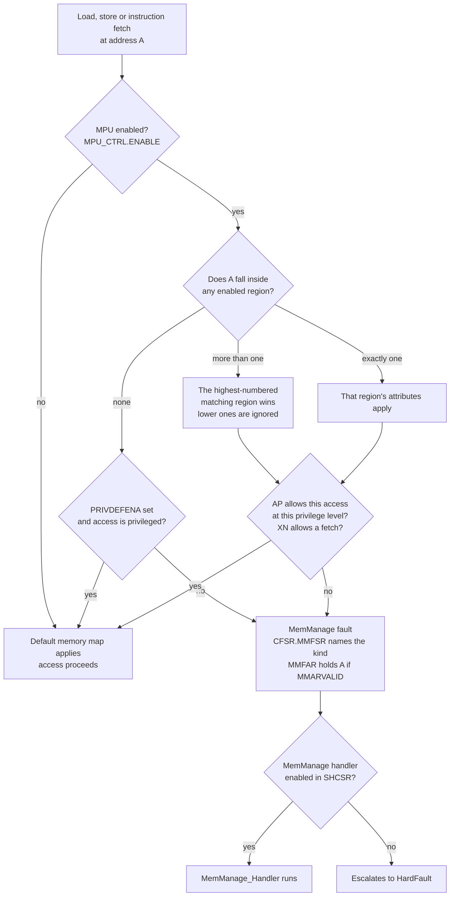

# The Memory Protection Unit

A null-pointer write on a Cortex-M does not crash. Address `0x0000_0000` is real memory — it is the start of flash, or the boot alias — so `*(uint32_t *)0 = 42` on a fresh chip silently does nothing at all, and the program carries on. A stack that overflows its intended region does not crash either; it grows down into `.bss` and corrupts variables that belong to something else, and the failure surfaces minutes later in code that is entirely innocent. Both are the same problem: **on a bare Cortex-M, memory has no permissions, so a wrong access is indistinguishable from a right one.**

The MPU is what changes that. It is a small block — eight regions on this part — that checks every load, store and instruction fetch against a table of address ranges and permissions, in parallel with the access itself, at no cycle cost. When an access does not have permission, the processor takes a MemManage fault **at the instruction that made it**, with the offending address in a register.

The mental model to keep separate from the start: **an MPU is not an MMU.** There is no address translation, no page table, no virtual memory, no swapping. Addresses go to the bus unchanged; the MPU's only power is to say "no" and raise a fault. [Virtual Memory and Paging](../../computer-science/memory-hierarchy/virtual-memory-and-paging.md) describes what the other thing does — everything there about translation, page faults and demand paging is absent here.

Which means the value proposition is narrower than "protection" suggests, and better than most people assume: the MPU turns a class of silent corruption into a loud, precise, immediate fault. That is worth having in a single-task bare-metal firmware, before any question of an RTOS or untrusted code arises.

:::info[Prerequisites]
[The Cortex-M Memory Map](./memory-map-and-bit-banding.md) covers the default memory map the MPU overrides, and the memory types (Normal, Device, Strongly-ordered) that its attribute fields select. [Privilege Modes and the Two Stacks](./privilege-modes-and-stacks.md) covers the privileged/unprivileged distinction that half the permission encodings depend on.
:::

## What the hardware checks



Three things in that diagram are the ones that trip people up, so they are worth stating flatly:

- **Overlap is resolved by region number, highest wins.** This is a feature, not a hazard: you define a large permissive background region at a low number and carve exceptions out of it at higher numbers.
- **A region-less address is a fault, unless `PRIVDEFENA` rescues it.** With `MPU_CTRL.PRIVDEFENA = 1`, privileged code falls back to the default memory map for any address no region covers. With it clear, privileged code can only touch memory you explicitly described — which is stricter, correct for a locked-down design, and the reason most first attempts at MPU configuration fault immediately.
- **A MemManage fault you never enabled arrives as a HardFault.** `SHCSR.MEMFAULTENA` resets to 0, so out of the box every MPU violation escalates. See [Exceptions and the Vector Table](./exceptions-and-the-vector-table.md) for the escalation rules; enabling the handler is one line and turns a generic HardFault into a fault with an address attached.

## The registers

Five registers at `0xE000_ED90`, and a programming model that is deliberately indexed: you select a region in `MPU_RNR`, then write its base and its attributes.

| Register | Offset | Purpose |
|---|---|---|
| `MPU_TYPER` | `0x00` | Read-only. `DREGION` = number of regions implemented; `0` means no MPU. |
| `MPU_CTRL` | `0x04` | `ENABLE`, `HFNMIENA`, `PRIVDEFENA`. |
| `MPU_RNR` | `0x08` | Which region the next `RBAR`/`RASR` write configures. |
| `MPU_RBAR` | `0x0C` | Region base address, plus a `VALID`+`REGION` shortcut that sets `RNR` in the same write. |
| `MPU_RASR` | `0x10` | Size, permissions, memory attributes, subregion disables, enable bit. |

On the STM32F411, `MPU_TYPER` reads `0x0000_0800`: `DREGION = 8`, `IREGION = 0`, `SEPARATE = 0` — eight unified regions covering both data and instruction accesses (PM0214 Rev 10 §4.2.5). Reading this register rather than assuming eight is the portable habit; Armv7-M allows 0, 8 or 16.

`MPU_RASR` is where the actual configuration lives.

| Bits | Field | Meaning |
|---|---|---|
| 0 | `ENABLE` | Region enable. |
| 5:1 | `SIZE` | Region size is **2^(SIZE+1)** bytes. Minimum `SIZE = 4` (32 bytes); maximum 31 (4 GB). |
| 7:6 | — | Reserved. |
| 15:8 | `SRD` | Subregion disable — one bit per eighth of the region. Only usable for regions of 256 bytes and above. |
| 16 | `B` | Bufferable. |
| 17 | `C` | Cacheable. |
| 18 | `S` | Shareable. |
| 21:19 | `TEX` | Type extension — with `C`, `B` and `S`, selects the memory type. |
| 23:22 | — | Reserved. |
| 26:24 | `AP` | Access permissions, below. |
| 27 | — | Reserved. |
| 28 | `XN` | Execute Never. `1` forbids instruction fetches from the region. |

Field definitions are PM0214 Rev 10 §4.2 (`MPU_RASR`) and *Armv7-M ARM* §B3.5.

**Access permissions**, from the same sources:

| `AP` | Privileged | Unprivileged | Typical use |
|---|---|---|---|
| `000` | No access | No access | A guard region. Any touch faults. |
| `001` | Read/write | No access | Kernel data, RTOS control blocks. |
| `010` | Read/write | Read-only | Shared state a task may observe but not modify. |
| `011` | Read/write | Read/write | Ordinary RAM. |
| `100` | — | — | Reserved, unpredictable. |
| `101` | Read-only | No access | Privileged constants. |
| `110` | Read-only | Read-only | Flash, `.rodata`. |
| `111` | Read-only | Read-only | Same as `110`. |

**Memory attributes** are the `TEX`/`C`/`B`/`S` combinations. In practice four presets cover almost everything on a single-core MCU:

| Memory | `TEX` | `C` | `B` | `S` | Resulting type |
|---|---|---|---|---|---|
| Internal flash | `000` | `1` | `0` | `0` | Normal, write-through cacheable |
| Internal SRAM | `000` | `1` | `1` | `0` | Normal, write-back |
| Peripheral registers | `000` | `0` | `1` | `1` | Device, shareable |
| Anything needing strict ordering | `000` | `0` | `0` | — | Strongly-ordered |

[The Cortex-M Memory Map](./memory-map-and-bit-banding.md) explains what those types actually promise about reordering and buffering. On a Cortex-M4 with no cache the `C` bit changes little in practice; on a Cortex-M7 it changes everything, which is why MPU configuration is a much bigger topic on that core.

## The alignment rule, which is not optional

**A region's base address must be aligned to its own size.** A 1 KB region can start at `0x2000_0400` but not at `0x2000_0200`. This falls out of the register format — `MPU_RBAR` only stores the address bits above the region size — and it is the single most annoying property of the v7-M MPU, because it means you cannot simply protect "this array" unless the linker put the array on a suitable boundary.

The consequences you plan around:

- Region sizes are powers of two from 32 bytes up. There is no 3 KB region; you use 2 KB plus 1 KB, or a 4 KB region with two subregions disabled.
- Anything you intend to protect must be *placed*, with a linker-script section or a compiler alignment attribute, not merely declared.
- `SRD` softens this. An 8 KB region with the top three subregions disabled covers 5 KB — still on an 8 KB-aligned base, but with a finer end boundary.

```c
/* A stack guard: a 32-byte no-access region at the low end of the stack.
   Region 7, so it overrides the permissive RAM region underneath it.
   PM0214 Rev 10, section 4.2. */
extern uint32_t _stack_guard;   /* linker: . = ALIGN(32); _stack_guard = .; . += 32; */

MPU->RNR  = 7u;
MPU->RBAR = (uint32_t)&_stack_guard;              /* 32-byte aligned */
MPU->RASR = (0u  << MPU_RASR_AP_Pos)              /* AP = 000, no access at all */
          | (1u  << MPU_RASR_XN_Pos)
          | (4u  << MPU_RASR_SIZE_Pos)            /* 2^(4+1) = 32 bytes */
          |  MPU_RASR_ENABLE_Msk;

SCB->SHCSR |= SCB_SHCSR_MEMFAULTENA_Msk;          /* real MemManage, not HardFault */
MPU->CTRL   = MPU_CTRL_PRIVDEFENA_Msk | MPU_CTRL_ENABLE_Msk;
__DSB();
__ISB();
```

That is the highest-value MPU configuration in bare-metal firmware and it is about fifteen lines: one region, one linker symbol, and stack overflow becomes a MemManage fault at the pushing instruction, with `MMFAR` pointing into the guard, instead of corrupted globals discovered later. The `DSB`/`ISB` pair matters — the barriers ensure the new configuration is in force before the next instruction is fetched (*Armv7-M ARM* §B3.5.3).

## Reading the fault

When a violation happens, `CFSR`'s low byte — the MemManage Fault Status Register — says what kind:

| Bit | Name | Meaning |
|---|---|---|
| 0 | `IACCVIOL` | Instruction fetch from a region with `XN`, or with no execute permission. |
| 1 | `DACCVIOL` | Load or store violated the region's `AP`. |
| 3 | `MUNSTKERR` | The fault happened while *un*stacking on exception return. |
| 4 | `MSTKERR` | The fault happened while stacking on exception entry — the classic stack-guard hit. |
| 5 | `MLSPERR` | Fault during lazy floating-point state preservation. |
| 7 | `MMARVALID` | `MMFAR` holds a valid faulting address. |

`MSTKERR` with `MMARVALID` set and `MMFAR` inside your guard region is a stack overflow, stated as precisely as hardware can state anything. Note that `MMARVALID` is not always set — an instruction-fetch violation often has nothing useful to put in `MMFAR` — so check the bit before believing the address.

## Armv8-M is a different MPU

The Cortex-M23, M33 and M55 have an MPU with the same *name* and a different programming model: regions are described by a base and a **limit** address rather than a base and a power-of-two size, alignment is to 32 bytes regardless of length, memory attributes are indirected through `MAIR0`/`MAIR1` instead of encoded per region, and there are no subregions. The alignment rule that dominates this page simply does not exist there. Configuration code does not port; the concepts — regions, permissions, `XN`, background map, MemManage — do.

:::warning[The three configurations that turn the MPU into a brick]
**Enabling the MPU with `PRIVDEFENA` clear and no region covering your code.** The instant `MPU_CTRL.ENABLE` is written, every address outside a defined region is off-limits — including the flash the next instruction is being fetched from and the stack the fault handler needs. The result is an immediate MemManage that escalates to HardFault, whose handler cannot stack a frame, which is lockup. The board is dead in the instruction after the enable, and single-stepping through it looks like the write itself crashed the chip. Set `PRIVDEFENA` while you are learning, and only take it away once every region you need is defined and tested.

**A misaligned base address, which does not fault — it moves your region.** `MPU_RBAR` ignores the address bits below the region size. Configure a 4 KB region at `0x2000_0800` and the hardware stores `0x2000_0000`: your region is 2 KB earlier than you asked for, protecting something you never intended and leaving the real target unprotected. There is no error. Verify by reading `MPU_RBAR` back and comparing — the same two-line assertion that catches a misaligned `VTOR`.

**Forgetting the barriers after reconfiguration.** The MPU is consulted by the memory system and by the instruction fetch path; without a `DSB` after the last register write and an `ISB` before relying on it, an access already in flight — or an instruction already fetched — can be checked against the previous configuration. The symptom is a fault that happens once, on the first run after a reconfiguration, and never reproduces when you step through it.

And one that is not a configuration error but a design one: **an MPU region does not protect against DMA.** The MPU sits in the processor's access path only. A DMA controller is a separate bus master and never consults it, so a rogue DMA descriptor will happily write into your guard region, your stack, or your vector table with no fault at all. Protecting against that requires the vendor's bus-level facilities, if the part has any — it is not something the MPU can do.
:::

## See also

- [The Cortex-M Memory Map](./memory-map-and-bit-banding.md) — the default map the MPU overrides, the memory types its attribute fields select, and the System-space `XN` rule an MPU cannot change.
- [Exceptions and the Vector Table](./exceptions-and-the-vector-table.md) — MemManage as exception 4, and why it escalates to HardFault until you enable it.
- [Privilege Modes and the Two Stacks](./privilege-modes-and-stacks.md) — the privileged/unprivileged split the `AP` encodings are built on, and the per-task stacks a guard region protects.
- [SysTick and the Core Peripherals](./systick-and-core-peripherals.md) — where `SHCSR`, `CFSR` and `MMFAR` sit in the System Control Block.
- [Virtual Memory and Paging](../../computer-science/memory-hierarchy/virtual-memory-and-paging.md) — the thing an MPU is repeatedly, and wrongly, assumed to be.

## References

- STMicroelectronics — [**PM0214**, *STM32 Cortex-M4 MCUs and MPUs programming manual*](https://www.st.com/resource/en/programming_manual/pm0214-stm32-cortexm4-mcus-and-mpus-programming-manual-stmicroelectronics.pdf), consulted at **Rev 10** (March 2020). §4.2 "Memory protection unit (MPU)" for the whole register set — `MPU_TYPER` (and §4.2.5's `0x0000 0800` reset value giving `DREGION = 8` on this part), `MPU_CTRL` with `HFNMIENA` and `PRIVDEFENA`, `MPU_RNR`, `MPU_RBAR` and `MPU_RASR` field definitions, the access-permission encodings, the subregion rules, the update procedure and the design hints; §4.4 for `SHCSR.MEMFAULTENA`, `CFSR`'s MemManage byte and `MMFAR`.
- Arm — [***Armv7-M Architecture Reference Manual***](https://developer.arm.com/documentation/ddi0403/latest/), consulted at **DDI 0403E.e (ID021621)**. §B3.5 "Protected Memory System Architecture, PMSAv7" is the normative definition: region matching and the highest-numbered-region rule, the `DefaultPermissions()` background map, the alignment requirement implied by the `MPU_RBAR` format, the `TEX`/`C`/`B`/`S` memory-type table, and §B3.5.3 on the barriers required around an MPU update. Also the rule that System space is always `XN` and an enabled MPU cannot change it.
- Arm — [***Armv8-M Architecture Reference Manual***](https://developer.arm.com/documentation/ddi0553/latest/) (DDI 0553). Consulted only to characterise the difference: the v8-M PMSA uses `MPU_RBAR`/`MPU_RLAR` base-and-limit pairs with 32-byte granularity and indirect attributes via `MPU_MAIR0`/`MPU_MAIR1`. Relevant if you expect this page's configuration code to move to a Cortex-M33; it does not.
- Arm — **CMSIS-Core(M)**, `core_cm4.h` and `mpu_armv7.h`. `MPU_Type`, the `MPU_RASR_*_Pos`/`_Msk` macros used above, and the `ARM_MPU_RASR()` and `ARM_MPU_SetRegion()` helpers, which are worth preferring to hand-assembled register values precisely because the size and alignment arithmetic is where the mistakes are.
