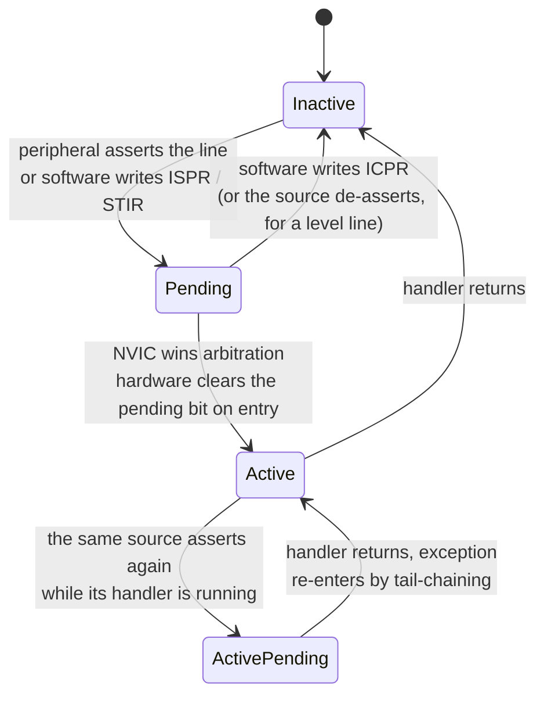

# The NVIC

The vector table answers *where*. The **Nested Vectored Interrupt Controller** answers *whether*, *when*, and *in what order* — and it is the only part of the exception model you actively program. Every interrupt line on the chip arrives at the NVIC; the NVIC decides whether that line is enabled, records it as pending if it is not yet serviceable, compares its priority against whatever the processor is currently doing, and hands the winner to the core.

The mental model that makes the rest of this page fall into place: **the NVIC holds three bits of state per interrupt — enabled, pending, active — and one priority byte.** Everything you do to an interrupt is a manipulation of those four things. Enabling is not clearing. Pending is not active. A priority number is not a priority level. Most NVIC bugs are one of those three sentences learned the hard way.

The controller is Arm's, not ST's, so it sits at the same address and behaves the same way on every Cortex-M. What the vendor chooses is how many lines are wired to it and — the detail that catches most people — **how many bits of the priority byte actually exist**.

:::info[Prerequisites]
[Exceptions and the Vector Table](./exceptions-and-the-vector-table.md) covers what happens once an exception wins arbitration: the stack frame, the vector fetch, tail-chaining and late arrival as mechanisms. This page is about the arbitration itself. [I/O and Interrupts](../../computer-science/buses-and-io/io-and-interrupts.md) owns the general interrupt-versus-polling model; [The Register Model](./cortex-m-register-model.md) covers `PRIMASK`, `FAULTMASK` and `BASEPRI`, which mask what the NVIC is offering.
:::

## The register set

Every NVIC register lives in the System Control Space inside the Private Peripheral Bus, at fixed architectural addresses (*Armv7-M ARM* DDI 0403E.e §B3.4, "Nested Vectored Interrupt Controller, NVIC").

| Register | Address | Access | What a write does |
|---|---|---|---|
| `NVIC_ISER0`–`ISER7` | `0xE000_E100` + 4n | RW | **Write 1 to enable.** Writing 0 does nothing. Reads back the current enable state. |
| `NVIC_ICER0`–`ICER7` | `0xE000_E180` + 4n | RW | **Write 1 to disable.** Writing 0 does nothing. Reads back the enable state, same as `ISER`. |
| `NVIC_ISPR0`–`ISPR7` | `0xE000_E200` + 4n | RW | **Write 1 to force pending** — a software-raised interrupt. |
| `NVIC_ICPR0`–`ICPR7` | `0xE000_E280` + 4n | RW | **Write 1 to clear pending.** |
| `NVIC_IABR0`–`IABR7` | `0xE000_E300` + 4n | RO | Active bits. Set while a handler is executing, including while it is preempted. |
| `NVIC_IPR0`–`IPR59` | `0xE000_E400` + 4n | RW | Four **byte-wide** priority fields per word, one byte per interrupt. |
| `NVIC_STIR` | `0xE000_EF00` | WO | Write an interrupt number to make it pending. Unprivileged access is gated by `CCR.USERSETMPEND`. |

Two structural points about that table.

**The set/clear register pairs exist so that enabling one interrupt is not a read-modify-write.** `NVIC->ISER[0] = (1u << 6)` enables interrupt 6 and touches nothing else — no read, no mask, no race with an interrupt that fires in between. This is the same design as the GPIO `BSRR` register and for the same reason. Code that does `NVIC->ISER[0] |= (1u << 6)` works, but it is a read-modify-write for no reason, and the read returns the *enable* state, which is not what a naive reader of that line expects.

**The priority registers are the documented exception to the word-access rule.** The PPB otherwise requires word accesses ([The Cortex-M Memory Map](./memory-map-and-bit-banding.md) covers why), but `NVIC_IPRn` is explicitly byte-addressable so a single interrupt's priority can be written without disturbing its three neighbours. CMSIS exposes it as `NVIC->IP[IRQn]`, a byte array.

On the STM32F411 the interrupt table runs to position 85 (RM0383 Rev 4, Table 37), so only `ISER0`–`ISER2` and `IPR0`–`IPR21` have any bits wired up. Registers beyond that exist architecturally and read as zero.

## Enabled, pending, active

These three bits are independent, and every combination is reachable.



- **Pending is sticky and survives being disabled.** An interrupt that fires while its `ISER` bit is 0 still sets its pending bit. Enable it later and it fires immediately — for something that was disabled during initialisation, that "immediately" is the first instruction after the enable, which is usually not what was intended. Clear the pending bit before enabling: write `ICPR` first, then `ISER`.
- **The pending bit is cleared by hardware at exception entry**, not at handler exit. So a source that re-asserts *while its own handler is running* sets pending again, and the handler is re-entered by tail-chaining after it returns. That is the correct behaviour for a device that produced a second event — and a hang for a device whose flag was never cleared.
- **Active means "on the stack", not "running".** A preempted handler is still active. Both `IABR` bits are set when a high-priority interrupt has preempted a low-priority one. This is the bit a fault handler reads to reconstruct what was in flight.

`PRIMASK` and `BASEPRI` sit downstream of all of this: they prevent an exception from *activating*, so a masked interrupt accumulates in the pending bit and is delivered the moment the mask is lifted. Masking loses nothing except ordering; disabling in `ICER` also loses nothing, because the pending bit still latches. Neither is a way to discard an event.

## The priority byte that is not a byte

Architecturally each interrupt gets an 8-bit priority field, so 256 levels. Almost no implementation provides them.

```wavedrom title="One NVIC_IPRn priority byte on the STM32F411" alt="Bit-field strip of an 8-bit NVIC priority field showing bits 7 to 4 implemented and bits 3 to 0 unimplemented"
{ reg: [
    { bits: 4, name: "unimplemented", type: 1 },
    { bits: 4, name: "priority", type: 3 }
  ],
  config: { bits: 8, hspace: 600 }
}
```

| Bits | Field | Reset | Meaning |
|---|---|---|---|
| 7:4 | Priority | `0b0000` | The four implemented bits. 16 levels, `0` the most urgent. |
| 3:0 | — | `0b0000` | Not implemented on this part. Writes are ignored, reads return zero. |

RM0383 Rev 4 §10.1.1 states the count for this device: "16 programmable priority levels (4 bits of interrupt priority are used)." The Armv7-M architecture allows an implementation to provide between 3 and 8 bits, always the **most significant** ones, with the unimplemented low bits reading as zero (*Armv7-M ARM* §B3.4.5). Three bits is common on small parts, four on most STM32s, and eight on essentially nothing.

Two consequences that produce real bugs:

**The value you write is not the level you get.** Writing `3` to `NVIC->IP[irq]` sets bits `[1:0]` — both unimplemented — so the register reads back `0`, the most urgent level. Write `1`, `2` and `3` to three interrupts and all three end up at priority 0, ordered by interrupt number, with no error and no warning. CMSIS's `NVIC_SetPriority()` does the shift for you:

```c
/* CMSIS core_cm4.h, paraphrased. __NVIC_PRIO_BITS is 4 on the STM32F4 family. */
NVIC->IP[irq] = (uint8_t)((priority << (8u - __NVIC_PRIO_BITS)) & 0xFFu);
```

So `NVIC_SetPriority(TIM2_IRQn, 3)` writes `0x30`. Use the CMSIS function and think in 0–15; write the register directly and you must pre-shift.

**`BASEPRI` takes the register-shaped value, not the CMSIS-shaped one.** `__set_BASEPRI(5)` is a mistake: 5 lands in the unimplemented nibble and masks nothing. `__set_BASEPRI(5 << (8 - __NVIC_PRIO_BITS))` — that is, `0x50` — masks everything at level 5 and below. The two APIs look symmetric and are not.

## Priority grouping

The priority byte is split by a **binary point** into a *group* (preempt) part and a *sub* part. Only the group part decides preemption; the sub part only breaks ties between two interrupts that are pending simultaneously at the same group priority. The split is set once, globally, by `AIRCR.PRIGROUP[10:8]` (PM0214 Rev 10 §4.4.5, `AIRCR`).

| `PRIGROUP` | Binary point | Group bits | Sub bits | Group priorities | Subpriorities | Effective on the STM32F411 (4 bits) |
|---|---|---|---|---|---|---|
| `0b000` | `0bxxxxxxx.y` | `[7:1]` | `[0]` | 128 | 2 | 16 groups, 1 sub — the sub bit does not exist |
| `0b001` | `0bxxxxxx.yy` | `[7:2]` | `[1:0]` | 64 | 4 | 16 groups, 1 sub |
| `0b010` | `0bxxxxx.yyy` | `[7:3]` | `[2:0]` | 32 | 8 | 16 groups, 1 sub |
| `0b011` | `0bxxxx.yyyy` | `[7:4]` | `[3:0]` | 16 | 16 | 16 groups, 1 sub |
| `0b100` | `0bxxx.yyyyy` | `[7:5]` | `[4:0]` | 8 | 32 | 8 groups, 2 subs |
| `0b101` | `0bxx.yyyyyy` | `[7:6]` | `[5:0]` | 4 | 64 | 4 groups, 4 subs |
| `0b110` | `0bx.yyyyyyy` | `[7]` | `[6:0]` | 2 | 128 | 2 groups, 8 subs |
| `0b111` | `0b.yyyyyyyy` | none | `[7:0]` | 1 | 256 | 1 group, 16 subs — nothing preempts anything |

`AIRCR` resets to `PRIGROUP = 0b000`, and writes to it require the key: bits `[31:16]` must be `0x5FA` or the write is ignored entirely (PM0214 Rev 10 §4.4.5). `NVIC_SetPriorityGrouping()` handles that.

The right-hand column is the part worth internalising. With only four implemented bits, `PRIGROUP` values `0b000` through `0b011` are **indistinguishable** — the sub-priority bits they nominate are all unimplemented, so you get 16 preemption levels and no sub-priorities. ST's HAL calls `0b011` "`NVIC_PRIORITYGROUP_4`" (four bits of preemption) and CubeMX selects it by default, which is a sensible choice; it just means the "sub priority" field in the CubeMX NVIC dialog does nothing at all on that setting. If you genuinely want sub-priorities on this part you must give up preemption levels for them: `0b101` buys four preemption groups and four subpriorities each.

## Nesting, and the two optimisations that make it cheap

Preemption happens when a newly pending exception's group priority is numerically **lower** than the processor's current execution priority. Equal group priorities do not preempt — the second one waits and tail-chains. PM0214 Rev 10 §2.3.5 gives the direction of the comparison: "A lower priority value indicating a higher priority."

The cost of that is what the NVIC's design is optimised around. Arm quotes **12 cycles** from the interrupt signal to the first instruction of the handler on a Cortex-M4 with zero-wait-state memory, and **6 cycles** for a tail-chained transition from one handler to the next (Arm, *Cortex-M4 Technical Reference Manual*, DDI 0439, exception-handling chapter). The saving is exactly the push and the pop that tail-chaining skips.

```wavedrom title="Two back-to-back interrupts: tail-chaining versus the pop-and-push it replaces" alt="Timeline comparing a tail-chained transition between two interrupt handlers against an unstack followed by a re-stack"
{ signal: [
    { name: "IRQ A",                      wave: "0.10.........................." },
    { name: "IRQ B",                      wave: "0.......10...................." },
    { name: "as implemented",             wave: "3..4...5.....6.7.....8..3.....",
      data: ["thread", "stack (12 cyc)", "ISR A", "tail-chain (6 cyc)", "ISR B", "unstack", "thread"] },
    { name: "if the frame were popped",   wave: "3..4...5.....8..4...7.....8..3",
      data: ["thread", "stack", "ISR A", "unstack", "stack again", "ISR B", "unstack", "thread"] }
  ],
  config: { hscale: 1 }
}
```

The bottom row is a counterfactual — the hardware never does it — but it is the shape most people picture, and the gap at the right-hand end is what the optimisation is worth. Two more behaviours in the same family:

- **Late arrival.** A higher-priority exception that arrives while the frame for a lower-priority one is still being stacked takes over the vector fetch. The stacking is not restarted, because the frame is identical either way.
- **Pop preemption.** An exception that arrives while a frame is being *un*stacked causes the pop to be abandoned and the new handler to be tail-chained instead. The frame is still on the stack, so there is nothing to redo.

All three are the same idea: the exception frame is generic, so the hardware manipulates it as little as possible. [Exceptions and the Vector Table](./exceptions-and-the-vector-table.md) shows where they sit in the entry and exit sequence.

Two practical notes on nesting depth. Every level of preemption costs another stack frame — 32 bytes, or 104 with floating-point context ([Floating Point and DSP Extensions](./floating-point-and-dsp.md)). With 16 priority levels, the theoretical worst case is 16 nested frames plus the faults; budgeting for it is usually pointless, but budgeting for *zero* nesting because "my interrupts are short" is how a stack overflow gets discovered in the field. And the 12-cycle figure assumes zero-wait-state memory: on the STM32F411 running at 100 MHz, flash needs 3 wait states, so real entry latency depends on whether the vector and the handler are in the ART accelerator's cache (RM0383 Rev 4 §3.4).

:::warning[Three NVIC mistakes that produce plausible, wrong behaviour]
**Writing an unshifted priority.** `NVIC->IP[TIM2_IRQn] = 2;` compiles, runs, and sets priority 0 — the *highest*. Do this for several interrupts with "different" priorities and they all collapse to 0, ordered by interrupt number, so the system appears to have a priority scheme and does not. The symptom arrives weeks later as a timing anomaly under load. The same mistake in the other direction, `__set_BASEPRI(3)`, produces a critical section that protects nothing. Rule: **0–15 goes through CMSIS, register writes are pre-shifted**, and if you are unsure which API you are holding, read `NVIC->IP[irq]` back and check it is not zero.

**Clearing the peripheral flag at the end of the handler.** The write that clears a device's interrupt flag goes into the write buffer; the handler returns before it reaches the peripheral; the line is still asserted; the NVIC re-pends the interrupt and you re-enter the handler. Usually it happens exactly once, so the handler runs twice per event — one extra byte read from a UART, one extra encoder count, one duplicated packet. Clear the flag **first**, at the top of the handler, and if it must be last, read the register back or issue a `DSB` before returning. This one is nasty because the duplicate is real work, not a crash: the system keeps running and the numbers are quietly wrong.

**Assuming `NVIC_DisableIRQ()` takes effect on the next instruction.** `ICER` is written through the same buffer. If the very next thing you do depends on the interrupt being off, insert `__DSB(); __ISB();` — Arm's own NVIC design guidance calls for exactly that. Without it, an interrupt can be taken *after* the instruction that disabled it, which reads as a compiler or hardware bug and is neither.

A fourth, less common but harder to find: **enabling an interrupt whose pending bit was set during initialisation.** Configuring a peripheral often sets its flag as a side effect — an EXTI line configured for both edges, a timer that overflowed while you were setting it up. The `ISER` write then delivers an interrupt immediately, before the driver's state is ready. Write `ICPR` before `ISER` as a matter of habit; it costs one instruction and removes the whole class.
:::

## See also

- [Exceptions and the Vector Table](./exceptions-and-the-vector-table.md) — the entry and exit sequence the NVIC feeds, and where the system exceptions get their priorities from.
- [The Register Model](./cortex-m-register-model.md) — `PRIMASK`, `FAULTMASK` and `BASEPRI`, the masks that sit between the NVIC's decision and the processor.
- [SysTick and the Core Peripherals](./systick-and-core-peripherals.md) — the rest of the System Control Space, including the SCB registers `AIRCR` and `ICSR` this page writes to.
- [Privilege Modes and the Two Stacks](./privilege-modes-and-stacks.md) — why unprivileged code cannot reach the NVIC at all, and what `CCR.USERSETMPEND` relaxes.
- [I/O and Interrupts](../../computer-science/buses-and-io/io-and-interrupts.md) — the general model of interrupt-driven I/O that this controller implements.

## References

- STMicroelectronics — [**PM0214**, *STM32 Cortex-M4 MCUs and MPUs programming manual*](https://www.st.com/resource/en/programming_manual/pm0214-stm32-cortexm4-mcus-and-mpus-programming-manual-stmicroelectronics.pdf), consulted at **Rev 10** (March 2020). §4.3 "Nested vectored interrupt controller (NVIC)" for the register descriptions, the set/clear semantics, the byte-addressable priority registers and the design hints on disabling interrupts; §4.4.5 for `AIRCR`, the `PRIGROUP` field and the `0x5FA` write key; §2.3.5 for the priority ordering rule quoted; §2.3.7 for tail-chaining and late arrival.
- Arm — [***Armv7-M Architecture Reference Manual***](https://developer.arm.com/documentation/ddi0403/latest/), consulted at **DDI 0403E.e (ID021621)**. §B3.4 "Nested Vectored Interrupt Controller, NVIC" for the architectural register addresses in the System Control Space and the rule that an implementation provides between 3 and 8 priority bits, always the most significant ones with the remainder RAZ/WI; §B3.2 for `AIRCR` and the priority-grouping definition; §B1.5 for the exception-entry preemption rules.
- Arm — [***Cortex-M4 Technical Reference Manual***](https://developer.arm.com/documentation/ddi0439/latest/) (DDI 0439). The source for the cycle figures: 12 cycles of interrupt latency and 6 cycles for a tail-chained transition, both for zero-wait-state memory. These are properties of the *processor implementation*, not of the architecture — an M0+ or an M7 differs, and so does the same core behind slower memory.
- STMicroelectronics — [**RM0383**, *STM32F411xC/E reference manual*](https://www.st.com/resource/en/reference_manual/rm0383-stm32f411xce-advanced-armbased-32bit-mcus-stmicroelectronics.pdf), consulted at **Rev 4** (May 2025). §10.1.1 for the four implemented priority bits and the 52 maskable channels; **Table 37** for the interrupt positions that determine how many `ISER`/`IPR` words are populated; §3.4 for the flash wait states and ART accelerator that make the real-world entry latency longer than the TRM's figure.
- Arm — **CMSIS-Core(M)**, `core_cm4.h`. `NVIC_SetPriority()`, `NVIC_EnableIRQ()`, `NVIC_SetPriorityGrouping()` and the `__NVIC_PRIO_BITS` device macro. Worth reading rather than just calling: the shift in `NVIC_SetPriority()` is the whole reason the CMSIS priority scale and the register contents differ.
