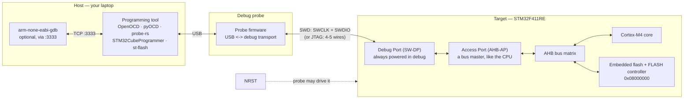

# Flashing and Programming

On a hosted system, "running the program" means handing a file to a loader. Here it means **writing your image into non-volatile memory inside the chip and then resetting it**, using a second piece of hardware that talks to the silicon over a two-wire debug port. That second piece of hardware is doing considerably more than copying bytes: it halts the core, drives the flash controller through a sequence the reference manual specifies, verifies, and releases reset.

The mental model is a chain, and every failure to flash is a break at one identifiable link in it:



The load-bearing idea in that diagram: **the Access Port is a bus master in its own right.** It is not asking the CPU to do anything. It reads and writes the AHB bus directly, which is why a probe can read RAM while the core is halted, and why it can still reach the flash controller when your firmware has wedged itself in a fault loop. It is also why a probe can recover a chip whose program is hostile — up to a point, and that point is the subject of the warning at the end.

:::info[Prerequisites]
[Reset and Boot Configuration](../01-hardware-foundations/reset-and-boot-configuration.md) owns `BOOT0`, the system-memory bootloader and the reset sources this page manipulates. [Lab Equipment](../01-hardware-foundations/lab-equipment.md) covers the on-board ST-LINK as a piece of bench equipment. [Reading the Map File](./elf-map-files-and-size.md) is where the `.elf`, `.bin` and `.hex` being flashed come from.
:::

## SWD and JTAG are transports, not protocols you write

Both carry the same thing — Arm's Debug Access Port protocol — over different wiring.

| | **JTAG** | **SWD (Serial Wire Debug)** |
|---|---|---|
| Pins | 4 mandatory (`TCK`,`TMS`,`TDI`,`TDO`) + optional `nTRST` | **2** (`SWCLK`, `SWDIO`) |
| Origin | IEEE 1149.1 boundary scan, predates Arm's use of it | Arm-specific, designed for pin-limited parts |
| Daisy-chaining | Yes, several devices on one chain | No (multidrop SWD exists, rarely used) |
| Boundary scan | Yes | No |
| On Cortex-M | Supported on most parts | **The default choice** |

On any modern Cortex-M, use SWD. Two pins instead of four matters on a 64-pin part, every probe supports it, and the JTAG-only capabilities — boundary scan, chaining a CPLD and an MCU on one connector — are board-bring-up concerns rather than firmware ones. On the NUCLEO-F411RE the decision is made for you: the on-board ST-LINK is wired to the target's SWD pins.

Add one more signal to the mental picture: **SWO**, the single-wire trace output. It is not part of SWD — it is a separate pin carrying ITM trace data out of the core, which is how `printf`-style output reaches a debugger without a UART. Cheap probes often omit it.

## The tools, and which to reach for

| Tool | Probes it drives | Language / ecosystem | Reach for it when |
|---|---|---|---|
| **OpenOCD** | ST-LINK, J-Link, CMSIS-DAP, FT2232, many more | C, config-file driven | The general default; scriptable, in every distro, drives almost anything |
| **STM32CubeProgrammer** (`STM32_Programmer_CLI`) | ST-LINK, plus UART/USB bootloader | ST, GUI + CLI | STM32 only, but the authority on option bytes and readout protection |
| **pyOCD** | CMSIS-DAP, ST-LINK, J-Link | Python | Python tooling, automated test rigs, easy scripting |
| **probe-rs** | CMSIS-DAP, ST-LINK, J-Link | Rust | Rust firmware (`cargo embed`, `probe-rs run`), and RTT logging |
| **`st-flash`** (stlink-tools) | ST-LINK only | C, minimal | You want one small binary that writes a `.bin` and nothing else |
| **SEGGER J-Link tools** | J-Link only | SEGGER | You have a J-Link; unbeatable flash speed and RTT |
| **`dfu-util`** | No probe — USB device | C | Field updates over USB, or no debug connector on the board |

For the NUCLEO-F411RE with its on-board ST-LINK, either OpenOCD or STM32CubeProgrammer covers everything. OpenOCD is the better default for a build system because it is scriptable and vendor-neutral; CubeProgrammer is the one to reach for when the question involves option bytes.

## Flashing, concretely

```bash
# OpenOCD, one shot: program, verify, reset, exit.
openocd -f interface/stlink.cfg -f target/stm32f4x.cfg \
        -c "program build/blink.elf verify reset exit"

# OpenOCD as a persistent GDB server, for an edit-debug loop.
openocd -f interface/stlink.cfg -f target/stm32f4x.cfg
# then, in another terminal:
arm-none-eabi-gdb build/blink.elf -ex "target extended-remote :3333" \
                                  -ex "load" -ex "monitor reset halt"

# ST's CLI. Note the explicit address for a raw .bin.
STM32_Programmer_CLI -c port=SWD -w build/blink.bin 0x08000000 -v -rst

# Minimal.  An .elf or .hex carries its own addresses; a .bin does not.
st-flash write build/blink.bin 0x08000000

# pyOCD and probe-rs.
pyocd flash -t stm32f411re build/blink.elf
probe-rs download --chip STM32F411RETx build/blink.elf
```

Two things are worth internalising from that list.

**`program … verify reset exit` is the form to memorise.** `verify` reads the flash back and compares — it costs a second and catches a marginal probe connection, a bad USB cable and a failing flash cell, all of which otherwise present as "my code does not work". `reset` means you are testing what you just wrote rather than what was there before.

**`.elf` and `.hex` contain addresses; `.bin` does not.** A `.bin` is raw bytes and *you* must supply `0x08000000`. Getting that wrong writes your vector table to the wrong place, which produces a completely dead board — no LED, no fault, nothing. Prefer flashing the ELF: it carries its own load addresses, and the tool cannot misplace it.

## When there is no probe: bootloaders and DFU

Every STM32 ships with a factory-programmed bootloader in system memory. Pull `BOOT0` high, reset, and the part runs ST's code instead of yours — on the STM32F411 that means USART1, USART2, I²C, SPI or **USB in DFU mode**, per [Reset and Boot Configuration](../01-hardware-foundations/reset-and-boot-configuration.md) and ST's AN2606.

```bash
dfu-util -l                                                  # is it enumerating?
dfu-util -a 0 -s 0x08000000:leave -D build/blink.bin         # write and run
```

This matters for two reasons beyond convenience. It is the **field-update path** for a product with no debug connector — most shipped hardware. And it is a **recovery path** when SWD is unavailable, which is the situation the next section is about.

## When the target stops responding to the probe

```text
Error: init mode failed (unable to connect to the target)
Error: [stm32f4x.cpu] Examination failed
Warn : target stm32f4x.cpu examination failed
```

Almost always this is not a broken chip. Work down this list, cheapest first:

1. **The obvious physical layer.** Is the board powered — is `LD3` on? Is the USB cable a data cable rather than a charge-only one? Is `CN2`'s ST-LINK/target jumper pair fitted? Is `BOOT0` jumpered high from an experiment you forgot about?

2. **Your firmware is fighting the probe.** This is the interesting case and the most common one once the physical layer is sound. If your code reconfigures `PA13`/`PA14` — the SWD pins — as GPIO, or enters a low-power mode with the debug interface disabled, or crashes into a reset loop before the probe can attach, the debug port is only reachable for the microseconds between reset release and the offending instruction.

   **Connect under reset** wins that race: the probe asserts `NRST`, establishes the debug connection while the core is held in reset, then releases it with the core already halted.

   ```bash
   openocd -f interface/stlink.cfg -c "reset_config srst_only srst_nogate connect_assert_srst" \
           -f target/stm32f4x.cfg -c "program build/blink.elf verify reset exit"

   STM32_Programmer_CLI -c port=SWD mode=UR -w build/blink.bin 0x08000000
   #                                  ^^^^^^^ "under reset"
   ```

   This recovers the overwhelming majority of "bricked" boards, and it is the reason `NRST` is worth wiring to your debug connector on a custom board.

3. **Mass erase, then reconnect.** If you can get one connection, erase everything so the hostile firmware is gone before it can run again.

   ```bash
   STM32_Programmer_CLI -c port=SWD mode=UR -e all
   openocd -f interface/stlink.cfg -f target/stm32f4x.cfg -c "init; reset halt; stm32f2x mass_erase 0; exit"
   ```

4. **Boot the system bootloader instead of your code.** `BOOT0` high, reset, then flash over USB DFU or UART. Your firmware never runs, so it cannot interfere.

5. **Now suspect the hardware.** Reflow the connector, check `NRST` is not stuck low, check for a shorted supply. This is where the multimeter comes in, and it is genuinely the last step, not the first.

:::warning[Readout protection Level 2 is permanent, and a Level 1 mistake erases everything]
The flash readout protection option byte is the one setting on the whole part that can turn a working board into landfill, and it does so exactly as documented — this is not a bug, it is the feature working.

RM0383 Rev 4 §3.6.2 defines three levels via the `RDP` byte in the option bytes:

| Level | `RDP` value | Debug access | Getting back |
|---|---|---|---|
| **0** | `0xAA` | Full | — (this is the default) |
| **1** | anything else | Flash unreadable while debugging; SRAM/option bytes reachable | Yes — **and the regression to Level 0 mass-erases the flash** |
| **2** | `0xCC` | **Debug port permanently disabled** | **No. Irreversible.** |

**Level 2 is final.** The reference manual states the option is irreversible when Level 2 is programmed: the JTAG/SWD interface is disabled at the silicon level, the bootloader is disabled, and there is no unlock sequence, no vendor tool, and no ST support case. A part at Level 2 will only ever run the firmware already inside it. If that firmware has no field-update mechanism of its own, the board is finished — you cannot debug it, reprogram it, or read it. Setting Level 2 on a development board by accident is a genuinely destroyed board.

Never set `RDP` to `0xCC`. Not to try it, not on a board you think is a throwaway. On a production line it is a deliberate, reviewed, final step, and it belongs behind a check that the device has a working authenticated update path.

**Level 1 has a smaller trap that catches people much more often.** It is reversible, but going back to Level 0 triggers a **mass erase of the entire flash** — by design, so that protection cannot be lifted to read out someone's firmware. Your code is gone. This surprises people who set Level 1 to test that it worked and then cleared it expecting the firmware to survive.

Related, on the same option bytes: **write protection (`nWRP`)** on a sector makes flashing that sector fail, often with a tool error that says only "programming failed". If a previously working flash command starts failing on one region, read the option bytes before you doubt your image:

```bash
STM32_Programmer_CLI -c port=SWD -ob displ      # show every option byte
STM32_Programmer_CLI -c port=SWD -ob RDP=0xAA   # Level 0 — mass-erases if lowering from Level 1
```

The habit worth keeping: **read the option bytes before writing them, and never write `RDP` from a script you have not read line by line.** A copy-pasted "unlock the chip" command from a forum is the single most likely way to arrive at Level 2.
:::

## See also

- [Reset and Boot Configuration](../01-hardware-foundations/reset-and-boot-configuration.md) — `BOOT0`, the system-memory bootloader, and the reset sources a probe drives.
- [Lab Equipment](../01-hardware-foundations/lab-equipment.md) — the on-board ST-LINK, its virtual COM port, and the meter you reach for at step 5.
- [Reading the Map File](./elf-map-files-and-size.md) — where the `.elf`, `.bin` and `.hex` come from, and why the ELF is the safer thing to flash.
- [CMake for Embedded](./cmake-for-embedded.md) — wiring the OpenOCD command above into a `flash` build target.
- [Build Systems and Vendor Tooling](./build-systems-and-vendor-tools.md) — what `pio run -t upload` and `west flash` are doing underneath.
- [The Cortex-M Memory Map](../02-processor-architecture/memory-map-and-bit-banding.md) — why `0x08000000` is the address a raw `.bin` must be written to.

## References

- STMicroelectronics — [**UM1724**, *STM32 Nucleo-64 boards (MB1136)*](https://www.st.com/resource/en/user_manual/um1724-stm32-nucleo64-boards-mb1136-stmicroelectronics.pdf), consulted at **Rev 17** (September 2025). §7.4 "Embedded ST-LINK/V2-1" for the on-board probe, its SWD wiring to the target, the `CN2` jumpers that select on-board versus external target, and the mass-storage drag-and-drop and virtual COM port interfaces. Rev 17 renumbered this chapter from §6.x to §7.x.
- STMicroelectronics — [**RM0383**, *STM32F411xC/E reference manual*](https://www.st.com/resource/en/reference_manual/rm0383-stm32f411xce-advanced-armbased-32bit-mcus-stmicroelectronics.pdf), consulted at **Rev 4** (May 2025). §3.6 "Option bytes" with §3.6.2 "Read protection" for the `RDP` levels, the `0xAA`/`0xCC` values, the mass-erase-on-regression rule and the statement that Level 2 is irreversible; §3.6.3 for write protection; §2.4 for boot configuration.
- OpenOCD Project — [**OpenOCD User's Guide**](https://openocd.org/doc/html/index.html). The [Debug Adapter Configuration](https://openocd.org/doc/html/Debug-Adapter-Configuration.html) chapter for `reset_config`, `srst_nogate` and `connect_assert_srst` — the connect-under-reset recovery above — plus [Flash Commands](https://openocd.org/doc/html/Flash-Commands.html) for `program … verify reset exit` and the `stm32f2x` driver that serves F4 parts, and [GDB and OpenOCD](https://openocd.org/doc/html/GDB-and-OpenOCD.html) for the `:3333` server.
- STMicroelectronics — [**UM2237**, *STM32CubeProgrammer software description*](https://www.st.com/resource/en/user_manual/um2237-stm32cubeprogrammer-software-description-stmicroelectronics.pdf). The `STM32_Programmer_CLI` reference: `mode=UR` connect-under-reset, `-ob displ` and option-byte programming, `-e all` mass erase, and the SWD/UART/USB-DFU connection modes.
- STMicroelectronics — [**AN2606**, *STM32 microcontroller system memory boot mode*](https://www.st.com/resource/en/application_note/cd00167594-stm32-microcontroller-system-memory-boot-mode-stmicroelectronics.pdf). Which peripherals and pins the factory bootloader activates per device, the entry conditions, and the protocol version — read this before relying on DFU as a recovery path.
- Arm — [**Arm Debug Interface Architecture Specification ADIv5**](https://developer.arm.com/documentation/ihi0031/latest/). The normative definition of the Debug Port and Access Port in the diagram above, and of SWD as a transport for the same protocol JTAG carries.
