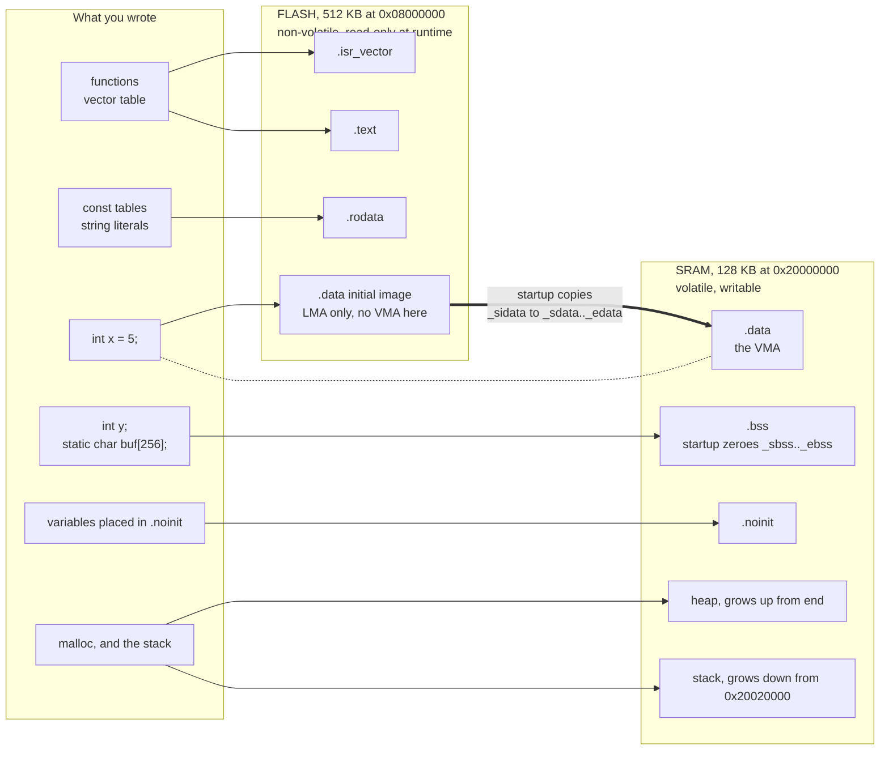

# Memory Sections and VMA vs LMA

Every variable and every function in your firmware ends up in one of about six buckets, and which bucket it lands in is decided by two things: whether it is code or data, and whether its initial value is zero. That is nearly the whole rule. `int counter;` goes in `.bss` because its initial value is zero. `int counter = 5;` goes in `.data` because it is not. `const int limit = 5;` goes in `.rodata` because it never changes and can therefore stay in flash. Nobody chose those placements for your variable; the compiler applied that rule and emitted a section name.

The part that trips people is `.data`, and it is worth stating the problem before the mechanism. An initialised global has to be *writable*, so at runtime it must be in RAM. But RAM contains nothing when power is applied, and the only non-volatile storage on the part is flash. So the value `5` must be **stored in flash** and **live in RAM** — two different addresses for the same object. ELF has names for these: the **VMA** is the address the program uses, and the **LMA** is the address the bytes were loaded from. On a hosted system the loader reconciles them. Here, [your startup code does](./startup-code.md), by copying.

:::info[Prerequisites]
[The Linker Script](./the-linker-script.md) is the file that assigns these sections to regions; this page explains what the assignments mean. [Object Files and Symbols](../../programming/cpp/01-toolchain-and-build/object-files-and-symbols.md) covers ELF sections in general.
:::

## Where each section ends up



The thick arrow is the whole point of the page: `.data` is the only section that exists in both regions, and the copy that reconciles them is something *you* wrote.

## The sections, one row each

| Section | Lives in | Occupies flash? | Initialised by | Typical contents |
|---|---|---|---|---|
| `.isr_vector` | Flash | Yes | Nothing — read by hardware | The vector table, at the base of flash. |
| `.text` | Flash | Yes | — | All code. Executed in place; no copy needed. |
| `.rodata` | Flash | Yes | — | `const` objects, string literals, jump tables, lookup tables. |
| `.data` | **RAM** | **Yes — the initial image** | Startup, by copying from the LMA | Globals and `static`s with a non-zero initialiser. |
| `.bss` | RAM | **No** | Startup, by zeroing | Globals and `static`s with no initialiser or an all-zero one. |
| `.noinit` | RAM | No | **Nothing** — deliberately | Data that must survive a warm reset: crash logs, boot counters, a "why did I reset" flag. |
| heap | RAM | No | `malloc`, growing upward from `end` | Only if you use dynamic allocation. |
| stack | RAM | No | Hardware sets `MSP` from vector entry 0 | Grows *downward* from `_estack`. |

Two entries deserve expansion.

**`.bss` costs nothing in flash and everything in RAM.** This is why `static char buffer[8192];` adds 8 KB to your RAM usage and zero bytes to your `.bin` file, and why the same array written as `static char buffer[8192] = {1};` — one non-zero initialiser — moves the whole thing to `.data` and adds **8 KB to flash as well**. That is a genuine surprise the first time it happens, and it is entirely mechanical: any non-zero initialiser, anywhere in the object, moves the object out of `.bss`.

**`.noinit` is the one section startup must leave alone.** It is not a compiler default; you create it in the linker script with `(NOLOAD)`, place variables into it with `__attribute__((section(".noinit")))`, and — critically — write your `.bss` zeroing loop so it does not cover the range. The payoff is a variable that survives a watchdog reset or a soft reset with its contents intact, which is the cheapest crash-diagnostics mechanism that exists on a microcontroller. It does *not* survive a power cycle: SRAM contents after power-on are undefined, so any `.noinit` state needs a magic-number guard before you trust it.

## VMA and LMA, concretely

The linker records both addresses in the ELF section headers, and you can read them directly:

```bash
arm-none-eabi-objdump -h build/firmware.elf
```

```text
Idx Name          Size      VMA       LMA       File off  Algn
  0 .isr_vector   00000198  08000000  08000000  00010000  2**2
                  CONTENTS, ALLOC, LOAD, READONLY, DATA
  1 .text         000012c4  08000198  08000198  00010198  2**2
                  CONTENTS, ALLOC, LOAD, READONLY, CODE
  2 .rodata       0000010c  0800145c  0800145c  0001145c  2**2
                  CONTENTS, ALLOC, LOAD, READONLY, DATA
  3 .data         0000004c  20000000  08001568  00020000  2**2
                  CONTENTS, ALLOC, LOAD, DATA
  4 .bss          00000714  2000004c  2000004c  0002004c  2**2
                  ALLOC
```

Three readings of that dump, in order of usefulness:

- **Row 3 is the only one where VMA and LMA differ.** `.data` is addressed at `0x2000_0000` and stored at `0x0800_1568`. That second number is exactly what `_sidata = LOADADDR(.data)` in the linker script captured.
- **Row 4 has `ALLOC` but not `CONTENTS` or `LOAD`.** That is what "occupies RAM, occupies no flash" looks like in the header flags. If your `.bss` ever shows `CONTENTS`, something in the script is wrong.
- **`.bss`'s LMA is meaningless.** The linker fills it in as equal to the VMA because nothing loads it. Do not read anything into it.

The size tool gives the same information rolled up:

```bash
arm-none-eabi-size build/firmware.elf
```

```text
   text    data     bss     dec     hex filename
   5732      76    1812    7620    1dc4 build/firmware.elf
```

The two numbers you actually care about are not printed:

- **Flash used** = `text` + `data` = 5732 + 76 = **5808 bytes**. `data` is counted twice in a sense — once as the RAM it occupies and once as the flash image it is loaded from — and this is where the flash charge appears.
- **RAM used at startup** = `data` + `bss` = 76 + 1812 = **1888 bytes**. Plus heap, plus the stack's actual high-water mark, neither of which any static tool can tell you.

`dec` and `hex` are the sum of all three columns and correspond to nothing physical. Ignore them.

## Where the compiler's choice is made

You can see the decision without running anything:

```bash
arm-none-eabi-gcc -c -Os main.c -o main.o
arm-none-eabi-objdump -t main.o | sort -k4
```

The fourth column is the section each symbol landed in. This is the fastest way to answer "why is my RAM usage 4 KB higher than I expected" — the answer is almost always a table that should have been `const` and was not.

Which brings up the one habit with the best size-to-effort ratio in embedded C: **mark every read-only table `const`**. Without it, a 2 KB lookup table is an initialised writable object: 2 KB of RAM *and* 2 KB of flash, plus 2 KB of startup copy time. With it, the table stays in `.rodata` and costs 2 KB of flash and nothing else. On a part with 128 KB of RAM you can absorb a few of these; on the 20 KB parts elsewhere in the family, three of them is the whole budget.

:::warning[`.data` that is never copied — "it builds, and every initialised global is garbage"]
The symptom is bizarre enough to send people looking in entirely the wrong place. The firmware boots, `main` runs, and every global with an initialiser holds a random value. Sometimes it holds a *plausible* random value, because SRAM after a warm reset holds whatever the last run left there — so the bug appears and disappears depending on whether you power-cycled or hit the reset button. Zero-initialised globals are fine, which makes it look like a compiler bug rather than a build defect.

There are three distinct ways to arrive there, and they need different fixes.

**The `AT>` is missing.** Written `} >RAM` instead of `} >RAM AT> FLASH`, the `.data` section gets a RAM LMA. Nothing loads it, the initial values never make it into the flash image, and there is nothing for startup to copy *from*. `objdump -h` shows the tell immediately: `.data` with VMA equal to LMA, both in the `0x2000_xxxx` range. This produces no warning of any kind.

**The copy loop is absent or wrong.** Someone wrote a minimal startup file that zeroes `.bss` and forgets `.data` entirely — an easy omission, because zeroing `.bss` is enough to make a program that only uses uninitialised globals work perfectly. Or the loop copies from `_etext` instead of `_sidata`, which is right only when nothing sits between `.text` and `.data`'s load image, and silently wrong the moment `.rodata` or an alignment gap does.

**Something ran before the copy.** `SystemInit()`, a clock setup routine, or a C++ static constructor executed from `Reset_Handler` *before* the `.data` copy, and it read or wrote an initialised global. The write is then obliterated by the copy that follows; the read gets garbage. The rule is absolute: **between reset and the end of the `.bss` zeroing, no code may touch any global.** Startup code that needs state before that point must keep it in local variables.

Two checks that catch all three in under a minute:

```bash
arm-none-eabi-objdump -h build/firmware.elf | grep -A1 '\.data'   # LMA must be in flash
arm-none-eabi-objdump -h build/firmware.elf | grep -A1 '\.bss'    # must show ALLOC only
```

Then put one deliberate canary in the firmware — a global initialised to a recognisable constant, checked as the first statement in `main` — and you will never debug this class again.
:::

## See also

- [The Linker Script](./the-linker-script.md) — the `>RAM AT> FLASH` line and the `_sidata`/`_sdata`/`_edata` symbols this page's copy depends on.
- [Startup Code: Reset to `main`](./startup-code.md) — the loop that performs the copy and the zeroing.
- [The Cortex-M Memory Map](../02-processor-architecture/memory-map-and-bit-banding.md) — why flash is at `0x0800_0000` and SRAM at `0x2000_0000` in the first place.
- [C Libraries for Embedded](./c-libraries-for-embedded.md) — the heap that sits above `.bss`, and the `end` symbol that bounds it.
- [Object Files and Symbols](../../programming/cpp/01-toolchain-and-build/object-files-and-symbols.md) — ELF sections, symbol tables and the general object-file model.

## References

- Free Software Foundation — [**GNU `ld` manual, "Output Section Description"**](https://sourceware.org/binutils/docs/ld/Output-Section-Description.html) and [**"Output Section LMA"**](https://sourceware.org/binutils/docs/ld/Output-Section-LMA.html). The normative definition of the VMA/LMA distinction, the `AT` and `AT>` forms, the `LOADADDR` expression used to recover the load address, and the `(NOLOAD)` output-section type used for `.bss` and `.noinit`.
- Free Software Foundation — [**GNU binutils manual, `objdump`**](https://sourceware.org/binutils/docs/binutils/objdump.html) and [**`size`**](https://sourceware.org/binutils/docs/binutils/size.html). `objdump -h` and the meaning of the `CONTENTS`, `ALLOC`, `LOAD` and `READONLY` section flags quoted in the dump above; `size`'s Berkeley-format `text`/`data`/`bss` columns and why they do not map one-to-one onto flash and RAM.
- Tool Interface Standard — [**Executable and Linking Format (ELF) Specification, v1.2**](https://refspecs.linuxfoundation.org/elf/elf.pdf). §1.4 "Sections" for the special section names `.text`, `.rodata`, `.data` and `.bss` and their required types and attributes — in particular that `.bss` is `SHT_NOBITS`, "occupies no space in the file", which is the formal statement of the flash-cost asymmetry above.
- STMicroelectronics — [**RM0383**, *STM32F411xC/E reference manual*](https://www.st.com/resource/en/reference_manual/rm0383-stm32f411xce-advanced-armbased-32bit-mcus-stmicroelectronics.pdf), consulted at **Rev 4** (May 2025). §3.3 "Memory map" for the flash and SRAM base addresses and sizes used throughout the diagram and the example dumps.
