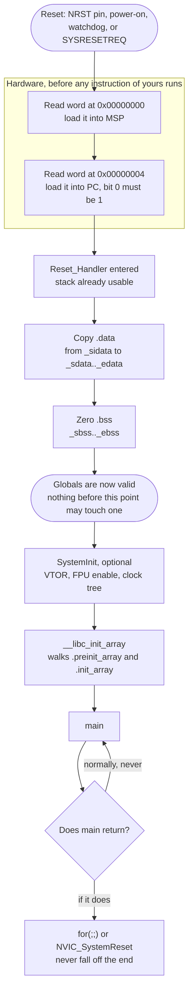

# Startup Code: Reset to `main`

C has a set of guarantees that programmers stop noticing after the first month. Initialised globals hold their initialisers. Uninitialised globals are zero. The stack works. `printf` has somewhere to write. Static C++ objects have had their constructors run before `main` starts. On a hosted system a program loader and a `crt0` object you have never opened deliver all of that before your first line executes.

On a Cortex-M there is no loader. The hardware does exactly two things — loads the stack pointer and jumps — and everything else in that list is a promise that some code you own has to keep. That code is the startup file, it is about fifty lines, and it is worth reading once carefully because half of the strangest bugs in bare-metal firmware live in the window it covers.

The mental model: **the startup file is the C runtime, written out by hand.** Its job is to take a processor that has just come out of reset and hand `main` an environment that matches what the C standard says it should be.

:::info[Prerequisites]
[Exceptions and the Vector Table](../02-processor-architecture/exceptions-and-the-vector-table.md) owns the vector table itself — its layout, the exception numbering, and how the NVIC uses it. [The Linker Script](./the-linker-script.md) defines every symbol this page consumes, and [Memory Sections and VMA vs LMA](./memory-sections.md) explains why `.data` needs copying at all.
:::

## The sequence



Everything above `Reset_Handler` is silicon. Everything below it is yours.

## Step 1 — the hardware loads `MSP` and `PC`

The processor's very first memory accesses are two word reads from the base of the vector table. PM0214 Rev 10 §2.3.4: "On system reset, the vector table is fixed at address `0x00000000`." Entry 0 is not a function pointer — it is the initial value of the Main Stack Pointer — and entry 1 is the reset vector.

This is why the first element of the table is `_estack` and not `Reset_Handler`, and it is why a linker script must place `.isr_vector` at the very start of flash. On the STM32F411RE the flash is aliased to `0x0000_0000` when the BOOT pins select main-flash boot, so a table at `0x0800_0000` is also visible at address zero — see [Reset and Boot Configuration](../01-hardware-foundations/reset-and-boot-configuration.md) for the pin behaviour.

Two properties of these two words matter more than they look:

- **The stack works before any of your code runs.** There is no "set up the stack" step in `Reset_Handler`, because the hardware did it. That is a deliberate architectural choice — it means `Reset_Handler` can be an ordinary C function that uses locals, rather than assembly that has to bootstrap a stack first.
- **Bit 0 of the reset vector must be 1.** PM0214 Rev 10 §2.1.3: the reset vector's "Bit[0] of the value is loaded into the EPSR T-bit at reset and must be 1." Taking the address of a C function gives you a value with bit 0 already set, so you get this for free — but hand-written tables with hard-coded addresses do not, and the failure is an immediate HardFault before the first instruction. [Thumb-2 and Code Density](../02-processor-architecture/thumb-and-instruction-sets.md) covers why.

## Step 2 — the vector table in C

The table can be written in C, which is easier to read and easier to keep in step with your handlers than the assembly version vendors ship. It matches the `stm32f411re.ld` in [The Linker Script](./the-linker-script.md).

```c
#include <stdint.h>

extern uint32_t _estack;   /* linker symbol: top of RAM. Take its ADDRESS. */

void Reset_Handler(void);
void Default_Handler(void);

/* Every Cortex-M system exception and every STM32F411 IRQ resolves here unless
   a strong definition elsewhere overrides it. */
#define WEAK_ALIAS __attribute__((weak, alias("Default_Handler")))

void NMI_Handler(void)          WEAK_ALIAS;
void HardFault_Handler(void)    WEAK_ALIAS;
void MemManage_Handler(void)    WEAK_ALIAS;
void BusFault_Handler(void)     WEAK_ALIAS;
void UsageFault_Handler(void)   WEAK_ALIAS;
void SVC_Handler(void)          WEAK_ALIAS;
void DebugMon_Handler(void)     WEAK_ALIAS;
void PendSV_Handler(void)       WEAK_ALIAS;
void SysTick_Handler(void)      WEAK_ALIAS;
/* ... then the 86 STM32F411 device IRQs, RM0383 Rev 4, Table 38. */

typedef void (*vector_t)(void);

__attribute__((section(".isr_vector"), used))
const vector_t vector_table[] = {
    (vector_t)(&_estack),   /* 0x00: initial MSP  */
    Reset_Handler,          /* 0x04: reset vector  */
    NMI_Handler,
    HardFault_Handler,
    MemManage_Handler,
    BusFault_Handler,
    UsageFault_Handler,
    0, 0, 0, 0,             /* reserved */
    SVC_Handler,
    DebugMon_Handler,
    0,                      /* reserved */
    PendSV_Handler,
    SysTick_Handler,
    /* device IRQ0 onward ... */
};
```

Three details carry weight. `section(".isr_vector")` is what the linker script's `KEEP(*(.isr_vector))` matches. `used` tells the compiler not to discard the array even though nothing in the translation unit references it. And `weak, alias("Default_Handler")` is the mechanism that lets you define `SysTick_Handler` in any file in the project and have it silently replace the placeholder — define nothing and unhandled interrupts land in `Default_Handler`, which should be an infinite loop you can catch in a debugger, never an empty function that returns.

## Step 3 — `Reset_Handler`

```c
#include <stdint.h>

extern uint32_t _sidata;   /* .data image in flash (LMA)     */
extern uint32_t _sdata;    /* .data start in RAM  (VMA)      */
extern uint32_t _edata;    /* .data end in RAM               */
extern uint32_t _sbss;     /* .bss start in RAM              */
extern uint32_t _ebss;     /* .bss end in RAM                */

extern void __libc_init_array(void);
extern int  main(void);
extern void SystemInit(void);   /* optional; see below */

__attribute__((noreturn))
void Reset_Handler(void)
{
    /* 1. Copy .data from its load address in flash to its run address in RAM. */
    const uint32_t *src = &_sidata;
    uint32_t *dst = &_sdata;
    while (dst < &_edata) {
        *dst++ = *src++;
    }

    /* 2. Zero .bss. */
    for (dst = &_sbss; dst < &_ebss; ) {
        *dst++ = 0u;
    }

    /* --- from here on, globals are valid --- */

    /* 3. Optional low-level init: VTOR, FPU enable, clock tree. */
    SystemInit();

    /* 4. Run C++ static constructors and __attribute__((constructor)) functions. */
    __libc_init_array();

    /* 5. Hand over. */
    (void)main();

    /* 6. main returned. There is nowhere to go. */
    for (;;) {
    }
}
```

**Why the copy comes first.** Everything after it may legally read a global; nothing before it may. The comment marking the boundary is not decoration — it is the invariant the rest of the file depends on.

**Why the loops use word pointers.** `_sdata` and `_edata` are 4-byte-aligned by the `ALIGN(4)` directives in the linker script, so word copies are safe and are four times faster than byte copies. If you change the script's alignment, change this.

**`SystemInit()` is optional and its placement is a real decision.** CMSIS-Core's convention is that `SystemInit` runs from `Reset_Handler` and does only the minimum a device needs before C code is safe — on STM32 parts ST's version enables the FPU's coprocessor access and sets `SCB->VTOR`. Two rules govern it:

- If you call it **before** the `.data` copy — which some vendor startup files do, in order to configure external RAM that `.data` might live in — it must not touch a single global. That is a strong constraint and it is easy to violate accidentally through a HAL function.
- Configuring the full clock tree here is a choice, not a requirement. Doing it late, from `main`, is easier to debug because you have a working runtime when it fails; doing it early means every timing constant is correct from the first instruction. Bare-metal projects in this section do it from `main`.

**`__libc_init_array()`** walks the `.preinit_array` and `.init_array` tables the linker built and calls each function pointer. This is what runs C++ static constructors and any C function marked `__attribute__((constructor))`. In a pure C project with no constructors the arrays are empty and the call costs a few cycles — leave it in, because the day someone adds a C++ file or a constructor attribute, its absence is a silent failure: the object is left zeroed rather than constructed, and nothing reports it.

## Step 4 — what happens if `main` returns

In a hosted program, returning from `main` is equivalent to calling `exit(status)`: `atexit` handlers run, streams are flushed, and the process ends. None of that means anything here. There is no parent, no exit status, and no "ended" state for a processor — it executes something forever or it is in a fault or it is asleep.

If `Reset_Handler` calls `main` and then falls off its own end, the processor executes whatever bytes the linker happened to place next in flash. That is usually the next function in `.text`, entered without a valid frame, and the result is a HardFault at a plausible-looking address with a call stack that makes no sense — a genuinely nasty thing to debug, because the reported fault has nothing to do with the actual defect.

`for (;;) {}` at the end costs two bytes and removes the class entirely. Combined with `__attribute__((noreturn))` the compiler will also warn you if the loop is ever removed.

Two variations worth knowing:

- **Reset instead of spinning.** For a shipped product, `NVIC_SystemReset()` is often better than a hang: a device that reboots recovers, a device that spins is bricked until someone power-cycles it. Combine it with a `.noinit` counter so the firmware knows it got here — see [Memory Sections and VMA vs LMA](./memory-sections.md).
- **Linking against the C library's `exit`.** If you let `main` return into newlib's `exit`, you pull in `__libc_fini_array`, the `atexit` machinery, and the `_exit` stub — a kilobyte or so of code that exists only to handle something that must never happen. Calling `main` from `Reset_Handler` and trapping the return yourself avoids all of it.

:::warning[The compiler turns your copy loop into a call to `memcpy`, and it is not there yet]
This is the startup bug with the best disguise, because the code that fails is correct C and looks obviously correct.

GCC's loop-idiom recognition sees the `while (dst < &_edata) *dst++ = *src++;` loop, recognises the pattern, and replaces the whole loop with a call to `memcpy`. The same optimisation turns the `.bss` loop into a call to `memset`. This happens at `-O2` and above via `-ftree-loop-distribute-patterns`, and `-ffreestanding` does **not** prevent it — the compiler is permitted to emit calls to those two functions regardless, and this surprises nearly everyone the first time.

Most of the time it is harmless: `memcpy` is in `.text` in flash, it does not read any global, and it works. The failure appears when one of the following is true:

- **`memcpy` was placed in RAM** — because someone marked it `.RamFunc`, or an RTOS or vendor library put its optimised version there for speed. The copy loop that is supposed to initialise RAM now calls a function that lives in RAM that has not been initialised yet. The symptom is a HardFault inside `Reset_Handler` before anything has run.
- **The libc's `memcpy` reads global state** — some tuned implementations dispatch on a cached feature word. That word is in `.data`, which is what you are in the middle of copying.
- **You built with `-nostdlib` and did not provide `memcpy`.** Then it is merely a link error naming a function you never wrote, which is confusing but at least loud.

The reliable fixes, in order of preference:

```bash
# 1. Tell GCC not to do this, for the startup file only:
arm-none-eabi-gcc -fno-tree-loop-distribute-patterns -c startup.c
```

```c
/* 2. Or make the pointers volatile so the loop cannot be pattern-matched: */
volatile uint32_t *dst = &_sdata;
```

Option 1 is preferred: applied as a per-file compile option it is explicit, it does not pessimise the generated copy, and it documents why. Do not apply it project-wide — you want that optimisation everywhere else.

The related trap in the same file has the same shape. Writing

```c
uint32_t *dst = (uint32_t *)_estack;   /* WRONG */
```

instead of `&_estack` reads the *contents* of the first word of RAM and uses it as an address. Linker-defined symbols have a location and no storage; the address is the value. This one at least tends to fault immediately.
:::

## See also

- [The Linker Script](./the-linker-script.md) — the complete `stm32f411re.ld` that defines every symbol this file uses.
- [Memory Sections and VMA vs LMA](./memory-sections.md) — why `.data` has two addresses and why `.bss` needs zeroing at all.
- [Exceptions and the Vector Table](../02-processor-architecture/exceptions-and-the-vector-table.md) — the full table layout and exception numbering behind the array above.
- [The Register Model](../02-processor-architecture/cortex-m-register-model.md) — `MSP`, the `T` bit, and why the reset vector's bit 0 must be set.
- [C Libraries for Embedded](./c-libraries-for-embedded.md) — `__libc_init_array`, `_exit`, and the runtime that startup is bootstrapping.

## References

- STMicroelectronics — [**PM0214**, *STM32 Cortex-M4 MCUs and MPUs programming manual*](https://www.st.com/resource/en/programming_manual/pm0214-stm32-cortexm4-mcus-and-mpus-programming-manual-stmicroelectronics.pdf), consulted at **Rev 10** (March 2020). §2.3.4 "Vector table" for the fixed reset address, the initial-`MSP`-then-`PC` fetch order and Table 17's entry layout; §2.1.2 "Stacks" for the full-descending stack that makes `_estack` the top of RAM; §2.1.3 for the requirement that reset-vector bit[0] be 1; §4.4 for `SCB->VTOR` if you relocate the table.
- Arm — [**CMSIS-Core (Cortex-M) documentation**](https://arm-software.github.io/CMSIS_6/latest/Core/index.html). The device-startup convention this page follows: the `SystemInit()` contract, the weak-`Default_Handler` alias pattern, the `__NO_RETURN` reset handler, and the reference startup and system templates that vendor files are derived from.
- Free Software Foundation — [**GCC manual, "Options That Control Optimization"**](https://gcc.gnu.org/onlinedocs/gcc/Optimize-Options.html). `-ftree-loop-distribute-patterns`, documented as transforming loops into "calls to library functions such as `memset`" — the normative statement behind the warning above — and the note that this happens at `-O2` and higher.
- Free Software Foundation — [**GCC manual, "Common Function Attributes"**](https://gcc.gnu.org/onlinedocs/gcc/Common-Function-Attributes.html) and [**"Common Variable Attributes"**](https://gcc.gnu.org/onlinedocs/gcc/Common-Variable-Attributes.html). `weak`, `alias`, `used`, `section`, `noreturn` and `constructor` — every attribute the vector table and reset handler above depend on.
- STMicroelectronics — [**RM0383**, *STM32F411xC/E reference manual*](https://www.st.com/resource/en/reference_manual/rm0383-stm32f411xce-advanced-armbased-32bit-mcus-stmicroelectronics.pdf), consulted at **Rev 4** (May 2025). Table 38 "Vector table for STM32F411xC/E" for the device IRQ list that follows the system exceptions, and §2.4 for the boot-mode aliasing that puts flash at address `0x0000_0000`.
