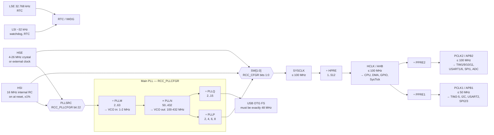

# Configuring the Clock Tree

Out of reset the STM32F411RE runs at 16 MHz on an internal RC oscillator, which is a deliberately conservative choice: it works with no crystal, no configuration, and no risk. It is also one sixth of what the part can do, it is accurate to about ±1 % over temperature rather than the ±20 ppm a crystal gives, and it cannot produce the 48 MHz that USB requires. Somewhere in the first week of a real project you will need to change it.

The mental model: **the clock tree is a fan-out from one chosen source through a chain of dividers and multipliers, and every timing number in the entire system is a leaf on it.** Your UART baud rate is a division of the APB2 clock. Your SysTick period is a division of the AHB clock. Your ADC sample time, your SPI bit rate, your timer's microsecond tick — all of them. Change the root and every leaf moves. That is why clock configuration is the one piece of initialisation that is genuinely global, and why getting it wrong produces symptoms that look like a dozen unrelated peripheral bugs.

There is a second, sharper reason it deserves its own page: **the clock and the flash memory have a dependency that runs in one direction only.** Flash cannot be read at full speed, so it needs wait states, and the number of wait states it needs is a function of the frequency. Raise the frequency before you raise the wait states and the processor tries to fetch instructions the flash cannot supply in time. That is the subject of the warning at the bottom, and it is the failure mode that makes people afraid of this register block.

:::info[Prerequisites]
[Clocks and Oscillators](../01-hardware-foundations/clocks-and-oscillators.md) owns the physics — what an RC oscillator, a crystal and a PLL actually are, why crystals need load capacitors, and what jitter and drift mean. This page is the register-configuration half. [Register-Level Programming](./register-level-programming.md) supplies the field idioms, and [SysTick and the Core Peripherals](../02-processor-architecture/systick-and-core-peripherals.md) is the first thing you will want to reconfigure afterwards.
:::

## The tree



The two constraints that shape every configuration are on that diagram: **APB1 tops out at 50 MHz** while APB2 goes to 100, and **the USB peripheral needs exactly 48 MHz** from the PLL's `Q` output. If your design uses USB, the PLL arithmetic is solved backwards from that 48 MHz before anything else.

One rule that is not on the diagram and catches everyone: **timer clocks are doubled when their APB prescaler is not 1.** If `PPRE1` divides by 2 to keep APB1 at 50 MHz, the timers on APB1 still receive 100 MHz, not 50 (RM0383 Rev 4 §6.2). This is deliberate — it lets timers keep full resolution on a slowed bus — and it means a timer period computed from `PCLK1` is out by a factor of two.

## The PLL arithmetic

Three constraints, applied in order (RM0383 Rev 4 §6.3.2):

| Stage | Formula | Constraint |
|---|---|---|
| VCO input | `f_VCOin = f_PLLSRC / PLLM` | **1–2 MHz.** 2 MHz is recommended, to limit PLL jitter. `PLLM` ∈ 2…63. |
| VCO output | `f_VCOout = f_VCOin × PLLN` | **100–432 MHz.** `PLLN` ∈ 50…432. (Check §6.3.2 for your exact part — the lower bound differs across the F4 family.) |
| System clock | `SYSCLK = f_VCOout / PLLP` | ≤ **100 MHz** on the F411. `PLLP` ∈ {2, 4, 6, 8}, encoded `00`…`11`. |
| USB / SDIO | `f_Q = f_VCOout / PLLQ` | Must be **48 MHz** for USB. `PLLQ` ∈ 2…15. |

**Worked: 100 MHz from the internal 16 MHz HSI.**

```text
PLLM = 8    →  16 MHz / 8   =   2 MHz   ✓ in 1-2 MHz, and at the recommended value
PLLN = 200  →   2 MHz × 200 = 400 MHz   ✓ in 100-432 MHz
PLLP = 4    → 400 MHz / 4   = 100 MHz   ✓ at the F411 maximum
PLLQ = ?    → 400 MHz / Q   =  48 MHz   ✗ Q would be 8.33 — no integer solution
```

So 100 MHz and USB are mutually exclusive from this VCO. That is not a limitation of the arithmetic, it is the reason the canonical F411 USB configuration runs at 96 MHz:

```text
PLLM = 8    →  16 MHz / 8   =   2 MHz   ✓
PLLN = 192  →   2 MHz × 192 = 384 MHz   ✓
PLLP = 4    → 384 MHz / 4   =  96 MHz   ✓ 4 % below maximum
PLLQ = 8    → 384 MHz / 8   =  48 MHz   ✓ exactly what USB needs
```

Four percent of clock speed in exchange for a working USB peripheral is almost always the right trade, and it is worth deciding which of the two you are building *before* you write the constants, because changing later moves every derived timing number in the project.

A third case worth having seen, for a board with an 8 MHz HSE — the frequency the ST-LINK's MCO supplies on a Nucleo when the solder bridges select it:

```text
PLLM = 4    →   8 MHz / 4   =   2 MHz   ✓ same VCO input, so N/P/Q are unchanged
```

Which is the practical point of `PLLM`: **normalise every source to 2 MHz at the VCO input, and the rest of the tree becomes source-independent.**

## Flash wait states and voltage scaling

Flash is slower than the core. At 100 MHz a single-cycle instruction fetch would need a flash access in 10 ns, and this flash cannot do that, so the flash interface inserts wait states. The number required depends on both frequency and supply voltage (RM0383 Rev 4, "Number of wait states according to CPU clock (HCLK) frequency"). At the 3.3 V a Nucleo runs at, the 2.7–3.6 V column applies:

| `HCLK` | `FLASH_ACR.LATENCY` | Wait states |
|---|---|---|
| 0 < HCLK ≤ 30 MHz | `0000` | 0 |
| 30 < HCLK ≤ 64 MHz | `0001` | 1 |
| 64 < HCLK ≤ 90 MHz | `0010` | 2 |
| 90 < HCLK ≤ 100 MHz | `0011` | 3 |

At lower supply voltages every threshold drops, so a battery-powered design running down to 2.1 V needs more wait states at the same frequency. The table in the reference manual has a column per voltage band; use the one that matches your worst-case supply, not your nominal one.

Two things soften the cost of three wait states, and both are off at reset:

- **`PRFTEN`** (bit 8) — the prefetch buffer, which fetches ahead on sequential code.
- **`ICEN`** and **`DCEN`** (bits 9 and 10) — the instruction and data caches on the flash interface. These are effectively free performance for straight-line code; there is very little reason not to enable them.

Separately, the **voltage regulator scale** bounds the maximum frequency. On the F411, Scale 1 permits up to 100 MHz, Scale 2 up to 84 MHz, and Scale 3 up to 64 MHz (RM0383 Rev 4 §5.1.4 and the datasheet's frequency-versus-voltage-scaling table). The scale can only be changed while the PLL is off, so it must be set early. Set it explicitly for your target frequency rather than relying on the reset value — the reset default differs across the F4 family, and inheriting code from an F407 project is exactly how you end up at Scale 2 trying to run at 100 MHz.

## The sequence

```c title="clock.c"
#include "stm32f4xx.h"

/* 16 MHz HSI -> PLL -> 100 MHz SYSCLK.
   AHB /1 = 100 MHz, APB1 /2 = 50 MHz (its maximum), APB2 /1 = 100 MHz. */
void clock_init_100mhz(void)
{
    /* --- 1. Voltage scale 1. Must be done with the PLL off, so: first. --- */
    RCC->APB1ENR |= RCC_APB1ENR_PWREN;
    (void)RCC->APB1ENR;
    MODIFY_REG(PWR->CR, PWR_CR_VOS_Msk, PWR_CR_VOS);   /* VOS = 11 = Scale 1 */

    /* --- 2. Flash wait states BEFORE the frequency goes up. --- */
    FLASH->ACR = FLASH_ACR_PRFTEN | FLASH_ACR_ICEN | FLASH_ACR_DCEN
               | FLASH_ACR_LATENCY_3WS;

    /* RM0383 requires reading ACR back to confirm the wait states took
       effect before relying on them. Do not skip this. */
    while ((FLASH->ACR & FLASH_ACR_LATENCY_Msk) != FLASH_ACR_LATENCY_3WS) {
    }

    /* --- 3. Bus prescalers, also before the switch, so APB1 never sees
             100 MHz even for one cycle. --- */
    MODIFY_REG(RCC->CFGR,
               RCC_CFGR_HPRE_Msk | RCC_CFGR_PPRE1_Msk | RCC_CFGR_PPRE2_Msk,
               RCC_CFGR_HPRE_DIV1 | RCC_CFGR_PPRE1_DIV2 | RCC_CFGR_PPRE2_DIV1);

    /* --- 4. PLL: HSI / 8 = 2 MHz, x200 = 400 MHz, /4 = 100 MHz.
             PLLCFGR may only be written while the PLL is off. --- */
    RCC->CR &= ~RCC_CR_PLLON;
    while (RCC->CR & RCC_CR_PLLRDY) {
    }

    RCC->PLLCFGR =
          (8u   << RCC_PLLCFGR_PLLM_Pos)   /* PLLM = 8   */
        | (200u << RCC_PLLCFGR_PLLN_Pos)   /* PLLN = 200 */
        | (1u   << RCC_PLLCFGR_PLLP_Pos)   /* PLLP: 01 encodes /4 */
        | (8u   << RCC_PLLCFGR_PLLQ_Pos);  /* PLLQ = 8 (not 48 MHz; USB unusable) */
                                           /* PLLSRC = 0 -> HSI */

    /* --- 5. Start the PLL and wait for lock. --- */
    RCC->CR |= RCC_CR_PLLON;
    while (!(RCC->CR & RCC_CR_PLLRDY)) {
    }

    /* --- 6. Switch SYSCLK to the PLL, then confirm the switch happened.
             SW is a request; SWS is the answer. --- */
    MODIFY_REG(RCC->CFGR, RCC_CFGR_SW_Msk, RCC_CFGR_SW_PLL);
    while ((RCC->CFGR & RCC_CFGR_SWS_Msk) != RCC_CFGR_SWS_PLL) {
    }

    /* --- 7. Tell the rest of the software what just happened. --- */
    SystemCoreClockUpdate();   /* or: SystemCoreClock = 100000000u; */
}
```

Four details in there are load-bearing and none of them are obvious from the register map alone.

**Every "enable" is followed by a wait on a matching "ready".** `PLLON` is a request; `PLLRDY` is the hardware saying the VCO has locked, which takes on the order of a couple of hundred microseconds. Switching `SW` to a PLL that has not locked selects a clock that is not yet a clock.

**`SW` and `SWS` are different fields.** `SW` is what you asked for; `SWS` is what the RCC actually switched to. The switch is not instantaneous, and if the requested source is not ready the hardware simply does not perform it — leaving `SW` reading back as PLL and the chip still running on HSI, with every derived frequency wrong by a factor of six and no error anywhere. Always poll `SWS`.

**`PLLCFGR` is only writable while the PLL is off.** Writes are ignored otherwise, silently. Reconfiguring the PLL at runtime — to drop to a low-power frequency and back — means switching `SYSCLK` off the PLL first, then clearing `PLLON`, then waiting for `PLLRDY` to clear.

**The prescalers go before the switch.** `HCLK` jumps from 16 MHz to 100 MHz the instant `SWS` changes. If `PPRE1` still says ÷1 at that moment, APB1 is momentarily at 100 MHz — double its rating — and whatever is running on it is out of specification for however long it takes the next instruction to execute.

## What to fix immediately afterwards

Changing the clock invalidates everything derived from it, and three things need attention in the same commit:

- **`SystemCoreClock`.** It is a plain global variable, not a register read, and until you call `SystemCoreClockUpdate()` or assign it, it holds the compile-time default. Everything that computes a baud rate or a timer prescaler from it is wrong until then. See [CMSIS and Vendor HALs](./cmsis-and-vendor-hals.md).
- **SysTick.** `SysTick_Config(SystemCoreClock / 1000u)` for a 1 kHz tick — recomputed, not the old constant.
- **Every calibrated delay loop.** The `crude_delay()` from the blink page now runs 6.25× faster. This is the moment to delete it in favour of a SysTick-based delay, which is correct by construction rather than by measurement.

:::warning[Raise the clock before the wait states and the chip stops, usually before the debugger can catch it]
This is the ordering trap, and it is unforgiving because the thing that breaks is instruction fetch itself.

Suppose you write the sequence in the intuitive order — configure the PLL, switch `SYSCLK` to it, then set `FLASH_ACR.LATENCY` to 3. For the handful of instructions between the switch and the latency write, the core is running at 100 MHz while the flash interface is still configured for zero wait states, meaning it is being asked to return an instruction word every 10 ns when it needs roughly 30. The data returned is whatever is on the bus when the access times out. The core executes it.

What you get is undefined. Most often an immediate HardFault from an undefined instruction or a bad branch — but the fault handler also lives in flash, so it is fetched under exactly the same broken conditions, and the usual outcome is a lockup rather than a fault you can inspect. Sometimes the part appears completely dead: `openocd` reports `Error: init mode failed (unable to connect to the target)`, because by the time the probe attaches the core is already wedged with the clock misconfigured.

**The rule is a ratchet, and it runs in both directions:**

- **Going up:** raise `LATENCY` first, verify it by reading `FLASH_ACR` back, *then* raise the clock. The read-back is not defensive programming for its own sake — RM0383 explicitly instructs you to check that the new wait-state count has been taken into account before proceeding, because the write and its effect are not simultaneous.
- **Going down:** lower the clock first, *then* lower `LATENCY`. Extra wait states at a low frequency are merely slow; too few at a high frequency is fatal. The safe direction is always the one that has more wait states than necessary.

The same ratchet applies to the voltage scale, in the same direction: raise the scale before raising the frequency, lower the frequency before lowering the scale. And it applies to the bus prescalers — set the dividers that *protect* a bus before the change that would overrun it.

Two relatives that share the shape:

- **Recovering a bricked part.** If you flashed a bad clock init, the chip may wedge before the debug port is usable. The fix is connect-under-reset — hold `NRST` asserted, attach, then release — or pull `BOOT0` high to boot the system bootloader instead of your firmware. [Flashing and Programming](../03-toolchain-and-build/flashing-and-programming.md) has both procedures, and [Reset and Boot Configuration](../01-hardware-foundations/reset-and-boot-configuration.md) covers `BOOT0`.
- **Switching to a crystal that is not fitted.** `HSEON` followed by a `while (!(RCC->CR & RCC_CR_HSERDY))` on a board with no crystal loops forever. Every wait on a `*RDY` bit in a shipped product wants a bounded retry count and a fallback to HSI — the part still runs at 16 MHz with a missing crystal, and a device that boots degraded beats one that hangs in `SystemInit`.
:::

## See also

- [Clocks and Oscillators](../01-hardware-foundations/clocks-and-oscillators.md) — the physical layer: RC versus crystal, load capacitors, drift, jitter, and startup time.
- [Register-Level Programming](./register-level-programming.md) — the clear-then-set idiom every `MODIFY_REG` above expands to.
- [CMSIS and Vendor HALs](./cmsis-and-vendor-hals.md) — `SystemInit()`, `SystemCoreClock` and `SystemCoreClockUpdate()`, and what CubeMX generates instead of the function above.
- [SysTick and the Core Peripherals](../02-processor-architecture/systick-and-core-peripherals.md) — the first thing to reconfigure once `HCLK` has moved.
- [Flashing and Programming](../03-toolchain-and-build/flashing-and-programming.md) — connect-under-reset, for when a clock-init bug locks the part before the debugger attaches.

## References

- STMicroelectronics — [**RM0383**, *STM32F411xC/E advanced Arm-based 32-bit MCUs reference manual*](https://www.st.com/resource/en/reference_manual/rm0383-stm32f411xce-advanced-armbased-32bit-mcus-stmicroelectronics.pdf), consulted at **Rev 4** (May 2025). §6.2 "Clocks" for the tree in the diagram, the APB1 ≤ 50 MHz / APB2 ≤ 100 MHz limits and the timer-clock doubling rule; §6.3.2 "RCC PLL configuration register" for the `PLLM`/`PLLN`/`PLLP`/`PLLQ` ranges, the 1–2 MHz VCO input and 100–432 MHz VCO output constraints, and the `0x2400 3010` reset value; §6.3.3 for `SW`/`SWS` and the `HPRE`/`PPRE1`/`PPRE2` encodings; §3.4 "Read interface" and the wait-state table for `FLASH_ACR.LATENCY`, `PRFTEN`, `ICEN`, `DCEN` and the instruction to read `FLASH_ACR` back after changing latency; §5.1.4 "Dynamic voltage scaling management" for the voltage scales and the requirement that the PLL be off to change them.
- STMicroelectronics — [**DS10314**, *STM32F411xC/STM32F411xE datasheet*](https://www.st.com/resource/en/datasheet/stm32f411re.pdf). The maximum-frequency-versus-voltage-scaling table (Scale 1 to 100 MHz, Scale 2 to 84 MHz, Scale 3 to 64 MHz), the HSI accuracy over temperature, and the HSE input frequency range for both crystal and bypass modes.
- STMicroelectronics — [**UM1724**, *STM32 Nucleo-64 boards (MB1136)*](https://www.st.com/resource/en/user_manual/um1724-stm32-nucleo64-boards-mb1136-stmicroelectronics.pdf), consulted at **Rev 14** (2020). §6.7 "OSC clock" for which oscillator sources a Nucleo actually provides and the solder-bridge configuration that selects the ST-LINK MCO as HSE — the reason the 8 MHz example above is worth having.
- Arm — [**CMSIS-Core documentation**](https://arm-software.github.io/CMSIS_6/latest/Core/index.html) (verified via context7, 2026-08-24). The `SystemInit()` and `SystemCoreClockUpdate()` contract: `SystemInit` "typically … configures the oscillator (PLL) that is part of the microcontroller device" and updates `SystemCoreClock` where the clock speed is variable.
