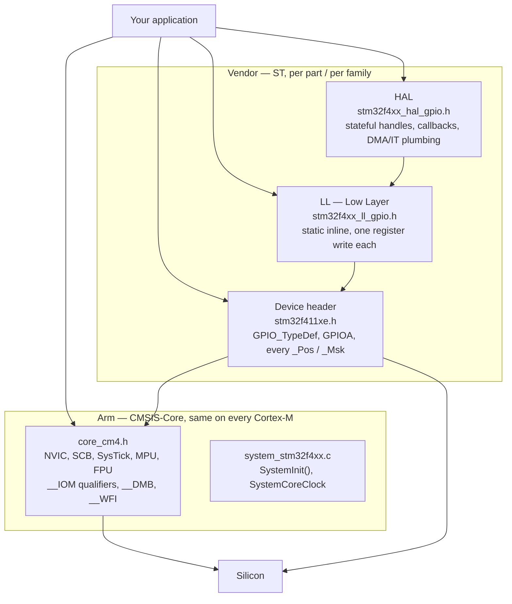

# CMSIS and Vendor HALs

"Bare metal" does not have to mean "type every address yourself". Between raw pointer casts and a full vendor framework there are three or four distinct layers, each with a different bargain, and the useful skill is knowing which one you are standing on and why — not picking a side.

The mental model: **these layers are stacked, not alternative.** CMSIS-Core defines conventions and gives you the processor. The vendor's device header applies those conventions to one specific part and is the authoritative machine-readable register map. LL is thin inline functions over that header. HAL is a stateful driver framework over LL. You can use the bottom two and stop; you cannot sensibly use HAL without the ones underneath it, because it is built on them. Every project mixes layers, and the ones that go badly are the ones that mix them without noticing.



The arrow from your application straight to the device header is the one that matters: **you can use the vendor's register definitions without using a single line of vendor driver code**, and that is usually the right default for a small project.

:::info[Prerequisites]
[Register-Level Programming](./register-level-programming.md) builds the struct-overlay pattern that the device header formalises. [Your First Bare-Metal Blink](./your-first-bare-metal-blink.md) is the program rewritten at each layer below. [The NVIC](../02-processor-architecture/the-nvic.md) and [SysTick and the Core Peripherals](../02-processor-architecture/systick-and-core-peripherals.md) cover the hardware CMSIS-Core wraps.
:::

## CMSIS-Core: what it actually standardises

CMSIS is a specification and a set of headers, not a compiled library. Nothing in CMSIS-Core allocates memory, owns state, or costs code size beyond the instructions its inline functions emit. What it gives you is:

**IO type qualifiers.** The convention for annotating register access permission. For struct members: `__IM` read-only, `__OM` write-only, `__IOM` read/write. For scalar variables the older spellings apply: `__I`, `__O`, `__IO`. All of them expand to `volatile`, plus `const` for the read-only forms — so `__IM uint32_t IDR;` is `volatile const uint32_t IDR;`, and an accidental assignment to it is a compile error rather than a silent no-op. Both sets of spellings are current; vendor headers written against CMSIS 5 use `__IO` heavily and CMSIS 6 keeps them.

**Core peripheral definitions.** `NVIC`, `SCB`, `SysTick`, `MPU`, `FPU`, `DWT`, `ITM` — as structs at their architecturally fixed addresses, identical on every Cortex-M4 from every vendor. This is why NVIC code ports between an STM32 and an NXP part unchanged while GPIO code does not.

```c
typedef struct {
  __IOM uint32_t ISER[8];      /* 0x000 (R/W) Interrupt Set Enable   */
        uint32_t RESERVED0[24];
  __IOM uint32_t ICER[8];      /* 0x080 (R/W) Interrupt Clear Enable */
        uint32_t RESERVED1[24];
  __IOM uint32_t ISPR[8];      /* 0x100 (R/W) Interrupt Set Pending  */
        uint32_t RESERVED2[24];
  __IOM uint32_t ICPR[8];      /* 0x180 (R/W) Interrupt Clear Pending*/
        uint32_t RESERVED3[24];
  __IOM uint32_t IABR[8];      /* 0x200 (R/W) Interrupt Active Bit   */
        uint32_t RESERVED4[56];
  __IOM uint8_t  IPR[240];     /* 0x300 (R/W) Interrupt Priority, 8-bit */
        uint32_t RESERVED5[644];
} NVIC_Type;
```

Note the reserved arrays and the byte-wide `IPR` — the same discipline as any hand-written overlay, and `IPR[n]` being one byte per interrupt is what makes `NVIC_SetPriority()` a single store rather than a read-modify-write.

**Functions over those peripherals.** `NVIC_EnableIRQ()`, `NVIC_SetPriority()`, `NVIC_SystemReset()`, `SysTick_Config()`. All `static inline`, all compiling to a handful of instructions.

**Compiler-independent intrinsics.** `__DMB()`, `__DSB()`, `__ISB()`, `__WFI()`, `__WFE()`, `__NOP()`, `__disable_irq()`, `__enable_irq()`, `__get_PRIMASK()`, `__set_BASEPRI()`, `__CLZ()`, `__REV()`. Each maps to one instruction, and each is spelled the same whether you build with GCC, Clang, Arm Compiler, or IAR. This is the part of CMSIS with the highest value-to-cost ratio: it is the only reason a barrier or a `WFI` is portable across toolchains at all. [What `volatile` Does and Does Not Do](./volatile-and-the-compiler.md) uses the barrier set.

**A startup and system-file contract.** `SystemInit()` is called from the startup file before `main`; CMSIS-Core specifies it as the function that "initializes the microcontroller system. Typically, this function configures the oscillator (PLL) that is part of the microcontroller device. For systems with a variable clock speed, it updates the variable `SystemCoreClock`." Alongside it, `SystemCoreClockUpdate()` recomputes that variable from the actual RCC register contents. Our [startup file](../03-toolchain-and-build/startup-code.md) follows exactly this convention with a weak `SystemInit()` you can override.

:::note[`SystemCoreClock` is a plain global, and it lies if you let it]
It is not read from hardware when you use it — it is a `uint32_t` in `.data` initialised to a compile-time guess. Reconfigure the PLL by hand without calling `SystemCoreClockUpdate()` afterwards, and every baud rate, timer prescaler and `HAL_Delay()` computed from it is wrong by whatever factor you changed the clock. [Configuring the Clock Tree](./clock-tree-configuration.md) covers keeping the two in step.
:::

## CMSIS 6, and what moved

CMSIS reorganised substantially at version 6.0.0, and search results, blog posts and older vendor packs still describe the version 5 layout. The differences that affect you:

| Change in CMSIS 6.0.0 | Consequence |
|---|---|
| Core(M) and Core(A) merged into a single **Core** component | One set of headers; the old `Core_A` split is gone. |
| **CMSIS-DSP** and **CMSIS-NN** moved into separate packs | They are no longer in the main repository; add them as their own dependency. |
| **CMSIS-RTOS** (v1) deprecated and removed; **CMSIS-RTOS2** retained | v1 API code needs migrating. RTOS2 also moved the OS Tick API. |
| **CMSIS-Pack, -SVD, -DAP, Devices, Utilities** moved to other repositories | The "CMSIS repo" is no longer one-stop; check where the piece you want now lives. |
| Arm Compiler 5 support dropped | AC5 projects stay on CMSIS 5. |
| Header files reworked and aligned with the TRMs | Struct member and macro names changed — see below. |

The renames are the part that breaks builds. CMSIS-Core 6.0.0 introduced incompatible changes against 5.6.0: struct members renamed (`NVIC->PR` became `NVIC->IPR`), struct types renamed (`CoreDebug_Type` became `DCB_Type`), and defines renamed to match (`CoreDebug_DEMCR_TRCENA_Msk` became `DCB_DEMCR_TRCENA_Msk`). CMSIS-Core 6.1 and later reintroduce the original spellings as deprecated aliases for backward compatibility — so a CMSIS 5 codebase may well build against 6.1+ where it failed against 6.0. Defining `CMSIS_DISABLE_DEPRECATED` removes those aliases, which is a useful way to find out how much old API a codebase still leans on.

None of this changes the ST device headers, which pin their own CMSIS-Core version — so a working STM32Cube project is not affected until you deliberately update the Core component.

## The device header is the authoritative register map

`stm32f411xe.h`, selected by `-DSTM32F411xE` and included through `stm32f4xx.h`, is generated from ST's SVD file — the same machine-readable description that drives the debugger's register view and the reference manual's register tables. It defines, for every peripheral on the part:

```c
/* The overlay -- exactly the pattern from the register-level page. */
typedef struct {
  __IO uint32_t MODER;    /* 0x00 */
  __IO uint32_t OTYPER;   /* 0x04 */
  __IO uint32_t OSPEEDR;  /* 0x08 */
  __IO uint32_t PUPDR;    /* 0x0C */
  __IO uint32_t IDR;      /* 0x10 */
  __IO uint32_t ODR;      /* 0x14 */
  __IO uint32_t BSRR;     /* 0x18 */
  __IO uint32_t LCKR;     /* 0x1C */
  __IO uint32_t AFR[2];   /* 0x20, 0x24 */
} GPIO_TypeDef;

#define GPIOA  ((GPIO_TypeDef *) GPIOA_BASE)

/* And, for every field, a position and a mask. */
#define RCC_AHB1ENR_GPIOAEN_Pos  (0U)
#define RCC_AHB1ENR_GPIOAEN_Msk  (0x1UL << RCC_AHB1ENR_GPIOAEN_Pos)
#define RCC_AHB1ENR_GPIOAEN      RCC_AHB1ENR_GPIOAEN_Msk
```

**Use this file even if you use nothing else the vendor ships.** It costs zero bytes — it is types and macros — it is generated rather than typed, so it does not contain the transposed-digit base address your hand-written header eventually will, and it is what every other piece of documentation, tooling and Stack Overflow answer for the part is written against. Retyping `#define GPIOA_BASE 0x40020000u` is a reasonable exercise exactly once, on the blink page, to prove there is nothing underneath. After that, include the header.

The `_Pos` / `_Msk` pairs are the same idea as the `FIELD_PREP` helpers from [Register-Level Programming](./register-level-programming.md), supplied for you and guaranteed consistent with the silicon.

## The same operation at three levels

Configure `PA5` as an output and turn the LED on. Identical hardware effect, three layers.

<Tabs>
<TabItem value="reg" label="Registers (device header)" default>

```c
#include "stm32f4xx.h"

void led_init(void)
{
    RCC->AHB1ENR |= RCC_AHB1ENR_GPIOAEN;
    (void)RCC->AHB1ENR;                       /* clock-enable propagation delay */

    MODIFY_REG(GPIOA->MODER,
               GPIO_MODER_MODE5_Msk,
               0x1UL << GPIO_MODER_MODE5_Pos); /* 01 = general purpose output */
}

void led_on(void)  { GPIOA->BSRR = GPIO_BSRR_BS5; }
void led_off(void) { GPIOA->BSRR = GPIO_BSRR_BR5; }
```

Four register accesses, no state anywhere, nothing between you and the reference manual. `MODIFY_REG` is a macro in `stm32f4xx.h` that expands to the clear-then-set idiom — it is not a driver, it is the two-bit-field bug fixed in one place.

**Cost:** you must know the register map. **Benefit:** you always know exactly what executed.

</TabItem>
<TabItem value="ll" label="LL (Low Layer)">

```c
#include "stm32f4xx_ll_bus.h"
#include "stm32f4xx_ll_gpio.h"

void led_init(void)
{
    LL_AHB1_GRP1_EnableClock(LL_AHB1_GRP1_PERIPH_GPIOA);
    LL_GPIO_SetPinMode(GPIOA, LL_GPIO_PIN_5, LL_GPIO_MODE_OUTPUT);
}

void led_on(void)  { LL_GPIO_SetOutputPin(GPIOA,   LL_GPIO_PIN_5); }
void led_off(void) { LL_GPIO_ResetOutputPin(GPIOA, LL_GPIO_PIN_5); }
```

Every one of these is a `static inline` function that performs the same register writes as the tab to the left — `LL_GPIO_SetOutputPin` is literally `GPIOA->BSRR = mask`. With optimisation on, the generated code is normally identical. `LL_AHB1_GRP1_EnableClock` includes the read-back for you.

**Cost:** a vendor header dependency, and a second vocabulary to learn on top of the register names. **Benefit:** named constants instead of shifts, no state, no allocations, and it reads as intent.

</TabItem>
<TabItem value="hal" label="HAL">

```c
#include "stm32f4xx_hal.h"

void led_init(void)
{
    __HAL_RCC_GPIOA_CLK_ENABLE();

    GPIO_InitTypeDef init = {
        .Pin   = GPIO_PIN_5,
        .Mode  = GPIO_MODE_OUTPUT_PP,
        .Pull  = GPIO_NOPULL,
        .Speed = GPIO_SPEED_FREQ_LOW,
    };
    HAL_GPIO_Init(GPIOA, &init);
}

void led_on(void)  { HAL_GPIO_WritePin(GPIOA, GPIO_PIN_5, GPIO_PIN_SET);   }
void led_off(void) { HAL_GPIO_WritePin(GPIOA, GPIO_PIN_5, GPIO_PIN_RESET); }
```

`HAL_GPIO_Init` is a real function with a loop over all sixteen pins, a switch on the mode, and writes to `MODER`, `OTYPER`, `OSPEEDR`, `PUPDR` and possibly `AFR` and the EXTI/SYSCFG registers. It is doing considerably more than the two tabs to the left, because it is written to handle every configuration the pin supports from one uniform structure.

`__HAL_RCC_GPIOA_CLK_ENABLE()` is a macro that sets the bit *and* reads it back into a temporary — the vendor hit the propagation-delay problem too, and this is their fix.

The HAL also requires `HAL_Init()` to have run, which configures SysTick and installs the tick counter that `HAL_Delay()` and every driver timeout depend on. That dependency is the subject of the warning below.

**Cost:** code size, a call you cannot see through, and a framework with initialisation order requirements. **Benefit:** for a peripheral with real complexity — USB, SD/MMC, Ethernet, a DMA-driven UART with error recovery — it is weeks of work you do not have to do.

</TabItem>
</Tabs>

## Choosing, honestly

| | Registers only | LL | HAL |
|---|---|---|---|
| Code size | Smallest | Effectively the same as registers | Largest, and hard to predict |
| Determinism | Total | Total | Timeouts, `while` loops on flags, state machines you did not write |
| Learning cost | The reference manual | The reference manual **plus** the LL API | The HAL API; the manual becomes optional, until it does not |
| Portability across ST parts | Low — register maps differ | Medium | High; this is its main selling point |
| Portability off ST | None | None | None |
| Debuggability | Every instruction is yours | Inlines to yours | Stepping into vendor code with its own error paths |
| Where it shines | GPIO, timers, simple SPI, anything you must certify or size-constrain | Almost everything on a small project | USB, SD, Ethernet, TouchGFX, anything with a protocol stack |
| Where it hurts | A complex peripheral you would be reimplementing | Nothing much; the main cost is the extra vocabulary | Tight RAM, hard real-time paths, or when a bug is inside the framework |

The pattern that works in practice is not "pick one". It is: **use the device header everywhere, LL for the peripherals you understand, HAL for the ones where reimplementing the protocol is not a good use of the project's time, and be deliberate about the boundary.** Nothing stops `HAL_GPIO_WritePin` and a direct `GPIOA->BSRR` coexisting — they are the same register. What causes trouble is HAL's *stateful* drivers, where a `HAL_UART_Transmit_DMA` in flight and a hand-written write to the same peripheral's registers will fight over hardware the handle believes it owns.

Two more honest points:

- **HAL's portability claim is real but narrow.** It ports across ST families and nowhere else. If cross-vendor portability is the actual goal, the abstraction has to be yours, defined by what your application needs, not by what a chip vendor's driver happens to expose. Zephyr's device model is the mature version of that idea.
- **"HAL is bloated" is usually measured wrong.** With `-Os`, `-ffunction-sections -fdata-sections` and `--gc-sections`, unused HAL modules are dropped entirely. The cost that remains is in the modules you actually call, and it is real but far smaller than the reputation. Measure your own image with `arm-none-eabi-size` and the map file rather than trusting anyone's number, including this page's — [Reading the Map File](../03-toolchain-and-build/elf-map-files-and-size.md) is how.

:::warning[`HAL_Delay()` inside an interrupt handler hangs the board forever]
This is the most-reported STM32 HAL trap, it looks like a lockup with no fault, and the mechanism is entirely mechanical once you see it.

`HAL_Delay(n)` does not busy-wait on a counter. It reads a global tick variable, `uwTick`, and spins until it has advanced by `n`. `uwTick` is incremented by `HAL_IncTick()`, which is called from `SysTick_Handler` — an interrupt.

Now call `HAL_Delay()` from another interrupt handler. On Cortex-M, an exception cannot be preempted by another exception of equal or lower priority, and "lower priority" means a numerically **greater** priority value. If your handler's priority number is less than or equal to SysTick's, SysTick cannot run while you are inside it. `HAL_IncTick()` never executes. `uwTick` never changes. `HAL_Delay()` waits for a condition that has become impossible, in a loop, forever.

ST states the constraint directly in the driver and in UM1725: `HAL_Delay()` provides a delay based on a variable incremented in the SysTick ISR, so if it is called from a peripheral ISR, the SysTick interrupt must have a **higher** priority (numerically lower) than that peripheral's interrupt — otherwise the calling ISR is blocked.

The symptom is what makes it expensive to diagnose: no HardFault, no reset, no error flag. The board simply stops responding. Halt it in the debugger and the program counter is inside a `while` loop in `stm32f4xx_hal.c` — vendor code, which reads as "the HAL is broken" rather than "my priority assignment is wrong". Meanwhile the same handler works perfectly when tested standalone at the default priority, and fails after someone raises its priority for an unrelated latency reason, weeks later.

**The fix is not to reorder priorities.** It is to not delay inside an interrupt handler at all. A handler that blocks for milliseconds is already wrong even when it does terminate: it is holding off every lower-priority interrupt in the system for that entire time. Set a flag, return, and do the waiting in the superloop. Writing interrupt handlers so this does not come up is a topic later in this folder.

The same shape appears anywhere a HAL function polls a tick-based timeout — `HAL_I2C_Master_Transmit`, `HAL_SPI_Transmit`, any blocking API with a `Timeout` argument. Called from a high-priority ISR, the timeout can never expire, so even the *failure* path hangs. If you must call HAL from an ISR, use the `_IT` or `_DMA` variants, which return immediately.
:::

## See also

- [Register-Level Programming](./register-level-programming.md) — the struct overlay and field idioms the device header standardises.
- [Your First Bare-Metal Blink](./your-first-bare-metal-blink.md) — the same program with no vendor code at all, for comparison with the tabs above.
- [What `volatile` Does and Does Not Do](./volatile-and-the-compiler.md) — `__DMB`, `__DSB` and `__ISB`, the CMSIS intrinsics worth using unconditionally.
- [Startup Code: Reset to `main`](../03-toolchain-and-build/startup-code.md) — the `SystemInit()` contract CMSIS-Core specifies and our startup file implements.
- [Build Systems and Vendor Tooling](../03-toolchain-and-build/build-systems-and-vendor-tools.md) — how CubeMX, STM32CubeIDE and the CMSIS packs deliver these files into a project.

## References

- Arm — [**CMSIS-Core documentation**](https://arm-software.github.io/CMSIS_6/latest/Core/index.html) (**verified via context7, 2026-08-24**, against the CMSIS 6 repository). Source for: the `__IM`/`__OM`/`__IOM` struct-member qualifiers and the `__I`/`__O`/`__IO` scalar forms; the `NVIC_Type` layout reproduced above, including the byte-wide `IPR[240]`; the `SystemInit()` contract ("configures the oscillator (PLL) … updates the variable `SystemCoreClock`", called from the startup file); and the `__DMB`/`__DSB`/`__ISB` compiler-control intrinsics.
- Arm — [**CMSIS 6 revision history**](https://arm-software.github.io/CMSIS_6/latest/General/index.html) and the CMSIS-Core version history (**verified via context7, 2026-08-24**). Source for the 6.0.0 restructuring: Core(M)/Core(A) merged, CMSIS-DSP and CMSIS-NN moved to separate packs, CMSIS-RTOS v1 removed, Arm Compiler 5 support dropped, Pack/SVD/DAP/Devices/Utilities relocated; and for the breaking renames (`NVIC->PR` → `NVIC->IPR`, `CoreDebug_Type` → `DCB_Type`, `CoreDebug_DEMCR_TRCENA_Msk` → `DCB_DEMCR_TRCENA_Msk`), the deprecated aliases restored in 6.1+, and `CMSIS_DISABLE_DEPRECATED`.
- STMicroelectronics — [**UM1725**, *Description of STM32F4 HAL and low-layer drivers*](https://www.st.com/resource/en/user_manual/um1725-description-of-stm32f4-hal-and-lowlayer-drivers-stmicroelectronics.pdf). The normative description of the HAL and LL layers, their initialisation model, and the `HAL_Delay()` / SysTick priority constraint quoted in the warning. Its introduction is also the clearest statement of the HAL-versus-LL trade-off from the vendor's own perspective.
- STMicroelectronics — [**cmsis-device-f4**](https://github.com/STMicroelectronics/cmsis-device-f4). The CMSIS device component for the F4 family: `stm32f4xx.h`, `stm32f411xe.h` with the `GPIO_TypeDef` overlay and every `_Pos`/`_Msk` pair, and `system_stm32f4xx.c` with `SystemInit()`, `SystemCoreClock` and `SystemCoreClockUpdate()`.
- STMicroelectronics — [**RM0383**, *STM32F411xC/E reference manual*](https://www.st.com/resource/en/reference_manual/rm0383-stm32f411xce-advanced-armbased-32bit-mcus-stmicroelectronics.pdf), consulted at **Rev 4** (May 2025). §8.4 for the GPIO register layout the device header mirrors, and §6.3.9 for the `RCC_AHB1ENR` clock-enable delay that `__HAL_RCC_GPIOA_CLK_ENABLE()` works around.
