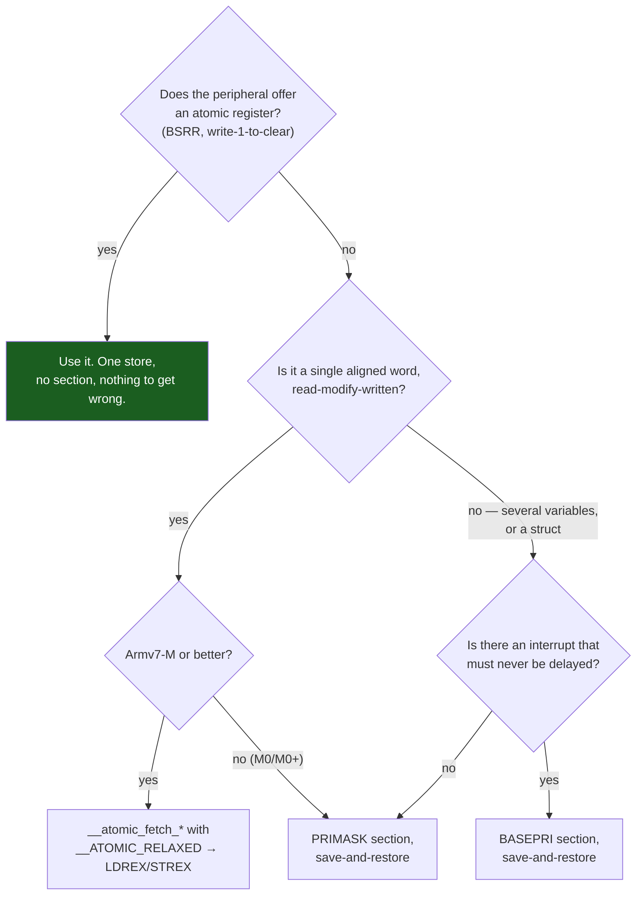

# Critical Sections and Atomicity

A bare-metal program with interrupts enabled is a concurrent program. There is one core and no scheduler, but there are still two threads of control — `main` and whatever handler just fired — and they share memory. Everything that makes concurrency hard is already present: lost updates, torn reads, half-built data structures observed mid-construction. What is *not* present is any of the machinery a hosted program would reach for. There is no mutex, no `std::atomic` you can assume is lock-free, no kernel to block against.

The mental model: **a critical section on a single-core MCU is not a lock. It is a statement about which interrupts are allowed to be running.** Nobody is competing for a lock, because there is only one instruction stream. The only way another piece of code can execute between your load and your store is if an exception is taken. Prevent that, and the sequence is indivisible. That framing is what makes the mechanisms below make sense — they are all ways of saying "not now" to the NVIC, plus one mechanism that instead says "tell me if you interrupted me."

:::info[Prerequisites]
[The NVIC](../02-processor-architecture/the-nvic.md) covers priority numbers and pre-emption, which the `BASEPRI` mechanism below is entirely built on. [What `volatile` Does and Does Not Do](./volatile-and-the-compiler.md) established that `volatile` gives no atomicity — this page is the answer to that. [Concurrency and Synchronization](../../computer-science/operating-systems/concurrency-and-synchronization.md) owns the general theory: race conditions, mutual exclusion, deadlock. This page is the Cortex-M mechanics only.
:::

## The four mechanisms

| Mechanism | Blocks | Cost (measured, `-O2`, Cortex-M4) | Use when |
|---|---|---|---|
| **`PRIMASK`** (`cpsid i` / `cpsie i`) | Every interrupt except NMI and HardFault | 1 instruction each way, 1–2 cycles | Short sections, no hard-real-time interrupt in the system, and code that must work on Armv6-M |
| **`BASEPRI`** (`msr basepri`) | Only interrupts at or numerically above a threshold | 2 instructions each way (`mrs`, `movs`+`msr`) | Something in the system must never be delayed; under an RTOS, essentially always |
| **`LDREX`/`STREX`** | Nothing — detects interference and retries | 5 instructions for a `fetch_or`, plus retry | A single word, read-modify-written, with no interrupt latency budget to spend |
| **Hardware atomicity** (`BSRR`, bit-banding, clear registers) | Nothing — the hardware does it in one store | 1 store | Whenever the peripheral offers it. Free and always correct |
| **`FAULTMASK`** | Everything except NMI | 1 instruction, auto-cleared on exception return | Almost never. It masks HardFault too, which is how you turn a diagnosable fault into a lockup |

The order matters. Reach for the *bottom* of that list first: if the peripheral gives you an atomic register, use it and there is no critical section to get wrong. Only when the data is in RAM does the question of masking arise.

## The nesting bug

This is the mistake, and it is worth showing before the correct form because almost every codebase contains it somewhere.

```c
void enter_critical(void) { __disable_irq(); }
void exit_critical(void)  { __enable_irq();  }

static void update_counters(void)
{
    enter_critical();
    total  += 1;
    recent += 1;
    exit_critical();          /* ← unconditionally re-enables */
}

void handle_event(void)
{
    enter_critical();         /* outer section: interrupts now OFF */
    update_counters();        /* inner section ... and it turns them back ON */
    log_index++;              /* ← NOT PROTECTED. The caller believes it is. */
    exit_critical();
}
```

`__enable_irq()` is `cpsie i`. It does not restore a previous state, because it never knew one — it clears `PRIMASK` unconditionally. The inner function's exit therefore re-enables interrupts *in the middle of the outer critical section*, and every line after the inner call runs unprotected while the code that wrote it is convinced otherwise.

What makes it genuinely nasty:

- **The window is small and data-dependent.** `log_index++` is three instructions. The race needs an interrupt in that window, so it fires rarely, under load, and never on your desk.
- **The bug is not where the symptom is.** The corrupted variable is `log_index`, in `handle_event`. The defect is in `update_counters`, which may be in another file written by someone else, and which is *correct in isolation*.
- **It appears through refactoring.** The code was fine when `update_counters` was inlined by hand. Extracting it into a function — a change with no behavioural intent at all — introduced the bug.
- **A second `exit_critical()` too many has the same shape.** So does an early `return` from inside a section that skips the exit, which leaves interrupts off forever and looks like a hang.

## The save-and-restore form

The fix is to make the exit restore what the entry found, rather than assert a state:

```c
static inline uint32_t critical_enter(void)
{
    uint32_t primask = __get_PRIMASK();   /* read BEFORE disabling */
    __disable_irq();
    return primask;                        /* 0 = were enabled, 1 = already off */
}

static inline void critical_exit(uint32_t primask)
{
    __set_PRIMASK(primask);                /* restore, do not assert */
}

/* Use: */
uint32_t s = critical_enter();
flags |= FLAG_A;
critical_exit(s);
```

The ordering is the whole point: `__get_PRIMASK()` must run *before* `__disable_irq()`, or you save the state you just created and restore "disabled" forever. Now the inner section's exit writes back `1` — the state its entry observed — and interrupts stay off until the outer exit writes back `0`. Nesting to any depth is correct, and it costs one register.

Real output from GCC 14.2.Rel1 at `-O2 -mcpu=cortex-m4 -mthumb`, showing exactly what the two forms compile to:

<Tabs>
<TabItem value="naive" label="Naive: broken when nested" default>

```armasm
naive:
        cpsid   i                 @ unconditionally OFF
        ldr     r2, =flags
        ldr     r3, [r2, #0]
        orr.w   r3, r3, #1
        str     r3, [r2, #0]
        cpsie   i                 @ unconditionally ON  ← the bug
        bx      lr
```

</TabItem>
<TabItem value="saverestore" label="Save-and-restore: nest-safe">

```armasm
saverestore:
        mrs     r1, PRIMASK       @ save first
        cpsid   i
        ldr     r2, =flags
        ldr     r3, [r2, #0]
        orr.w   r3, r3, #1
        str     r3, [r2, #0]
        msr     PRIMASK, r1       @ restore what we found
        bx      lr
```

</TabItem>
<TabItem value="basepri" label="BASEPRI: leaves urgent interrupts running">

```armasm
basepri_section:
        mrs     r1, BASEPRI       @ save
        movs    r3, #80           @ 0x50 — the threshold, already shifted
        msr     BASEPRI, r3
        ldr     r2, =flags
        ldr     r3, [r2, #0]
        orr.w   r3, r3, #1
        str     r3, [r2, #0]
        msr     BASEPRI, r1       @ restore
        bx      lr
```

</TabItem>
</Tabs>

*All three: GCC 14.2.Rel1, `-O2 -mcpu=cortex-m4 -mthumb`, compiled from the C above. Literal pool folded into `ldr =` for readability; instruction sequence unmodified.*

The cost of correctness is one `mrs` and the difference between `cpsie i` and `msr`. Two extra instructions to remove an entire class of refactoring hazard is not a trade worth thinking about — write the save-and-restore form and never write the other one.

:::tip
CMSIS ships this. `__get_PRIMASK()`, `__set_PRIMASK()`, `__disable_irq()` and `__enable_irq()` are all CMSIS-Core intrinsics — see [CMSIS and Vendor HALs](./cmsis-and-vendor-hals.md). Some vendor HALs also provide a macro pair; check what it does before trusting it, because "enter/exit critical" macros that expand to bare `cpsid`/`cpsie` are common.
:::

## `BASEPRI`: masking with a floor

`PRIMASK` is blunt. It stops *everything*, including the motor-commutation interrupt that must run every 50 µs and the failure of which destroys hardware. `BASEPRI` is the graduated version: write a priority value and the processor blocks every exception whose priority number is **greater than or equal to** it — that is, every exception *less urgent* than the threshold — and lets anything more urgent through.

Two traps, both of which produce a critical section that silently does nothing:

- **`BASEPRI` = 0 means "masking disabled".** There is no way to express "block priority 0" — priority 0 is the most urgent configurable level and is always allowed. Writing 0 is how you *turn the mask off*.
- **The value must be pre-shifted into the implemented bits.** The STM32F4 implements 4 priority bits, in the *upper* nibble of the 8-bit field (PM0214 §4.2.7). Priority level 5 is therefore `5 << 4` = `0x50`, which is the `#80` in the listing above. Writing `5` sets the threshold to level 0 after truncation, which masks essentially nothing and gives you a critical section with no critical in it. `NVIC_EncodePriority()` and the `__NVIC_PRIO_BITS` device macro exist to stop you doing this arithmetic by hand.

The rule that comes with `BASEPRI` and is easy to forget: **any interrupt more urgent than the threshold is still running during your critical section.** If it touches the data you are protecting, the section protects nothing. Splitting interrupts into "kernel-aware, maskable" and "urgent, must never touch shared state" is the standard discipline — it is exactly what FreeRTOS's `configMAX_SYSCALL_INTERRUPT_PRIORITY` formalises, and the reason its documentation is so emphatic that an ISR above that threshold must never call an RTOS API.

`BASEPRI` does not exist on Armv6-M (Cortex-M0/M0+). Code that must run on both has to fall back to `PRIMASK`, which is one of the few places where the M0 is genuinely less capable rather than just slower.

## `LDREX`/`STREX`: don't mask, detect

Armv7-M has an exclusive monitor. `LDREX` reads a word and tags the address; `STREX` writes it *only if* the tag is still valid, returning 0 for success and 1 for failure. Anything that could have interfered — an exception being taken, a context switch, another `STREX`, an explicit `CLREX` — clears the tag, so the store fails and you loop.

You rarely write it by hand. GCC's `__atomic_*` builtins generate it:

```c
flags |= FLAG_A;                                    /* racy */
__atomic_fetch_or(&flags, FLAG_A, __ATOMIC_RELAXED); /* not racy */
```

```armasm
relaxed_or:
        ldr     r3, =flags
.Lretry:
        ldrex   r1, [r3]
        orr.w   r1, r1, #1
        strex   r2, r1, [r3]
        cmp     r2, #0
        bne.n   .Lretry           @ interfered with — do it again
        bx      lr
```

*GCC 14.2.Rel1, `-O2 -mcpu=cortex-m4 -mthumb`.*

Five instructions in the common case, no interrupt is delayed by even one cycle, and under contention you pay a retry instead of making the whole system wait. For a single word being read-modify-written this is usually the best answer available.

Three details that decide whether you can use it:

- **Use `__ATOMIC_RELAXED` on a single-core MCU.** With the default `__ATOMIC_SEQ_CST` GCC brackets the loop with `dmb ish` — verified in the same build: two extra barrier instructions that exist to order against *other cores*, of which there are none. Relaxed ordering is correct here because the only other observer is an interrupt handler on the same core, and exception entry and return are already ordering points. If a DMA engine also reads the location, that is a different problem and needs an explicit `__DMB()` at the handover, not a stronger atomic.
- **There is no `LDREX` on Armv6-M.** Compiling the identical source for Cortex-M0 produces `bl __atomic_fetch_or_4` — a libatomic call whose implementation masks interrupts. Correct, but ten times the cost and a surprise if you were counting on five instructions. Check the disassembly when you change target.
- **The monitor is a single global tag, not per-address.** An RTOS context switch must issue `CLREX` (or rely on the fact that an exclusive sequence interrupted by a context switch will fail and retry). Do not hold an exclusive across anything long — the whole idiom assumes `LDREX` and `STREX` are a handful of instructions apart.

## Choosing



And the constraint that outranks all of it: **the section must be short and it must be bounded.** Every instruction inside a `PRIMASK` section is added directly to the worst-case interrupt latency of the entire system. A loop whose iteration count depends on data, a function call into code you did not write, a `printf`, a flash write — none of these belong inside a critical section, because their duration is not a number you can state.

## Idempotent entry and exit in practice

Two patterns worth stealing outright.

**Scoped sections with a block macro**, so entry and exit cannot get separated by an early `return`:

```c
#define CRITICAL_SECTION(...)                     \
    do {                                          \
        uint32_t _pm = critical_enter();          \
        __VA_ARGS__                               \
        critical_exit(_pm);                       \
    } while (0)

CRITICAL_SECTION(
    queue.head = next;
    queue.count++;
);
```

It is not beautiful, but a `return` inside it is now a visible mistake rather than a silent leak of the masked state. (In C++ the same job is done properly by an RAII guard — see the future C++-for-firmware material.)

**A counted nesting wrapper** when a subsystem genuinely needs `enter`/`exit` as separate calls across module boundaries:

```c
static uint32_t nesting;
static uint32_t saved_primask;

void critical_enter_counted(void)
{
    uint32_t pm = __get_PRIMASK();
    __disable_irq();
    if (nesting++ == 0) { saved_primask = pm; }
}

void critical_exit_counted(void)
{
    if (--nesting == 0) { __set_PRIMASK(saved_primask); }
}
```

Note that `nesting` itself needs no protection: every access to it happens with interrupts already disabled. That is the one place in this page where reasoning about "who can be running" pays off directly rather than through a mechanism.

:::warning[The critical section that turned into a hang, and the one that never masked anything]
Two failure modes, both of which present as something other than a concurrency bug.

**Interrupts left off forever.** An early `return`, a `goto`, a `break` out of a loop, or an assertion firing inside a critical section skips the exit. `PRIMASK` stays set. `main` keeps running perfectly — it is not blocked on anything — but SysTick stops, the UART stops, the watchdog refresh (if it is interrupt-driven) stops, and the board resets a second later with no clue why. The tell is unmistakable once you know to look: halt in the debugger and read `PRIMASK` (`p $primask` in GDB). If it is 1 while ordinary application code is running, you have found it. Grep for every `critical_enter` and confirm each has exactly one reachable exit on every path.

**A `BASEPRI` section that masks nothing.** Writing an unshifted priority — `__set_BASEPRI(5)` on a part with 4 implemented bits in the top nibble — truncates to 0, and 0 means *disabled*. The section compiles, runs, costs cycles, and provides no protection at all. Every symptom is a rare data corruption, which sends you looking at the data. Always build the value from `__NVIC_PRIO_BITS`, e.g. `__set_BASEPRI(5 << (8 - __NVIC_PRIO_BITS))`, and never write a bare number.

Both are invisible to code review of the section itself, because the section looks correct. What is wrong is a path through it, or an arithmetic assumption underneath it.
:::

## See also

- [The NVIC](../02-processor-architecture/the-nvic.md) — priority numbers, implemented bits, and pre-emption, all of which `BASEPRI` is defined in terms of.
- [What `volatile` Does and Does Not Do](./volatile-and-the-compiler.md) — why the qualifier is necessary and insufficient, and the read-modify-write race this page fixes.
- [Interrupt Handlers in C](./interrupt-handlers-in-c.md) — the other side of every race here, and the table of which sharing shapes need a section at all.
- [A GPIO Driver from Scratch](./gpio-driver-from-scratch.md) — `BSRR`, the hardware-atomic option at the top of the decision tree.
- [Concurrency and Synchronization](../../computer-science/operating-systems/concurrency-and-synchronization.md) — the general theory of races, mutual exclusion and deadlock that this page assumes.

## References

- STMicroelectronics — [**PM0214**, *STM32 Cortex-M4 MCUs and MPUs programming manual*](https://www.st.com/resource/en/programming_manual/pm0214-stm32-cortexm4-mcus-and-mpus-programming-manual-stmicroelectronics.pdf), Rev 10. §2.1.3 for the `PRIMASK`, `FAULTMASK` and `BASEPRI` special registers and their exact masking semantics; §2.4.4 for the `CPS` instruction forms `cpsid i` and `cpsie i`; §4.2.7 for the priority register layout and the four implemented bits that make the pre-shift necessary.
- Arm — [**Armv7-M Architecture Reference Manual**](https://developer.arm.com/documentation/ddi0403/latest/) (DDI 0403). §A3.4 for exclusive access, the local monitor, and the `LDREX`/`STREX`/`CLREX` semantics including when the tag is cleared; §B1.4.3 for `BASEPRI` and the rule that a value of zero disables masking.
- Free Software Foundation — [**GCC manual, "Built-in Functions for Memory Model Aware Atomic Operations"**](https://gcc.gnu.org/onlinedocs/gcc/_005f_005fatomic-Builtins.html). The `__atomic_fetch_*` family and the memory-order arguments; the documented fallback to `libatomic` library calls on targets without native exclusive instructions, which is what the Cortex-M0 build above demonstrates.
- Arm — [**CMSIS-Core (Cortex-M) documentation**](https://arm-software.github.io/CMSIS_6/latest/Core/index.html). `__get_PRIMASK`, `__set_PRIMASK`, `__disable_irq`, `__enable_irq`, `__get_BASEPRI`, `__set_BASEPRI`, and the `__NVIC_PRIO_BITS` device macro used for the shift.
- Amazon Web Services — [**FreeRTOS: RTOS for ARM Cortex-M**](https://www.freertos.org/Documentation/02-Kernel/03-Supported-devices/02-Customization#configmax_syscall_interrupt_priority). `configMAX_SYSCALL_INTERRUPT_PRIORITY` as the canonical worked example of a `BASEPRI` threshold, and the rule that interrupts above it must not call kernel APIs — the discipline described in the `BASEPRI` section above.

*Instruction listings on this page were produced with Arm GNU Toolchain 14.2.Rel1 (GCC 14.2.1) at `-O2 -mcpu=cortex-m4 -mthumb`, and the Cortex-M0 fallback with `-mcpu=cortex-m0`.*
